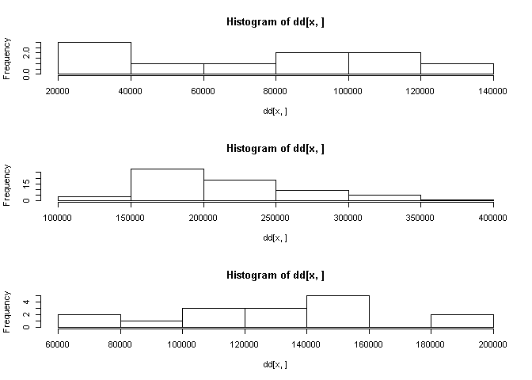

fastcampus\_R프로그래밍\_5
================
huimin
2019년 3월 19일

EDA ( 탐색적 자료 분석 )
========================

데이터에 있는 특징을 알아내는 작업이다.<br> 어려운 통계이론을 사용하기 보다는 쉬운 통계를 이용해서 데이터에 숨겨진 특징을 알아내는 작업이다.<br> 데이터 분석의 목적 : 예측(prediction), 분류(classification)

기본 설정하기
-------------

``` r
# 필요 패키지 설치하기
library(tidyverse)
```

    ## -- Attaching packages --------------- tidyverse 1.2.1 --

    ## √ ggplot2 3.1.0       √ purrr   0.3.1  
    ## √ tibble  2.0.1       √ dplyr   0.8.0.1
    ## √ tidyr   0.8.3       √ stringr 1.4.0  
    ## √ readr   1.3.1       √ forcats 0.4.0

    ## -- Conflicts ------------------ tidyverse_conflicts() --
    ## x dplyr::filter() masks stats::filter()
    ## x dplyr::lag()    masks stats::lag()

``` r
library(purrr)
library(dplyr)
library(naniar)

# 필요한 데이터 불러오기
house.price <- read.csv(file = "d:/fastcampus/HousePrices.csv",
                        header = TRUE,
                        stringsAsFactors = TRUE)
```

데이터 확인하기
---------------

``` r
# 데이터의 전체적인 구조
str(house.price)
```

    ## 'data.frame':    2919 obs. of  81 variables:
    ##  $ Id           : int  1 2 3 4 5 6 7 8 9 10 ...
    ##  $ MSSubClass   : int  60 20 60 70 60 50 20 60 50 190 ...
    ##  $ MSZoning     : Factor w/ 5 levels "C (all)","FV",..: 4 4 4 4 4 4 4 4 5 4 ...
    ##  $ LotFrontage  : int  65 80 68 60 84 85 75 NA 51 50 ...
    ##  $ LotArea      : int  8450 9600 11250 9550 14260 14115 10084 10382 6120 7420 ...
    ##  $ Street       : Factor w/ 2 levels "Grvl","Pave": 2 2 2 2 2 2 2 2 2 2 ...
    ##  $ Alley        : Factor w/ 2 levels "Grvl","Pave": NA NA NA NA NA NA NA NA NA NA ...
    ##  $ LotShape     : Factor w/ 4 levels "IR1","IR2","IR3",..: 4 4 1 1 1 1 4 1 4 4 ...
    ##  $ LandContour  : Factor w/ 4 levels "Bnk","HLS","Low",..: 4 4 4 4 4 4 4 4 4 4 ...
    ##  $ Utilities    : Factor w/ 2 levels "AllPub","NoSeWa": 1 1 1 1 1 1 1 1 1 1 ...
    ##  $ LotConfig    : Factor w/ 5 levels "Corner","CulDSac",..: 5 3 5 1 3 5 5 1 5 1 ...
    ##  $ LandSlope    : Factor w/ 3 levels "Gtl","Mod","Sev": 1 1 1 1 1 1 1 1 1 1 ...
    ##  $ Neighborhood : Factor w/ 25 levels "Blmngtn","Blueste",..: 6 25 6 7 14 12 21 17 18 4 ...
    ##  $ Condition1   : Factor w/ 9 levels "Artery","Feedr",..: 3 2 3 3 3 3 3 5 1 1 ...
    ##  $ Condition2   : Factor w/ 8 levels "Artery","Feedr",..: 3 3 3 3 3 3 3 3 3 1 ...
    ##  $ BldgType     : Factor w/ 5 levels "1Fam","2fmCon",..: 1 1 1 1 1 1 1 1 1 2 ...
    ##  $ HouseStyle   : Factor w/ 8 levels "1.5Fin","1.5Unf",..: 6 3 6 6 6 1 3 6 1 2 ...
    ##  $ OverallQual  : int  7 6 7 7 8 5 8 7 7 5 ...
    ##  $ OverallCond  : int  5 8 5 5 5 5 5 6 5 6 ...
    ##  $ YearBuilt    : int  2003 1976 2001 1915 2000 1993 2004 1973 1931 1939 ...
    ##  $ YearRemodAdd : int  2003 1976 2002 1970 2000 1995 2005 1973 1950 1950 ...
    ##  $ RoofStyle    : Factor w/ 6 levels "Flat","Gable",..: 2 2 2 2 2 2 2 2 2 2 ...
    ##  $ RoofMatl     : Factor w/ 8 levels "ClyTile","CompShg",..: 2 2 2 2 2 2 2 2 2 2 ...
    ##  $ Exterior1st  : Factor w/ 15 levels "AsbShng","AsphShn",..: 13 9 13 14 13 13 13 7 4 9 ...
    ##  $ Exterior2nd  : Factor w/ 16 levels "AsbShng","AsphShn",..: 14 9 14 16 14 14 14 7 16 9 ...
    ##  $ MasVnrType   : Factor w/ 4 levels "BrkCmn","BrkFace",..: 2 3 2 3 2 3 4 4 3 3 ...
    ##  $ MasVnrArea   : int  196 0 162 0 350 0 186 240 0 0 ...
    ##  $ ExterQual    : Factor w/ 4 levels "Ex","Fa","Gd",..: 3 4 3 4 3 4 3 4 4 4 ...
    ##  $ ExterCond    : Factor w/ 5 levels "Ex","Fa","Gd",..: 5 5 5 5 5 5 5 5 5 5 ...
    ##  $ Foundation   : Factor w/ 6 levels "BrkTil","CBlock",..: 3 2 3 1 3 6 3 2 1 1 ...
    ##  $ BsmtQual     : Factor w/ 4 levels "Ex","Fa","Gd",..: 3 3 3 4 3 3 1 3 4 4 ...
    ##  $ BsmtCond     : Factor w/ 4 levels "Fa","Gd","Po",..: 4 4 4 2 4 4 4 4 4 4 ...
    ##  $ BsmtExposure : Factor w/ 4 levels "Av","Gd","Mn",..: 4 2 3 4 1 4 1 3 4 4 ...
    ##  $ BsmtFinType1 : Factor w/ 6 levels "ALQ","BLQ","GLQ",..: 3 1 3 1 3 3 3 1 6 3 ...
    ##  $ BsmtFinSF1   : int  706 978 486 216 655 732 1369 859 0 851 ...
    ##  $ BsmtFinType2 : Factor w/ 6 levels "ALQ","BLQ","GLQ",..: 6 6 6 6 6 6 6 2 6 6 ...
    ##  $ BsmtFinSF2   : int  0 0 0 0 0 0 0 32 0 0 ...
    ##  $ BsmtUnfSF    : int  150 284 434 540 490 64 317 216 952 140 ...
    ##  $ TotalBsmtSF  : int  856 1262 920 756 1145 796 1686 1107 952 991 ...
    ##  $ Heating      : Factor w/ 6 levels "Floor","GasA",..: 2 2 2 2 2 2 2 2 2 2 ...
    ##  $ HeatingQC    : Factor w/ 5 levels "Ex","Fa","Gd",..: 1 1 1 3 1 1 1 1 3 1 ...
    ##  $ CentralAir   : Factor w/ 2 levels "N","Y": 2 2 2 2 2 2 2 2 2 2 ...
    ##  $ Electrical   : Factor w/ 5 levels "FuseA","FuseF",..: 5 5 5 5 5 5 5 5 2 5 ...
    ##  $ X1stFlrSF    : int  856 1262 920 961 1145 796 1694 1107 1022 1077 ...
    ##  $ X2ndFlrSF    : int  854 0 866 756 1053 566 0 983 752 0 ...
    ##  $ LowQualFinSF : int  0 0 0 0 0 0 0 0 0 0 ...
    ##  $ GrLivArea    : int  1710 1262 1786 1717 2198 1362 1694 2090 1774 1077 ...
    ##  $ BsmtFullBath : int  1 0 1 1 1 1 1 1 0 1 ...
    ##  $ BsmtHalfBath : int  0 1 0 0 0 0 0 0 0 0 ...
    ##  $ FullBath     : int  2 2 2 1 2 1 2 2 2 1 ...
    ##  $ HalfBath     : int  1 0 1 0 1 1 0 1 0 0 ...
    ##  $ BedroomAbvGr : int  3 3 3 3 4 1 3 3 2 2 ...
    ##  $ KitchenAbvGr : int  1 1 1 1 1 1 1 1 2 2 ...
    ##  $ KitchenQual  : Factor w/ 4 levels "Ex","Fa","Gd",..: 3 4 3 3 3 4 3 4 4 4 ...
    ##  $ TotRmsAbvGrd : int  8 6 6 7 9 5 7 7 8 5 ...
    ##  $ Functional   : Factor w/ 7 levels "Maj1","Maj2",..: 7 7 7 7 7 7 7 7 3 7 ...
    ##  $ Fireplaces   : int  0 1 1 1 1 0 1 2 2 2 ...
    ##  $ FireplaceQu  : Factor w/ 5 levels "Ex","Fa","Gd",..: NA 5 5 3 5 NA 3 5 5 5 ...
    ##  $ GarageType   : Factor w/ 6 levels "2Types","Attchd",..: 2 2 2 6 2 2 2 2 6 2 ...
    ##  $ GarageYrBlt  : int  2003 1976 2001 1998 2000 1993 2004 1973 1931 1939 ...
    ##  $ GarageFinish : Factor w/ 3 levels "Fin","RFn","Unf": 2 2 2 3 2 3 2 2 3 2 ...
    ##  $ GarageCars   : int  2 2 2 3 3 2 2 2 2 1 ...
    ##  $ GarageArea   : int  548 460 608 642 836 480 636 484 468 205 ...
    ##  $ GarageQual   : Factor w/ 5 levels "Ex","Fa","Gd",..: 5 5 5 5 5 5 5 5 2 3 ...
    ##  $ GarageCond   : Factor w/ 5 levels "Ex","Fa","Gd",..: 5 5 5 5 5 5 5 5 5 5 ...
    ##  $ PavedDrive   : Factor w/ 3 levels "N","P","Y": 3 3 3 3 3 3 3 3 3 3 ...
    ##  $ WoodDeckSF   : int  0 298 0 0 192 40 255 235 90 0 ...
    ##  $ OpenPorchSF  : int  61 0 42 35 84 30 57 204 0 4 ...
    ##  $ EnclosedPorch: int  0 0 0 272 0 0 0 228 205 0 ...
    ##  $ X3SsnPorch   : int  0 0 0 0 0 320 0 0 0 0 ...
    ##  $ ScreenPorch  : int  0 0 0 0 0 0 0 0 0 0 ...
    ##  $ PoolArea     : int  0 0 0 0 0 0 0 0 0 0 ...
    ##  $ PoolQC       : Factor w/ 3 levels "Ex","Fa","Gd": NA NA NA NA NA NA NA NA NA NA ...
    ##  $ Fence        : Factor w/ 4 levels "GdPrv","GdWo",..: NA NA NA NA NA 3 NA NA NA NA ...
    ##  $ MiscFeature  : Factor w/ 4 levels "Gar2","Othr",..: NA NA NA NA NA 3 NA 3 NA NA ...
    ##  $ MiscVal      : int  0 0 0 0 0 700 0 350 0 0 ...
    ##  $ MoSold       : int  2 5 9 2 12 10 8 11 4 1 ...
    ##  $ YrSold       : int  2008 2007 2008 2006 2008 2009 2007 2009 2008 2008 ...
    ##  $ SaleType     : Factor w/ 9 levels "COD","Con","ConLD",..: 9 9 9 9 9 9 9 9 9 9 ...
    ##  $ SaleCondition: Factor w/ 6 levels "Abnorml","AdjLand",..: 5 5 5 1 5 5 5 5 1 5 ...
    ##  $ SalePrice    : int  208500 181500 223500 140000 250000 143000 307000 200000 129900 118000 ...

``` r
# 첫머리 10행만 출력해보기
head(house.price, n = 10)
```

    ##    Id MSSubClass MSZoning LotFrontage LotArea Street Alley LotShape
    ## 1   1         60       RL          65    8450   Pave  <NA>      Reg
    ## 2   2         20       RL          80    9600   Pave  <NA>      Reg
    ## 3   3         60       RL          68   11250   Pave  <NA>      IR1
    ## 4   4         70       RL          60    9550   Pave  <NA>      IR1
    ## 5   5         60       RL          84   14260   Pave  <NA>      IR1
    ## 6   6         50       RL          85   14115   Pave  <NA>      IR1
    ## 7   7         20       RL          75   10084   Pave  <NA>      Reg
    ## 8   8         60       RL          NA   10382   Pave  <NA>      IR1
    ## 9   9         50       RM          51    6120   Pave  <NA>      Reg
    ## 10 10        190       RL          50    7420   Pave  <NA>      Reg
    ##    LandContour Utilities LotConfig LandSlope Neighborhood Condition1
    ## 1          Lvl    AllPub    Inside       Gtl      CollgCr       Norm
    ## 2          Lvl    AllPub       FR2       Gtl      Veenker      Feedr
    ## 3          Lvl    AllPub    Inside       Gtl      CollgCr       Norm
    ## 4          Lvl    AllPub    Corner       Gtl      Crawfor       Norm
    ## 5          Lvl    AllPub       FR2       Gtl      NoRidge       Norm
    ## 6          Lvl    AllPub    Inside       Gtl      Mitchel       Norm
    ## 7          Lvl    AllPub    Inside       Gtl      Somerst       Norm
    ## 8          Lvl    AllPub    Corner       Gtl       NWAmes       PosN
    ## 9          Lvl    AllPub    Inside       Gtl      OldTown     Artery
    ## 10         Lvl    AllPub    Corner       Gtl      BrkSide     Artery
    ##    Condition2 BldgType HouseStyle OverallQual OverallCond YearBuilt
    ## 1        Norm     1Fam     2Story           7           5      2003
    ## 2        Norm     1Fam     1Story           6           8      1976
    ## 3        Norm     1Fam     2Story           7           5      2001
    ## 4        Norm     1Fam     2Story           7           5      1915
    ## 5        Norm     1Fam     2Story           8           5      2000
    ## 6        Norm     1Fam     1.5Fin           5           5      1993
    ## 7        Norm     1Fam     1Story           8           5      2004
    ## 8        Norm     1Fam     2Story           7           6      1973
    ## 9        Norm     1Fam     1.5Fin           7           5      1931
    ## 10     Artery   2fmCon     1.5Unf           5           6      1939
    ##    YearRemodAdd RoofStyle RoofMatl Exterior1st Exterior2nd MasVnrType
    ## 1          2003     Gable  CompShg     VinylSd     VinylSd    BrkFace
    ## 2          1976     Gable  CompShg     MetalSd     MetalSd       None
    ## 3          2002     Gable  CompShg     VinylSd     VinylSd    BrkFace
    ## 4          1970     Gable  CompShg     Wd Sdng     Wd Shng       None
    ## 5          2000     Gable  CompShg     VinylSd     VinylSd    BrkFace
    ## 6          1995     Gable  CompShg     VinylSd     VinylSd       None
    ## 7          2005     Gable  CompShg     VinylSd     VinylSd      Stone
    ## 8          1973     Gable  CompShg     HdBoard     HdBoard      Stone
    ## 9          1950     Gable  CompShg     BrkFace     Wd Shng       None
    ## 10         1950     Gable  CompShg     MetalSd     MetalSd       None
    ##    MasVnrArea ExterQual ExterCond Foundation BsmtQual BsmtCond
    ## 1         196        Gd        TA      PConc       Gd       TA
    ## 2           0        TA        TA     CBlock       Gd       TA
    ## 3         162        Gd        TA      PConc       Gd       TA
    ## 4           0        TA        TA     BrkTil       TA       Gd
    ## 5         350        Gd        TA      PConc       Gd       TA
    ## 6           0        TA        TA       Wood       Gd       TA
    ## 7         186        Gd        TA      PConc       Ex       TA
    ## 8         240        TA        TA     CBlock       Gd       TA
    ## 9           0        TA        TA     BrkTil       TA       TA
    ## 10          0        TA        TA     BrkTil       TA       TA
    ##    BsmtExposure BsmtFinType1 BsmtFinSF1 BsmtFinType2 BsmtFinSF2 BsmtUnfSF
    ## 1            No          GLQ        706          Unf          0       150
    ## 2            Gd          ALQ        978          Unf          0       284
    ## 3            Mn          GLQ        486          Unf          0       434
    ## 4            No          ALQ        216          Unf          0       540
    ## 5            Av          GLQ        655          Unf          0       490
    ## 6            No          GLQ        732          Unf          0        64
    ## 7            Av          GLQ       1369          Unf          0       317
    ## 8            Mn          ALQ        859          BLQ         32       216
    ## 9            No          Unf          0          Unf          0       952
    ## 10           No          GLQ        851          Unf          0       140
    ##    TotalBsmtSF Heating HeatingQC CentralAir Electrical X1stFlrSF X2ndFlrSF
    ## 1          856    GasA        Ex          Y      SBrkr       856       854
    ## 2         1262    GasA        Ex          Y      SBrkr      1262         0
    ## 3          920    GasA        Ex          Y      SBrkr       920       866
    ## 4          756    GasA        Gd          Y      SBrkr       961       756
    ## 5         1145    GasA        Ex          Y      SBrkr      1145      1053
    ## 6          796    GasA        Ex          Y      SBrkr       796       566
    ## 7         1686    GasA        Ex          Y      SBrkr      1694         0
    ## 8         1107    GasA        Ex          Y      SBrkr      1107       983
    ## 9          952    GasA        Gd          Y      FuseF      1022       752
    ## 10         991    GasA        Ex          Y      SBrkr      1077         0
    ##    LowQualFinSF GrLivArea BsmtFullBath BsmtHalfBath FullBath HalfBath
    ## 1             0      1710            1            0        2        1
    ## 2             0      1262            0            1        2        0
    ## 3             0      1786            1            0        2        1
    ## 4             0      1717            1            0        1        0
    ## 5             0      2198            1            0        2        1
    ## 6             0      1362            1            0        1        1
    ## 7             0      1694            1            0        2        0
    ## 8             0      2090            1            0        2        1
    ## 9             0      1774            0            0        2        0
    ## 10            0      1077            1            0        1        0
    ##    BedroomAbvGr KitchenAbvGr KitchenQual TotRmsAbvGrd Functional
    ## 1             3            1          Gd            8        Typ
    ## 2             3            1          TA            6        Typ
    ## 3             3            1          Gd            6        Typ
    ## 4             3            1          Gd            7        Typ
    ## 5             4            1          Gd            9        Typ
    ## 6             1            1          TA            5        Typ
    ## 7             3            1          Gd            7        Typ
    ## 8             3            1          TA            7        Typ
    ## 9             2            2          TA            8       Min1
    ## 10            2            2          TA            5        Typ
    ##    Fireplaces FireplaceQu GarageType GarageYrBlt GarageFinish GarageCars
    ## 1           0        <NA>     Attchd        2003          RFn          2
    ## 2           1          TA     Attchd        1976          RFn          2
    ## 3           1          TA     Attchd        2001          RFn          2
    ## 4           1          Gd     Detchd        1998          Unf          3
    ## 5           1          TA     Attchd        2000          RFn          3
    ## 6           0        <NA>     Attchd        1993          Unf          2
    ## 7           1          Gd     Attchd        2004          RFn          2
    ## 8           2          TA     Attchd        1973          RFn          2
    ## 9           2          TA     Detchd        1931          Unf          2
    ## 10          2          TA     Attchd        1939          RFn          1
    ##    GarageArea GarageQual GarageCond PavedDrive WoodDeckSF OpenPorchSF
    ## 1         548         TA         TA          Y          0          61
    ## 2         460         TA         TA          Y        298           0
    ## 3         608         TA         TA          Y          0          42
    ## 4         642         TA         TA          Y          0          35
    ## 5         836         TA         TA          Y        192          84
    ## 6         480         TA         TA          Y         40          30
    ## 7         636         TA         TA          Y        255          57
    ## 8         484         TA         TA          Y        235         204
    ## 9         468         Fa         TA          Y         90           0
    ## 10        205         Gd         TA          Y          0           4
    ##    EnclosedPorch X3SsnPorch ScreenPorch PoolArea PoolQC Fence MiscFeature
    ## 1              0          0           0        0   <NA>  <NA>        <NA>
    ## 2              0          0           0        0   <NA>  <NA>        <NA>
    ## 3              0          0           0        0   <NA>  <NA>        <NA>
    ## 4            272          0           0        0   <NA>  <NA>        <NA>
    ## 5              0          0           0        0   <NA>  <NA>        <NA>
    ## 6              0        320           0        0   <NA> MnPrv        Shed
    ## 7              0          0           0        0   <NA>  <NA>        <NA>
    ## 8            228          0           0        0   <NA>  <NA>        Shed
    ## 9            205          0           0        0   <NA>  <NA>        <NA>
    ## 10             0          0           0        0   <NA>  <NA>        <NA>
    ##    MiscVal MoSold YrSold SaleType SaleCondition SalePrice
    ## 1        0      2   2008       WD        Normal    208500
    ## 2        0      5   2007       WD        Normal    181500
    ## 3        0      9   2008       WD        Normal    223500
    ## 4        0      2   2006       WD       Abnorml    140000
    ## 5        0     12   2008       WD        Normal    250000
    ## 6      700     10   2009       WD        Normal    143000
    ## 7        0      8   2007       WD        Normal    307000
    ## 8      350     11   2009       WD        Normal    200000
    ## 9        0      4   2008       WD       Abnorml    129900
    ## 10       0      1   2008       WD        Normal    118000

``` r
# 요약 정보 확인하기
summary(house.price)
```

    ##        Id           MSSubClass        MSZoning     LotFrontage    
    ##  Min.   :   1.0   Min.   : 20.00   C (all):  25   Min.   : 21.00  
    ##  1st Qu.: 730.5   1st Qu.: 20.00   FV     : 139   1st Qu.: 59.00  
    ##  Median :1460.0   Median : 50.00   RH     :  26   Median : 68.00  
    ##  Mean   :1460.0   Mean   : 57.14   RL     :2265   Mean   : 69.31  
    ##  3rd Qu.:2189.5   3rd Qu.: 70.00   RM     : 460   3rd Qu.: 80.00  
    ##  Max.   :2919.0   Max.   :190.00   NA's   :   4   Max.   :313.00  
    ##                                                   NA's   :486     
    ##     LotArea        Street      Alley      LotShape   LandContour
    ##  Min.   :  1300   Grvl:  12   Grvl: 120   IR1: 968   Bnk: 117   
    ##  1st Qu.:  7478   Pave:2907   Pave:  78   IR2:  76   HLS: 120   
    ##  Median :  9453               NA's:2721   IR3:  16   Low:  60   
    ##  Mean   : 10168                           Reg:1859   Lvl:2622   
    ##  3rd Qu.: 11570                                                 
    ##  Max.   :215245                                                 
    ##                                                                 
    ##   Utilities      LotConfig    LandSlope   Neighborhood    Condition1  
    ##  AllPub:2916   Corner : 511   Gtl:2778   NAmes  : 443   Norm   :2511  
    ##  NoSeWa:   1   CulDSac: 176   Mod: 125   CollgCr: 267   Feedr  : 164  
    ##  NA's  :   2   FR2    :  85   Sev:  16   OldTown: 239   Artery :  92  
    ##                FR3    :  14              Edwards: 194   RRAn   :  50  
    ##                Inside :2133              Somerst: 182   PosN   :  39  
    ##                                          NridgHt: 166   RRAe   :  28  
    ##                                          (Other):1428   (Other):  35  
    ##    Condition2     BldgType      HouseStyle    OverallQual    
    ##  Norm   :2889   1Fam  :2425   1Story :1471   Min.   : 1.000  
    ##  Feedr  :  13   2fmCon:  62   2Story : 872   1st Qu.: 5.000  
    ##  Artery :   5   Duplex: 109   1.5Fin : 314   Median : 6.000  
    ##  PosA   :   4   Twnhs :  96   SLvl   : 128   Mean   : 6.089  
    ##  PosN   :   4   TwnhsE: 227   SFoyer :  83   3rd Qu.: 7.000  
    ##  RRNn   :   2                 2.5Unf :  24   Max.   :10.000  
    ##  (Other):   2                 (Other):  27                   
    ##   OverallCond      YearBuilt     YearRemodAdd    RoofStyle   
    ##  Min.   :1.000   Min.   :1872   Min.   :1950   Flat   :  20  
    ##  1st Qu.:5.000   1st Qu.:1954   1st Qu.:1965   Gable  :2310  
    ##  Median :5.000   Median :1973   Median :1993   Gambrel:  22  
    ##  Mean   :5.565   Mean   :1971   Mean   :1984   Hip    : 551  
    ##  3rd Qu.:6.000   3rd Qu.:2001   3rd Qu.:2004   Mansard:  11  
    ##  Max.   :9.000   Max.   :2010   Max.   :2010   Shed   :   5  
    ##                                                              
    ##     RoofMatl     Exterior1st    Exterior2nd     MasVnrType  
    ##  CompShg:2876   VinylSd:1025   VinylSd:1014   BrkCmn :  25  
    ##  Tar&Grv:  23   MetalSd: 450   MetalSd: 447   BrkFace: 879  
    ##  WdShake:   9   HdBoard: 442   HdBoard: 406   None   :1742  
    ##  WdShngl:   7   Wd Sdng: 411   Wd Sdng: 391   Stone  : 249  
    ##  ClyTile:   1   Plywood: 221   Plywood: 270   NA's   :  24  
    ##  Membran:   1   (Other): 369   (Other): 390                 
    ##  (Other):   2   NA's   :   1   NA's   :   1                 
    ##    MasVnrArea     ExterQual ExterCond  Foundation   BsmtQual   
    ##  Min.   :   0.0   Ex: 107   Ex:  12   BrkTil: 311   Ex  : 258  
    ##  1st Qu.:   0.0   Fa:  35   Fa:  67   CBlock:1235   Fa  :  88  
    ##  Median :   0.0   Gd: 979   Gd: 299   PConc :1308   Gd  :1209  
    ##  Mean   : 102.2   TA:1798   Po:   3   Slab  :  49   TA  :1283  
    ##  3rd Qu.: 164.0             TA:2538   Stone :  11   NA's:  81  
    ##  Max.   :1600.0                       Wood  :   5              
    ##  NA's   :23                                                    
    ##  BsmtCond    BsmtExposure BsmtFinType1   BsmtFinSF1     BsmtFinType2
    ##  Fa  : 104   Av  : 418    ALQ :429     Min.   :   0.0   ALQ :  52   
    ##  Gd  : 122   Gd  : 276    BLQ :269     1st Qu.:   0.0   BLQ :  68   
    ##  Po  :   5   Mn  : 239    GLQ :849     Median : 368.5   GLQ :  34   
    ##  TA  :2606   No  :1904    LwQ :154     Mean   : 441.4   LwQ :  87   
    ##  NA's:  82   NA's:  82    Rec :288     3rd Qu.: 733.0   Rec : 105   
    ##                           Unf :851     Max.   :5644.0   Unf :2493   
    ##                           NA's: 79     NA's   :1        NA's:  80   
    ##    BsmtFinSF2        BsmtUnfSF       TotalBsmtSF      Heating    
    ##  Min.   :   0.00   Min.   :   0.0   Min.   :   0.0   Floor:   1  
    ##  1st Qu.:   0.00   1st Qu.: 220.0   1st Qu.: 793.0   GasA :2874  
    ##  Median :   0.00   Median : 467.0   Median : 989.5   GasW :  27  
    ##  Mean   :  49.58   Mean   : 560.8   Mean   :1051.8   Grav :   9  
    ##  3rd Qu.:   0.00   3rd Qu.: 805.5   3rd Qu.:1302.0   OthW :   2  
    ##  Max.   :1526.00   Max.   :2336.0   Max.   :6110.0   Wall :   6  
    ##  NA's   :1         NA's   :1        NA's   :1                    
    ##  HeatingQC CentralAir Electrical     X1stFlrSF      X2ndFlrSF     
    ##  Ex:1493   N: 196     FuseA: 188   Min.   : 334   Min.   :   0.0  
    ##  Fa:  92   Y:2723     FuseF:  50   1st Qu.: 876   1st Qu.:   0.0  
    ##  Gd: 474              FuseP:   8   Median :1082   Median :   0.0  
    ##  Po:   3              Mix  :   1   Mean   :1160   Mean   : 336.5  
    ##  TA: 857              SBrkr:2671   3rd Qu.:1388   3rd Qu.: 704.0  
    ##                       NA's :   1   Max.   :5095   Max.   :2065.0  
    ##                                                                   
    ##   LowQualFinSF        GrLivArea     BsmtFullBath     BsmtHalfBath    
    ##  Min.   :   0.000   Min.   : 334   Min.   :0.0000   Min.   :0.00000  
    ##  1st Qu.:   0.000   1st Qu.:1126   1st Qu.:0.0000   1st Qu.:0.00000  
    ##  Median :   0.000   Median :1444   Median :0.0000   Median :0.00000  
    ##  Mean   :   4.694   Mean   :1501   Mean   :0.4299   Mean   :0.06136  
    ##  3rd Qu.:   0.000   3rd Qu.:1744   3rd Qu.:1.0000   3rd Qu.:0.00000  
    ##  Max.   :1064.000   Max.   :5642   Max.   :3.0000   Max.   :2.00000  
    ##                                    NA's   :2        NA's   :2        
    ##     FullBath        HalfBath       BedroomAbvGr   KitchenAbvGr  
    ##  Min.   :0.000   Min.   :0.0000   Min.   :0.00   Min.   :0.000  
    ##  1st Qu.:1.000   1st Qu.:0.0000   1st Qu.:2.00   1st Qu.:1.000  
    ##  Median :2.000   Median :0.0000   Median :3.00   Median :1.000  
    ##  Mean   :1.568   Mean   :0.3803   Mean   :2.86   Mean   :1.045  
    ##  3rd Qu.:2.000   3rd Qu.:1.0000   3rd Qu.:3.00   3rd Qu.:1.000  
    ##  Max.   :4.000   Max.   :2.0000   Max.   :8.00   Max.   :3.000  
    ##                                                                 
    ##  KitchenQual  TotRmsAbvGrd      Functional     Fireplaces     FireplaceQu
    ##  Ex  : 205   Min.   : 2.000   Typ    :2717   Min.   :0.0000   Ex  :  43  
    ##  Fa  :  70   1st Qu.: 5.000   Min2   :  70   1st Qu.:0.0000   Fa  :  74  
    ##  Gd  :1151   Median : 6.000   Min1   :  65   Median :1.0000   Gd  : 744  
    ##  TA  :1492   Mean   : 6.452   Mod    :  35   Mean   :0.5971   Po  :  46  
    ##  NA's:   1   3rd Qu.: 7.000   Maj1   :  19   3rd Qu.:1.0000   TA  : 592  
    ##              Max.   :15.000   (Other):  11   Max.   :4.0000   NA's:1420  
    ##                               NA's   :   2                               
    ##    GarageType    GarageYrBlt   GarageFinish   GarageCars   
    ##  2Types :  23   Min.   :1895   Fin : 719    Min.   :0.000  
    ##  Attchd :1723   1st Qu.:1960   RFn : 811    1st Qu.:1.000  
    ##  Basment:  36   Median :1979   Unf :1230    Median :2.000  
    ##  BuiltIn: 186   Mean   :1978   NA's: 159    Mean   :1.767  
    ##  CarPort:  15   3rd Qu.:2002                3rd Qu.:2.000  
    ##  Detchd : 779   Max.   :2207                Max.   :5.000  
    ##  NA's   : 157   NA's   :159                 NA's   :1      
    ##    GarageArea     GarageQual  GarageCond  PavedDrive   WoodDeckSF     
    ##  Min.   :   0.0   Ex  :   3   Ex  :   3   N: 216     Min.   :   0.00  
    ##  1st Qu.: 320.0   Fa  : 124   Fa  :  74   P:  62     1st Qu.:   0.00  
    ##  Median : 480.0   Gd  :  24   Gd  :  15   Y:2641     Median :   0.00  
    ##  Mean   : 472.9   Po  :   5   Po  :  14              Mean   :  93.71  
    ##  3rd Qu.: 576.0   TA  :2604   TA  :2654              3rd Qu.: 168.00  
    ##  Max.   :1488.0   NA's: 159   NA's: 159              Max.   :1424.00  
    ##  NA's   :1                                                            
    ##   OpenPorchSF     EnclosedPorch      X3SsnPorch       ScreenPorch    
    ##  Min.   :  0.00   Min.   :   0.0   Min.   :  0.000   Min.   :  0.00  
    ##  1st Qu.:  0.00   1st Qu.:   0.0   1st Qu.:  0.000   1st Qu.:  0.00  
    ##  Median : 26.00   Median :   0.0   Median :  0.000   Median :  0.00  
    ##  Mean   : 47.49   Mean   :  23.1   Mean   :  2.602   Mean   : 16.06  
    ##  3rd Qu.: 70.00   3rd Qu.:   0.0   3rd Qu.:  0.000   3rd Qu.:  0.00  
    ##  Max.   :742.00   Max.   :1012.0   Max.   :508.000   Max.   :576.00  
    ##                                                                      
    ##     PoolArea        PoolQC       Fence      MiscFeature    MiscVal        
    ##  Min.   :  0.000   Ex  :   4   GdPrv: 118   Gar2:   5   Min.   :    0.00  
    ##  1st Qu.:  0.000   Fa  :   2   GdWo : 112   Othr:   4   1st Qu.:    0.00  
    ##  Median :  0.000   Gd  :   4   MnPrv: 329   Shed:  95   Median :    0.00  
    ##  Mean   :  2.252   NA's:2909   MnWw :  12   TenC:   1   Mean   :   50.83  
    ##  3rd Qu.:  0.000               NA's :2348   NA's:2814   3rd Qu.:    0.00  
    ##  Max.   :800.000                                        Max.   :17000.00  
    ##                                                                           
    ##      MoSold           YrSold        SaleType    SaleCondition 
    ##  Min.   : 1.000   Min.   :2006   WD     :2525   Abnorml: 190  
    ##  1st Qu.: 4.000   1st Qu.:2007   New    : 239   AdjLand:  12  
    ##  Median : 6.000   Median :2008   COD    :  87   Alloca :  24  
    ##  Mean   : 6.213   Mean   :2008   ConLD  :  26   Family :  46  
    ##  3rd Qu.: 8.000   3rd Qu.:2009   CWD    :  12   Normal :2402  
    ##  Max.   :12.000   Max.   :2010   (Other):  29   Partial: 245  
    ##                                  NA's   :   1                 
    ##    SalePrice     
    ##  Min.   : 34900  
    ##  1st Qu.:129975  
    ##  Median :163000  
    ##  Mean   :180921  
    ##  3rd Qu.:214000  
    ##  Max.   :755000  
    ##  NA's   :1459

일변량(Uni-variate) 질적 자료의 분석
------------------------------------

일변량 : 하나의 열(변수)<br> 질적 자료 : 범주형 자료

### 빈도표(Frequency Table) 만들기

``` r
# 빈도(Frequency)
# table(data$variable) : 빈도를 벡터로 반환한다.
table(house.price$MSZoning)
```

    ## 
    ## C (all)      FV      RH      RL      RM 
    ##      25     139      26    2265     460

``` r
# RL이 가장 많이 나왔다. 정렬을 해준다.
MSZoning.Frequency <- sort(table(house.price$MSZoning), decreasing = TRUE)
sort(table(house.price$MSZoning), decreasing = TRUE)[1:3] # 상위 3개
```

    ## 
    ##   RL   RM   FV 
    ## 2265  460  139

### 백분율

``` r
# 백분율(Percent)
# prop.table(Frequency) : 전체를 1로 두고 비율을 구하여 벡터로 반환한다.
prop.table(table(house.price$MSZoning))*100
```

    ## 
    ##    C (all)         FV         RH         RL         RM 
    ##  0.8576329  4.7684391  0.8919383 77.7015437 15.7804460

``` r
sort(prop.table(table(house.price$MSZoning))*100, decreasing = TRUE)
```

    ## 
    ##         RL         RM         FV         RH    C (all) 
    ## 77.7015437 15.7804460  4.7684391  0.8919383  0.8576329

``` r
# 소수점 조절하기
MSZoning.Percent <- round(sort(prop.table(table(house.price$MSZoning))*100, decreasing = TRUE), digits = 1)

# 빈도와 백분율 합치기
MSZoning.table <- cbind(MSZoning.Frequency, MSZoning.Percent)
MSZoning.table
```

    ##         MSZoning.Frequency MSZoning.Percent
    ## RL                    2265             77.7
    ## RM                     460             15.8
    ## FV                     139              4.8
    ## RH                      26              0.9
    ## C (all)                 25              0.9

### 모든 factor에 대해서 빈도와 백분율 구해서 객체에 저장하기

``` r
# house.price에서 factor만 가져온 새로운 객체
house.price.factor <- house.price[, sapply(house.price, is.factor)]

# 저장될 반복문
result.frame <- data.frame()

# 빈도와 백분율을 result.frame에 저장하는 반복문
for(i in 1:ncol(house.price.factor)){
  
  table <- table(house.price.factor[,i])
  prop <- prop.table(table(house.price.factor[,i]))
  
  result <- cbind(variable = colnames(house.price.factor)[i],
                  table, 
                  prop)
  
  result.frame <- rbind(result.frame, result)
}

# 현재 rownames로 설정된 것을 colume으로 전환하고, rownames는 초기화하기
result.frame <- cbind(NAME = rownames(result.frame),result.frame)
rownames(result.frame) <- NULL

# 저장하기
writexl::write_xlsx(result.frame,
                    path = "C:/Users/Leehuimin/Desktop/프로그래밍 언어/R/fastcampus_markdown_project/01편_R프로그래밍/result.xlsx")
```

### purrr 패키지 : factor만 추출하는 또 다른 방법

``` r
# factor인 열만 추출한다.
house.price.factor <- house.price %>% purrr::keep(is.factor)

# factor인 열을 버린다.
house.price.nonfactor <- house.price %>% purrr::discard(is.factor) 
```

### 막대 그래프 (Bar plot)

질적자료가 주로 비율을 사용하기 때문에, 막대/원 그래프를 사용한다.<br> 비중이 많은 것이 눈에서 가까워야 한다.<br> **barplot(frequency or percent)**

``` r
barplot(sort(table(house.price$MSZoning), decreasing = TRUE))
```


### 원 그래프 (Pie Chart)

**pie(frequency or percent)**

``` r
pie(sort(table(house.price$MSZoning), decreasing = TRUE))
```


### 그래프의 자세한 옵션은 day6(b) 소스코드 참고

시각화는 워낙 방대한 분량을 차지하기 때문에, 이 요약 마크다운에서는 부담만 가중될 것이다.

apply 계열 함수
---------------

### apply(X, MARGIN = , FUN = )

margin = 1일 경우 행에 함수를 적용<br> margin = 2일 경우 열에 함수를 적용<br> X = array, matrix<br> 리턴 : vector, array, list

``` r
A <- matrix(1:9, nrow = 3, ncol = 3)

apply(A, 1, mean) 
```

    ## [1] 4 5 6

``` r
apply(A, 1, is.numeric)
```

    ## [1] TRUE TRUE TRUE

``` r
apply(A, 2, sum)
```

    ## [1]  6 15 24

### sapply(X, FUN = )

vector, mattrix 혹은 , simplify = TRUE(default) 적용 시 배열을 반환한다.<br> simplify = FALSE, USE.NAMES = FALSE일 경우 lapply와 같다.

``` r
id <- 1:3
bt <- factor(c("a","a","b"), levels = c("a","b"))
age <- c(10,20,30)
major <- factor(c("통계","컴퓨터","통계"), levels = c("통계","컴퓨터"))
money <- c(30,40,50)
df1 <- data.frame(id,bt,age,major,money)

df1[ , sapply(df1, is.factor)] # 이런 식으로 응용 가능하다.
```

    ##   bt  major
    ## 1  a   통계
    ## 2  a 컴퓨터
    ## 3  b   통계

### 기타 : lapply, tapply, mapply

일변량(uni-variate) 양적 자료의 분석
------------------------------------

### 데이터 불러오고 준비하기

``` r
house.price <- read.csv(file = "d:/fastcampus/HousePrices.csv",
                        header = TRUE,
                        stringsAsFactors = TRUE)

house.price.numeric <- house.price %>% purrr::keep(is.numeric)
```

### 구간의 빈도표(Frequency Table)와 백분율

``` r
# (1) 구간의 빈도

# 구간의 범위 (max - min = range)
LotArea.Min <- min(house.price.numeric$LotArea)
LotArea.Max <- max(house.price.numeric$LotArea)
LotArea.Range <- LotArea.Max - LotArea.Min

# 구간의 개수
interval.count <- 1 + 3.3*log10(length(house.price.numeric$LotArea))
interval.count <- as.integer(interval.count)

# 구간의 폭
interval.width <- LotArea.Range / interval.count
interval.width <- round(interval.width, digits = -3) # 간단하게 조정

# 도출된 구간의 정보
# 최솟값 : 1300, 최댓값 : 215245 이므로
# 첫번째 구간 : 0~18000 마지막 구간: 198000 ~ 216000
# 구간의 정보 : 0, 18000, 36000, 54000, 72000, 90000, ... , 216000

# 구간의 정보를 갖는 새로운 변수 만들기
house.price.numeric$LotArea.group <- cut(house.price.numeric$LotArea,
                                         breaks = seq(from = 0, to = 220000, by = 18000),
                                         right = FALSE)

# 빈도표 도출
table(house.price.numeric$LotArea.group)
```

    ## 
    ##         [0,1.8e+04)   [1.8e+04,3.6e+04)   [3.6e+04,5.4e+04) 
    ##                2799                  95                  17 
    ##   [5.4e+04,7.2e+04)     [7.2e+04,9e+04)    [9e+04,1.08e+05) 
    ##                   4                   0                   0 
    ## [1.08e+05,1.26e+05) [1.26e+05,1.44e+05) [1.44e+05,1.62e+05) 
    ##                   1                   0                   1 
    ##  [1.62e+05,1.8e+05)  [1.8e+05,1.98e+05) [1.98e+05,2.16e+05) 
    ##                   1                   0                   1

``` r
# (2) 구간의 백분율
round(prop.table(table(house.price.numeric$LotArea.group))*100,
      digits = 1)
```

    ## 
    ##         [0,1.8e+04)   [1.8e+04,3.6e+04)   [3.6e+04,5.4e+04) 
    ##                95.9                 3.3                 0.6 
    ##   [5.4e+04,7.2e+04)     [7.2e+04,9e+04)    [9e+04,1.08e+05) 
    ##                 0.1                 0.0                 0.0 
    ## [1.08e+05,1.26e+05) [1.26e+05,1.44e+05) [1.44e+05,1.62e+05) 
    ##                 0.0                 0.0                 0.0 
    ##  [1.62e+05,1.8e+05)  [1.8e+05,1.98e+05) [1.98e+05,2.16e+05) 
    ##                 0.0                 0.0                 0.0

### 연습 : SalePrice에서 동일하게 빈도와 백분율을 구하시오.

``` r
# 데이터 확인하기
summary(house.price$SalePrice)
```

    ##    Min. 1st Qu.  Median    Mean 3rd Qu.    Max.    NA's 
    ##   34900  129975  163000  180921  214000  755000    1459

``` r
str(house.price$SalePrice)
```

    ##  int [1:2919] 208500 181500 223500 140000 250000 143000 307000 200000 129900 118000 ...

``` r
length(house.price$SalePrice[is.na(house.price$SalePrice)]) # na 확인
```

    ## [1] 1459

``` r
# 구간 설정하기
saleprice.min <- min(house.price$SalePrice, na.rm = TRUE)
saleprice.max <- max(house.price$SalePrice, na.rm = TRUE)
saleprice.range <- saleprice.max - saleprice.min

saleprice.count <- round((1 + 3.3*log10(length(house.price$SalePrice))),
                         digits = 0)

saleprice.width <- round((saleprice.range / saleprice.count),
                         digits = -2)

house.price.numeric$saleprice.group <- cut(house.price.numeric$SalePrice,
                                           breaks = seq(from = 0,
                                                        to = 780000,
                                                        by = 60000),
                                           right = FALSE)

# 빈도
table(house.price.numeric$saleprice.group)
```

    ## 
    ##         [0,6e+04)   [6e+04,1.2e+05) [1.2e+05,1.8e+05) [1.8e+05,2.4e+05) 
    ##                11               251               624               323 
    ##   [2.4e+05,3e+05)   [3e+05,3.6e+05) [3.6e+05,4.2e+05) [4.2e+05,4.8e+05) 
    ##               136                63                30                12 
    ## [4.8e+05,5.4e+05)   [5.4e+05,6e+05)   [6e+05,6.6e+05) [6.6e+05,7.2e+05) 
    ##                 3                 3                 2                 0 
    ## [7.2e+05,7.8e+05) 
    ##                 2

``` r
# 백분율
prop.table(table(house.price.numeric$saleprice.group))*100
```

    ## 
    ##         [0,6e+04)   [6e+04,1.2e+05) [1.2e+05,1.8e+05) [1.8e+05,2.4e+05) 
    ##         0.7534247        17.1917808        42.7397260        22.1232877 
    ##   [2.4e+05,3e+05)   [3e+05,3.6e+05) [3.6e+05,4.2e+05) [4.2e+05,4.8e+05) 
    ##         9.3150685         4.3150685         2.0547945         0.8219178 
    ## [4.8e+05,5.4e+05)   [5.4e+05,6e+05)   [6e+05,6.6e+05) [6.6e+05,7.2e+05) 
    ##         0.2054795         0.2054795         0.1369863         0.0000000 
    ## [7.2e+05,7.8e+05) 
    ##         0.1369863

### 히스토그램

hist(data*v**a**r**i**a**b**l**e*)&lt;*b**r* &gt; *h**i**s**t*(*d**a**t**a*variable, breaks = 구간 정보)<br> hist(data$variable, breaks = 구간의 개수)<br> 나머지 아규먼트는 동일하다. main, ylim, ylab, 등등...<br> 특히 **xlim과 ylim**은 매우 유용하다!

``` r
hist(house.price.numeric$SalePrice) # sturges Formula가 자동으로 적용됨
```


``` r
hist(house.price.numeric$SalePrice,
     breaks = seq(from = 0, to = 800000, 60000)) # 구간의 정보
```


``` r
hist(house.price.numeric$SalePrice,
     breaks = 1000) # 구간의 개수
```


``` r
hist(house.price.numeric$SalePrice,
     breaks = 3000,
     xlim = c(0,400000)) # xlim 추가
```


### 상자그림(Boxplot)

이상치(outlier)를 파악하기 위해서 그리는 그래프이다. boxplot(data$variable) boxplot(data.variable ~ data.variable) : 집단 별 상자그림 boxplot(양적 자료 ~ 질적 자료)

``` r
# 작은 원으로 나오는 것들은 이상치다.
boxplot(house.price.numeric$SalePrice)
```


``` r
# 여러가지 변수들을 한 번에 비교하기
boxplot(house.price$SalePrice ~ house.price$MSZoning)
```


### ggplot2 패키지를 이용한 히스토그램과 상자그림

``` r
house.price.numeric %>%
  ggplot2::ggplot(mapping = aes(x = SalePrice)) +
  geom_histogram()
```

    ## `stat_bin()` using `bins = 30`. Pick better value with `binwidth`.

    ## Warning: Removed 1459 rows containing non-finite values (stat_bin).


``` r
house.price.numeric %>%
  ggplot2::ggplot(mapping = aes(x = SalePrice)) +
  geom_histogram(binwidth = 100000) # 구간의 폭
```

    ## Warning: Removed 1459 rows containing non-finite values (stat_bin).


``` r
house.price %>%
  ggplot2::ggplot(mapping = aes(x = SalePrice)) +
  geom_histogram(bins = 20) # 구간의 개수
```

    ## Warning: Removed 1459 rows containing non-finite values (stat_bin).


``` r
house.price %>%
  ggplot2::ggplot(mapping = aes(x = SalePrice)) +
  geom_histogram() +
  facet_wrap( ~MSZoning + Street) # 집단별 히스토그램
```

    ## `stat_bin()` using `bins = 30`. Pick better value with `binwidth`.

    ## Warning: Removed 1459 rows containing non-finite values (stat_bin).


``` r
# 상자그림
house.price %>%
  ggplot2::ggplot(mapping = aes(x = MSZoning,
                                y = SalePrice)) +
  geom_boxplot()
```

    ## Warning: Removed 1459 rows containing non-finite values (stat_boxplot).


``` r
house.price %>%
  ggplot2::ggplot(mapping = aes(x = MSZoning,
                                y = SalePrice)) +
  geom_boxplot() +
  facet_wrap(~Street)
```

    ## Warning: Removed 1459 rows containing non-finite values (stat_boxplot).


### 기술통계량 = 요약통계량

1.  중심 = 대표값

``` r
# 평균(Mean)
# mean(data$variable, na.rm = TRUE)
mean(house.price$SalePrice)
```

    ## [1] NA

``` r
mean(house.price$SalePrice, na.rm = TRUE)
```

    ## [1] 180921.2

``` r
# 절사 평균(Trimmed Mean)
# mean(data$variable, trim = , na.rm = TRUE)
# trim은 0 ~ 0.5 사이의 값이다.
mean(house.price$SalePrice, trim = 0.05, na.rm = TRUE)
```

    ## [1] 174065.9

``` r
# 중위수(중앙값 = Median)
# median(data$variable, na.rm = TRUE)
median(house.price$SalePrice, na.rm = TRUE)
```

    ## [1] 163000

``` r
# 최빈수(최빈값 = Mode)
# which.max(table(data$variable))
# prettyR::Mode(data$variable, na.rm = TRUE)
which.max(c(3, 107, 203, 77, 1023))
```

    ## [1] 5

``` r
ages <- c(29, 25, 27, 27, 26, 35)
table(ages)
```

    ## ages
    ## 25 26 27 29 35 
    ##  1  1  2  1  1

``` r
which.max(table(ages)) # 빈도가 가장 큰 값의 인덱스 위치를 반환한다.
```

    ## 27 
    ##  3

``` r
which.max(table(house.price$SalePrice))
```

    ## 140000 
    ##    195

``` r
prettyR::Mode(house.price$SalePrice, na.rm = TRUE)
```

    ## [1] "140000"

1.  퍼짐 = 산포 = 다름<br> 얼마나 다를까를 알려주는 값<br> 범위, 사분위범위=사분위수범위, 분산, 표준편차, 중위수 절대 편차

``` r
# 범위(Range) : 최댓값(Max) - 최솟값(Min)
# diff(range(data$variable, na.rm = TRUE))
range(house.price$SalePrice, na.rm = TRUE) # numeric vector
```

    ## [1]  34900 755000

``` r
range(house.price$SalePrice, na.rm = TRUE)[1] # 최솟값 
```

    ## [1] 34900

``` r
range(house.price$SalePrice, na.rm = TRUE)[2] # 최댓값
```

    ## [1] 755000

``` r
diff(c(34900, 755000, 34900)) # 차이를 2개씩 짝지어서 반환해준다.
```

    ## [1]  720100 -720100

``` r
# 시계열 계산에 유용하다.

# 범위 계산
diff(range(house.price$SalePrice, na.rm = TRUE))
```

    ## [1] 720100

``` r
# 사분위범위 = 사분위수범위 ( IQR : Inter-Quartile Range )
# Q3 - Q1
# IQR(data$variable, na.rm = TRUE)
IQR(house.price$SalePrice, na.rm = TRUE)
```

    ## [1] 84025

``` r
# 분산 ( Variance )
# var(data$variable, na.rm = TRUE)
var(house.price$SalePrice, na.rm = TRUE)
```

    ## [1] 6311111264

``` r
# 표준편차 ( Standard Deviation )
# 평균과 양적 자료가 얼마나 다를까를 알려주는 값
# sd(data$variable, na.rm = TRUE)
sd(house.price$SalePrice, na.rm = TRUE)
```

    ## [1] 79442.5

``` r
# 중위수 절대 편차 ( MAD : Median Absolute Deviation )
# 중위수와 양적자료가 얼마나 다른지를 알려주는 함수이다.
# mad(data$variable, na.rm = TRUE)
mad(house.price$SalePrice, na.rm = TRUE) # 중위수 160000와 56338.8 정도 차이가 난다는 결과나 반환된다.
```

    ## [1] 56338.8

1.  분포의 모양

``` r
# 왜도(Skewness) : 대칭 여부를 알려주는 값
# 왜도 = 0 : 대칭
# 왜도 < 0 : 비대칭 ( 오른쪽으로 치우쳐짐 )
# 왜도 > 0 : 비대칭 ( 왼쪽으로 치우쳐짐 )
# e1071::skewness(data$variable, na.rm = TRUE)
e1071::skewness(house.price$SalePrice, na.rm = TRUE)
```

    ## [1] 1.879009

``` r
# 첨도(kurtosis) : 중심이 얼마나 뾰족한 지 알려주는 값 
# 첨도 = 0 : 중심이 보통정도에 몰려있음
# 첨도 > 0 : 중심에 몰려서 뾰족해진다
# 첨도 < 0 : 중심이 낮아진다
# e1071::kurtosis(data$variable, na.rm = TRUE)
e1071::kurtosis(house.price$SalePrice, na.rm = TRUE)
```

    ## [1] 6.496789

### 기술통계량 구하는데에 유용한 함수들

summary(data*v**a**r**i**a**b**l**e**o**r**d**a**t**a*)&lt;*b**r* &gt; *b**y*(*양**적**자**료*, *질**적**자**료*, *함**수**명*)&lt;*b**r* &gt; *p**s**y**c**h* : :*d**e**s**c**r**i**b**e*(*d**a**t**a*variable)<br> psych::describeBy(양적 자료, 질접 자료)

``` r
# (1) summary(data$variable or data)
summary(house.price$SalePrice)
```

    ##    Min. 1st Qu.  Median    Mean 3rd Qu.    Max.    NA's 
    ##   34900  129975  163000  180921  214000  755000    1459

``` r
# (2) by(data$variable, data$variable, function.name)
# by(양적 자료, 질적 자료, 함수명)
# 집단별로 양적 자료에 대한 기술통계량
par(mfrow = c(3,1))
by(house.price$SalePrice, house.price$MSZoning, mean, na.rm = TRUE)
```

    ## house.price$MSZoning: C (all)
    ## [1] 74528
    ## -------------------------------------------------------- 
    ## house.price$MSZoning: FV
    ## [1] 214014.1
    ## -------------------------------------------------------- 
    ## house.price$MSZoning: RH
    ## [1] 131558.4
    ## -------------------------------------------------------- 
    ## house.price$MSZoning: RL
    ## [1] 191005
    ## -------------------------------------------------------- 
    ## house.price$MSZoning: RM
    ## [1] 126316.8

``` r
by(house.price$SalePrice, house.price$MSZoning, sd, na.rm = TRUE)
```

    ## house.price$MSZoning: C (all)
    ## [1] 33791.09
    ## -------------------------------------------------------- 
    ## house.price$MSZoning: FV
    ## [1] 52369.66
    ## -------------------------------------------------------- 
    ## house.price$MSZoning: RH
    ## [1] 35714.12
    ## -------------------------------------------------------- 
    ## house.price$MSZoning: RL
    ## [1] 80766.34
    ## -------------------------------------------------------- 
    ## house.price$MSZoning: RM
    ## [1] 48521.69

``` r
by(house.price$SalePrice, house.price$MSZoning, summary, na.rm = TRUE)
```

    ## house.price$MSZoning: C (all)
    ##    Min. 1st Qu.  Median    Mean 3rd Qu.    Max.    NA's 
    ##   34900   43998   74700   74528   98332  133900      15 
    ## -------------------------------------------------------- 
    ## house.price$MSZoning: FV
    ##    Min. 1st Qu.  Median    Mean 3rd Qu.    Max.    NA's 
    ##  144152  174000  205950  214014  250000  370878      74 
    ## -------------------------------------------------------- 
    ## house.price$MSZoning: RH
    ##    Min. 1st Qu.  Median    Mean 3rd Qu.    Max.    NA's 
    ##   76000  106150  136500  131558  148609  200000      10 
    ## -------------------------------------------------------- 
    ## house.price$MSZoning: RL
    ##    Min. 1st Qu.  Median    Mean 3rd Qu.    Max.    NA's 
    ##   39300  137700  174000  191005  224700  755000    1114 
    ## -------------------------------------------------------- 
    ## house.price$MSZoning: RM
    ##    Min. 1st Qu.  Median    Mean 3rd Qu.    Max.    NA's 
    ##   37900  100000  120500  126317  140000  475000     242

``` r
by(house.price$SalePrice, house.price$MSZoning, hist, na.rm = TRUE)
```

    ## Warning in plot.window(xlim, ylim, "", ...): "na.rm"는 그래픽 매개변수가 아
    ## 닙니다

    ## Warning in title(main = main, sub = sub, xlab = xlab, ylab = ylab, ...):
    ## "na.rm"는 그래픽 매개변수가 아닙니다

    ## Warning in axis(1, ...): "na.rm"는 그래픽 매개변수가 아닙니다

    ## Warning in axis(2, ...): "na.rm"는 그래픽 매개변수가 아닙니다

    ## Warning in plot.window(xlim, ylim, "", ...): "na.rm"는 그래픽 매개변수가 아
    ## 닙니다

    ## Warning in title(main = main, sub = sub, xlab = xlab, ylab = ylab, ...):
    ## "na.rm"는 그래픽 매개변수가 아닙니다

    ## Warning in axis(1, ...): "na.rm"는 그래픽 매개변수가 아닙니다

    ## Warning in axis(2, ...): "na.rm"는 그래픽 매개변수가 아닙니다

    ## Warning in plot.window(xlim, ylim, "", ...): "na.rm"는 그래픽 매개변수가 아
    ## 닙니다

    ## Warning in title(main = main, sub = sub, xlab = xlab, ylab = ylab, ...):
    ## "na.rm"는 그래픽 매개변수가 아닙니다

    ## Warning in axis(1, ...): "na.rm"는 그래픽 매개변수가 아닙니다

    ## Warning in axis(2, ...): "na.rm"는 그래픽 매개변수가 아닙니다



    ## Warning in plot.window(xlim, ylim, "", ...): "na.rm"는 그래픽 매개변수가 아
    ## 닙니다

    ## Warning in title(main = main, sub = sub, xlab = xlab, ylab = ylab, ...):
    ## "na.rm"는 그래픽 매개변수가 아닙니다

    ## Warning in axis(1, ...): "na.rm"는 그래픽 매개변수가 아닙니다

    ## Warning in axis(2, ...): "na.rm"는 그래픽 매개변수가 아닙니다

    ## Warning in plot.window(xlim, ylim, "", ...): "na.rm"는 그래픽 매개변수가 아
    ## 닙니다

    ## Warning in title(main = main, sub = sub, xlab = xlab, ylab = ylab, ...):
    ## "na.rm"는 그래픽 매개변수가 아닙니다

    ## Warning in axis(1, ...): "na.rm"는 그래픽 매개변수가 아닙니다

    ## Warning in axis(2, ...): "na.rm"는 그래픽 매개변수가 아닙니다

    ## house.price$MSZoning: C (all)
    ## $breaks
    ## [1]  20000  40000  60000  80000 100000 120000 140000
    ## 
    ## $counts
    ## [1] 3 1 1 2 2 1
    ## 
    ## $density
    ## [1] 1.5e-05 5.0e-06 5.0e-06 1.0e-05 1.0e-05 5.0e-06
    ## 
    ## $mids
    ## [1]  30000  50000  70000  90000 110000 130000
    ## 
    ## $xname
    ## [1] "dd[x, ]"
    ## 
    ## $equidist
    ## [1] TRUE
    ## 
    ## attr(,"class")
    ## [1] "histogram"
    ## -------------------------------------------------------- 
    ## house.price$MSZoning: FV
    ## $breaks
    ## [1] 100000 150000 200000 250000 300000 350000 400000
    ## 
    ## $counts
    ## [1]  4 28 18  9  5  1
    ## 
    ## $density
    ## [1] 1.230769e-06 8.615385e-06 5.538462e-06 2.769231e-06 1.538462e-06
    ## [6] 3.076923e-07
    ## 
    ## $mids
    ## [1] 125000 175000 225000 275000 325000 375000
    ## 
    ## $xname
    ## [1] "dd[x, ]"
    ## 
    ## $equidist
    ## [1] TRUE
    ## 
    ## attr(,"class")
    ## [1] "histogram"
    ## -------------------------------------------------------- 
    ## house.price$MSZoning: RH
    ## $breaks
    ## [1]  60000  80000 100000 120000 140000 160000 180000 200000
    ## 
    ## $counts
    ## [1] 2 1 3 3 5 0 2
    ## 
    ## $density
    ## [1] 6.2500e-06 3.1250e-06 9.3750e-06 9.3750e-06 1.5625e-05 0.0000e+00
    ## [7] 6.2500e-06
    ## 
    ## $mids
    ## [1]  70000  90000 110000 130000 150000 170000 190000
    ## 
    ## $xname
    ## [1] "dd[x, ]"
    ## 
    ## $equidist
    ## [1] TRUE
    ## 
    ## attr(,"class")
    ## [1] "histogram"
    ## -------------------------------------------------------- 
    ## house.price$MSZoning: RL
    ## $breaks
    ##  [1]      0  50000 100000 150000 200000 250000 300000 350000 400000 450000
    ## [11] 500000 550000 600000 650000 700000 750000 800000
    ## 
    ## $counts
    ##  [1]   1  56 354 356 189  89  55  24  14   4   2   3   2   0   1   1
    ## 
    ## $density
    ##  [1] 1.737619e-08 9.730669e-07 6.151173e-06 6.185925e-06 3.284101e-06
    ##  [6] 1.546481e-06 9.556907e-07 4.170287e-07 2.432667e-07 6.950478e-08
    ## [11] 3.475239e-08 5.212858e-08 3.475239e-08 0.000000e+00 1.737619e-08
    ## [16] 1.737619e-08
    ## 
    ## $mids
    ##  [1]  25000  75000 125000 175000 225000 275000 325000 375000 425000 475000
    ## [11] 525000 575000 625000 675000 725000 775000
    ## 
    ## $xname
    ## [1] "dd[x, ]"
    ## 
    ## $equidist
    ## [1] TRUE
    ## 
    ## attr(,"class")
    ## [1] "histogram"
    ## -------------------------------------------------------- 
    ## house.price$MSZoning: RM
    ## $breaks
    ##  [1]      0  50000 100000 150000 200000 250000 300000 350000 400000 450000
    ## [11] 500000
    ## 
    ## $counts
    ##  [1]   1  55 126  26   3   4   1   1   0   1
    ## 
    ## $density
    ##  [1] 9.174312e-08 5.045872e-06 1.155963e-05 2.385321e-06 2.752294e-07
    ##  [6] 3.669725e-07 9.174312e-08 9.174312e-08 0.000000e+00 9.174312e-08
    ## 
    ## $mids
    ##  [1]  25000  75000 125000 175000 225000 275000 325000 375000 425000 475000
    ## 
    ## $xname
    ## [1] "dd[x, ]"
    ## 
    ## $equidist
    ## [1] TRUE
    ## 
    ## attr(,"class")
    ## [1] "histogram"

``` r
par(mfrow = c(1,1))
```


``` r
# (3) psych::describe(), describeBy()
# psych::describe(data$variable)
psych::describe(house.price$SalePrice) # 10% 절사평균을 기본으로 한다.
```

    ##    vars    n     mean      sd median  trimmed     mad   min    max  range
    ## X1    1 1460 180921.2 79442.5 163000 170783.3 56338.8 34900 755000 720100
    ##    skew kurtosis      se
    ## X1 1.88      6.5 2079.11

``` r
psych::describe(house.price$SalePrice, trim = 0.05) # 바꿀 수 있음
```

    ##    vars    n     mean      sd median  trimmed     mad   min    max  range
    ## X1    1 1460 180921.2 79442.5 163000 174065.9 56338.8 34900 755000 720100
    ##    skew kurtosis      se
    ## X1 1.88      6.5 2079.11

``` r
# psych::describeBy(data$variable, data$variable)
# psych::describeBy(양적 자료, 질접 자료)
# 전체 양적 자료와 하나의 질적 자료를 집단별로 기술통계량을 반환 할 수 있다.
psych::describeBy(house.price$SalePrice, house.price$MSZoning)
```

    ## 
    ##  Descriptive statistics by group 
    ## group: C (all)
    ##    vars  n  mean       sd median trimmed      mad   min    max range skew
    ## X1    1 10 74528 33791.09  74700   72060 45498.03 34900 133900 99000 0.26
    ##    kurtosis       se
    ## X1    -1.41 10685.68
    ## -------------------------------------------------------- 
    ## group: FV
    ##    vars  n     mean       sd median  trimmed      mad    min    max  range
    ## X1    1 65 214014.1 52369.66 205950 208104.9 49592.97 144152 370878 226726
    ##    skew kurtosis      se
    ## X1 0.94     0.41 6495.66
    ## -------------------------------------------------------- 
    ## group: RH
    ##    vars  n     mean       sd median  trimmed      mad   min   max  range
    ## X1    1 16 131558.4 35714.12 136500 130638.1 34421.52 76000 2e+05 124000
    ##    skew kurtosis      se
    ## X1 0.02    -0.95 8928.53
    ## -------------------------------------------------------- 
    ## group: RL
    ##    vars    n   mean       sd median  trimmed   mad   min    max  range
    ## X1    1 1151 191005 80766.34 174000 180229.9 59304 39300 755000 715700
    ##    skew kurtosis      se
    ## X1 1.94     6.72 2380.63
    ## -------------------------------------------------------- 
    ## group: RM
    ##    vars   n     mean       sd median trimmed     mad   min    max  range
    ## X1    1 218 126316.8 48521.69 120500  120681 28910.7 37900 475000 437100
    ##    skew kurtosis     se
    ## X1 3.22    16.82 3286.3

### Missing Value 처리하기

``` r
# (1) 처리하지 않고 분석
# naniar::miss_var_summary(data)
# naniar::miss_case_summary(data)

# Missing Value 확인하기
naniar::miss_var_summary(house.price)
```

    ## # A tibble: 81 x 3
    ##    variable     n_miss pct_miss
    ##    <chr>         <int>    <dbl>
    ##  1 PoolQC         2909    99.7 
    ##  2 MiscFeature    2814    96.4 
    ##  3 Alley          2721    93.2 
    ##  4 Fence          2348    80.4 
    ##  5 SalePrice      1459    50.0 
    ##  6 FireplaceQu    1420    48.6 
    ##  7 LotFrontage     486    16.6 
    ##  8 GarageYrBlt     159     5.45
    ##  9 GarageFinish    159     5.45
    ## 10 GarageQual      159     5.45
    ## # ... with 71 more rows

``` r
# 전체 데이터의 5%를 넘어가면 좋지 않은 데이터이다.

# 행별로 Missing Value 확인하기
naniar::miss_case_summary(house.price)
```

    ## # A tibble: 2,919 x 3
    ##     case n_miss pct_miss
    ##    <int>  <int>    <dbl>
    ##  1  1848     17     21.0
    ##  2  2121     16     19.8
    ##  3  2190     16     19.8
    ##  4  2191     16     19.8
    ##  5  2194     16     19.8
    ##  6  2553     16     19.8
    ##  7  2892     16     19.8
    ##  8    40     15     18.5
    ##  9   534     15     18.5
    ## 10  1012     15     18.5
    ## # ... with 2,909 more rows

``` r
# (2) 삭제하고 분석

# na.omit(data)
# missing value가 한 행에 하나라도 있으면 그 행을 제거해버린다.
# 그렇기 때문에, 모든 행이 사라질 수도 있다.
na.omit(house.price)
```

    ##  [1] Id            MSSubClass    MSZoning      LotFrontage   LotArea      
    ##  [6] Street        Alley         LotShape      LandContour   Utilities    
    ## [11] LotConfig     LandSlope     Neighborhood  Condition1    Condition2   
    ## [16] BldgType      HouseStyle    OverallQual   OverallCond   YearBuilt    
    ## [21] YearRemodAdd  RoofStyle     RoofMatl      Exterior1st   Exterior2nd  
    ## [26] MasVnrType    MasVnrArea    ExterQual     ExterCond     Foundation   
    ## [31] BsmtQual      BsmtCond      BsmtExposure  BsmtFinType1  BsmtFinSF1   
    ## [36] BsmtFinType2  BsmtFinSF2    BsmtUnfSF     TotalBsmtSF   Heating      
    ## [41] HeatingQC     CentralAir    Electrical    X1stFlrSF     X2ndFlrSF    
    ## [46] LowQualFinSF  GrLivArea     BsmtFullBath  BsmtHalfBath  FullBath     
    ## [51] HalfBath      BedroomAbvGr  KitchenAbvGr  KitchenQual   TotRmsAbvGrd 
    ## [56] Functional    Fireplaces    FireplaceQu   GarageType    GarageYrBlt  
    ## [61] GarageFinish  GarageCars    GarageArea    GarageQual    GarageCond   
    ## [66] PavedDrive    WoodDeckSF    OpenPorchSF   EnclosedPorch X3SsnPorch   
    ## [71] ScreenPorch   PoolArea      PoolQC        Fence         MiscFeature  
    ## [76] MiscVal       MoSold        YrSold        SaleType      SaleCondition
    ## [81] SalePrice    
    ## <0 rows> (or 0-length row.names)

``` r
# complete.cases(data)
# missing value가 완전히 없는 행만 반환한다.
house.price[complete.cases(house.price), ]
```

    ##  [1] Id            MSSubClass    MSZoning      LotFrontage   LotArea      
    ##  [6] Street        Alley         LotShape      LandContour   Utilities    
    ## [11] LotConfig     LandSlope     Neighborhood  Condition1    Condition2   
    ## [16] BldgType      HouseStyle    OverallQual   OverallCond   YearBuilt    
    ## [21] YearRemodAdd  RoofStyle     RoofMatl      Exterior1st   Exterior2nd  
    ## [26] MasVnrType    MasVnrArea    ExterQual     ExterCond     Foundation   
    ## [31] BsmtQual      BsmtCond      BsmtExposure  BsmtFinType1  BsmtFinSF1   
    ## [36] BsmtFinType2  BsmtFinSF2    BsmtUnfSF     TotalBsmtSF   Heating      
    ## [41] HeatingQC     CentralAir    Electrical    X1stFlrSF     X2ndFlrSF    
    ## [46] LowQualFinSF  GrLivArea     BsmtFullBath  BsmtHalfBath  FullBath     
    ## [51] HalfBath      BedroomAbvGr  KitchenAbvGr  KitchenQual   TotRmsAbvGrd 
    ## [56] Functional    Fireplaces    FireplaceQu   GarageType    GarageYrBlt  
    ## [61] GarageFinish  GarageCars    GarageArea    GarageQual    GarageCond   
    ## [66] PavedDrive    WoodDeckSF    OpenPorchSF   EnclosedPorch X3SsnPorch   
    ## [71] ScreenPorch   PoolArea      PoolQC        Fence         MiscFeature  
    ## [76] MiscVal       MoSold        YrSold        SaleType      SaleCondition
    ## [81] SalePrice    
    ## <0 rows> (or 0-length row.names)

``` r
# 응용하기
# SalePrice에서 missing value가 없는 값만 가져오기
# house.price[complete.cases(house.price$SalePrice), ]
naniar::n_miss(house.price$SalePrice) # 변수의 missing value 개수
```

    ## [1] 1459

``` r
# (3) 다른 값으로 대체하여 분석 ( imputation )

# 평균으로 대체하기
house.price[is.na(house.price$SalePrice), "SalePrice"] <- mean(house.price$SalePrice,
                                                    na.rm = TRUE) 

# 중위수로 대체하기
house.price[is.na(house.price$SalePrice), "SalePrice"] <- median(house.price$SalePrice,
                                                    na.rm = TRUE)

# 잘 대체되었는지 확인하기
naniar::n_miss(house.price$SalePrice)
```

    ## [1] 0

인터넷에서 알아낸 꿀팁
======================

``` r
# 현재 적재한 데이터 사이즈 확인하기
print(object.size(house.price), units='MB')
```

    ## 1 Mb
