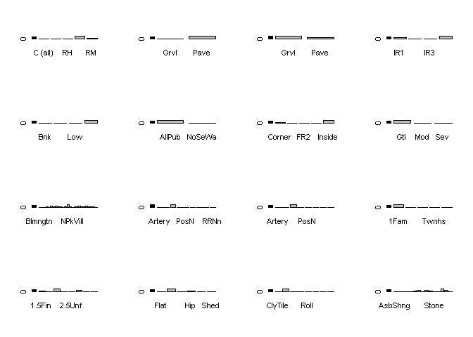
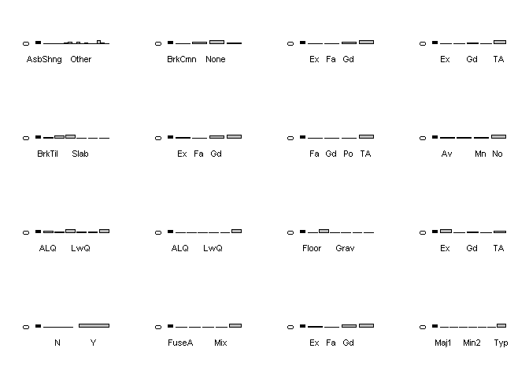
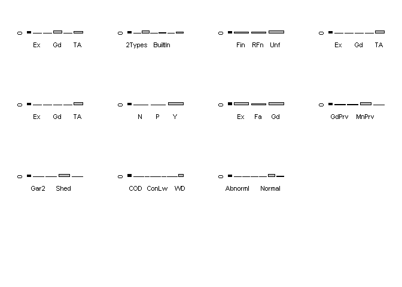

fastcampus\_R프로그래밍\_6
================
huimin
2019년 3월 21일

기본 설정
=========

``` r
library(tidyverse)
```

    ## -- Attaching packages --------------- tidyverse 1.2.1 --

    ## √ ggplot2 3.1.0       √ purrr   0.3.1  
    ## √ tibble  2.0.1       √ dplyr   0.8.0.1
    ## √ tidyr   0.8.3       √ stringr 1.4.0  
    ## √ readr   1.3.1       √ forcats 0.4.0

    ## -- Conflicts ------------------ tidyverse_conflicts() --
    ## x dplyr::filter() masks stats::filter()
    ## x dplyr::lag()    masks stats::lag()

``` r
library(purrr)
library(e1071)


house.price <- read.csv(file = "d:/fastcampus/HousePrices.csv",
                        header = TRUE,
                        stringsAsFactors = TRUE)
```

사용자 함수 만들기
==================

사용자가 만든 함수는 기존의 함수보다 우선순위를 가진다.<br> function.name &lt;- function(argments) { 작업 }<br>

임의 데이터를 넣고, **factor이면 막대그래프**를 그리고,<br> **numeric이면 n, 평균, 표준편차**를 구하는 함수<br> 그래프는 return하지 않는다.<br> factor 막대 n개<br> numeric n개 : n행 3열의 numeric n개

``` r
example.function <- function(dataset){
  
  dataset.factor <- dataset %>% purrr::keep(is.factor)
  dataset.numeric <- dataset %>% purrr::keep(is.numeric)
  
  par(mfrow = c(4,4))
  for(i in 1:ncol(dataset.factor)){
    
    barplot(table(dataset.factor[, i]))
    
  }
  par(mfrow = c(1,1))
  
  # 결과 저장 프레임
  result.frame <- data.frame()

  for(i in 1:ncol(dataset.numeric)){

    n <- length(dataset.numeric[complete.cases(dataset.numeric[, i]), i])
    mean <- mean(dataset.numeric[, i], na.rm = TRUE)
    sd <- sd(dataset.numeric[, i], na.rm = TRUE)

    result <- data.frame(n, mean, sd)

    result.frame <- rbind(result.frame, result)

  }

  return(result.frame)
  
}


result.frame <- example.function(house.price)
```



``` r
print(result.frame)
```

    ##       n         mean           sd
    ## 1  2919 1.460000e+03 8.427870e+02
    ## 2  2919 5.713772e+01 4.251763e+01
    ## 3  2433 6.930580e+01 2.334490e+01
    ## 4  2919 1.016811e+04 7.886996e+03
    ## 5  2919 6.089072e+00 1.409947e+00
    ## 6  2919 5.564577e+00 1.113131e+00
    ## 7  2919 1.971313e+03 3.029144e+01
    ## 8  2919 1.984264e+03 2.089434e+01
    ## 9  2896 1.022013e+02 1.793343e+02
    ## 10 2918 4.414232e+02 4.556108e+02
    ## 11 2918 4.958225e+01 1.692056e+02
    ## 12 2918 5.607721e+02 4.395437e+02
    ## 13 2918 1.051778e+03 4.407663e+02
    ## 14 2919 1.159582e+03 3.923621e+02
    ## 15 2919 3.364837e+02 4.287015e+02
    ## 16 2919 4.694416e+00 4.639682e+01
    ## 17 2919 1.500760e+03 5.060510e+02
    ## 18 2917 4.298937e-01 5.247356e-01
    ## 19 2917 6.136442e-02 2.456869e-01
    ## 20 2919 1.568003e+00 5.529693e-01
    ## 21 2919 3.802672e-01 5.028716e-01
    ## 22 2919 2.860226e+00 8.226931e-01
    ## 23 2919 1.044536e+00 2.144620e-01
    ## 24 2919 6.451524e+00 1.569379e+00
    ## 25 2919 5.971223e-01 6.461294e-01
    ## 26 2760 1.978113e+03 2.557428e+01
    ## 27 2918 1.766621e+00 7.616243e-01
    ## 28 2918 4.728746e+02 2.153948e+02
    ## 29 2919 9.370983e+01 1.265266e+02
    ## 30 2919 4.748681e+01 6.757549e+01
    ## 31 2919 2.309832e+01 6.424425e+01
    ## 32 2919 2.602261e+00 2.518817e+01
    ## 33 2919 1.606235e+01 5.618437e+01
    ## 34 2919 2.251799e+00 3.566395e+01
    ## 35 2919 5.082597e+01 5.674022e+02
    ## 36 2919 6.213087e+00 2.714762e+00
    ## 37 2919 2.007793e+03 1.314964e+00
    ## 38 1460 1.809212e+05 7.944250e+04
