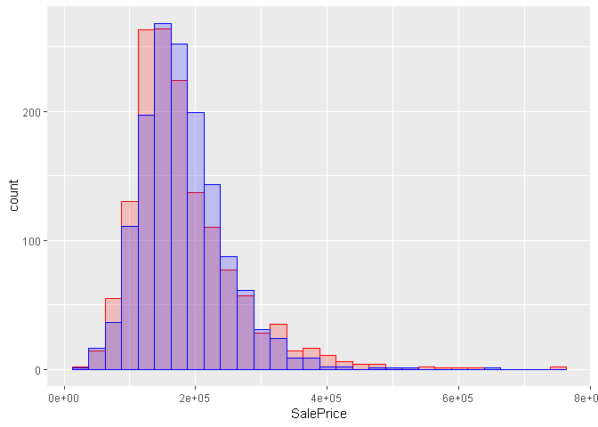

fastcampus\_R프로그래밍\_9
================
huimin
2019년 3월 23일

기본 설정
=========

``` r
library(tidyverse)
```

    ## -- Attaching packages --------------- tidyverse 1.2.1 --

    ## √ ggplot2 3.1.0       √ purrr   0.3.1  
    ## √ tibble  2.0.1       √ dplyr   0.8.0.1
    ## √ tidyr   0.8.3       √ stringr 1.4.0  
    ## √ readr   1.3.1       √ forcats 0.4.0

    ## -- Conflicts ------------------ tidyverse_conflicts() --
    ## x dplyr::filter() masks stats::filter()
    ## x dplyr::lag()    masks stats::lag()

``` r
library(purrr)
library(psych) # corr.test() 사용하기 위해서
```

    ## 
    ## Attaching package: 'psych'

    ## The following objects are masked from 'package:ggplot2':
    ## 
    ##     %+%, alpha

``` r
library(car)
```

    ## Loading required package: carData

    ## 
    ## Attaching package: 'car'

    ## The following object is masked from 'package:psych':
    ## 
    ##     logit

    ## The following object is masked from 'package:dplyr':
    ## 
    ##     recode

    ## The following object is masked from 'package:purrr':
    ## 
    ##     some

``` r
house.price <- read.csv(file = "d:/fastcampus/HousePrices.csv",
                        header = TRUE,
                        stringsAsFactors = TRUE)
```

Correlation Analysis ( 상관분석 )
=================================

**2개의 양적 자료**간의 직선(선형)의 관계**(상관관계)**가 있는지를 통계적으로 검정(분석)하는 방법<br> **자료**<br> 양적 자료 : 2개<br> 동일한 대상자에게 수집(측정)한 양적 자료임

상관계수
--------

선형관계를 수치로 알려줌 (상관관계의 정도)<br> 상관계수의 값은 -1 ~ 1의 값을 가지며 음수일 경우 음의 상관관계, 양수일 경우 양의 상관관계를 가진다.<br> 또한, 절대값이 크면 클수록 상관관계의 정도가 강하다.

cor(양적 자료, 양적 자료, method = )<br> cor(x, y, method = )<br> method : "pearson"(default), "spearman", "kendall"<br> pearson : 양적자료와 양적자료 비교<br> spearman : 순서형 자료와 순서형 자료 비교 ( 비모수적 방법과 비슷 )<br> kendall : 순서형 자료와 순서형 자료 비교 ( 비모수적 방법과 비슷 )

``` r
# NA값 제거하기
house.price.df2 <- house.price[complete.cases(house.price$LotArea,
                                              house.price$SalePrice), ]

# 상관계수
cor.result <- cor(house.price.df2$LotArea,
                  house.price.df2$SalePrice,
                  method = "pearson")

# 소수점 3자리까지 표현하기
round(cor.result, digits = 3)
```

    ## [1] 0.264

상관계수 해석 : LotArea와 SalePrice는 미약하게 양의 상관관계를 보인다.

상관계수 행렬
-------------

``` r
# 양적 자료만 선별
house.price.df <- house.price %>%
  dplyr::select(SalePrice, contains("Area"))

# NA 제거
house.price.df <- na.omit(house.price.df)

# 상관계수 행렬
# cor(data, method = "pearson")
round(cor(house.price.df, method = "pearson"),
      digits = 3)
```

    ##            SalePrice LotArea MasVnrArea GrLivArea GarageArea PoolArea
    ## SalePrice      1.000   0.265      0.477     0.710      0.622    0.093
    ## LotArea        0.265   1.000      0.104     0.261      0.181    0.078
    ## MasVnrArea     0.477   0.104      1.000     0.391      0.373    0.012
    ## GrLivArea      0.710   0.261      0.391     1.000      0.469    0.171
    ## GarageArea     0.622   0.181      0.373     0.469      1.000    0.061
    ## PoolArea       0.093   0.078      0.012     0.171      0.061    1.000

상관분석
--------

귀무가설 : LotArea와 SalePrice 간에는 관련성(상관관계)이 없다.<br> 대립가설 : LotArea와 SalePrice 간에는 관련성(상관관계)이 있다.

cor.test(양적 자료, 양적 자료, method = "pearson")<br> cor.test(x, y, method = "pearson")

``` r
cor.test(house.price$LotArea,
         house.price$SalePrice,
         method = "pearson")
```

    ## 
    ##  Pearson's product-moment correlation
    ## 
    ## data:  house.price$LotArea and house.price$SalePrice
    ## t = 10.445, df = 1458, p-value < 2.2e-16
    ## alternative hypothesis: true correlation is not equal to 0
    ## 95 percent confidence interval:
    ##  0.2154574 0.3109369
    ## sample estimates:
    ##       cor 
    ## 0.2638434

**결론** : 유의확률이 0.000이므로, 유의수준 0.05에서 LotArea와 SalePrice 간에는 관련성이 있다고 추정할 수 있다. 이 때의 상관계수는 0.264이다.

상관분석 결과를 저장할 수 있는 분석 함수
----------------------------------------

cor.test(data)는 불가능하다. psych 패키지를 이용한다.<br> psych::corr.test(data, method = "pearson")

``` r
corr.test.result <- psych::corr.test(house.price.df)

corr.test.result$r
```

    ##             SalePrice    LotArea MasVnrArea GrLivArea GarageArea
    ## SalePrice  1.00000000 0.26467400 0.47749305 0.7100797 0.62249171
    ## LotArea    0.26467400 1.00000000 0.10415982 0.2611593 0.18077795
    ## MasVnrArea 0.47749305 0.10415982 1.00000000 0.3908566 0.37306648
    ## GrLivArea  0.71007968 0.26115929 0.39085664 1.0000000 0.46942270
    ## GarageArea 0.62249171 0.18077795 0.37306648 0.4694227 1.00000000
    ## PoolArea   0.09310862 0.07788841 0.01172306 0.1708081 0.06129241
    ##              PoolArea
    ## SalePrice  0.09310862
    ## LotArea    0.07788841
    ## MasVnrArea 0.01172306
    ## GrLivArea  0.17080813
    ## GarageArea 0.06129241
    ## PoolArea   1.00000000

``` r
corr.test.result$p
```

    ##                SalePrice      LotArea   MasVnrArea     GrLivArea
    ## SalePrice   0.000000e+00 9.577459e-24 1.896061e-82 5.426815e-222
    ## LotArea     1.064162e-24 0.000000e+00 3.497962e-04  3.638500e-23
    ## MasVnrArea  1.458509e-83 6.995925e-05 0.000000e+00  3.717733e-53
    ## GrLivArea  3.617877e-223 4.548125e-24 3.379757e-54  0.000000e+00
    ## GarageArea 1.515599e-156 3.924168e-12 3.626847e-49  1.873856e-80
    ## PoolArea    3.814743e-04 2.978931e-03 6.553522e-01  5.705424e-11
    ##               GarageArea     PoolArea
    ## SalePrice  2.121839e-155 1.525897e-03
    ## LotArea     2.746917e-11 8.936794e-03
    ## MasVnrArea  3.626847e-48 6.553522e-01
    ## GrLivArea   2.248627e-79 3.423254e-10
    ## GarageArea  0.000000e+00 3.900967e-02
    ## PoolArea    1.950484e-02 0.000000e+00

Regression Analysis ( 회귀분석 )
================================

어떤 양적 자료가 다른 양적 자료에게 영향을 주는지를 통계적으로 검정(분석)하는 방법<br> **인과관계**가 있는지를 분석하는 방법<br> 선형면(직선)으로 분석하는 것을 **선형 회귀 분석**이라고 하며, 가장 간단하여 해석하기 쉬운 모형이다.<br>

**목적**<br> (1) 예측 ( Prediction )<br> (2) 분류 ( Classification )<br>

**자료**<br> 최소 2개의 자료가 있어야 함.<br> 양적 자료 1개 : **종속변수** = 반응변수 = **Label**<br> 양적 자료 1개 이상 : **독립변수** = 설명변수 = **feature**<br>

**종류**<br> 단순선형 회귀분석 : Simple Linear Regression Analysis<br> 종속변수 1개<br> 독립변수 1개<br>

다중선형 회귀분석 : Multiple Linear Regression Analysis<br> 종속변수 1개<br> 독립변수 2개 이상<br>

단순선형 회귀분석 실습
----------------------

종속변수 : SalePrice<br> 독립변수 : GrLivArea<br> GrLivArea가 SalePrice에 영향을 주는가?<br> 회귀모형 : SalePrice = beta0 + beta1\*GrLivArea + error<br>

lm(종속변수 ~ 독립변수, data = )<br> summary(회귀분석결과)

``` r
regression.model <- lm(SalePrice ~ GrLivArea,
                       data = house.price)

summary(regression.model)
```

    ## 
    ## Call:
    ## lm(formula = SalePrice ~ GrLivArea, data = house.price)
    ## 
    ## Residuals:
    ##     Min      1Q  Median      3Q     Max 
    ## -462999  -29800   -1124   21957  339832 
    ## 
    ## Coefficients:
    ##              Estimate Std. Error t value Pr(>|t|)    
    ## (Intercept) 18569.026   4480.755   4.144 3.61e-05 ***
    ## GrLivArea     107.130      2.794  38.348  < 2e-16 ***
    ## ---
    ## Signif. codes:  0 '***' 0.001 '**' 0.01 '*' 0.05 '.' 0.1 ' ' 1
    ## 
    ## Residual standard error: 56070 on 1458 degrees of freedom
    ##   (1459 observations deleted due to missingness)
    ## Multiple R-squared:  0.5021, Adjusted R-squared:  0.5018 
    ## F-statistic:  1471 on 1 and 1458 DF,  p-value: < 2.2e-16

### 결과해석

(SalePrice) = 18569 + 107.1\*(GrLivArea)<br>

### 1단계 : 회귀모형의 타당성

귀무가설 : 이 회귀모형은 타당하지 않다.<br> 대립가설 : 이 회귀모형은 타당하다.<br> F-statistic를 본다.<br> ssr의 자유도 : 1<br> sse의 자유도 : 1458 = n-2<br> F = 1471<br> **p-value = 0.000**

### 2단계 : 독립변수는 종속변수에서 영향을 미치는가?

귀무가설 : 독립변수는 종속변수에게 영향을 주지 않는다. (beta1 = 0)<br> 대립가설 : 독립변수는 종속변수에게 영향을 준다. (beta1 != 0)<br> 회귀분석 결과에서 Coefficients 부분의 p-value를 본다.<br> **p-value = 0.000**

### 3단계 : 독립변수가 종속변수에게 얼마나 영향을 미치는가?

회귀분석의 결과에서 coefficients 부분의 Estimate를 보면 된다.<br> + 일 경우 증가시키는 영향, -일 경우 감소시키는 영향이다.<br>

**결론** :독립변수의 기본 단위가 1증가하면 종속 변수는 약 107.130 정도 증가시키는 영향을 준다. GrLivArea(용적)이 1 square feet 만큼 증가하면, SalePrice는 약 107.130$ 정도 증가시키는 영향을 준다.

### 4단계 : 회귀모형의 설명력

독립변수가 종속변수의 변화를 얼마나 설명하고 있는가?<br> 회귀분석 결과에서 다음을 본다.<br> Multiple R-squared: 0.5021<br>

R Square : **결정계수** ( Coefficient of Determination )<br> ( SSR / SST ) x 100 : 0.5021 x 100 = 50.2%<br>

**결론** : 독립변수가 종속변수의 다름을 약 50.2% 정도 설명하고 있다.<br> GrLivArea(용적)이 SalePrice(가격)의 다름을 50.2% 설명하고 있다.<br> 다른 말로 하면, GrLivArea가 SalePrice의 다름을 설명하지 못하고 있는 부분이 40.8% 있다. ( SSE / SST ) \* 100<br>

### 5단계 : 예측

predict(model, newdata = data.frame(독립변수 = ))<br> 예측하고 싶은 값을 넣거나, 전체 데이터를 넣으면 회귀모형에 맞는 예측을 반환해준다.

``` r
predict(regression.model, newdata = data.frame(GrLivArea = 2000))
```

    ##        1 
    ## 232829.7

``` r
predict(regression.model, 
        newdata = data.frame(GrLivArea = c(1000, 1500, 2000)))
```

    ##        1        2        3 
    ## 125699.4 179264.6 232829.7

``` r
# 예측값
pred <- predict(regression.model, house.price)
# 예측값을 house.price에 추가하기
house.price$SalePrice.pred <- pred
house.price$SalePrice.pred[is.na(house.price$SalePrice)] <- NA

# 예측값과 실제 데이터 간단하게 비교해보기
ggplot(data = house.price) +
  geom_histogram(mapping = aes(x = SalePrice),
                 fill = "red",
                 color = "red",
                 alpha = 0.2) +
  geom_histogram(mapping = aes(x = SalePrice.pred),
                 fill = "blue",
                 color = "blue",
                 alpha = 0.2)
```

    ## `stat_bin()` using `bins = 30`. Pick better value with `binwidth`.

    ## Warning: Removed 1459 rows containing non-finite values (stat_bin).

    ## `stat_bin()` using `bins = 30`. Pick better value with `binwidth`.

    ## Warning: Removed 1459 rows containing non-finite values (stat_bin).


붉은색 히스토그램 = **실제값**<br> 파란색 히스토그램 = **예측값**

다중선형 회귀분석 실습
----------------------

lm(종속변수 ~ 독립변수1 + 독립변수2 + 독립변수p, data = )<br> summary(다중 선형 회귀분석의 결과)<br>

특정 데이터에서 종속변수를 제외한 나머지 모든 변수를 독립변수로 지정하는 방법<br> lm(종속변수 ~ ., data = )<br> summary(다중 선형 회귀분석의 결과)<br>

종속변수 : SalePrice<br> 독립변수 : 변수명에 Area이 있는 것들

``` r
# 종속변수 SalePrice와 각종 양적 자료들만 선별한 데이터셋
house.price.numeric <- house.price %>% dplyr::select(SalePrice,
                                                     contains("Area"))

# 회귀모델 만들기
regression.model2 <- lm(SalePrice ~ .,
                        data = house.price.numeric)

# 결과 보기
summary(regression.model2)
```

    ## 
    ## Call:
    ## lm(formula = SalePrice ~ ., data = house.price.numeric)
    ## 
    ## Residuals:
    ##     Min      1Q  Median      3Q     Max 
    ## -495131  -22563    -305   20078  330856 
    ## 
    ## Coefficients:
    ##              Estimate Std. Error t value Pr(>|t|)    
    ## (Intercept) 1363.4436  4212.2602   0.324    0.746    
    ## LotArea        0.5147     0.1308   3.936 8.67e-05 ***
    ## MasVnrArea    70.8508     7.7698   9.119  < 2e-16 ***
    ## GrLivArea     72.3129     2.9028  24.912  < 2e-16 ***
    ## GarageArea   120.8415     6.8550  17.628  < 2e-16 ***
    ## PoolArea     -30.9499    31.7475  -0.975    0.330    
    ## ---
    ## Signif. codes:  0 '***' 0.001 '**' 0.01 '*' 0.05 '.' 0.1 ' ' 1
    ## 
    ## Residual standard error: 47880 on 1446 degrees of freedom
    ##   (1467 observations deleted due to missingness)
    ## Multiple R-squared:  0.6365, Adjusted R-squared:  0.6353 
    ## F-statistic: 506.4 on 5 and 1446 DF,  p-value: < 2.2e-16

``` r
# 예측하기
house.price.numeric$SalePrice.pred <- predict(regression.model2,
                                              house.price.numeric)

house.price.numeric$SalePrice.pred[is.na(house.price.numeric$SalePrice)] <- NA


# 예측값과 실제 데이터 간단하게 비교해보기
ggplot(data = house.price.numeric) +
  geom_histogram(mapping = aes(x = SalePrice),
                 fill = "red",
                 color = "red",
                 alpha = 0.2) +
  geom_histogram(mapping = aes(x = SalePrice.pred),
                 fill = "blue",
                 color = "blue",
                 alpha = 0.2)
```

    ## `stat_bin()` using `bins = 30`. Pick better value with `binwidth`.

    ## Warning: Removed 1459 rows containing non-finite values (stat_bin).

    ## `stat_bin()` using `bins = 30`. Pick better value with `binwidth`.

    ## Warning: Removed 1467 rows containing non-finite values (stat_bin).



회귀분석에서 고려해야 할 사항들
-------------------------------

**1. 변수선택 방법 ( Variable Selection )**<br> step(회귀모형, direction = )<br> direction : "forward", "backward", "both"<br> foward : 전진선택법<br> backward : 후진소거법<br> both : stepwise 단계선택법<br>

**어떤 방법을 최종 모형으로 사용할까?**<br> AIC값이 가장 작은 것이 좋은 모형임<br> 또는 R-Square or Adjusted R-Square : 값이 가장 큰 것이 좋은 모형임

``` r
# forward selection
house.price.forward.model <- step(regression.model2,
                                  direction = "forward")
```

    ## Start:  AIC=31301.05
    ## SalePrice ~ LotArea + MasVnrArea + GrLivArea + GarageArea + PoolArea

``` r
summary(house.price.forward.model)
```

    ## 
    ## Call:
    ## lm(formula = SalePrice ~ LotArea + MasVnrArea + GrLivArea + GarageArea + 
    ##     PoolArea, data = house.price.numeric)
    ## 
    ## Residuals:
    ##     Min      1Q  Median      3Q     Max 
    ## -495131  -22563    -305   20078  330856 
    ## 
    ## Coefficients:
    ##              Estimate Std. Error t value Pr(>|t|)    
    ## (Intercept) 1363.4436  4212.2602   0.324    0.746    
    ## LotArea        0.5147     0.1308   3.936 8.67e-05 ***
    ## MasVnrArea    70.8508     7.7698   9.119  < 2e-16 ***
    ## GrLivArea     72.3129     2.9028  24.912  < 2e-16 ***
    ## GarageArea   120.8415     6.8550  17.628  < 2e-16 ***
    ## PoolArea     -30.9499    31.7475  -0.975    0.330    
    ## ---
    ## Signif. codes:  0 '***' 0.001 '**' 0.01 '*' 0.05 '.' 0.1 ' ' 1
    ## 
    ## Residual standard error: 47880 on 1446 degrees of freedom
    ##   (1467 observations deleted due to missingness)
    ## Multiple R-squared:  0.6365, Adjusted R-squared:  0.6353 
    ## F-statistic: 506.4 on 5 and 1446 DF,  p-value: < 2.2e-16

``` r
# backward selection
# 가장 마지막 부분이 최종적인 회귀모형이다.
house.price.backward.model <- step(regression.model2,
                                   direction = "backward")
```

    ## Start:  AIC=31301.05
    ## SalePrice ~ LotArea + MasVnrArea + GrLivArea + GarageArea + PoolArea
    ## 
    ##              Df  Sum of Sq        RSS   AIC
    ## - PoolArea    1 2.1791e+09 3.3177e+12 31300
    ## <none>                     3.3155e+12 31301
    ## - LotArea     1 3.5527e+10 3.3510e+12 31315
    ## - MasVnrArea  1 1.9065e+11 3.5061e+12 31380
    ## - GarageArea  1 7.1252e+11 4.0280e+12 31582
    ## - GrLivArea   1 1.4229e+12 4.7384e+12 31818
    ## 
    ## Step:  AIC=31300
    ## SalePrice ~ LotArea + MasVnrArea + GrLivArea + GarageArea
    ## 
    ##              Df  Sum of Sq        RSS   AIC
    ## <none>                     3.3177e+12 31300
    ## - LotArea     1 3.4944e+10 3.3526e+12 31313
    ## - MasVnrArea  1 1.9360e+11 3.5113e+12 31380
    ## - GarageArea  1 7.1340e+11 4.0311e+12 31581
    ## - GrLivArea   1 1.4422e+12 4.7598e+12 31822

``` r
summary(house.price.backward.model)
```

    ## 
    ## Call:
    ## lm(formula = SalePrice ~ LotArea + MasVnrArea + GrLivArea + GarageArea, 
    ##     data = house.price.numeric)
    ## 
    ## Residuals:
    ##     Min      1Q  Median      3Q     Max 
    ## -508148  -22405     -48   20039  315152 
    ## 
    ## Coefficients:
    ##              Estimate Std. Error t value Pr(>|t|)    
    ## (Intercept) 1935.2517  4171.1514   0.464    0.643    
    ## LotArea        0.5102     0.1307   3.904  9.9e-05 ***
    ## MasVnrArea    71.2806     7.7572   9.189  < 2e-16 ***
    ## GrLivArea     71.8594     2.8652  25.080  < 2e-16 ***
    ## GarageArea   120.9101     6.8545  17.639  < 2e-16 ***
    ## ---
    ## Signif. codes:  0 '***' 0.001 '**' 0.01 '*' 0.05 '.' 0.1 ' ' 1
    ## 
    ## Residual standard error: 47880 on 1447 degrees of freedom
    ##   (1467 observations deleted due to missingness)
    ## Multiple R-squared:  0.6363, Adjusted R-squared:  0.6353 
    ## F-statistic: 632.8 on 4 and 1447 DF,  p-value: < 2.2e-16

``` r
# stepwise
# 가장 마지막 부분이 최종적인 회귀모형이다.
house.price.stepwise.model <- step(regression.model2,
                                   direction = "both")
```

    ## Start:  AIC=31301.05
    ## SalePrice ~ LotArea + MasVnrArea + GrLivArea + GarageArea + PoolArea
    ## 
    ##              Df  Sum of Sq        RSS   AIC
    ## - PoolArea    1 2.1791e+09 3.3177e+12 31300
    ## <none>                     3.3155e+12 31301
    ## - LotArea     1 3.5527e+10 3.3510e+12 31315
    ## - MasVnrArea  1 1.9065e+11 3.5061e+12 31380
    ## - GarageArea  1 7.1252e+11 4.0280e+12 31582
    ## - GrLivArea   1 1.4229e+12 4.7384e+12 31818
    ## 
    ## Step:  AIC=31300
    ## SalePrice ~ LotArea + MasVnrArea + GrLivArea + GarageArea
    ## 
    ##              Df  Sum of Sq        RSS   AIC
    ## <none>                     3.3177e+12 31300
    ## + PoolArea    1 2.1791e+09 3.3155e+12 31301
    ## - LotArea     1 3.4944e+10 3.3526e+12 31313
    ## - MasVnrArea  1 1.9360e+11 3.5113e+12 31380
    ## - GarageArea  1 7.1340e+11 4.0311e+12 31581
    ## - GrLivArea   1 1.4422e+12 4.7598e+12 31822

``` r
summary(house.price.stepwise.model)
```

    ## 
    ## Call:
    ## lm(formula = SalePrice ~ LotArea + MasVnrArea + GrLivArea + GarageArea, 
    ##     data = house.price.numeric)
    ## 
    ## Residuals:
    ##     Min      1Q  Median      3Q     Max 
    ## -508148  -22405     -48   20039  315152 
    ## 
    ## Coefficients:
    ##              Estimate Std. Error t value Pr(>|t|)    
    ## (Intercept) 1935.2517  4171.1514   0.464    0.643    
    ## LotArea        0.5102     0.1307   3.904  9.9e-05 ***
    ## MasVnrArea    71.2806     7.7572   9.189  < 2e-16 ***
    ## GrLivArea     71.8594     2.8652  25.080  < 2e-16 ***
    ## GarageArea   120.9101     6.8545  17.639  < 2e-16 ***
    ## ---
    ## Signif. codes:  0 '***' 0.001 '**' 0.01 '*' 0.05 '.' 0.1 ' ' 1
    ## 
    ## Residual standard error: 47880 on 1447 degrees of freedom
    ##   (1467 observations deleted due to missingness)
    ## Multiple R-squared:  0.6363, Adjusted R-squared:  0.6353 
    ## F-statistic: 632.8 on 4 and 1447 DF,  p-value: < 2.2e-16

``` r
# 각 방식에 따른 AIC
house.price.forward.model$anova$AIC
```

    ## [1] 31301.05

``` r
house.price.backward.model$anova$AIC
```

    ## [1] 31301.05 31300.00

``` r
house.price.stepwise.model$anova$AIC
```

    ## [1] 31301.05 31300.00

**2. 다중공선성(Multicolinearity)**<br> 회귀모형에 있는 독립변수들 간의 상관관계가 있는지를 알려줌<br> 회귀모형의 가정 중에 하나는, 독립변수들 간에는 상관관계가 없어야 한다는 것이다.<br>

VIF : Variance Inflation Factor : 분산 팽창 인자 = 분산 팽창 요인<br> **VIF 값이 10 이상이면 다중공선성이 있다고 판단한다.**<br> 10미만이면, 다중공선성이 없다고 판단한다.<br>

car::vif(최종회귀모형)<br>

``` r
# 다중공선성 확인하기
car::vif(house.price.stepwise.model)
```

    ##    LotArea MasVnrArea  GrLivArea GarageArea 
    ##   1.078432   1.248485   1.435407   1.363063

**3. 독립변수들 중에서 어떤 독립변수가 종속변수에게 가장 큰 영향력을 가질까?**<br> 표준화된 회귀계수(Coefficient of standardized regression)<br> **표준화된 회귀계수의 절대값**이 가장 큰 독립변수가 종속변수에게 가장 큰 영향력을 준다.<br>

표준화된 회귀계수 구하기<br> lm.beta::lm.beta(최종회귀모형)

``` r
lm.beta::lm.beta(house.price.stepwise.model)
```

    ## 
    ## Call:
    ## lm(formula = SalePrice ~ LotArea + MasVnrArea + GrLivArea + GarageArea, 
    ##     data = house.price.numeric)
    ## 
    ## Standardized Coefficients::
    ## (Intercept)     LotArea  MasVnrArea   GrLivArea  GarageArea 
    ##  0.00000000  0.06427714  0.16278515  0.47639569  0.32651119

**4. 더미변수 ( Dummy Variable )** 기본적으로 독립변수는 양적 자료이어야 함<br> 그런데 질적 자료도 독립변수로 넣고 싶을 때에, **질적 자료를 0과 1로 구성된 양적 자료로 변환**한 것이 더미 변수이다.<br>

질적 자료의 레벨이 2개라면, 더미 변수를 하나만 만들면 된다.<br> 질적 자료의 레벨이 3개라면, 더미 변수를 두 개 만들어야 한다.<br> 질적 자료의 레벨이 n개라면, 더미 변수를 n-1개 만들어야 한다.<br> 이해를 돕기 위해서 다음의 표를 만들어보았다.<br>

| 레벨의 수 | 더미변수1 | 더미번수2 | 더미변수3 |   ---  | 더미변수n-1 |                       해석                       |
|:---------:|:---------:|:---------:|:---------:|:------:|:-----------:|:------------------------------------------------:|
|     2     |   toggle  |     -     |     -     |    -   |      -      |    더미변수 1이 0일때와 1일 때. 총 2개의 레벨    |
|     3     |   toggle  |   toggle  |     -     |    -   |      -      | 더미변수 1과 2가 (1,0) (0,1) (0,0) 총 3개의 레벨 |
|     n     |   toggle  |   toggle  |   toggle  | toggle |    toggle   |         더미변수 1,2,...n-1 총 n개의 레벨        |

``` r
# MSZoning이 RL일 때 1, 그 외에는 0이라는 더미변수를 추가하였다.
# 이는 즉, RL일 때, SalePrice에 얼만큼의 영향을 주는지 확인하는 것이다.
house.price.numeric$MSZoning <- ifelse(house.price$MSZoning == "RL",
                                       1,
                                       0)

# 회귀모형 적합하기
regression.model3 <- lm(SalePrice ~.,
                        data = house.price.numeric)

# 회귀모형 변수 선별
regression.model3 <- step(regression.model3,
                          direction = "both")
```

    ## Start:  AIC=31260.02
    ## SalePrice ~ LotArea + MasVnrArea + GrLivArea + GarageArea + PoolArea + 
    ##     SalePrice.pred + MSZoning
    ## 
    ## 
    ## Step:  AIC=31260.02
    ## SalePrice ~ LotArea + MasVnrArea + GrLivArea + GarageArea + PoolArea + 
    ##     MSZoning
    ## 
    ##              Df  Sum of Sq        RSS   AIC
    ## - PoolArea    1 2.5168e+09 3.2212e+12 31259
    ## <none>                     3.2187e+12 31260
    ## - LotArea     1 1.7670e+10 3.2364e+12 31266
    ## - MSZoning    1 9.6813e+10 3.3155e+12 31301
    ## - MasVnrArea  1 1.8552e+11 3.4042e+12 31339
    ## - GarageArea  1 6.4937e+11 3.8681e+12 31525
    ## - GrLivArea   1 1.4104e+12 4.6291e+12 31786
    ## 
    ## Step:  AIC=31259.15
    ## SalePrice ~ LotArea + MasVnrArea + GrLivArea + GarageArea + MSZoning
    ## 
    ##                  Df  Sum of Sq        RSS   AIC
    ## <none>                         3.2212e+12 31259
    ## + PoolArea        1 2.5168e+09 3.2187e+12 31260
    ## + SalePrice.pred  1 2.5168e+09 3.2187e+12 31260
    ## - LotArea         1 1.7246e+10 3.2384e+12 31265
    ## - MSZoning        1 9.6475e+10 3.3177e+12 31300
    ## - MasVnrArea      1 1.8860e+11 3.4098e+12 31340
    ## - GarageArea      1 6.5038e+11 3.8716e+12 31524
    ## - GrLivArea       1 1.4279e+12 4.6491e+12 31790

``` r
# 다중공산성 확인해보기
car::vif(regression.model3)
```

    ##    LotArea MasVnrArea  GrLivArea GarageArea   MSZoning 
    ##   1.110623   1.248898   1.435896   1.378916   1.064816

``` r
# 결과보기
summary(regression.model3)
```

    ## 
    ## Call:
    ## lm(formula = SalePrice ~ LotArea + MasVnrArea + GrLivArea + GarageArea + 
    ##     MSZoning, data = house.price.numeric)
    ## 
    ## Residuals:
    ##     Min      1Q  Median      3Q     Max 
    ## -498094  -22510    -718   18779  314109 
    ## 
    ## Coefficients:
    ##               Estimate Std. Error t value Pr(>|t|)    
    ## (Intercept) -9923.8516  4489.0618  -2.211  0.02721 *  
    ## LotArea         0.3637     0.1307   2.782  0.00547 ** 
    ## MasVnrArea     70.3660     7.6475   9.201  < 2e-16 ***
    ## GrLivArea      71.5163     2.8247  25.318  < 2e-16 ***
    ## GarageArea    116.1150     6.7956  17.087  < 2e-16 ***
    ## MSZoning    20624.0902  3133.9518   6.581 6.52e-11 ***
    ## ---
    ## Signif. codes:  0 '***' 0.001 '**' 0.01 '*' 0.05 '.' 0.1 ' ' 1
    ## 
    ## Residual standard error: 47200 on 1446 degrees of freedom
    ##   (1467 observations deleted due to missingness)
    ## Multiple R-squared:  0.6468, Adjusted R-squared:  0.6456 
    ## F-statistic: 529.7 on 5 and 1446 DF,  p-value: < 2.2e-16

더미변수를 통해서, **MSZoning**은 다른 독립변수들이 고정되어 있을 때에 **RL로 바뀌면** SalePrice를 약 **20624.090달러 증가**시킨다는 것을 알 수 있다.

회귀분석의 에러(잔차)에 대한 가정 4가지
---------------------------------------

1.  정규성 가정<br>
2.  선형성 가정<br>
3.  독립성 가정<br>
4.  등분산성 가정<br>

<!-- -->

1.  gvlma::gvlma(최종 회귀모형)<br> **summary(gvlma::gvlma(최종 회귀모형))**<br> **파라미터 설명**<br> global stat : 전반적인 가정.<br> skewness : 왜도. 대칭성과 관련된 부분.<br> kurtosis : 첨도. 정규성과 관련된 부분.<br> Link Function : 선형성.<br> Heteroscedasticity : 등분산성.

2.  독립성 검정을 해주는 함수<br> 귀무가설 : 에러들은 각각 독립이다.<br> 대립가설 : 에러들은 각각 독립이 아니다.<br> **car::durbinWatsonTest(최종 회귀모형)**<br>

3.  등분산성 검정을 해주는 함수<br> 귀무가설 : 등분산이다.<br> 대립가설 : 이분산이다.<br> **car::ncvTest(최종 회귀모형)**<br>

4.  정규성 검정을 해주는 함수<br> 귀무가설 : 에러는 정규분포를 따른다.<br> 대립가설 : 에러는 정규분포를 따르지 않는다.<br> residual : 잔차( 종속변수의 실제값 - 예측값 )<br> **shapiro.test(최종회귀모형$residuals)**
