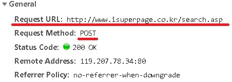
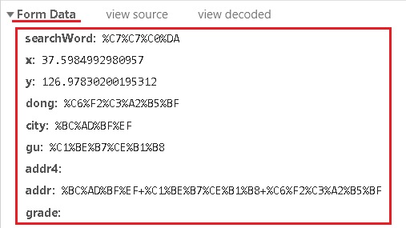

fastcampus\_웹크롤링\_2
================
huimin
2019년 3월 27일

기본 설정
=========

``` r
library(tidyverse)
```

    ## -- Attaching packages --------------- tidyverse 1.2.1 --

    ## √ ggplot2 3.1.0       √ purrr   0.3.1  
    ## √ tibble  2.0.1       √ dplyr   0.8.0.1
    ## √ tidyr   0.8.3       √ stringr 1.4.0  
    ## √ readr   1.3.1       √ forcats 0.4.0

    ## -- Conflicts ------------------ tidyverse_conflicts() --
    ## x dplyr::filter() masks stats::filter()
    ## x dplyr::lag()    masks stats::lag()

``` r
library(httr)
library(rvest)
```

    ## Loading required package: xml2

    ## 
    ## Attaching package: 'rvest'

    ## The following object is masked from 'package:purrr':
    ## 
    ##     pluck

    ## The following object is masked from 'package:readr':
    ## 
    ##     guess_encoding

``` r
library(readr)
library(urltools)
```

    ## 
    ## Attaching package: 'urltools'

    ## The following object is masked from 'package:xml2':
    ## 
    ##     url_parse

한글 인코딩 방식에 대한 이해
============================

한글 인코딩은 한글을 컴퓨터에 표시하는 방식을 말한다.<br> 한글 인코딩에 주로 사용되는 방식은 크게 **EUC-KR**과 **UTF-8**이다.<br>

윈도우의 기본 인코딩 방식은 EUC-KR이고, 맥의 기본 인코딩 방식은 UTF-8이다.<br> 그렇기 때문에, 인터넷 **홈페이지의 형식**과 자신 **컴퓨터의 운영체제**에 따라서 **인코딩 방식을 변경**해줄 필요가 있다.<br><br>

**한글 인코딩 관련 R 함수들**<br>

|               함수              |                      설명                      |
|:-------------------------------:|:----------------------------------------------:|
|        localeToCharset()        | 컴퓨터에 설정된 로케일의 문자 인코딩 방식 확인 |
|      Encoding(x = "문자열")     |       문자열의 인코딩 방식을 확인 및 설정      |
| iconv(x="문자열",from="",to="") |                인코딩 방식 변경                |
|  guess\_encoding(file="파일명") |      컴퓨터에 저장된 파일/URL 인코딩 확인      |

여기서 guess\_encoding의 경우에는 **readr 패키지**가 필요하다.<br>

16진수 문자 해독하기
--------------------

``` r
hex <- '49 20 77 61 6E 6E 61 20 73 65 65 20 79 6F 75 20 73 6F 20 6D 75 63 68 0A 49 66 20 79 6F 75 20 67 69 76 65 20 6D 65 20 61 6E 20 68 6F 75 72 0A 49 27 6D 20 6A 75 73 74 20 6C 6F 6F 6B 69 6E 67 20 61 74 20 79 6F 75 72 20 66 61 63 65 2E 0A 49 20 64 6F 6E 27 74 20 77 61 6E 74 20 74 6F 20 62 65 20 77 69 74 68 20 73 6F 6D 65 6F 6E 65 20 79 6F 75 27 72 65 20 6E 6F 74 2E 0A 53 6F 2C 20 49 27 6C 6C 20 62 65 20 61 6C 6F 6E 65 20 66 6F 72 20 74 68 65 20 74 69 6D 65 20 62 65 69 6E 67 2E'

# 띄여쓰기 제거하기 + 리스트 형태로 반환된 것의 리스트 해제하기
hex <- hex %>% str_split(pattern = " ") %>% unlist()

# 출력해보기
print(hex)
```

    ##   [1] "49" "20" "77" "61" "6E" "6E" "61" "20" "73" "65" "65" "20" "79" "6F"
    ##  [15] "75" "20" "73" "6F" "20" "6D" "75" "63" "68" "0A" "49" "66" "20" "79"
    ##  [29] "6F" "75" "20" "67" "69" "76" "65" "20" "6D" "65" "20" "61" "6E" "20"
    ##  [43] "68" "6F" "75" "72" "0A" "49" "27" "6D" "20" "6A" "75" "73" "74" "20"
    ##  [57] "6C" "6F" "6F" "6B" "69" "6E" "67" "20" "61" "74" "20" "79" "6F" "75"
    ##  [71] "72" "20" "66" "61" "63" "65" "2E" "0A" "49" "20" "64" "6F" "6E" "27"
    ##  [85] "74" "20" "77" "61" "6E" "74" "20" "74" "6F" "20" "62" "65" "20" "77"
    ##  [99] "69" "74" "68" "20" "73" "6F" "6D" "65" "6F" "6E" "65" "20" "79" "6F"
    ## [113] "75" "27" "72" "65" "20" "6E" "6F" "74" "2E" "0A" "53" "6F" "2C" "20"
    ## [127] "49" "27" "6C" "6C" "20" "62" "65" "20" "61" "6C" "6F" "6E" "65" "20"
    ## [141] "66" "6F" "72" "20" "74" "68" "65" "20" "74" "69" "6D" "65" "20" "62"
    ## [155] "65" "69" "6E" "67" "2E"

``` r
# 16진수의 정수로 변환하고 raw 객체로 속성을 바꾼다.
hexRaw <- hex %>% strtoi(base = 16L) %>% as.raw()
# raw 객체를 다시 문자열로 변환하기
hexCha <- hexRaw %>% rawToChar()


# 결과 확인하기
print(hexCha)
```

    ## [1] "I wanna see you so much\nIf you give me an hour\nI'm just looking at your face.\nI don't want to be with someone you're not.\nSo, I'll be alone for the time being."

``` r
# 강제 개행 \n이 있기 때문에 cat으로 출력해준다.
cat(hexCha)
```

    ## I wanna see you so much
    ## If you give me an hour
    ## I'm just looking at your face.
    ## I don't want to be with someone you're not.
    ## So, I'll be alone for the time being.

한글 인코딩 관련 R 함수 실습
----------------------------

``` r
# 현재 설정된 한글 인코딩 방식 확인
localeToCharset()
```

    ## [1] "CP949"

``` r
text <- "텍스트입니다."

# 현재 text의 인코딩 방식 ( windows의 경우 unknown 출력됨 )
Encoding(text)
```

    ## [1] "unknown"

``` r
# latin1로 설정해보기
Encoding(text) <- "latin1"
Encoding(text)
```

    ## [1] "latin1"

``` r
print(text)
```

    ## [1] "AؽºÆ®AO´I´U."

``` r
# 이외에 bytes(16진수), UTF-8, CP949, EUC-KR로 설정할 수도 있다.
Encoding(text) <- "EUC-KR"

# iconv를 통해서 한글 인코딩 형식 변경하기
iconv(x= text, from = "EUC-KR", to = "UTF-8")
```

    ## [1] "텍스트입니다."

``` r
iconv(x= text, from = "EUC-KR", to = "CP949")
```

    ## [1] "텍스트입니다."

``` r
# guess_encoding()을 통해 관심있는 URL에 사용된 문자 인코딩 방식 확인하기
readr::guess_encoding(file = "https://www.naver.com/")
```

    ## # A tibble: 2 x 2
    ##   encoding     confidence
    ##   <chr>             <dbl>
    ## 1 UTF-8              1   
    ## 2 windows-1252       0.31

``` r
# 출력된 결과중 confidence가 가장 높은 것을 선택한다.
```

로케일에 대한 이해
==================

운영체제는 국가마다 서로 다른 로케일을 제공한다. ( 문자 표기 방법 )<br> 한글 인코딩 방식이 로케일에 영향을 받는다.<br>

**로케일 관련 R 함수들**<br>

|                  함수                 |                   설명                   |
|:-------------------------------------:|:----------------------------------------:|
|            Sys.getlocale()            |      현재 설정된 로케일을 확인한다.      |
| Sys.setlocale(category = , locale = ) |          로케일 설정을 변경한다.         |
|           localeToCharset()           | 현재 설정된 한글 인코딩 방식을 확인한다. |

편의상 category = "LC\_ALL"을 한다.<br> **html\_table()**함수는 **EUC-KR, CP949** 등의 문자 인코딩 방식이 적용된 로케일에서는 **제대로 작동하지 않으므로**, 만약 **Windows 컴퓨터**를 사용하고 있다면 이 함수를 적용하기 위해 일시적으로 **로케일을 변경**해주어야 한다.<br>

실습 - 로케일 관련 함수들
-------------------------

``` r
# 현재의 로케일 확인하기
Sys.getlocale()
```

    ## [1] "LC_COLLATE=Korean_Korea.949;LC_CTYPE=Korean_Korea.949;LC_MONETARY=Korean_Korea.949;LC_NUMERIC=C;LC_TIME=Korean_Korea.949"

``` r
# 현재 설정된 로케일에 따른 문자 인코딩 방식 확인하기
localeToCharset()
```

    ## [1] "CP949"

``` r
# 우리나라 UTF-8로 로케일 변경하기
Sys.setlocale(category = "LC_ALL",
              locale = "korean")
```

    ## [1] "LC_COLLATE=Korean_Korea.949;LC_CTYPE=Korean_Korea.949;LC_MONETARY=Korean_Korea.949;LC_NUMERIC=C;LC_TIME=Korean_Korea.949"

``` r
localeToCharset()
```

    ## [1] "CP949"

실습2 - 네이버 증권 : 코스피200 데이터 수집하기
-----------------------------------------------

``` r
# https://finance.naver.com/sise/sise_index.nhn?code=KPI200
res <- GET(url = "https://finance.naver.com/sise/sise_index.nhn",
           query = list(code="KPI200"))
print(res)
```

    ## Response [https://finance.naver.com/sise/sise_index.nhn?code=KPI200]
    ##   Date: 2019-03-28 05:04
    ##   Status: 200
    ##   Content-Type: text/html;charset=EUC-KR
    ##   Size: 44 kB
    ## 
    ## 
    ## 
    ## 
    ## 
    ## 
    ## 
    ## <script language=javascript src='/js/recent_code.js'></script>
    ## <script type="text/javascript">
    ## function mainSiseMove(code) {
    ## ...

``` r
# 임시로 로케일 변경하기
Sys.setlocale(category = "LC_ALL", locale = "C")
```

    ## [1] "C"

``` r
localeToCharset()
```

    ## [1] "ASCII"

``` r
# 필요한 부분만 테이블로 추출하기
table <- res %>% 
  read_html(encoding = "EUC-KR") %>% 
  html_nodes(css = "div.subtop_sise_detail>table") %>% 
  html_table()

# 다시 되돌리기
Sys.setlocale(category = "LC_ALL", locale = "korean")
```

    ## [1] "LC_COLLATE=Korean_Korea.949;LC_CTYPE=Korean_Korea.949;LC_MONETARY=Korean_Korea.949;LC_NUMERIC=C;LC_TIME=Korean_Korea.949"

``` r
# 출력하기
print(table)
```

    ## [[1]]
    ##           X1     X2 X3             X4        X5
    ## 1  코스피200 275.22 NA     상한종목수         0
    ## 2                   NA                         
    ## 3   전일대비   2.06 NA     상승종목수        42
    ## 4                   NA                         
    ## 5     등락률 -0.74% NA     하한종목수         0
    ## 6                   NA                         
    ## 7   장중최고 276.20 NA     하락종목수       135
    ## 8                   NA                         
    ## 9   장중최저 273.90 NA     보합종목수        23
    ## 10                  NA                         
    ## 11  52주최고 323.97 NA   거래량(천주)    45,755
    ## 12                  NA                         
    ## 13  52주최저 254.55 NA 거래대금(백만) 2,021,467
    ## 14                  NA

``` r
str(table)
```

    ## List of 1
    ##  $ :'data.frame':    14 obs. of  5 variables:
    ##   ..$ X1: chr [1:14] "코스피200" "" "전일대비" "" ...
    ##   ..$ X2: chr [1:14] "275.22" "" "2.06" "" ...
    ##   ..$ X3: logi [1:14] NA NA NA NA NA NA ...
    ##   ..$ X4: chr [1:14] "상한종목수" "" "상승종목수" "" ...
    ##   ..$ X5: chr [1:14] "0" "" "42" "" ...

``` r
# 전처리하기
table <- table[[1]][seq(from = 1, to = 14, by = 2), -3]
colnames(table) <- c("구분","값","구분","값")
result <- rbind(table[,1:2], table[,3:4]) %>% as.data.frame()
rownames(result) <- NULL

# 결과 출력하기
print(result)
```

    ##              구분        값
    ## 1       코스피200    275.22
    ## 2        전일대비      2.06
    ## 3          등락률    -0.74%
    ## 4        장중최고    276.20
    ## 5        장중최저    273.90
    ## 6        52주최고    323.97
    ## 7        52주최저    254.55
    ## 8      상한종목수         0
    ## 9      상승종목수        42
    ## 10     하한종목수         0
    ## 11     하락종목수       135
    ## 12     보합종목수        23
    ## 13   거래량(천주)    45,755
    ## 14 거래대금(백만) 2,021,467

POST
====

POST방식의 파라미터는 다음과 같이 찾을 수 있다.<br>

**개발자도구-&gt;Network-&gt;해당 문서**에서 General에 있는 **"요청라인"**<br> 

**퍼센트 인코딩**형식으로 되어있는 **메시지 바디**<br> 

**퍼센트 인코딩이란?**<br> URL에 사용되는 문자를 인코딩하는 방식이자, **URL인코딩**이라고도 한다.<br> 퍼센트 인코딩된 문자열을 **디코딩**하면 사람이 볼 수 있다.<br>

**urltools패키지**<br> url\_decode(urls = "문자열") : 퍼센트 디코딩을 한다.<br> url\_encode(urls = "문자열") : 퍼센트 인코딩을 한다.<br>

실습1 - 퍼센트 인코딩 관련 R 함수 소개
--------------------------------------

``` r
string <- "웹크롤링"
string %>% Encoding()
```

    ## [1] "unknown"

``` r
# 퍼센트 인코딩 했을 경우
string %>% url_encode()
```

    ## [1] "%c0%a5%c5%a9%b7%d1%b8%b5"

``` r
# 퍼센트 인코딩 한 것을 디코딩 했을 경우
string %>% url_encode() %>% url_decode()
```

    ## [1] "웹크롤링"

실습2 - POST 방식을 활용한 정보 수집하기
----------------------------------------

POST 방식<br> res &lt;- POST(url = "요청할 웹 페이지 URL",<br> body = list(POST방식 요청에 사용될 파라미터 - 개발자 도구),<br> encode = c("multipart","form","json","raw"))<br>

encode의 경우, 4가지 중 해당하는 한 가지를 선택하거나 생략할 수 있다.<br> body에 **I()함수**를 사용하는 이유는, **더블 인코딩을 방지**하기 위함이다.

``` r
res <- POST(url = "http://www.isuperpage.co.kr/search.asp",
            body = list(searchWord = "%C4%A1%C5%B2" %>% I(),
                        city = "%BC%AD%BF%EF" %>% I(),
                        gu = "%B0%AD%B3%B2%B1%B8" %>% I()),
            encode = "form")

# 결과 출력하기
print(res)
```

    ## Response [http://www.isuperpage.co.kr/search.asp]
    ##   Date: 2019-03-28 05:04
    ##   Status: 200
    ##   Content-Type: text/html; Charset=EUC-KR
    ##   Size: 82.9 kB
    ## 
    ## <!DOCTYPE html>
    ## <html lang="ko">
    ## <head>
    ## <meta charset="euc-kr">
    ## <meta http-equiv="X-UA-Compatible" content="IE=edge" />
    ## <title>:: 대한민국 모든 전화번호 검색은 한국전화번호부 ::</title>
    ## <link rel="stylesheet" type='text/css' href="/css3/base_n_n.css"/>
    ## <link href="/css3/dcaccordion.css" rel="stylesheet" type="text/css" />
    ## <link href="/jqy/jquery-ui.css" rel="stylesheet" type="text/css" />
    ## ...

``` r
Name <- res %>%
  read_html() %>% 
  html_nodes(css = "div > a.l_tit") %>% 
  html_text()

phone <- res %>%
  read_html() %>% 
  html_nodes(css = "div > span.phone") %>% 
  html_text()

location <- res %>% 
  read_html() %>% 
  html_nodes(css = "div.l_cont > span:nth-child(2)") %>% 
  html_text()

Name
```

    ##  [1] "투어치킨"                     "페리카나 강남구청점"         
    ##  [3] "BBQ논현점"                    "BBQ치킨논현점"               
    ##  [5] "스파이스치킨"                 "BBQ역삼점"                   
    ##  [7] "지엔에스비에이치씨대치개포점" "훌랄라"                      
    ##  [9] "멕시칸치킨"                   "둘둘치킨개포점"

``` r
phone
```

    ##  [1] "02-567-4924"  "02-515-3576"  "02-516-9282"  "02-516-3380" 
    ##  [5] "02-555-1105"  "02-2052-1166" "02-529-2099"  "02-515-0140" 
    ##  [9] "02-529-9779"  "02-3461-2292"

``` r
location <- location[-1]

result <- data.frame(Name, phone, location)
result
```

    ##                            Name        phone
    ## 1                      투어치킨  02-567-4924
    ## 2           페리카나 강남구청점  02-515-3576
    ## 3                     BBQ논현점  02-516-9282
    ## 4                 BBQ치킨논현점  02-516-3380
    ## 5                  스파이스치킨  02-555-1105
    ## 6                     BBQ역삼점 02-2052-1166
    ## 7  지엔에스비에이치씨대치개포점  02-529-2099
    ## 8                        훌랄라  02-515-0140
    ## 9                    멕시칸치킨  02-529-9779
    ## 10               둘둘치킨개포점 02-3461-2292
    ##                             location
    ## 1  서울 강남구 역삼동 641-13 지상1층
    ## 2             서울 강남구 삼성동 4-4
    ## 3          서울 강남구 논현동 166-11
    ## 4          서울 강남구 논현동 166-11
    ## 5         서울 강남구 역삼1동 818-15
    ## 6         서울 강남구 역삼1동 836-26
    ## 7            서울 강남구 개포2동 169
    ## 8           서울 강남구 신사동 658-1
    ## 9         서울 강남구 개포1동 660-12
    ## 10           서울 강남구 개포동 1187
