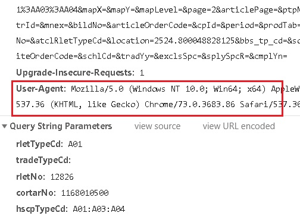
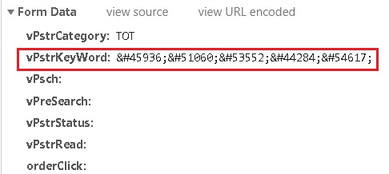
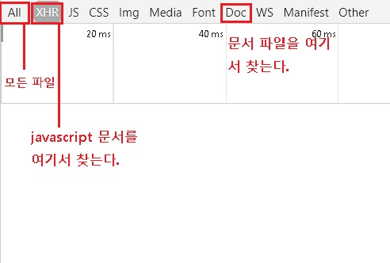
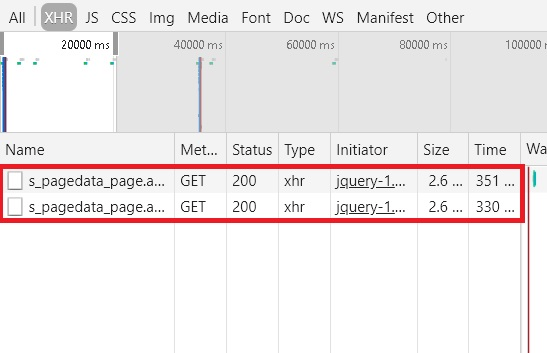
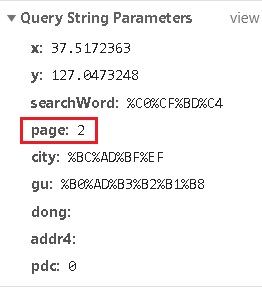
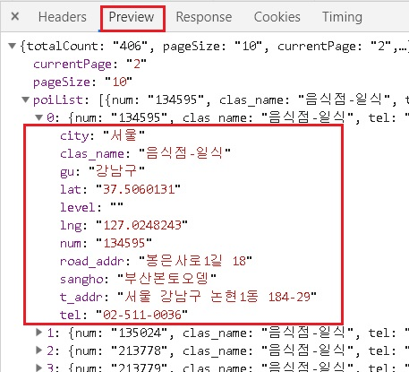

fastcampus\_웹크롤링\_3
================
huimin
2019년 3월 28일

기초 설정
=========

``` r
library(httr)
library(urltools)
library(rvest)
```

    ## Loading required package: xml2

    ## 
    ## Attaching package: 'xml2'

    ## The following object is masked from 'package:urltools':
    ## 
    ##     url_parse

``` r
library(tidyverse)
```

    ## -- Attaching packages --------------- tidyverse 1.2.1 --

    ## √ ggplot2 3.1.0       √ purrr   0.3.1  
    ## √ tibble  2.0.1       √ dplyr   0.8.0.1
    ## √ tidyr   0.8.3       √ stringr 1.4.0  
    ## √ readr   1.3.1       √ forcats 0.4.0

    ## -- Conflicts ------------------ tidyverse_conflicts() --
    ## x dplyr::filter()         masks stats::filter()
    ## x readr::guess_encoding() masks rvest::guess_encoding()
    ## x dplyr::lag()            masks stats::lag()
    ## x purrr::pluck()          masks rvest::pluck()
    ## x xml2::url_parse()       masks urltools::url_parse()

네이버 부동산 매매 데이터 수집
==============================

크롬 - 개발자도구 - **Network**에서 **Preserve log**를 체크한 뒤, 페이지를 넘기면서 변화를 확인해야한다.<br>

**user\_agent**란?<br> 네이버 및 일부 서비스는 사용자 에이전트를 보고 4XX를 응답하는 경우가 있기 때문에, user\_agent를 함께 전송해야 하는 경우가 있다.<br>

**방법 1 **: network탭에서 **Request headers**에서 확인한다.<br> 

**방법 2 **: <https://whoishostingthis.com/tools/user-agent/> 에서 확인하기<br> **방법 3 **: google의 크롤러 사용자 에이전트 보기 ( 홈페이지 방문 )

``` r
# https://land.naver.com/article/articleList.nhn?rletTypeCd=A01&tradeTypeCd=&hscpTypeCd=A01%3AA03%3AA04&rletNo=12826

res <- GET(url = "https://land.naver.com/article/articleList.nhn",
           query = list(rletTypeCd="A01",
                        hscpTypeCd="A01:A03:A04",
                        cortarNo="1168010500",
                        rletNo="12826",
                        page ="1"),
           user_agent(agent = "Mozilla/5.0 (Windows NT 10.0; Win64; x64) AppleWebKit/537.36 (KHTML, like Gecko) Chrome/73.0.3683.86 Safari/537.36"))

# 결과 확인해보기
print(res)
```

    ## Response [https://land.naver.com/article/articleList.nhn?rletTypeCd=A01&hscpTypeCd=A01%3AA03%3AA04&cortarNo=1168010500&rletNo=12826&page=1]
    ##   Date: 2019-04-02 15:27
    ##   Status: 200
    ##   Content-Type: text/html;charset=UTF-8
    ##   Size: 314 kB
    ## <!DOCTYPE HTML PUBLIC "-//W3C//DTD HTML 4.01 Transitional//EN" "http://w...
    ## <html lang="ko">
    ## <head>
    ## <title>
    ## 
    ##  아이파크삼성, 삼성동, 강남구, 매물 : 네이버 부동산
    ## 
    ## 
    ## 
    ## 
    ## ...

``` r
# 여기까지만.
```

참고
====

네이버의 일부 서비스는 **referer**를 추가해야 HTTP 요청이 실행되는 경우가 있다.<br> referer는 크롬 개발자도구의 네트워크 탭으로 이동하여 Request Headers에서 찾는다. GET 함수나 POST 함수에서 다음과 같이 사용한다.<br> GET(url = "", add\_headers(referer = ""))<br> **URL에 검색어 부분이 포함되어 있지 않다면, POST 방식을 의심하는 것이 좋다.**<br>

POST 방식으로 교보문고에서 검색 결과 수집하기
=============================================

POST방식을 사용하지만, 조금 특별한 부분이 있다.



빨간색 네모 박스 부분은 **UCS-2 인코딩 방식**이다.<br> 이것을 EUC-KR에서 만들려면 약간 특별한 방식이 필요하기 때문에, 이 마크다운에서는 그냥 encode된 상태를 보고 사용한다.

``` r
# http://www.kyobobook.co.kr/search/SearchCommonMain.jsp

res <- POST(url = "http://www.kyobobook.co.kr/search/SearchCommonMain.jsp",
            body = list(vPstrCategory = "TOT" %>% I(),
                        vPstrKeyWord="%26%2345936%3B%26%2351060%3B%26%2353552%3B%26%2344284%3B%26%2354617%3B" %>% I(),
                        searchCategory = "TOT" %>% I(),
                        searchKeyword = "%B5%A5%C0%CC%C5%CD%B0%FA%C7%D0" %>% I(),
                        vPplace = "top" %>% I(),
                        eventurlFlag = "0" %>% I(),
                        eventurlDelFlag = "1" %>% I()),
            encode = "form")

# 값 확인하기
print(res)
```

    ## Response [http://www.kyobobook.co.kr/search/SearchCommonMain.jsp]
    ##   Date: 2019-04-02 15:27
    ##   Status: 200
    ##   Content-Type: text/html; charset=EUC-KR
    ##   Size: 290 kB
    ## <!DOCTYPE html PUBLIC "-//W3C//DTD XHTML 1.0 Transitional//EN" "http://w...
    ## <html xmlns="http://www.w3.org/1999/xhtml">
    ## 
    ## 
    ## 
    ## 
    ## 
    ## 
    ## 
    ## 
    ## ...

``` r
# 데이터과학이라는 말 있는지 확인하기
res %>%
  content(as = "text", encoding = "EUC-KR") %>% 
  str_detect("데이터과학")
```

    ## [1] TRUE

``` r
bookName <- res %>%
  read_html(encoding = "EUC-KR") %>% 
  html_nodes(css = "div.title > a > strong") %>% 
  html_text()

print(bookName)
```

    ##  [1] " 데이터과학 입문"                                                
    ##  [2] " 데이터과학 비즈니스"                                            
    ##  [3] " 데이터 과학을 위한 통계"                                        
    ##  [4] "실리콘밸리 데이터 과학자가 알려주는 따라 하며 배우는 데이터 과학"
    ##  [5] "밑바닥부터 시작하는 데이터 과학"                                 
    ##  [6] "Data Science for Business"                                       
    ##  [7] " 데이터 과학 무엇을 하는가?"                                     
    ##  [8] " 엑셀만 알아도 할 수 있는 데이터 과학"                           
    ##  [9] " R을 활용한 데이터 과학"                                         
    ## [10] "Data Mining"                                                     
    ## [11] "Data Science from Scratch"                                       
    ## [12] "MS 본사 데이터 과학자가 알려주는 헬로 데이터 과학"               
    ## [13] "Principles of Data Science"                                      
    ## [14] "빅데이터 AI를 위한 데이터 과학"                                  
    ## [15] " Pandas로 하는 데이터 과학"                                      
    ## [16] " 데이터 과학 입문자를 위한 R"                                    
    ## [17] " 처음 배우는 데이터 과학"                                        
    ## [18] "Predictive Analytics and Data Mining"                            
    ## [19] " 엑셀을 활용한 데이터 과학 실무 입문"                            
    ## [20] "파이썬으로 배우는 데이터 과학 입문과 실습"                       
    ## [21] " 데이터과학 입문"                                                
    ## [22] " 데이터과학 입문"                                                
    ## [23] "긍정육아법~ 착한 엄마가 애들을 망친다고요? "                     
    ## [24] "[부동산] 부동산 투자, 인공지능이 답이다 - 이건영 "               
    ## [25] "데이터 과학을 위한 통계"                                         
    ## [26] "자바 머신 러닝 마스터"

JAvAScript를 활용한 웹 크롤링
=============================

1. JavaScript 기초
==================

javascript는 객체 기반의 스크립트 언어이다.<br> javascript는 **HTML 및 CSS**와 함께 사용된다.<br> javascript를 이용한 웹 크롤링 관점에서는 **XHR**에 대한 기초 지식만 가지고 있으면 된다.

**AJAX** : javascript 라이브러리 중 하나이며, 비동기 javascript이며 XML이다.<br> AJAX는 통신할 때 웹 페이지 전체를 새로고침하는 대신, 특정 부분의 데이터만 내려받아 보여주므로 경제적이다.<br> AJAX는 HTTP 요청 대신 **XHR(XML Http Request)** 객체를 사용한다.<br> AJAX는 **JSON 및 XML** 형태의 데이터를 주고 받는다.

**개발자도구**에서 다음과 같이 XHR을 찾을 수 있다.



2. 페이지 네비게이션에 대한 이해
================================

페이지 네비게이션이란, 동일한 페이지 안에서 나누어진 게시물을 클릭을 통해서 볼 수 있도록 만든 **javaScript의 라이브러리 jQuery**에서 많이 사용된다.<br> 페이지 네비게이션 **버튼을 클릭**했을 때 **HTTP요청 방식을 확인**하고, 각 페이지별 HTTP 요청을 실행한 후 **해당 페이지 데이터를 수집하는 과정**을 반복해야한다.<br>

3. JavaScript + GET 방식 and POST 방식
======================================

**json** 형태의 데이터를 처리하려면, **jsonlite 패키지**의 **fromJSON()** 함수를 사용한다.

1.  json만 추출하여, 리스트 자료형 객체 생성<br> json &lt;- res %&gt;% as.character() %&gt;% fromJSON()<br>
2.  구조 확인하기<br> str(json)<br>
3.  데이터프레임 원소만 추출할 경우<br> json$poiList

실습1 - 한국 전화번호부에서 업종 데이터 수집하기
------------------------------------------------

**서울 강남구 일식**에 대한 데이터 수집하기<br> 하단의 페이지 네비게이션 또한 이동하여 전체 데이터 수집하는 것이 목적이다.<br> **크롬 개발자도구의 doc탭**에서는, 페이지 네비게이션을 통해서 페이지를 이동해도 **새로운 문서 정보가 생성되지 않는다.**<br> 이럴 때에는 **javascript**가 사용되었다고 추측할 수 있다.<br>

아래 그림과 같이 크롬 개발자 도구의 네트워크 탭의 **XHR**로 이동하고, 페이지 네비게이션을 클릭해보면, **s\_pagedata\_page.asp**가 생성되어 있다.



클릭하고 **Query String** 부분을 확인해본 결과, 아래 그림처럼 **page**에 대한 정보가 나와있다.



더군다나, **preview**를 눌러보니, 해당 페이지에 대한 정보가 정리되어 있다. 이는 확실하게 **javascript**를 사용했음을 알 수 있다.



``` r
# 새로운 라이브러리, jsonlite 불러오기
library(jsonlite)
```

    ## 
    ## Attaching package: 'jsonlite'

    ## The following object is masked from 'package:purrr':
    ## 
    ##     flatten

``` r
# 키워드 정리
upjong <- "일식"
cityNm <- "서울"
guNm <- "강남구"


res <- GET(url = "http://www.isuperpage.co.kr/search/s_pagedata_page.asp",
           query = list(searchWord = upjong %>% url_encode() %>% I(),
                        city = cityNm %>% url_encode() %>% I(),
                        gu = guNm %>% url_encode() %>% I(),
                        page = 2))


# 출력해보기
print(res)
```

    ## Response [http://www.isuperpage.co.kr/search/s_pagedata_page.asp?searchWord=%c0%cf%bd%c4&city=%bc%ad%bf%ef&gu=%b0%ad%b3%b2%b1%b8&page=2]
    ##   Date: 2019-04-02 15:27
    ##   Status: 200
    ##   Content-Type: application/json; Charset=euc-kr
    ##   Size: 2.46 kB

``` r
# 제대로 가져왔는지 확인해보기
res %>%
  content(as = "text", encoding = "EUC-KR") %>% 
  str_detect(pattern = "이도미")
```

    ## [1] TRUE

``` r
# 제이슨 데이터를 리스트 객체로 저장하기
json <- res %>% content(as = "text", encoding = "EUC-KR") %>% fromJSON()


# 제이슨 데이터의 형태를 확인하기
str(json)
```

    ## List of 4
    ##  $ totalCount : chr "406"
    ##  $ pageSize   : chr "10"
    ##  $ currentPage: chr "2"
    ##  $ poiList    :'data.frame': 10 obs. of  11 variables:
    ##   ..$ num      : chr [1:10] "134595" "135024" "213778" "213779" ...
    ##   ..$ clas_name: chr [1:10] "음식점-일식" "음식점-일식" "음식점-일식" "음식점-일식" ...
    ##   ..$ tel      : chr [1:10] "02-511-0036" "02-556-2022" "02-548-2031" "02-2057-0053" ...
    ##   ..$ t_addr   : chr [1:10] "서울 강남구 논현1동 184-29" "서울 강남구 역삼동 674-20" "서울 강남구 청담동 93-12" "서울 강남구 도곡동 469-29" ...
    ##   ..$ road_addr: chr [1:10] "봉은사로1길 18" " " "도산대로67길 13" " " ...
    ##   ..$ city     : chr [1:10] "서울" "서울" "서울" "서울" ...
    ##   ..$ gu       : chr [1:10] "강남구" "강남구" "강남구" "강남구" ...
    ##   ..$ lat      : chr [1:10] "37.5060131" "37.504023" "37.52493594" "37.4899002" ...
    ##   ..$ lng      : chr [1:10] "127.0248243" "127.0410053" "127.0438897" "127.0437445" ...
    ##   ..$ sangho   : chr [1:10] "부산본토오뎅" "이도미" "야마모도스시" "인터내셔날본산" ...
    ##   ..$ level    : chr [1:10] "" "" "" "" ...

**fromJSON()에서 반환된 리스트 구조 파악하기**<br> **$ totalCount** : 일식업체의 총 개수<br> **$ pageSize** : 한 페이지당 노출되는 사업체의 수<br> **$ currentPage**: 현재 페이지<br> **$ poiList** : 정보가 담긴 데이터 프레임

``` r
# 수집해야할 총 페이지 수
# ceiling()함수는 올림 함수이다.
pages <- (as.numeric(json$totalCount) / as.numeric(json$pageSize)) %>% 
  ceiling()


# 결과를 저장할 데이터
result <- data.frame()


# 전체 페이지 크롤링을 위한 반복문 만들기
for(i in 1:pages){
  
  cat("현재 ",i," 페이지 수집 중입니다.\n")
  
  res <- GET(url = "http://www.isuperpage.co.kr/search/s_pagedata_page.asp",
             query = list(searchWord = upjong %>% url_encode() %>% I(),
                          city = cityNm %>% url_encode() %>% I(),
                          gu = guNm %>% url_encode() %>% I(),
                          page = i))
  
  
  json <- res %>% content(as = "text", encoding = "EUC-KR") %>% fromJSON()
  
  # 전화번호
  Phone <- json$poiList$tel
  
  # 주소
  Address <- json$poiList$t_addr
  
  # 상호
  Name <- json$poiList$sangho
  
  # result에 저장하기
  result <- rbind(result, data.frame(Name, Address, Phone))
  
  # 서버에 부하가 걸릴 경우, 차단당할 수 있기 때문에 1초간 쉬기
  Sys.sleep(time = 1)
}
```

    ## 현재  1  페이지 수집 중입니다.
    ## 현재  2  페이지 수집 중입니다.
    ## 현재  3  페이지 수집 중입니다.
    ## 현재  4  페이지 수집 중입니다.
    ## 현재  5  페이지 수집 중입니다.
    ## 현재  6  페이지 수집 중입니다.
    ## 현재  7  페이지 수집 중입니다.
    ## 현재  8  페이지 수집 중입니다.
    ## 현재  9  페이지 수집 중입니다.
    ## 현재  10  페이지 수집 중입니다.
    ## 현재  11  페이지 수집 중입니다.
    ## 현재  12  페이지 수집 중입니다.
    ## 현재  13  페이지 수집 중입니다.
    ## 현재  14  페이지 수집 중입니다.
    ## 현재  15  페이지 수집 중입니다.
    ## 현재  16  페이지 수집 중입니다.
    ## 현재  17  페이지 수집 중입니다.
    ## 현재  18  페이지 수집 중입니다.
    ## 현재  19  페이지 수집 중입니다.
    ## 현재  20  페이지 수집 중입니다.
    ## 현재  21  페이지 수집 중입니다.
    ## 현재  22  페이지 수집 중입니다.
    ## 현재  23  페이지 수집 중입니다.
    ## 현재  24  페이지 수집 중입니다.
    ## 현재  25  페이지 수집 중입니다.
    ## 현재  26  페이지 수집 중입니다.
    ## 현재  27  페이지 수집 중입니다.
    ## 현재  28  페이지 수집 중입니다.
    ## 현재  29  페이지 수집 중입니다.
    ## 현재  30  페이지 수집 중입니다.
    ## 현재  31  페이지 수집 중입니다.
    ## 현재  32  페이지 수집 중입니다.
    ## 현재  33  페이지 수집 중입니다.
    ## 현재  34  페이지 수집 중입니다.
    ## 현재  35  페이지 수집 중입니다.
    ## 현재  36  페이지 수집 중입니다.
    ## 현재  37  페이지 수집 중입니다.
    ## 현재  38  페이지 수집 중입니다.
    ## 현재  39  페이지 수집 중입니다.
    ## 현재  40  페이지 수집 중입니다.
    ## 현재  41  페이지 수집 중입니다.

``` r
# 결과물 확인해보기
head(result, n = 10)
```

    ##                     Name                                          Address
    ## 1  돈정/일식 돈가스 덮밥                         서울 강남구 역삼동 644-9
    ## 2                 묵호집                         서울 강남구 역삼동 688-2
    ## 3               참치명가             서울 강남구 청담동 53 우산빌딩 101호
    ## 4               사까나야          서울 강남구 신사동 665-1 한양타운미오젠
    ## 5             가덕도횟집                     서울 강남구 역삼동 722-3 1층
    ## 6                   신전                      서울 강남구 청담동 32-3 1층
    ## 7               바다풍경 서울 강남구 역삼동 832-3 영신빌딩지하1층바다풍경
    ## 8                 용수사       서울 강남구 대치동 942-5 삼성빌딩2층용수사
    ## 9           닝교초돈부리                        서울 강남구 신사동 514-20
    ## 10          복먹고복받고                           서울 강남구 논현동62-8
    ##            Phone
    ## 1   02-3453-1446
    ## 2    02-564-2195
    ## 3   02-3442-0017
    ## 4   02-3445-1075
    ## 5    02-568-7454
    ## 6    02-511-2297
    ## 7    02-552-8525
    ## 8    02-567-1516
    ## 9  010-6450-4183
    ## 10 010-5555-2221

실습2 : 네이버 블로그 메인 텍스트 데이터 수집하기
-------------------------------------------------

``` r
# referer 설정하기
ref <- "https://section.blog.naver.com/BlogHome.nhn?directoryNo=0&currentPage=1&groupId=0"

res <- GET(url = "https://section.blog.naver.com/ajax/DirectoryPostList.nhn",
           query = list(directorySeq = "0",
                        pageNo = "1"),
           add_headers(referer = ref))


# 결과물 출력해보기
print(res)
```

    ## Response [https://section.blog.naver.com/ajax/DirectoryPostList.nhn?directorySeq=0&pageNo=1]
    ##   Date: 2019-04-02 15:28
    ##   Status: 200
    ##   Content-Type: application/json; charset=utf-8
    ##   Size: 28.4 kB
    ## )]}',
    ## {"result":{"totalCount":1000,"postList":[{"blogId":"bovari","blogNo":118...

``` r
# 결과물 확인해보기
res %>%
  content(as = "text", encoding = "UTF-8") %>% 
  str_detect(pattern = "마시따남도")
```

    ## [1] FALSE

``` r
# 첫머리에 )]}', 라는 문자 때문에 fromJSON()이 안 먹힌다.
res %>% 
  content(as = "text", encoding = "UTF-8") %>% 
  str_sub(start = 1, end = 100) %>% 
  cat()
```

    ## )]}',
    ## {"result":{"totalCount":1000,"postList":[{"blogId":"bovari","blogNo":118626531,"nickname":"보바리

``` r
# 따라서 이를 지워주고, fromJSON()을 사용한다.
json <- res %>%
  content(as = "text", encoding = "UTF-8") %>% 
  str_remove(pattern = "\\)\\]\\}\\',") %>% 
  fromJSON()


# json의 구조를 확인해본다.
str(json)
```

    ## List of 1
    ##  $ result:List of 2
    ##   ..$ totalCount: int 1000
    ##   ..$ postList  :'data.frame':   10 obs. of  20 variables:
    ##   .. ..$ blogId           : chr [1:10] "bovari" "onwinnersmd" "kma_131" "njh929" ...
    ##   .. ..$ blogNo           : int [1:10] 118626531 55792127 57118774 107387081 21142609 73872569 22861651 128305069 47340511 16758629
    ##   .. ..$ nickname         : chr [1:10] "보바리" "우리가 사는 세상" "기상청" "루이자" ...
    ##   .. ..$ profileImage     : chr [1:10] "https://blogpfthumb-phinf.pstatic.net/MjAxNzAyMTdfODkg/MDAxNDg3MzE4MzI1NTky.7Tmdv-YIVDc-eZ1HXNU1R_XBC77Ux-IfNNe"| __truncated__ "https://blogpfthumb-phinf.pstatic.net/20160119_258/onwinnersmd_1453190423801gIxlj_JPEG/IMG_20151108_225751%2B%2"| __truncated__ "https://blogpfthumb-phinf.pstatic.net/20160328_59/kma_131_1459144781421XGKSM_JPEG/10478672_888717781150327_7545"| __truncated__ "https://blogpfthumb-phinf.pstatic.net/MjAxOTAyMTBfMTIz/MDAxNTQ5NzczMjkxMDIy.TMNdBJSs05O6-mIoPe1TjQWyXKX_CPi2oFo"| __truncated__ ...
    ##   .. ..$ blogUrl          : chr [1:10] "https://blog.naver.com/bovari" "https://blog.naver.com/onwinnersmd" "https://blog.naver.com/kma_131" "https://blog.naver.com/njh929" ...
    ##   .. ..$ logNo            : num [1:10] 2.22e+11 2.22e+11 2.22e+11 2.22e+11 2.22e+11 ...
    ##   .. ..$ title            : chr [1:10] "왕십리 속눈썹연장 :: 부작용없는곳 워니컬추천!" "대치동 수학학원 클라디 중등 상담 후 QnA정리" "[봄 해외여행지 추천] 이국적인 봄의 정취를 느껴보자! 4월에 가면 좋은 해외여행지" "에어팟2 부럽지 않은 엘라고 에어팟 케이스 철가루 방지 스티커 이어팁 리얼리뷰" ...
    ##   .. ..$ postUrl          : chr [1:10] "https://blog.naver.com/bovari/221503576631" "https://blog.naver.com/onwinnersmd/221503576232" "https://blog.naver.com/kma_131/221503567977" "https://blog.naver.com/njh929/221503567784" ...
    ##   .. ..$ briefContents    : chr [1:10] "왕십리 속눈썹연장워니컬<U+200B><U+200B><U+200B><U+200B><U+200B><U+200B>하잉, 보바리에요<U+200B><U+200B><U+200B>"| __truncated__ "대치동 수학학원클라디 중등 상담 후QnA 정리제 친동생은 아이들 유학 때문에 캐나다에서 지내고 있는데요. 지난 겨울"| __truncated__ "11기 국민참여 기자단 / 박지현<U+200B><U+200B>봄바람이 살랑살랑 불어오는 4월, 그래서인지 어디론가 떠나고 싶은 마"| __truncated__ "에어팟2 부럽지 않은 엘라고 에어팟 케이스, 철가루 방지 스티커, 이어팁 리얼리뷰<U+200B><U+200B><U+200B><U+200B><U"| __truncated__ ...
    ##   .. ..$ sympathyCnt      : int [1:10] 12 24 26 20 7 5 23 26 24 105
    ##   .. ..$ commentCnt       : int [1:10] 3 3 1 3 2 3 5 2 0 0
    ##   .. ..$ addDate          : num [1:10] 1.55e+12 1.55e+12 1.55e+12 1.55e+12 1.55e+12 ...
    ##   .. ..$ hasThumbnail     : logi [1:10] TRUE TRUE TRUE TRUE TRUE TRUE ...
    ##   .. ..$ thumbnails       :List of 10
    ##   .. .. ..$ :'data.frame':   6 obs. of  3 variables:
    ##   .. .. .. ..$ videoThumbnail: logi [1:6] FALSE FALSE FALSE FALSE FALSE FALSE
    ##   .. .. .. ..$ vrthumbnail   : logi [1:6] FALSE FALSE FALSE FALSE FALSE FALSE
    ##   .. .. .. ..$ url           : chr [1:6] "https://blogthumb.pstatic.net/MjAxOTA0MDFfMTYg/MDAxNTU0MTIzODc2NTYz.S8b2_GpWw4a5qPqgCSGooGfmmp1lBd8jsi9MPkFQSjg"| __truncated__ "https://blogthumb.pstatic.net/MjAxOTA0MDFfMjA5/MDAxNTU0MDgzMjI3Mjk2.OpFquCtR4HCudJs_17ZgwirBQIsilQ2qFRm0bJ-LOw8"| __truncated__ "https://blogthumb.pstatic.net/MjAxOTA0MDFfMTA4/MDAxNTU0MDg1NDIyMDIy.GxWrkUj6VZsJOjlhr9qYVx-RD-X8jAzkL2oGu4kOKTY"| __truncated__ "https://blogthumb.pstatic.net/MjAxOTA0MDFfNjkg/MDAxNTU0MDgzMzAwMDYw.tqjAV_fa1XIG5VXQOiNUNnvuSd_NHTz6n4lSKN2YV94"| __truncated__ ...
    ##   .. .. ..$ :'data.frame':   6 obs. of  3 variables:
    ##   .. .. .. ..$ videoThumbnail: logi [1:6] FALSE FALSE FALSE FALSE FALSE FALSE
    ##   .. .. .. ..$ vrthumbnail   : logi [1:6] FALSE FALSE FALSE FALSE FALSE FALSE
    ##   .. .. .. ..$ url           : chr [1:6] "https://blogthumb.pstatic.net/MjAxOTA0MDJfMzMg/MDAxNTU0MTgxMzA2MzMz.1iNkhPOc_Gj0szTNzdXRyzl_Sb73DGPpKIgbMfYf42o"| __truncated__ "https://blogthumb.pstatic.net/MjAxOTA0MDJfMTA5/MDAxNTU0MTc5NjU0MTU0.sN86vL_oiYm-QCLfEdPiwDrBBkrJbS-W--lOa9G3WTc"| __truncated__ "https://blogthumb.pstatic.net/MjAxOTA0MDJfMTcy/MDAxNTU0MTc5OTUxNDg4.D0Au8Jvihg7emQHZTKZry546Zwf-yeMaID7k10iDMu0"| __truncated__ "https://blogthumb.pstatic.net/MjAxOTA0MDJfOTgg/MDAxNTU0MTgxMTQ1NTU2.dsN3Skel0Wxuk_Xqh3rC4mrRevxeGyh1OKqP8VKERHs"| __truncated__ ...
    ##   .. .. ..$ :'data.frame':   6 obs. of  3 variables:
    ##   .. .. .. ..$ videoThumbnail: logi [1:6] FALSE FALSE FALSE FALSE FALSE FALSE
    ##   .. .. .. ..$ vrthumbnail   : logi [1:6] FALSE FALSE FALSE FALSE FALSE FALSE
    ##   .. .. .. ..$ url           : chr [1:6] "https://blogthumb.pstatic.net/MjAxOTA0MDFfNTIg/MDAxNTU0MTI2NDQyNTUw.it-rSDLAPQXwhpoSM2X-ckjWqExjU0uH7c57WSytuKk"| __truncated__ "https://blogthumb.pstatic.net/MjAxOTA0MDFfMTcy/MDAxNTU0MTI2NDYzNjYx.9xp2coGODFt66svzq6bpvzc71x7v9tnWjnUUFZExBIs"| __truncated__ "https://blogthumb.pstatic.net/MjAxOTA0MDFfMjcx/MDAxNTU0MTIwNTI5Mjc3.wP-ysHjDvo1MKt9SWj2GMyKSEvXbInXz202VGJdqNlI"| __truncated__ "https://blogthumb.pstatic.net/MjAxOTA0MDJfMzgg/MDAxNTU0MTYyNDc0NTc3.aQyFDRZ9FQbQVsU5amTm9nztp36stYo1KH74AE8C3pI"| __truncated__ ...
    ##   .. .. ..$ :'data.frame':   6 obs. of  3 variables:
    ##   .. .. .. ..$ videoThumbnail: logi [1:6] FALSE FALSE FALSE FALSE FALSE FALSE
    ##   .. .. .. ..$ vrthumbnail   : logi [1:6] FALSE FALSE FALSE FALSE FALSE FALSE
    ##   .. .. .. ..$ url           : chr [1:6] "https://blogthumb.pstatic.net/MjAxOTAzMzBfNjEg/MDAxNTUzOTQ3NDIzMDc4.iYB7ot8-TKWhrP2vyedHIUpupAK0msJoA_NjeXng2i4"| __truncated__ "https://blogthumb.pstatic.net/MjAxOTA0MDFfNjEg/MDAxNTU0MTI1NDk2MjA3.96rDm_mCxGe8898-UQtc765NqB7mx5MGWFi72b05zZk"| __truncated__ "https://blogthumb.pstatic.net/MjAxOTAzMzBfMTg4/MDAxNTUzOTQ2NDIxMjEy.Ch1br18eGptvKC_oM3zj5gba_5nFgOf4k4d4cdfWiFY"| __truncated__ "https://blogthumb.pstatic.net/MjAxOTAzMzBfMTEw/MDAxNTUzOTQ2NDU2NTg3.oaMjA-7p6SBdWONQw4pNtKG_olh0x7-AO92mV7iQ6D0"| __truncated__ ...
    ##   .. .. ..$ :'data.frame':   6 obs. of  3 variables:
    ##   .. .. .. ..$ videoThumbnail: logi [1:6] FALSE FALSE FALSE FALSE FALSE FALSE
    ##   .. .. .. ..$ vrthumbnail   : logi [1:6] FALSE FALSE FALSE FALSE FALSE FALSE
    ##   .. .. .. ..$ url           : chr [1:6] "https://blogthumb.pstatic.net/MjAxOTA0MDJfMjA0/MDAxNTU0MTc3OTEzNzc4.hLWMAf9KhpG1ilukLZz4nGgG-3O3u_p4CMIvfS1169c"| __truncated__ "https://blogthumb.pstatic.net/MjAxOTA0MDJfMTU2/MDAxNTU0MTc3NTIyMTE1.N_2lMJNto0BvxSpGek5kFu4g_RgpW1B0bGsTKa-8G3U"| __truncated__ "https://blogthumb.pstatic.net/MjAxOTA0MDJfMjg3/MDAxNTU0MTc3NTIyODY2.2G5mK201LfN_P1PNiZHYhiP0IrtBcTvV6Aan8QPLP24"| __truncated__ "https://blogthumb.pstatic.net/MjAxOTA0MDJfMTUy/MDAxNTU0MTc3NTIyNDUz.hOOhNFUaa90Xw-MqqJpB6YA_0DXBE5vfcv7KbQJ9YNw"| __truncated__ ...
    ##   .. .. ..$ :'data.frame':   6 obs. of  3 variables:
    ##   .. .. .. ..$ videoThumbnail: logi [1:6] FALSE FALSE FALSE FALSE FALSE FALSE
    ##   .. .. .. ..$ vrthumbnail   : logi [1:6] FALSE FALSE FALSE FALSE FALSE FALSE
    ##   .. .. .. ..$ url           : chr [1:6] "https://blogthumb.pstatic.net/MjAxOTA0MDFfMTI4/MDAxNTU0MTE1NTg1OTY2.hnem66hOhSBMNx4wEZlmzIJEbBUtg1EgoxeiHkbdovQ"| __truncated__ "https://blogthumb.pstatic.net/MjAxOTA0MDFfODUg/MDAxNTU0MTE2NDQ3MzA1.vXihWJR4jkPK-57MqV31xV7VITgq-7rQGIRhv1AQsT8"| __truncated__ "https://blogthumb.pstatic.net/MjAxOTA0MDFfMTUy/MDAxNTU0MTE2NDQ3MzQ4.nVgF3pgwYXVWj1bt4enq-f-Y0pdtKjJxE28s9l-0He8"| __truncated__ "https://blogthumb.pstatic.net/MjAxOTA0MDFfMjI4/MDAxNTU0MTE2NDQ3MzU2.xRx0MGXEiqXyBLIe2xKdb4uSYbsGCH_yXF7fNRSR7dE"| __truncated__ ...
    ##   .. .. ..$ :'data.frame':   6 obs. of  3 variables:
    ##   .. .. .. ..$ videoThumbnail: logi [1:6] FALSE FALSE FALSE FALSE FALSE FALSE
    ##   .. .. .. ..$ vrthumbnail   : logi [1:6] FALSE FALSE FALSE FALSE FALSE FALSE
    ##   .. .. .. ..$ url           : chr [1:6] "https://blogthumb.pstatic.net/MjAxOTA0MDJfMjMx/MDAxNTU0MTczNjc1NDk5.Fhm51cB3lArYFXqJOCq3bsJVCr_qpnEs3lnfa0uMd-o"| __truncated__ "https://blogthumb.pstatic.net/MjAxOTA0MDJfMjQg/MDAxNTU0MTczNzE4Mjc2.Gx_D5JCavOQgQ-BFwr7i0ICYNkDNXpNrqbszZgVqDTA"| __truncated__ "https://blogthumb.pstatic.net/MjAxOTA0MDJfMTgw/MDAxNTU0MTczNzYzODk5.NB-VL09cgpH1pf9zYhLwz2GZ2_NWIi4x_ZI_xlvk6_g"| __truncated__ "https://blogthumb.pstatic.net/MjAxOTA0MDJfMjk5/MDAxNTU0MTczODAwMzM3.pYJKZEXxUmNTJHpBr4v_ux5b8ShmYDqium-q5kOgaFo"| __truncated__ ...
    ##   .. .. ..$ :'data.frame':   6 obs. of  3 variables:
    ##   .. .. .. ..$ videoThumbnail: logi [1:6] FALSE FALSE FALSE FALSE TRUE FALSE
    ##   .. .. .. ..$ vrthumbnail   : logi [1:6] FALSE FALSE FALSE FALSE FALSE FALSE
    ##   .. .. .. ..$ url           : chr [1:6] "https://blogthumb.pstatic.net/MjAxOTA0MDJfMTI0/MDAxNTU0MTcxODM4ODE2.xEH3iPqnQOhS-HMoItQDHXLlBrT96TRu2s1heVi77ho"| __truncated__ "https://blogthumb.pstatic.net/MjAxOTA0MDJfMTg5/MDAxNTU0MTcxODY2MzU2.IDwvOWIc738LYs1qJB_xgSECZH0gb_zvUq6pxS-pvIo"| __truncated__ "https://blogthumb.pstatic.net/MjAxOTA0MDJfMjM5/MDAxNTU0MTcxNjk2MDA2.Q2xuI_5uZsidu3Dmt6aLaCA-rqUlL3YTjrbXvfrejIc"| __truncated__ "https://blogthumb.pstatic.net/MjAxOTA0MDJfMjg1/MDAxNTU0MTcxNjk3OTAy.cPUQvAVFs_P00qilK5COmKtUvJ4xqrqmUZ5_shLjBn4"| __truncated__ ...
    ##   .. .. ..$ :'data.frame':   6 obs. of  3 variables:
    ##   .. .. .. ..$ videoThumbnail: logi [1:6] TRUE TRUE TRUE TRUE TRUE TRUE
    ##   .. .. .. ..$ vrthumbnail   : logi [1:6] FALSE FALSE FALSE FALSE FALSE FALSE
    ##   .. .. .. ..$ url           : chr [1:6] "https://phinf.pstatic.net/image.nmv/blog_2019_04_02_496/b62c2ce3-5500-11e9-adc0-48df3726a06a_05.jpg" "https://phinf.pstatic.net/image.nmv/blog_2019_04_02_1290/bdcd4d40-5500-11e9-a03b-48df37269ee2_05.jpg" "https://phinf.pstatic.net/image.nmv/blog_2019_04_02_560/c54a437e-5500-11e9-adc0-48df3726a06a_05.jpg" "https://phinf.pstatic.net/image.nmv/blog_2019_04_02_960/cd7d4260-5500-11e9-9c38-48df37269fd0_05.jpg" ...
    ##   .. .. ..$ :'data.frame':   6 obs. of  3 variables:
    ##   .. .. .. ..$ videoThumbnail: logi [1:6] FALSE FALSE FALSE FALSE FALSE FALSE
    ##   .. .. .. ..$ vrthumbnail   : logi [1:6] FALSE FALSE FALSE FALSE FALSE FALSE
    ##   .. .. .. ..$ url           : chr [1:6] "https://blogthumb.pstatic.net/MjAxOTA0MDJfMTgw/MDAxNTU0MTc5MzQzNDg4.OkuRWynK4NCbOZsaLxcr0-Ji3uGLoYB9j5jEX4Lqk8s"| __truncated__ "https://blogthumb.pstatic.net/MjAxOTA0MDJfMTEz/MDAxNTU0MTc5MzM0MzYw.LsI5YTn4BVCbt1o0shoBMRU6uY1of3wOuu-hy9qa62Q"| __truncated__ "https://blogthumb.pstatic.net/MjAxOTA0MDJfMTM1/MDAxNTU0MTc5MzMzOTIx.S7MvAq7LyqlrTg5HT898Z-STy-Kvqfpnay2A_ScvjYU"| __truncated__ "https://blogthumb.pstatic.net/MjAxOTA0MDJfMiAg/MDAxNTU0MTc5MzM0MjE0.oP27xTx9qME9vdkH3cn85sJ07hyMbIWDtB-CgKvf8-0"| __truncated__ ...
    ##   .. ..$ buddyRelationType: logi [1:10] NA NA NA NA NA NA ...
    ##   .. ..$ directory        :'data.frame': 10 obs. of  18 variables:
    ##   .. .. ..$ seq           : int [1:10] NA 34 31 21 NA 21 NA 21 32 27
    ##   .. .. ..$ name          : chr [1:10] NA "교육·학문" "사회·정치" "상품리뷰" ...
    ##   .. .. ..$ useYn         : logi [1:10] NA TRUE TRUE TRUE NA TRUE ...
    ##   .. .. ..$ sortNo        : int [1:10] NA 6 2 8 NA 8 NA 8 3 6
    ##   .. .. ..$ leafYn        : logi [1:10] NA TRUE TRUE TRUE NA TRUE ...
    ##   .. .. ..$ depth         : int [1:10] NA 1 1 1 NA 1 NA 1 1 1
    ##   .. .. ..$ parentSeq     : int [1:10] NA 4 4 2 NA 2 NA 2 4 3
    ##   .. .. ..$ relatedYn     : logi [1:10] NA TRUE TRUE FALSE NA FALSE ...
    ##   .. .. ..$ mainYn        : logi [1:10] NA FALSE FALSE FALSE NA FALSE ...
    ##   .. .. ..$ mainSortNo    : int [1:10] NA 4 4 3 NA 3 NA 3 4 4
    ##   .. .. ..$ alias         : chr [1:10] NA NA NA "shop" ...
    ##   .. .. ..$ lcsAlias      : chr [1:10] NA "education" "politics" "shop" ...
    ##   .. .. ..$ nclickId      :'data.frame': 10 obs. of  6 variables:
    ##   .. .. .. ..$ seq               : int [1:10] NA 34 31 21 NA 21 NA 21 32 27
    ##   .. .. .. ..$ nclickAlias       : chr [1:10] NA "education" "politics" "product" ...
    ##   .. .. .. ..$ nclickCode        : chr [1:10] NA "e" "x" "D" ...
    ##   .. .. .. ..$ gnbArea           : chr [1:10] NA "lnb*k.education" "lnb*k.politics" "lnb*l.product" ...
    ##   .. .. .. ..$ themeAreaFirstPart: chr [1:10] NA "thm*e" "thm*x" "thm*D" ...
    ##   .. .. .. ..$ relatedArea       : chr [1:10] NA "rth*s.education" "rth*s.politics" "rth*s.product" ...
    ##   .. .. ..$ parent        : logi [1:10] NA FALSE FALSE FALSE NA FALSE ...
    ##   .. .. ..$ mainYnAsInt   : int [1:10] NA 0 0 0 NA 0 NA 0 0 0
    ##   .. .. ..$ relatedYnAsInt: int [1:10] NA 1 1 0 NA 0 NA 0 0 1
    ##   .. .. ..$ leafYnAsInt   : int [1:10] NA 1 1 1 NA 1 NA 1 1 1
    ##   .. .. ..$ useYnAsInt    : int [1:10] NA 1 1 1 NA 1 NA 1 1 1
    ##   .. ..$ gdid             : chr [1:10] "90000003_000000000000003392A45A37" "90000003_000000000000003392A458A8" "90000003_000000000000003392A43869" "90000003_000000000000003392A437A8" ...
    ##   .. ..$ buddyWithUser    : logi [1:10] FALSE FALSE FALSE FALSE FALSE FALSE ...
    ##   .. ..$ commentEnable    : logi [1:10] TRUE TRUE TRUE TRUE TRUE TRUE ...
    ##   .. ..$ sympathyEnable   : logi [1:10] TRUE TRUE TRUE TRUE TRUE TRUE ...

``` r
# 결과물을 저장해본다.
blog <- json$result$postList

blog <- blog %>% 
  dplyr::select(nickname, title, postUrl)

head(blog, n = 10)
```

    ##            nickname
    ## 1            보바리
    ## 2  우리가 사는 세상
    ## 3            기상청
    ## 4            루이자
    ## 5          카푸치노
    ## 6            모아르
    ## 7       vivid dream
    ## 8             LAPIN
    ## 9       모드림 의원
    ## 10         포도월척
    ##                                                                             title
    ## 1                                   왕십리 속눈썹연장 :: 부작용없는곳 워니컬추천!
    ## 2                                     대치동 수학학원 클라디 중등 상담 후 QnA정리
    ## 3  [봄 해외여행지 추천] 이국적인 봄의 정취를 느껴보자! 4월에 가면 좋은 해외여행지
    ## 4     에어팟2 부럽지 않은 엘라고 에어팟 케이스 철가루 방지 스티커 이어팁 리얼리뷰
    ## 5                                          국수나무 메뉴판 가격 추천 하는 메뉴는?
    ## 6                                      갤럭시 버즈 화이트 두 손이 자유로워진 일상
    ## 7                           전시 소파 할인 루가노리클라이너 소파할인매장에서 득템
    ## 8                   건강간식 : 더테스트키친 그대로크래커 아이들간식으로도 좋아요!
    ## 9                                                  헤어라인모발이식 지금의 정답은
    ## 10                                           강화 가볼만한곳 건강함을 요리하던 곳
    ##                                            postUrl
    ## 1       https://blog.naver.com/bovari/221503576631
    ## 2  https://blog.naver.com/onwinnersmd/221503576232
    ## 3      https://blog.naver.com/kma_131/221503567977
    ## 4       https://blog.naver.com/njh929/221503567784
    ## 5  https://blog.naver.com/ju_love1202/221503562880
    ## 6     https://blog.naver.com/fdfelove/221503538271
    ## 7     https://blog.naver.com/youliyan/221503555313
    ## 8      https://blog.naver.com/lapin_0/221503553261
    ## 9  https://blog.naver.com/o_o____1004/221503542617
    ## 10   https://blog.naver.com/jun610412/221503539877

네이버 연예 뉴스 기사 수집
--------------------------

``` r
# 오늘의 날짜
today1 <- Sys.Date()
today2 <- Sys.Date() %>% format(format = "%Y%m%d")


# https://entertain.naver.com/ranking


res <- GET(url = "https://entertain.naver.com/ranking/page.json",
           query = list(type = "hit_total" %>% I(),
                        date = today1))

# 출력해보기
print(res)
```

    ## Response [https://entertain.naver.com/ranking/page.json?type=hit_total&date=2019-04-03]
    ##   Date: 2019-04-02 15:28
    ##   Status: 200
    ##   Content-Type: application/json;charset=UTF-8
    ##   Size: 151 kB

``` r
# 확인하기
res %>%
  content(as = "text", encoding = "UTF-8") %>% 
  str_detect(pattern = "로이킴")
```

    ## [1] TRUE

``` r
# 리스트 객체로 저장
json <- res %>% content(as = "text", encoding = "UTF-8") %>% fromJSON()

# 기사 제목 중 하나만 확인해보기
cat(json$articles$contentsArticle$title[2])
```

    ## MBC 뉴스데스크, 황하나 경찰 친분 자랑 녹취+마약 투약 영상 공개

``` r
# 이런식으로, 날짜를 통해서 구분되는 웹페이지는 today만 바꿔주면서 계속 크롤링 해올 수 있다.
```

실습 - 네이버 모바일 카페 메인에서 검색어로 카페글 수집
-------------------------------------------------------

특이한 케이스도 존재한다.<br> 이 실습은 **POST 방식으로 html request**를 하는데, 메세지 바디에 **url\_encode**를 하고 쿼리를 넣으면 **오류가 발생**한다.<br> 가끔씩은 POST방식인데도 인자로 query = list()를 넣어야 할 때도 있었다.<br> 아마도 **Ajax**일 경우에는 **url\_encode를 할 필요가 없었**던 것 같다.<br>

``` r
searchword <- "청주 미친만두"

res <- POST(url = "https://m.cafe.naver.com/SectionArticleSearchAjax.nhn",
            body = list(page = 2,
                        query = searchword %>% I()))


# 출력해보기
print(res)
```

    ## Response [https://m.cafe.naver.com/SectionArticleSearchAjax.nhn]
    ##   Date: 2019-04-02 15:28
    ##   Status: 200
    ##   Content-Type: application/json
    ##   Size: 10 kB

``` r
# 확인하기
res %>%
  content(as = "text", encoding = "UTF-8") %>% 
  str_detect(pattern = "미친만두")
```

    ## [1] TRUE

``` r
# 리스트 객체로 저장하기
json <- res %>%
  content(as = "text", encoding = "UTF-8") %>% 
  fromJSON()


# str()을 통해 확인해본 결과, totalcount = 337이고, 1페이지당 10개의 게시물들이 있다.

pages <- (json$result$totalCount / json$result$perPage) %>% ceiling()

result <- data.frame()


for(i in 1:pages){
  
  res <- POST(url = "https://m.cafe.naver.com/SectionArticleSearchAjax.nhn",
            body = list(page = i,
                        query = searchword %>% I()))
  
  json <- res %>%
    content(as = "text", encoding = "UTF-8") %>%
    fromJSON()
  
  
  cafeName <- json$result$searchItemList$cafeName
  
  Subject <- json$result$searchItemList$subject
  
  Contents <- json$result$searchItemList$content
  
  linkUrl <- json$result$searchItemList$linkUrl
  
  
  result <- rbind(result, data.frame(cafeName,
                                     Subject,
                                     Contents,
                                     linkUrl))
  
  Sys.sleep(time = 1)
  
}

head(result, n = 1)
```

    ##                                              cafeName
    ## 1 파주맘 - 파주지역 대표카페 (금촌, 문산, 운정, 교하)
    ##                                Subject
    ## 1 <b>청주 미친만두</b> 먹어보셨나요???
    ##                                                                                                                                                                                                        Contents
    ## 1 <b>청주</b> <b>만두</b>를 선물 받았는데... 6개 ㅋ꺼내려다가 혹시나 해서 3개만 꺼냈는데도 제... 아무리 매운<b>만두</b> 매운돈까스 매운음식들 먹고 다녔지먼 그냥<b>만두</b> 매운<b>만두</b> <b>미친만두</b>... 
    ##                                    linkUrl
    ## 1 https://m.cafe.naver.com/pajumom/3126047

참고 - tryCatch() 함수
======================

반복문 실행 중 에러 발생할 경우, 반복문 실행이 종료되기 때문에, tryCatch() 함수를 유용하게 사용할 수 있다.<br>

tryCatch({실행하고자 하는 라인들}, error = function(e) e)
