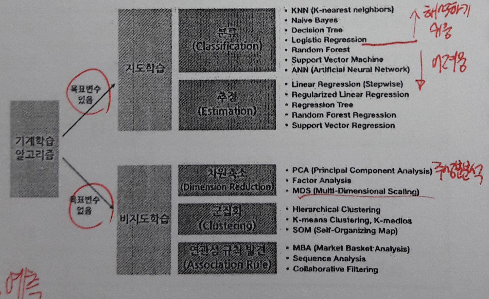
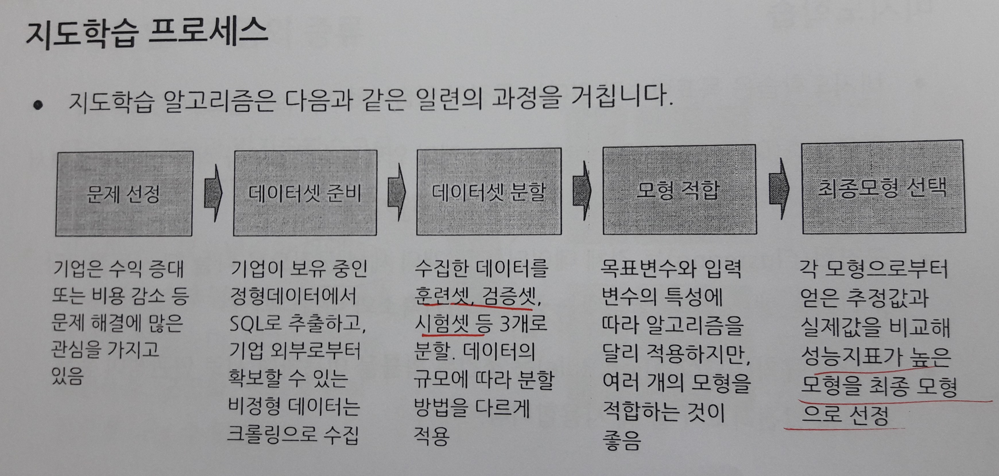
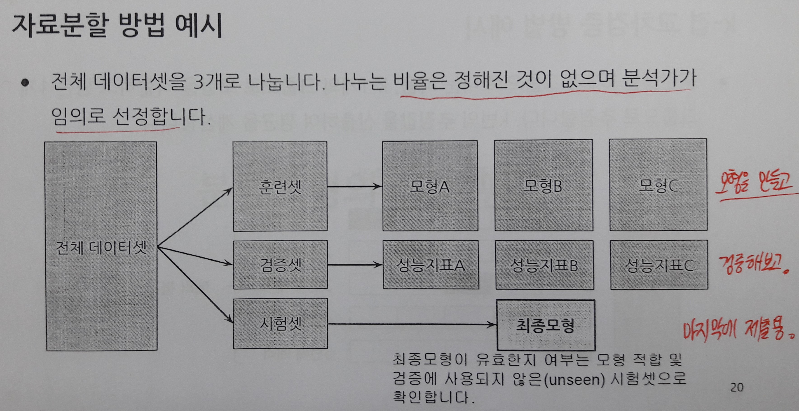
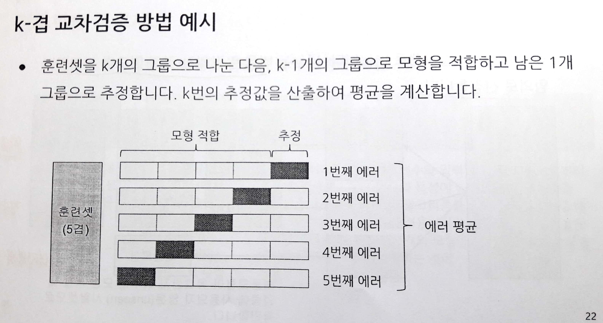
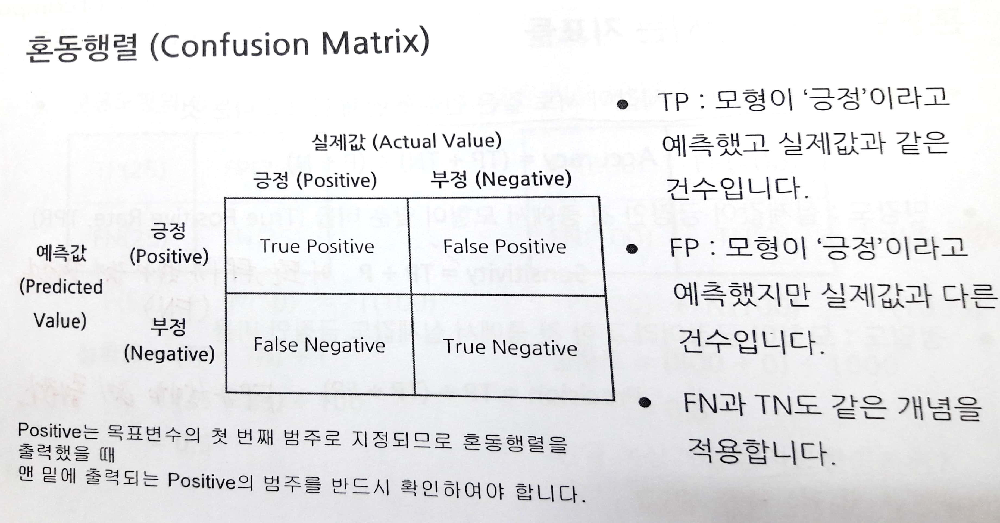
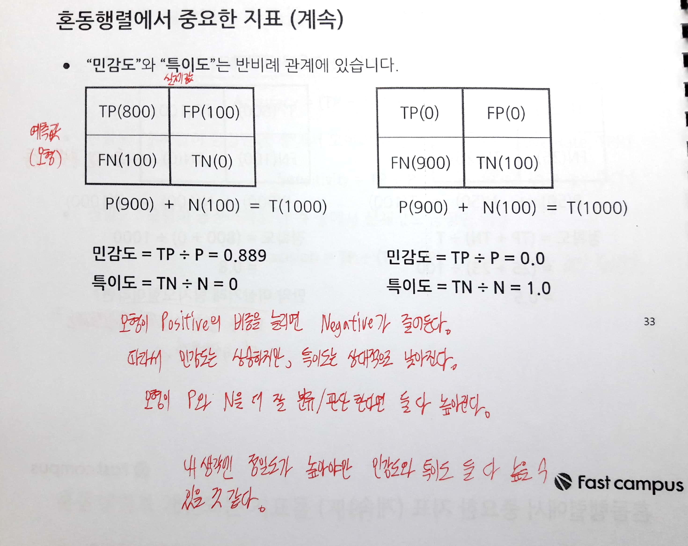
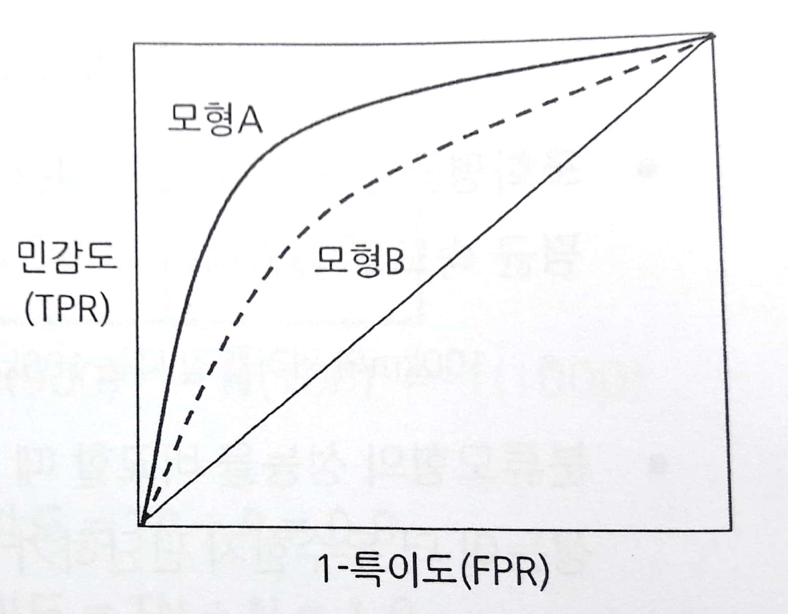
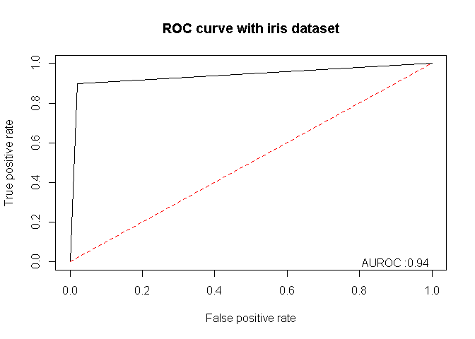
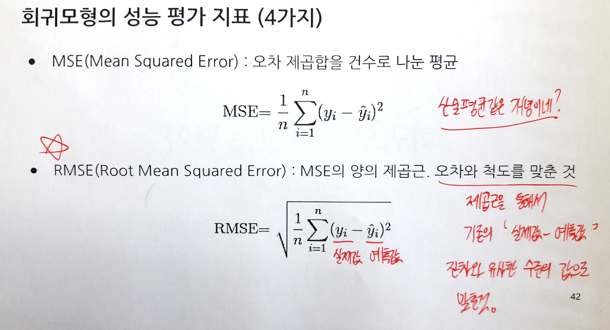
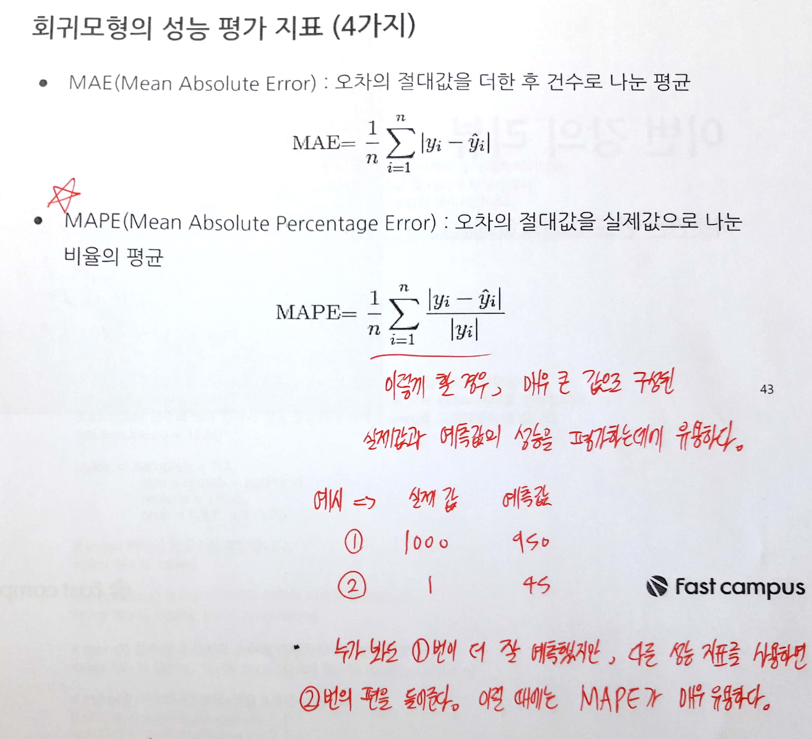

fastcampus\_머신러닝\_1
================
huimin
2019년 5월 20일

기초설정
========

``` r
library(tidyverse)
```

    ## Registered S3 methods overwritten by 'ggplot2':
    ##   method         from 
    ##   [.quosures     rlang
    ##   c.quosures     rlang
    ##   print.quosures rlang

    ## Registered S3 method overwritten by 'rvest':
    ##   method            from
    ##   read_xml.response xml2

    ## -- Attaching packages --------------------- tidyverse 1.2.1 --

    ## √ ggplot2 3.1.1       √ purrr   0.3.2  
    ## √ tibble  2.1.1       √ dplyr   0.8.0.1
    ## √ tidyr   0.8.3       √ stringr 1.4.0  
    ## √ readr   1.3.1       √ forcats 0.4.0

    ## -- Conflicts ------------------------ tidyverse_conflicts() --
    ## x dplyr::filter() masks stats::filter()
    ## x dplyr::lag()    masks stats::lag()

``` r
library(readr)
library(stringr)
library(rpart) # 의사 결정 나무
library(caret) # 혼동행렬을 위한 패키지
```

    ## Loading required package: lattice

    ## 
    ## Attaching package: 'caret'

    ## The following object is masked from 'package:purrr':
    ## 
    ##     lift

``` r
library(e1071) # confusionMatrix 함수를 사용하기 위한 패키지
library(MLmetrics) # F1_Score 함수를 사용하기 위한 패키지
```

    ## 
    ## Attaching package: 'MLmetrics'

    ## The following objects are masked from 'package:caret':
    ## 
    ##     MAE, RMSE

    ## The following object is masked from 'package:base':
    ## 
    ##     Recall

``` r
library(ROCR) # ROC 커브를 사용하기 위한 패키지
```

    ## Loading required package: gplots

    ## 
    ## Attaching package: 'gplots'

    ## The following object is masked from 'package:stats':
    ## 
    ##     lowess

``` r
library(pROC) # AUROC를 계산하기 위한 패키지
```

    ## Type 'citation("pROC")' for a citation.

    ## 
    ## Attaching package: 'pROC'

    ## The following objects are masked from 'package:stats':
    ## 
    ##     cov, smooth, var

기계학습의 개념
===============

기계학습이란? **인공지능의 한 분야**이다. 기계학습은 인공지능의 부분집합이라 할 수 있다. 딥러닝은 기계학습(머신러닝)의 부분집합이다.

-   기계학습은 목표변수의 유무에 따라 **지도학습**과 **비지도학습**으로 구분한다.
-   지도학습은 목표변수의 형태에 따라 **분류**와 **추정(회귀)**으로 구분할 수 있다.
-   비지도학습은 **차원축소, 군집화, 연관성 규칙** 등으로 나눌 수 있다.



지도학습
--------

-   분석하려는 데이터셋에 목표변수가 있는 경우, 지도학습을 실행한다.
-   목표변수가 범주형인 경우, **분류(Classification) 모형**을 적합한다.
-   목표변수가 연속형인 경우, **추정(Estimation) 또는 회귀(Regression) 모형**을 적합한다.

비지도학습
----------

-   비지도학습은 목표변수가 없다.
-   **차원축소(Dimension Reduction)**는 p개의 입력변수를 p보다 작은 m개로 줄여서 다른 알고리즘에 적용할 때 사용된다.(주성분분석 등)
-   **군집화(Clustering)**는 전체 데이터를 몇 개의 세부 군집으로 나눌 때 사용한다. 군집화는 행을 줄인다는 점에서 차원축소와 다르다.
-   **연관성(Association) 규칙**은 조건부 확률을 이용하여 서로 연관성이 높은 규칙을 발견하고자 할 때 사용한다.

지도학습 프로세스
=================



데이터셋 분할 방법은 크게 **자료분할**과 **k-겹 교차검증**의 2가지로 나뉜다.

-   데이터셋의 크기가 큰 경우, **자료분할(Hold-out Validation)**을 주로 사용한다.
-   데이터셋의 크기가 작은 경우, **k겹-교차검증(k-Cross Validation)**이 쓰인다.





``` r
# 실습용 자료 불러오기
aptPrice <- readRDS(file = "practice_data/aptPrice.RDS")

# 열의 인코딩 형식 바꿔서 글자 깨짐 방지하기
colnames(aptPrice) <- colnames(aptPrice) %>% 
  iconv(from = "UTF-8", to = "EUC-KR")

# 티블 데이터로 바꿔서 실습하기
tb.aptPrice <- as.tibble(aptPrice)
```

    ## Warning: `as.tibble()` is deprecated, use `as_tibble()` (but mind the new semantics).
    ## This warning is displayed once per session.

``` r
# 데이터 구조 파악하기
str(tb.aptPrice)
```

    ## Classes 'tbl_df', 'tbl' and 'data.frame':    1516 obs. of  27 variables:
    ##  $ 아파트명    : chr  "SK허브프리모" "대우디오빌" "신동아(22)" "신동아(22)" ...
    ##  $ 전용면적    : num  33.8 31.8 35.7 35.7 84.5 ...
    ##  $ 층          : int  7 4 1 9 6 11 13 2 3 9 ...
    ##  $ 거래금액    : num  32900 27000 58500 68000 92500 ...
    ##  $ 최고층수    : int  20 15 13 13 13 13 13 13 13 13 ...
    ##  $ 승강기수    : int  4 2 20 20 20 20 20 20 20 20 ...
    ##  $ 총동수      : int  1 1 6 6 6 6 6 6 6 6 ...
    ##  $ 연면적      : num  35505 9783 58817 58817 58817 ...
    ##  $ 주거전용면적: num  9680 4261 45646 45646 45646 ...
    ##  $ 일반관리인원: int  6 3 6 6 6 6 6 6 6 6 ...
    ##  $ 경비인원    : int  5 3 9 9 9 9 9 9 9 9 ...
    ##  $ 청소인원    : int  3 2 6 6 6 6 6 6 6 6 ...
    ##  $ CCTV개수    : num  70 46 42 42 42 42 42 42 42 42 ...
    ##  $ 총세대수    : num  176 155 644 644 644 644 644 644 644 644 ...
    ##  $ 면적당관리비: num  3574 5213 1885 1885 1885 ...
    ##  $ 총주차대수  : num  276 123 684 684 684 684 684 684 684 684 ...
    ##  $ 세대주차대수: num  1.6 0.8 1.1 1.1 1.1 1.1 1.1 1.1 1.1 1.1 ...
    ##  $ 경과년수    : num  11 13 20 20 20 20 20 20 20 20 ...
    ##  $ 계단식      : num  0 0 1 1 1 1 1 1 1 1 ...
    ##  $ 분양        : num  1 1 1 1 1 1 1 1 1 1 ...
    ##  $ 위탁관리    : num  1 1 1 1 1 1 1 1 1 1 ...
    ##  $ 개별난방    : num  1 1 1 1 1 1 1 1 1 1 ...
    ##  $ 주차관제    : num  0 0 0 0 0 0 0 0 0 0 ...
    ##  $ 브랜드사    : num  1 1 0 0 0 0 0 0 0 0 ...
    ##  $ 로그금액    : num  10.4 10.2 11 11.1 11.4 ...
    ##  $ 루트금액    : num  181 164 242 261 304 ...
    ##  $ 변환금액    : num  3973 3394 6284 7085 9053 ...

``` r
# 1. 자료분할 : 전체 데이터를 5:3:2로 나누고 훈련셋, 검증셋, 시험셋으로 명명하도록 하겠다.
set.seed(1234)

# sample 함수를 통한 1,2,3 복원추출
index <- sample(x = 1:3,
                size = nrow(tb.aptPrice),
                replace = TRUE,
                prob = c(0.5,0.3,0.2))

# 비율 확인하기
prop.table(table(index))
```

    ## index
    ##         1         2         3 
    ## 0.4920844 0.3054090 0.2025066

``` r
train.set <- tb.aptPrice[index == 1, ]
validation.set <- tb.aptPrice[index == 2, ]
test.set <- tb.aptPrice[index == 3, ]

# 분할한 데이터의 평균이 다른 지 확인하기
mean(train.set$거래금액)
```

    ## [1] 136470.2

``` r
mean(validation.set$거래금액)
```

    ## [1] 137574.5

``` r
mean(test.set$거래금액)
```

    ## [1] 134434.2

``` r
# 분산분석 결과 평균에는 유효한 차이가 없음
aov(index ~ tb.aptPrice$거래금액) %>% summary()
```

    ##                        Df Sum Sq Mean Sq F value Pr(>F)
    ## tb.aptPrice$거래금액    1    0.1  0.1239   0.203  0.653
    ## Residuals            1514  925.8  0.6115

``` r
# 2. k-겹 교차검증 실습
index <- sample(x = 1:2,
                size = nrow(tb.aptPrice),
                replace = TRUE,
                prob = c(0.7,0.3))

# 비율 다시 확인하기
index %>% table() %>% prop.table()
```

    ## .
    ##         1         2 
    ## 0.7051451 0.2948549

``` r
train.set <- tb.aptPrice[index == 1, ]
test.set <- tb.aptPrice[index == 2, ]

# 5겹으로 교차 검증을 하기 위한 훈련셋 5등분
k <- 5
n <- nrow(train.set)
cvldx <- sample(x = 1:n)

fold <- list()

# 반복문을 활용하여 리스트에 5겹의 train.set 저장하기
for (i in 1:k){
  
  fold[[i]] <- c(1:n)[cvldx %% k == (i-1)]
  
}

# 이곳에서 모형을 만들고
train.set[-fold[[1]], ] %>% nrow()
```

    ## [1] 856

``` r
# 이곳에서 test한다.
train.set[fold[[1]], ] %>% nrow()
```

    ## [1] 213

``` r
# 이런 식으로 5번 테스트하고 예측값을 추정한다. 그 후, 오차를 계산하고 평균을 계산하면 된다.
```

분류모형의 성능 평가
====================

-   분류모형은 **목표변수가 범주형**이므로, 데이터셋의 실제값과 분류모형의 **추정값이 서로 같거나 다름으로 성능을 평가**할 수 있다.
-   정확도(Accuracy) 또는 오분류율(Misclassification Rate) 등으로 분류모형의 성능을 측정하는 대신 다양한 지표를 활용한다.
-   특히 해결해야 하는 문제와 **데이터셋이 보유한 특징에 따라 참고해야할 지표가 다를 수 있다는 점**에 유의해야 한다.

분류모형의 성능 평가 기준 (3가지)
=================================

-   **혼동행렬(Confusion Matrix)** : 실제값(Actual Value)과 예측값(Predicted Value)으로 그린 2x2 행렬이다. 여러 지표들을 한 번에 확인할 수 있다.
-   **F1 Score** : 혼동행렬의 지표 중 민감도(Sensitivity)와 정밀도(Precision)의 조화평균을 의미한다. 어느 하나의 지표만 우수한 경우 F1 점수는 낮아진다.
-   **ROC Curve** : x축은 1-특이도, y축은 민감도를 그린 그래프이다. **ROC커브 아래의 면적을 AUROC**라고 하며, AUROC의 크기로 모형의 분류 성능을 측정한다.

혼동행렬
--------



-   실제값이 긍정인 건수의 합(**P**) = TP + FN
-   실제값이 부정인 건수의 합(**N**) = FP + TN
-   전체 건수의 합(**T**) = P + N

-   정확도(Accuracy) : (TP + TN) / (P + N)
-   **민감도(Sensitivity) : TP / P**
-   **정밀도(Precision) : TP / (TP + FP)**
-   **특이도(Specificity) : TN / N**



**민감도와 정밀도가 동시에 높을수록 좋은 모형**이라고 할 수 있다. 민감도와 특이도는 반비례 관계에 있다. 그렇기 때문에 민감도와 정밀도는 동시에 높기가 어려운 것이다.

``` r
# iris 데이터를 통한 실습을 진행해본다.
str(iris)
```

    ## 'data.frame':    150 obs. of  5 variables:
    ##  $ Sepal.Length: num  5.1 4.9 4.7 4.6 5 5.4 4.6 5 4.4 4.9 ...
    ##  $ Sepal.Width : num  3.5 3 3.2 3.1 3.6 3.9 3.4 3.4 2.9 3.1 ...
    ##  $ Petal.Length: num  1.4 1.4 1.3 1.5 1.4 1.7 1.4 1.5 1.4 1.5 ...
    ##  $ Petal.Width : num  0.2 0.2 0.2 0.2 0.2 0.4 0.3 0.2 0.2 0.1 ...
    ##  $ Species     : Factor w/ 3 levels "setosa","versicolor",..: 1 1 1 1 1 1 1 1 1 1 ...

``` r
# setosa를 제외한 데이터셋으로 가공하기
data.set <- iris[iris$Species != "setosa", ]
levels(data.set$Species)
```

    ## [1] "setosa"     "versicolor" "virginica"

``` r
data.set$Species <- data.set$Species %>% as.character() %>% as.factor()
levels(data.set$Species)
```

    ## [1] "versicolor" "virginica"

``` r
# 의사결정나무 적합하기
fitTree <- rpart(Species ~., data = data.set)

# 의사결정나무 출력해보기
summary(fitTree)
```

    ## Call:
    ## rpart(formula = Species ~ ., data = data.set)
    ##   n= 100 
    ## 
    ##     CP nsplit rel error xerror       xstd
    ## 1 0.88      0      1.00   1.24 0.09707729
    ## 2 0.01      1      0.12   0.16 0.05425864
    ## 
    ## Variable importance
    ##  Petal.Width Petal.Length Sepal.Length  Sepal.Width 
    ##           40           32           17           11 
    ## 
    ## Node number 1: 100 observations,    complexity param=0.88
    ##   predicted class=versicolor  expected loss=0.5  P(node) =1
    ##     class counts:    50    50
    ##    probabilities: 0.500 0.500 
    ##   left son=2 (54 obs) right son=3 (46 obs)
    ##   Primary splits:
    ##       Petal.Width  < 1.75 to the left,  improve=38.969400, (0 missing)
    ##       Petal.Length < 4.75 to the left,  improve=37.353540, (0 missing)
    ##       Sepal.Length < 6.15 to the left,  improve=10.686870, (0 missing)
    ##       Sepal.Width  < 2.45 to the left,  improve= 3.555556, (0 missing)
    ##   Surrogate splits:
    ##       Petal.Length < 4.75 to the left,  agree=0.91, adj=0.804, (0 split)
    ##       Sepal.Length < 6.15 to the left,  agree=0.73, adj=0.413, (0 split)
    ##       Sepal.Width  < 2.95 to the left,  agree=0.67, adj=0.283, (0 split)
    ## 
    ## Node number 2: 54 observations
    ##   predicted class=versicolor  expected loss=0.09259259  P(node) =0.54
    ##     class counts:    49     5
    ##    probabilities: 0.907 0.093 
    ## 
    ## Node number 3: 46 observations
    ##   predicted class=virginica   expected loss=0.02173913  P(node) =0.46
    ##     class counts:     1    45
    ##    probabilities: 0.022 0.978

``` r
# 예측값 저장하기
pred <- predict(fitTree, newdata = data.set, type = "class")
# 실제값 저장하기
real <- data.set$Species

# 혼동행렬 출력하기
caret::confusionMatrix(data = pred, reference = real)
```

    ## Confusion Matrix and Statistics
    ## 
    ##             Reference
    ## Prediction   versicolor virginica
    ##   versicolor         49         5
    ##   virginica           1        45
    ##                                          
    ##                Accuracy : 0.94           
    ##                  95% CI : (0.874, 0.9777)
    ##     No Information Rate : 0.5            
    ##     P-Value [Acc > NIR] : <2e-16         
    ##                                          
    ##                   Kappa : 0.88           
    ##                                          
    ##  Mcnemar's Test P-Value : 0.2207         
    ##                                          
    ##             Sensitivity : 0.9800         
    ##             Specificity : 0.9000         
    ##          Pos Pred Value : 0.9074         
    ##          Neg Pred Value : 0.9783         
    ##              Prevalence : 0.5000         
    ##          Detection Rate : 0.4900         
    ##    Detection Prevalence : 0.5400         
    ##       Balanced Accuracy : 0.9400         
    ##                                          
    ##        'Positive' Class : versicolor     
    ## 

F1 Score
--------

-   F1 점수는 **민감도와 정밀도의 조화평균**이다.
-   **F1 Score = 2TP / (2TP + FP + FN)**
-   분류모형의 성능을 비교할 때 민감도와 정밀도를 동시에 고려한다면 어떤 모형의 성능이 더 우수한지 판단하기 어렵지만 F1 점수로 환산하면 비교할 수 있다.

``` r
F1_Score(y_true = real, y_pred = pred)
```

    ## [1] 0.9423077

ROC Curve 및 AUROC
------------------



-   ROC 커브는 x축에 1-특이도, Y축에 민감도를 기준으로 놓고 분류모형의 성능을 그린 그래프이다.
-   **성능이 우수할수록 민감도와 특이도가 동시에 높다.**
-   이런 경우, ROC Curve는 왼쪽 상단 모서리에 가까워진다.

-   AUROC는 ROC 커브 아래에 해당하는 면적을 의미한다.
-   **0.5~1.0의 값을 가지며, 클수록 성능이 좋은 모형이다.**

``` r
# 추정값과 실제값의 교차테이블을 확인한다.
table(pred, real)
```

    ##             real
    ## pred         versicolor virginica
    ##   versicolor         49         5
    ##   virginica           1        45

``` r
# pred와 real을 factor에서 숫자형으로 변환하기
pred <- pred %>% as.numeric()
real <- real %>% as.numeric()

# ROC 커브를 그리기 위한 prediction object라고 한다.
predObj <- ROCR::prediction(predictions = pred, labels = real)

# predObj 객체를 활용하여 performance 객체를 생성할 수 있다고 한다.
perform <- ROCR::performance(prediction.obj = predObj,
                             measure = "tpr",
                             x.measure = "fpr")

# ROC curve 구하기
plot(perform, main = "ROC curve with iris dataset")
lines(x = c(0,1), y = c(0,1), col = "red", lty = 2)

# AUROC 구하기
auroc <- pROC::auc(real, pred)
auroc
```

    ## Area under the curve: 0.94

``` r
# AUROC 값을 그래프에 추가하기
text(x = 0.9, y = 0, labels = str_c("AUROC :", auroc))
```



회귀모형의 성능 평가 기준
=========================

-   회귀모형은 **목표변수가 연속한 숫자**이므로, 실제값과 추정값의 차이인 오차를 계산하여 모형의 성능을 평가할 수 있다.
-   모형 전체의 오차 크기를 계산할 때 개별 오차를 단순 합계하면 결국 0이 되므로 **부호를 제거하기 위해 제곱 또는 절대값**을 취한다.
-   회귀모형의 성능을 평가하는 지표가 여러 개이지만, **대체로 비슷한 결과**를 얻게되므로 **한 가지 지표를 정하여 사용**하면 된다.

회귀모형의 성능 평가 지표 (4가지)
---------------------------------





``` r
# 예시로 사용할 데이터 women
str(women)
```

    ## 'data.frame':    15 obs. of  2 variables:
    ##  $ height: num  58 59 60 61 62 63 64 65 66 67 ...
    ##  $ weight: num  115 117 120 123 126 129 132 135 139 142 ...

``` r
# 회귀모형 적합하기
fit.women <- lm(weight ~ height, data = women)
summary(fit.women)
```

    ## 
    ## Call:
    ## lm(formula = weight ~ height, data = women)
    ## 
    ## Residuals:
    ##     Min      1Q  Median      3Q     Max 
    ## -1.7333 -1.1333 -0.3833  0.7417  3.1167 
    ## 
    ## Coefficients:
    ##              Estimate Std. Error t value Pr(>|t|)    
    ## (Intercept) -87.51667    5.93694  -14.74 1.71e-09 ***
    ## height        3.45000    0.09114   37.85 1.09e-14 ***
    ## ---
    ## Signif. codes:  0 '***' 0.001 '**' 0.01 '*' 0.05 '.' 0.1 ' ' 1
    ## 
    ## Residual standard error: 1.525 on 13 degrees of freedom
    ## Multiple R-squared:  0.991,  Adjusted R-squared:  0.9903 
    ## F-statistic:  1433 on 1 and 13 DF,  p-value: 1.091e-14

``` r
# 예측값과 실제값
pred <- predict(fit.women, newdata = women, type = "response")
real <- women$weight
# 잔차
error <- residuals(fit.women)

# MSE
error**2 %>% mean()
```

    ## [1] 2.015556

``` r
# RMSE
error**2 %>% mean() %>% sqrt()
```

    ## [1] 1.419703

``` r
# MAE
error %>% abs() %>% mean()
```

    ## [1] 1.155556

``` r
# MAPE
((error %>% abs()) / (real %>% abs())) %>% mean()
```

    ## [1] 0.008409659
