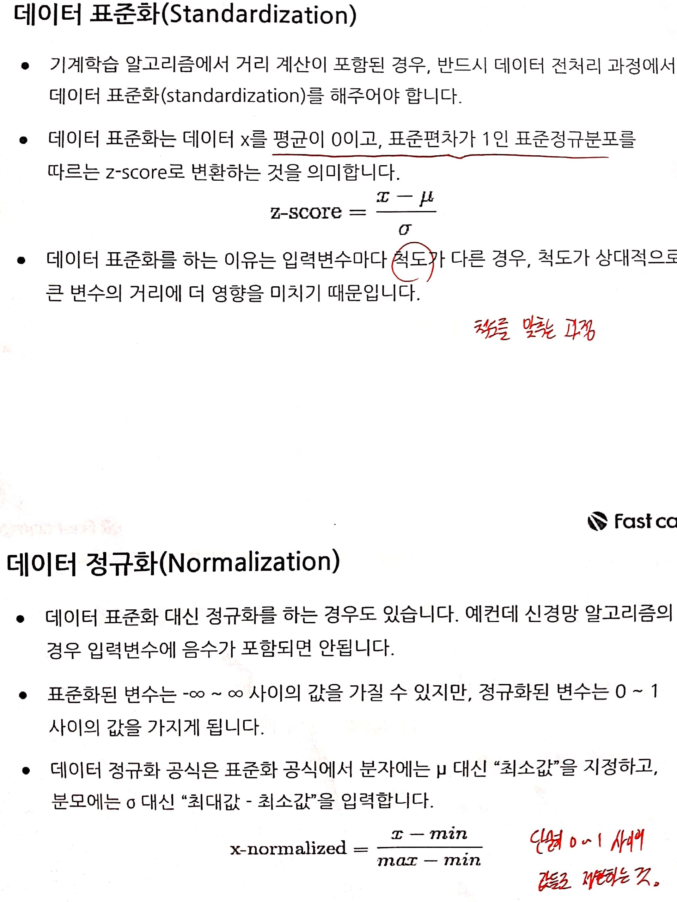
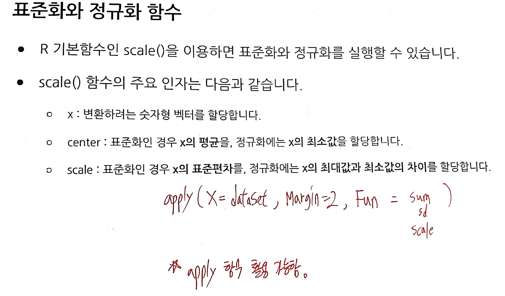
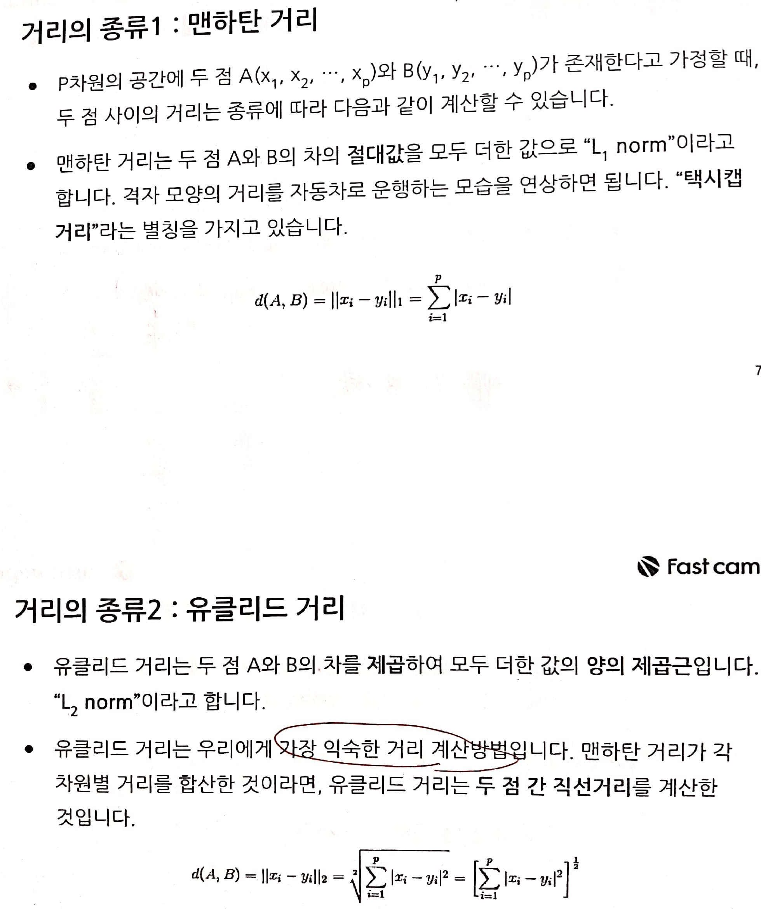
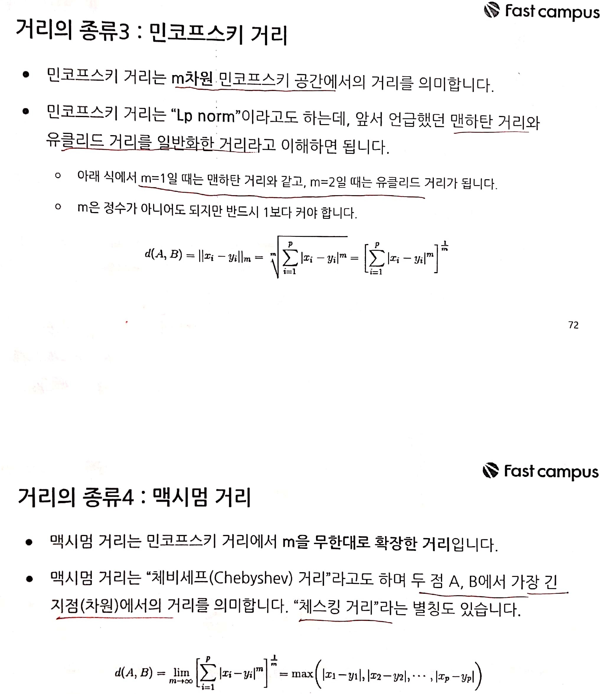
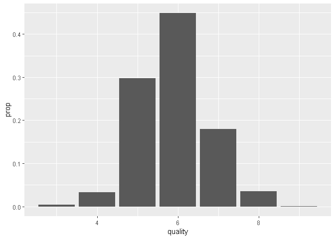

fastcampus\_머신러닝\_2
================
huimin
2019년 5월 22일

기초설정
========

``` r
library(tidyverse)
```

    ## Registered S3 methods overwritten by 'ggplot2':
    ##   method         from 
    ##   [.quosures     rlang
    ##   c.quosures     rlang
    ##   print.quosures rlang

    ## Registered S3 method overwritten by 'rvest':
    ##   method            from
    ##   read_xml.response xml2

    ## -- Attaching packages --------------------- tidyverse 1.2.1 --

    ## √ ggplot2 3.1.1       √ purrr   0.3.2  
    ## √ tibble  2.1.1       √ dplyr   0.8.0.1
    ## √ tidyr   0.8.3       √ stringr 1.4.0  
    ## √ readr   1.3.1       √ forcats 0.4.0

    ## -- Conflicts ------------------------ tidyverse_conflicts() --
    ## x dplyr::filter() masks stats::filter()
    ## x dplyr::lag()    masks stats::lag()

``` r
library(readr)
library(stringr)
library(rpart) # 의사 결정 나무
library(caret) # 혼동행렬을 위한 패키지
```

    ## Loading required package: lattice

    ## 
    ## Attaching package: 'caret'

    ## The following object is masked from 'package:purrr':
    ## 
    ##     lift

``` r
library(e1071) # confusionMatrix 함수를 사용하기 위한 패키지
library(MLmetrics) # F1 점수 사용하기
```

    ## 
    ## Attaching package: 'MLmetrics'

    ## The following objects are masked from 'package:caret':
    ## 
    ##     MAE, RMSE

    ## The following object is masked from 'package:base':
    ## 
    ##     Recall

``` r
library(pROC) # AUROC 확인하기
```

    ## Type 'citation("pROC")' for a citation.

    ## 
    ## Attaching package: 'pROC'

    ## The following objects are masked from 'package:stats':
    ## 
    ##     cov, smooth, var

``` r
library(kknn) # kknn() 함수
```

    ## 
    ## Attaching package: 'kknn'

    ## The following object is masked from 'package:caret':
    ## 
    ##     contr.dummy

``` r
library(class) # knn() 함수
library(ROSE) # ovun.sample() 함수
```

    ## Loaded ROSE 0.0-3

K-최근접이웃 알고리즘의 개요
============================

-   일부 기계학습 알고리즘은 데이터 간 **유사도 혹은 비유사도**를 측정한다.
-   유사도 기준으로는 **거리(Distance)**가 주로 이용되는데, 예컨데 군집분석의 경우 데이터 간 거리가 가까울수록 유사도가 높다고 판단하여 같은 군집으로 묶는다.
-   **k-최근접이웃 알고리즘**도 개별 데이터 간 거리를 측정하여 가장 가까운 k개 이웃 데이터를 선별한 다음, 이웃 데이터의 목표변수로부터 **다수결(범주형)** 또는 **평균(연속형)** 등을 계산하여 해당 데이터의 목표변수를 추정하는 방식을 채택한다.

가장 기초적인 알고리즘으로서, 가까이에 있으면 같은 그룹이라는 매우 간단한 수학적 지식만을 사용한다.

K-최근접이웃 알고리즘의 특징
----------------------------

-   **사례 기반 추론 방법**에 속한다. 과거에 있었던 사례들의 결과를 바탕으로 새로운 사례의 결과를 예측하는 기법이다.
-   데이터 간 유사도 척도로 **거리**를 사용하다.
-   **비모수적 알고리즘**이므로, 분류모형과 회귀모형 모두 사용할 수 있다.
-   K를 작은 숫자로 설정하면, 데이터의 범위가 좁아지므로 **이상치에 민감해진다.**
-   K를 큰 숫자로 설정하면, 데이터의 범위가 커지므로 인접한 조금 더 관대한 모형이 만들어진다.
-   일반적으로 훈련용 데이터셋 건수의 제곱근을 k로 사용하며, 더 최적해를 구하기 위해서는 교차검증을 통한 튜닝을 한다.

이어서

-   거리를 기준으로 **가중치**를 부여할 수도 있다.
-   거리가 가까울수록 긴밀한 관계라고 판단할 경우, 더 높은 가중치를 부여하는 것이 좋다.

유사도의 척도, 거리의 종류
==========================









R 기본함수인 **dist()**를 이용하면 다양한 거리를 계산할 수 있다.

| dist의 인자 |                              설명                              |
|:-----------:|:--------------------------------------------------------------:|
|      x      |          거리를 계산할 숫자형 행렬, 데이터프레임 할당          |
|    method   |        "euclidean", "maximum", "manhattan", "minkowski"        |
|      p      |  minkowski를 할당했을 경우, 지수에 해당하는 숫자. default = 2  |
|     diag    | TRUE를 할당하면 행렬로 출력되는 결과에서 대각원소를 0으로 설정 |
|    upper    |                TRUE를 할당하면 상삼각행렬이 출력               |

**데이터 표준화와 정규화는 R 기본함수인 scale()**로 간단하게 실행할 수 있다.

추가적인 팁으로, **sapply()함수라는 각 컬럼별로 공통의 함수를 적용해주는 편리한 함수**가 있다.

``` r
# 1. 데이터 표준화 및 정규화 실습
dataset <- iris[, -5]
head(dataset)
```

    ##   Sepal.Length Sepal.Width Petal.Length Petal.Width
    ## 1          5.1         3.5          1.4         0.2
    ## 2          4.9         3.0          1.4         0.2
    ## 3          4.7         3.2          1.3         0.2
    ## 4          4.6         3.1          1.5         0.2
    ## 5          5.0         3.6          1.4         0.2
    ## 6          5.4         3.9          1.7         0.4

``` r
scaleA <- scale(x = dataset$Sepal.Length,
                center = mean(x = dataset$Sepal.Length),
                scale = sd(x = dataset$Sepal.Length))
head(scaleA)
```

    ##            [,1]
    ## [1,] -0.8976739
    ## [2,] -1.1392005
    ## [3,] -1.3807271
    ## [4,] -1.5014904
    ## [5,] -1.0184372
    ## [6,] -0.5353840

``` r
# 참고로 center와 scale에는 평균과 표준편차가 기본값이다.
scaleB <- scale(x = dataset$Sepal.Length)
head(scaleB)
```

    ##            [,1]
    ## [1,] -0.8976739
    ## [2,] -1.1392005
    ## [3,] -1.3807271
    ## [4,] -1.5014904
    ## [5,] -1.0184372
    ## [6,] -0.5353840

``` r
# 전체 데이터 표준화
scaleC <- scale(dataset)
head(scaleC)
```

    ##      Sepal.Length Sepal.Width Petal.Length Petal.Width
    ## [1,]   -0.8976739  1.01560199    -1.335752   -1.311052
    ## [2,]   -1.1392005 -0.13153881    -1.335752   -1.311052
    ## [3,]   -1.3807271  0.32731751    -1.392399   -1.311052
    ## [4,]   -1.5014904  0.09788935    -1.279104   -1.311052
    ## [5,]   -1.0184372  1.24503015    -1.335752   -1.311052
    ## [6,]   -0.5353840  1.93331463    -1.165809   -1.048667

``` r
# 2. 정규화 실습
scaleA <- scale(x = dataset$Sepal.Length,
                center = min(x = dataset$Sepal.Length),
                scale = range(x = dataset$Sepal.Length) %>% diff())
head(scaleA)
```

    ##            [,1]
    ## [1,] 0.22222222
    ## [2,] 0.16666667
    ## [3,] 0.11111111
    ## [4,] 0.08333333
    ## [5,] 0.19444444
    ## [6,] 0.30555556

``` r
# 전체 데이터 정규화
ScaleB <- scale(x = dataset,
                center = sapply(dataset, FUN = min),
                scale = sapply(dataset, 
                               FUN = function(x) range(x) %>% diff))
head(ScaleB)
```

    ##      Sepal.Length Sepal.Width Petal.Length Petal.Width
    ## [1,]   0.22222222   0.6250000   0.06779661  0.04166667
    ## [2,]   0.16666667   0.4166667   0.06779661  0.04166667
    ## [3,]   0.11111111   0.5000000   0.05084746  0.04166667
    ## [4,]   0.08333333   0.4583333   0.08474576  0.04166667
    ## [5,]   0.19444444   0.6666667   0.06779661  0.04166667
    ## [6,]   0.30555556   0.7916667   0.11864407  0.12500000

``` r
# 3. 거리 계산 실습
dataset <- iris[1:2, -5]
dataset
```

    ##   Sepal.Length Sepal.Width Petal.Length Petal.Width
    ## 1          5.1         3.5          1.4         0.2
    ## 2          4.9         3.0          1.4         0.2

``` r
# 유클리디안 거리
dist(dataset, method = "euclidean")
```

    ##           1
    ## 2 0.5385165

``` r
# 맨하탄 거리
dist(dataset, method = "manhattan")
```

    ##     1
    ## 2 0.7

``` r
# 민코우스키 거리
dist(dataset, method = "minkowski", p = 3)
```

    ##           1
    ## 2 0.5104469

``` r
# 맥시멈 거리
dist(dataset, method = "maximum")
```

    ##     1
    ## 2 0.5

가중치 없는 knn모형(와인 데이터 품질 등급)
==========================================

분류모형은 목표변수가 범주형이어야 하므로 "quality" 컬럼을 적당한 기준을 정해 라벨링한다.

**class 패키지의 knn() 함수**

| knn의 인자 |                           설명                          |
|:----------:|:-------------------------------------------------------:|
|    train   |            훈련셋을 할당한다. (목표변수 제외)           |
|    test    |            시험셋을 할당한다. (목표변수 제외)           |
|     cl     |      목표변수를 할당한다. 범주형으로 할당해야 한다.     |
|      k     |           참고할 이웃의 수를 정수로 할당한다.           |
|    prob    | 목표변수 범주에 속할 확률 반환 여부를 TRUE FALSE로 할당 |

와인 데이터 목표변수의 경우 각 레벨의 비중이 78: 22로 불균형 데이터셋이다. **불균형일 경우, 정확도는 높지만 민감도와 정밀도 등은 낮을 수 있다.** 따라서 **표본 균형화 작업**을 실행해야 한다.

-   Oversampling : 소수 레벨의 비중이 다수 레벨의 비중보다 크게 작으므로, 소수 레벨의 행을 여러 번 복사하여 다수 레벨의 건수만큼 늘린다.
-   Undersampling : 다수 레벨의 건수를 소수 레벨의 건수만큼 줄인다.
-   SMOTE : Oversampling과 Undersampling을 혼합한 방법이다.

**ROSE 패키지의 ovun.sample() 함수**로 오버샘플링, 언더샘플링 및 smote를 실행할 수 있다.

| ovun.sample의 인자 |                          설명                          |
|:------------------:|:------------------------------------------------------:|
|       formula      |        목표변수와 입력변수 간 관계식을 지정한다.       |
|        data        |                   훈련셋을 할당한다.                   |
|       method       |                 "over", "under", "both"                |
|          p         | 목표변수의 범주형 비중을 설정. 0.5로 할 경우 같은 비중 |
|        seed        |                      set.seed 기능                     |

``` r
# 와인데이터 불러오기
load(file = "practice_data/wine.RData")

head(wine)
```

    ##   fixed.acidity volatile.acidity citric.acid residual.sugar chlorides
    ## 1           7.0             0.27        0.36           20.7     0.045
    ## 2           6.3             0.30        0.34            1.6     0.049
    ## 3           8.1             0.28        0.40            6.9     0.050
    ## 4           7.2             0.23        0.32            8.5     0.058
    ## 5           7.2             0.23        0.32            8.5     0.058
    ## 6           8.1             0.28        0.40            6.9     0.050
    ##   free.sulfur.dioxide total.sulfur.dioxide density   pH sulphates alcohol
    ## 1                  45                  170  1.0010 3.00      0.45     8.8
    ## 2                  14                  132  0.9940 3.30      0.49     9.5
    ## 3                  30                   97  0.9951 3.26      0.44    10.1
    ## 4                  47                  186  0.9956 3.19      0.40     9.9
    ## 5                  47                  186  0.9956 3.19      0.40     9.9
    ## 6                  30                   97  0.9951 3.26      0.44    10.1
    ##   quality
    ## 1       6
    ## 2       6
    ## 3       6
    ## 4       6
    ## 5       6
    ## 6       6

``` r
# 목표변수의 누적상대도수
wine$quality %>% 
  table() %>% 
  prop.table() %>% 
  cumsum() %>% 
  round(digits = 4L)*100
```

    ##      3      4      5      6      7      8      9 
    ##   0.41   3.74  33.48  78.36  96.33  99.90 100.00

``` r
# quality의 분포보기
ggplot(data = wine) +
  geom_bar(mapping = aes(x = quality,
                         y = ..prop..))
```



``` r
# knn 분류를 위해서 목표변수 새로 만들기
# quality 값이 3~6이면 good 7~9이면 best를 할당한다.
wine$grade <- ifelse(wine$quality >= 7, "best", "good")
wine$grade <- as.factor(wine$grade)

# 모든 종속변수를 표준화한다.
wine.scaled <- scale(x = wine[, 1:11]) %>% as.data.frame()
wine.scaled <- cbind(wine.scaled, wine$grade)
head(wine.scaled)
```

    ##   fixed.acidity volatile.acidity citric.acid residual.sugar   chlorides
    ## 1     0.1720794      -0.08176155  0.21325843      2.8210611 -0.03535139
    ## 2    -0.6574340       0.21587359  0.04799622     -0.9446688  0.14773200
    ## 3     1.4756004       0.01745016  0.54378284      0.1002720  0.19350284
    ## 4     0.4090832      -0.47860841 -0.11726599      0.4157258  0.55966962
    ## 5     0.4090832      -0.47860841 -0.11726599      0.4157258  0.55966962
    ## 6     1.4756004       0.01745016  0.54378284      0.1002720  0.19350284
    ##   free.sulfur.dioxide total.sulfur.dioxide      density          pH
    ## 1           0.5698734            0.7444890  2.331273996 -1.24679399
    ## 2          -1.2528907           -0.1496693 -0.009153237  0.73995309
    ## 3          -0.3121093           -0.9732363  0.358628185  0.47505348
    ## 4           0.6874711            1.1209768  0.525801559  0.01147916
    ## 5           0.6874711            1.1209768  0.525801559  0.01147916
    ## 6          -0.3121093           -0.9732363  0.358628185  0.47505348
    ##     sulphates    alcohol wine$grade
    ## 1 -0.34914861 -1.3930102       good
    ## 2  0.00134171 -0.8241915       good
    ## 3 -0.43677119 -0.3366326       good
    ## 4 -0.78726151 -0.4991523       good
    ## 5 -0.78726151 -0.4991523       good
    ## 6 -0.43677119 -0.3366326       good

``` r
set.seed(123)

index <- sample(x = 1:2,
                size = nrow(wine.scaled),
                prob = c(0.7,0.3),
                replace = TRUE)

# 훈련셋과 시험셋
train.set <- wine.scaled[index == 1, ]
test.set <- wine.scaled[index == 2, ]

# grade 비율 확인하기
train.set$`wine$grade` %>% table() %>% prop.table()
```

    ## .
    ##      best      good 
    ## 0.2102355 0.7897645

``` r
test.set$`wine$grade` %>% table() %>% prop.table()
```

    ## .
    ##      best      good 
    ## 0.2309801 0.7690199

``` r
fit.knn <- knn(train = train.set[, 1:11],
               test = test.set[, 1:11],
               cl = train.set$`wine$grade`,
               k = train.set %>% nrow() %>% sqrt() %>% ceiling(),
               prob = TRUE)

# 결과 확인하기
str(fit.knn)
```

    ##  Factor w/ 2 levels "best","good": 2 2 2 2 2 2 2 1 2 2 ...
    ##  - attr(*, "prob")= num [1:1459] 0.95 0.983 0.983 0.695 0.814 ...

``` r
# 예측값의 확률 확인하는 방법
attr(x = fit.knn, which = "prob")[1:100]
```

    ##   [1] 0.9500000 0.9833333 0.9833333 0.6949153 0.8135593 0.6440678 1.0000000
    ##   [8] 0.5084746 1.0000000 1.0000000 0.9152542 0.8474576 0.7333333 0.9491525
    ##  [15] 0.8666667 0.7288136 0.9830508 0.9830508 0.8000000 0.5084746 0.9322034
    ##  [22] 0.5423729 1.0000000 0.8305085 0.9491525 0.9830508 0.9322034 0.9833333
    ##  [29] 0.9830508 0.6833333 0.8305085 0.9491525 0.9322034 1.0000000 1.0000000
    ##  [36] 0.7457627 0.5500000 0.8983051 0.9491525 0.6949153 0.9830508 0.7500000
    ##  [43] 0.8135593 0.9661017 0.6779661 0.9000000 0.7288136 0.6610169 1.0000000
    ##  [50] 0.9491525 0.7166667 0.6610169 1.0000000 0.5932203 0.9830508 0.7627119
    ##  [57] 0.9661017 0.9661017 1.0000000 0.6949153 1.0000000 0.7118644 0.9152542
    ##  [64] 0.9830508 0.9491525 0.7966102 0.7966102 0.8305085 0.8983051 0.7118644
    ##  [71] 0.6779661 0.7166667 0.7000000 0.9677419 1.0000000 1.0000000 0.9322034
    ##  [78] 0.9322034 0.6101695 0.8305085 1.0000000 0.8474576 0.9666667 0.7627119
    ##  [85] 0.7627119 0.7627119 0.7796610 0.8135593 0.9661017 0.7796610 0.7457627
    ##  [92] 0.6949153 0.8135593 0.7000000 0.7333333 0.7627119 0.8813559 0.6271186
    ##  [99] 0.7966102 0.5084746

``` r
# 실제값과 예측값 객체 저장하기
pred <- fit.knn
real <- test.set$`wine$grade`

# 분류모형 성능 평가하기
confusionMatrix(pred,real)
```

    ## Confusion Matrix and Statistics
    ## 
    ##           Reference
    ## Prediction best good
    ##       best   83   45
    ##       good  254 1077
    ##                                           
    ##                Accuracy : 0.7951          
    ##                  95% CI : (0.7734, 0.8155)
    ##     No Information Rate : 0.769           
    ##     P-Value [Acc > NIR] : 0.009245        
    ##                                           
    ##                   Kappa : 0.2633          
    ##                                           
    ##  Mcnemar's Test P-Value : < 2.2e-16       
    ##                                           
    ##             Sensitivity : 0.24629         
    ##             Specificity : 0.95989         
    ##          Pos Pred Value : 0.64844         
    ##          Neg Pred Value : 0.80917         
    ##              Prevalence : 0.23098         
    ##          Detection Rate : 0.05689         
    ##    Detection Prevalence : 0.08773         
    ##       Balanced Accuracy : 0.60309         
    ##                                           
    ##        'Positive' Class : best            
    ## 

``` r
F1_Score(pred, real)
```

    ## [1] 0.3569892

``` r
real <- as.numeric(real)
pred <- as.numeric(pred)
pROC::auc(real, pred)
```

    ## Area under the curve: 0.6031

``` r
# 2. 표본 샘플링을 통해서 정확도 높이기

train.set <- train.set %>% 
  dplyr::rename(grade = `wine$grade`)

# ovun.sample() 사용하기
train.set.bal <- ovun.sample(formula = grade ~.,
                             data = train.set,
                             method = "both",
                             p = 0.5,
                             seed = 123)
train.set.bal <- train.set.bal$data

# 모형 적합하기
fit.knn.bal <- knn(train = train.set.bal[, 1:11],
                   test = test.set[, 1:11],
                   cl = train.set.bal$grade,
                   k = nrow(train.set.bal) %>% sqrt() %>% ceiling(),
                   prob = TRUE)

# 예측값 객체 저장하기
pred <- fit.knn.bal

# 레벨 재조정
levels(pred)
```

    ## [1] "good" "best"

``` r
pred <- relevel(pred, ref = "best")

# 실제값 객체 저장하기
real <- test.set$`wine$grade`


# 분류모형 성능 평가하기
confusionMatrix(pred, real)
```

    ## Confusion Matrix and Statistics
    ## 
    ##           Reference
    ## Prediction best good
    ##       best  284  370
    ##       good   53  752
    ##                                          
    ##                Accuracy : 0.7101         
    ##                  95% CI : (0.686, 0.7333)
    ##     No Information Rate : 0.769          
    ##     P-Value [Acc > NIR] : 1              
    ##                                          
    ##                   Kappa : 0.386          
    ##                                          
    ##  Mcnemar's Test P-Value : <2e-16         
    ##                                          
    ##             Sensitivity : 0.8427         
    ##             Specificity : 0.6702         
    ##          Pos Pred Value : 0.4343         
    ##          Neg Pred Value : 0.9342         
    ##              Prevalence : 0.2310         
    ##          Detection Rate : 0.1947         
    ##    Detection Prevalence : 0.4483         
    ##       Balanced Accuracy : 0.7565         
    ##                                          
    ##        'Positive' Class : best           
    ## 

``` r
F1_Score(real, pred)
```

    ## [1] 0.5731584

``` r
real <- as.numeric(real)
pred <- as.numeric(pred)
pROC::auc(real, pred)
```

    ## Area under the curve: 0.7565

가중치 있는 knn 모형
====================

**kknn 패키지의 kknn() 함수를 이용한다.**

| kknn의 인자 |                    설명                   |
|:-----------:|:-----------------------------------------:|
|   formula   | 목표변수와 입력변수 간 관계식을 지정한다. |
|    train    |             훈련셋을 할당한다.            |
|     test    |             시험셋을 할당한다.            |
|      k      |          참고할 이웃의 수를 할당          |
|   distance  |   Minkowski 거리에서의 p값을 정수로 입력  |
|    kernel   |          가중치 부여 방법을 할당          |

참고로 kernel은 **"rectangular" (가중치 없는 모형)**, "triangular", "epanechnikov", "biweight", "triweight", "cos", "inv", "gaussian", "rank" and "optimal". 에서 선택한다. 도움말 참고

``` r
# kknn 모형 적합하기
fit.kknn <- kknn(formula = grade ~.,
                 train = train.set.bal,
                 test = test.set,
                 k = train.set.bal %>% nrow() %>% sqrt() %>% ceiling(),
                 distance = 2,
                 kernel = "triangular")

str(fit.kknn)
```

    ## List of 10
    ##  $ fitted.values: Factor w/ 2 levels "good","best": 1 1 1 2 1 2 1 2 1 1 ...
    ##  $ CL           : chr [1:1459, 1:59] "good" "good" "good" "good" ...
    ##  $ W            : num [1:1459, 1:59] 1 0.353 0.353 1 0.364 ...
    ##  $ D            : num [1:1459, 1:59] 0 1.19 1.19 0 1.52 ...
    ##  $ C            : num [1:1459, 1:59] 330 1295 1295 1039 1575 ...
    ##  $ prob         : num [1:1459, 1:2] 0.954 0.962 0.962 0.453 0.563 ...
    ##   ..- attr(*, "dimnames")=List of 2
    ##   .. ..$ : NULL
    ##   .. ..$ : chr [1:2] "good" "best"
    ##  $ response     : chr "nominal"
    ##  $ distance     : num 2
    ##  $ call         : language kknn(formula = grade ~ ., train = train.set.bal, test = test.set,      k = train.set.bal %>% nrow() %>% sqrt() %>| __truncated__ ...
    ##  $ terms        :Classes 'terms', 'formula'  language grade ~ fixed.acidity + volatile.acidity + citric.acid + residual.sugar +      chlorides + free.sulfur.dioxide + | __truncated__ ...
    ##   .. ..- attr(*, "variables")= language list(grade, fixed.acidity, volatile.acidity, citric.acid, residual.sugar,      chlorides, free.sulfur.dioxide, to| __truncated__ ...
    ##   .. ..- attr(*, "factors")= int [1:12, 1:11] 0 1 0 0 0 0 0 0 0 0 ...
    ##   .. .. ..- attr(*, "dimnames")=List of 2
    ##   .. .. .. ..$ : chr [1:12] "grade" "fixed.acidity" "volatile.acidity" "citric.acid" ...
    ##   .. .. .. ..$ : chr [1:11] "fixed.acidity" "volatile.acidity" "citric.acid" "residual.sugar" ...
    ##   .. ..- attr(*, "term.labels")= chr [1:11] "fixed.acidity" "volatile.acidity" "citric.acid" "residual.sugar" ...
    ##   .. ..- attr(*, "order")= int [1:11] 1 1 1 1 1 1 1 1 1 1 ...
    ##   .. ..- attr(*, "intercept")= int 1
    ##   .. ..- attr(*, "response")= int 1
    ##   .. ..- attr(*, ".Environment")=<environment: R_GlobalEnv> 
    ##   .. ..- attr(*, "predvars")= language list(grade, fixed.acidity, volatile.acidity, citric.acid, residual.sugar,      chlorides, free.sulfur.dioxide, to| __truncated__ ...
    ##   .. ..- attr(*, "dataClasses")= Named chr [1:12] "factor" "numeric" "numeric" "numeric" ...
    ##   .. .. ..- attr(*, "names")= chr [1:12] "grade" "fixed.acidity" "volatile.acidity" "citric.acid" ...
    ##  - attr(*, "class")= chr "kknn"

``` r
# 예측값과 실제값 처리
pred <- fit.kknn$fitted.values
real <- test.set$`wine$grade`

levels(pred)
```

    ## [1] "good" "best"

``` r
pred <- relevel(pred, ref = "best")


# 분류모형 성능 평가하기
confusionMatrix(pred, real)
```

    ## Confusion Matrix and Statistics
    ## 
    ##           Reference
    ## Prediction best good
    ##       best  269  351
    ##       good   68  771
    ##                                           
    ##                Accuracy : 0.7128          
    ##                  95% CI : (0.6888, 0.7359)
    ##     No Information Rate : 0.769           
    ##     P-Value [Acc > NIR] : 1               
    ##                                           
    ##                   Kappa : 0.3752          
    ##                                           
    ##  Mcnemar's Test P-Value : <2e-16          
    ##                                           
    ##             Sensitivity : 0.7982          
    ##             Specificity : 0.6872          
    ##          Pos Pred Value : 0.4339          
    ##          Neg Pred Value : 0.9190          
    ##              Prevalence : 0.2310          
    ##          Detection Rate : 0.1844          
    ##    Detection Prevalence : 0.4249          
    ##       Balanced Accuracy : 0.7427          
    ##                                           
    ##        'Positive' Class : best            
    ## 

``` r
F1_Score(real, pred)
```

    ## [1] 0.5621735

``` r
pred <- as.numeric(pred)
real <- as.numeric(real)
pROC::auc(real, pred)
```

    ## Area under the curve: 0.7427
