fastcampus\_머신러닝\_3
================
huimin
2019년 5월 28일

기초설정
========

``` r
library(tidyverse)
```

    ## Registered S3 methods overwritten by 'ggplot2':
    ##   method         from 
    ##   [.quosures     rlang
    ##   c.quosures     rlang
    ##   print.quosures rlang

    ## Registered S3 method overwritten by 'rvest':
    ##   method            from
    ##   read_xml.response xml2

    ## -- Attaching packages --------------------- tidyverse 1.2.1 --

    ## √ ggplot2 3.1.1       √ purrr   0.3.2  
    ## √ tibble  2.1.1       √ dplyr   0.8.0.1
    ## √ tidyr   0.8.3       √ stringr 1.4.0  
    ## √ readr   1.3.1       √ forcats 0.4.0

    ## -- Conflicts ------------------------ tidyverse_conflicts() --
    ## x dplyr::filter() masks stats::filter()
    ## x dplyr::lag()    masks stats::lag()

``` r
library(readr)
library(caret) # 혼동행렬을 위한 패키지
```

    ## Loading required package: lattice

    ## 
    ## Attaching package: 'caret'

    ## The following object is masked from 'package:purrr':
    ## 
    ##     lift

``` r
library(e1071) # confusionMatrix 함수를 사용하기 위한 패키지
library(mlbench)
library(MLmetrics)
```

    ## 
    ## Attaching package: 'MLmetrics'

    ## The following objects are masked from 'package:caret':
    ## 
    ##     MAE, RMSE

    ## The following object is masked from 'package:base':
    ## 
    ##     Recall

``` r
library(pROC)
```

    ## Type 'citation("pROC")' for a citation.

    ## 
    ## Attaching package: 'pROC'

    ## The following objects are masked from 'package:stats':
    ## 
    ##     cov, smooth, var

``` r
library(ROSE)
```

    ## Loaded ROSE 0.0-3

나이브 베이즈 알고리즘의 개요
=============================

-   나이브 베이즈 알고리즘은 **조건부 확률과 베이즈 정리**를 이용한다.
-   나이브(naive)는 순진하다는 의미를 갖는데, **입력변수의 각 항에 대해 서로 독립이라는 가정**을 하기 때문에 붙여진 이름이다.

조건부 확률
===========

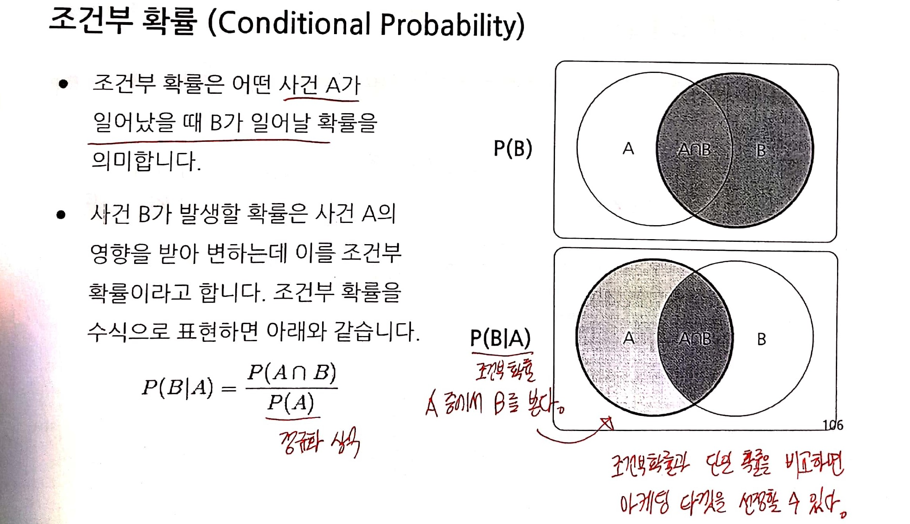

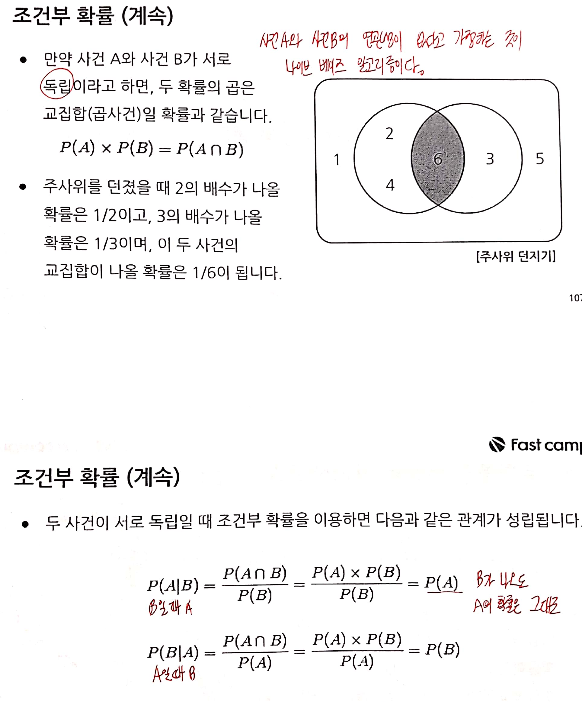

베이즈 정리
===========

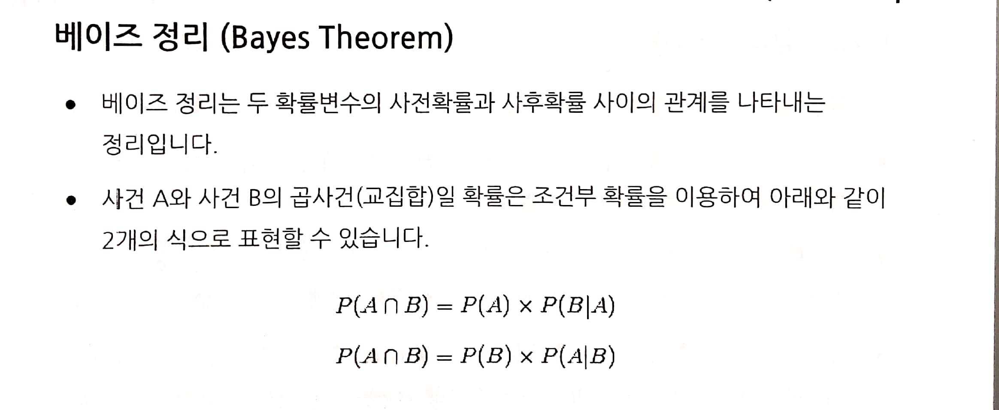

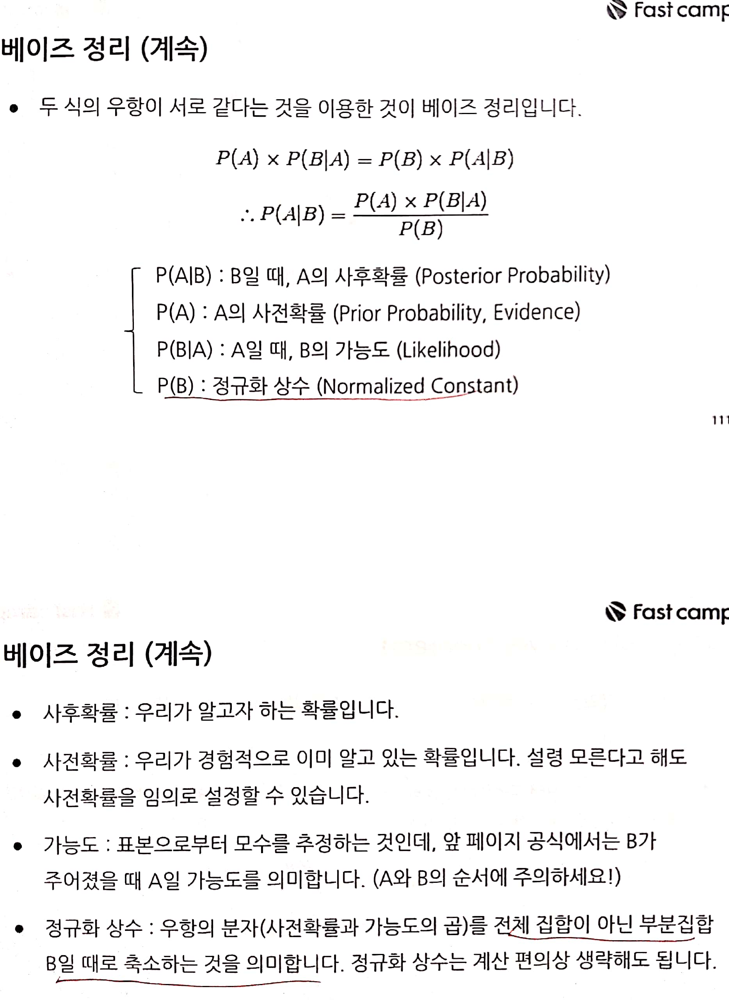

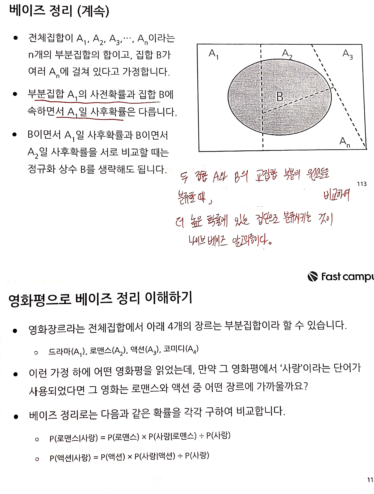

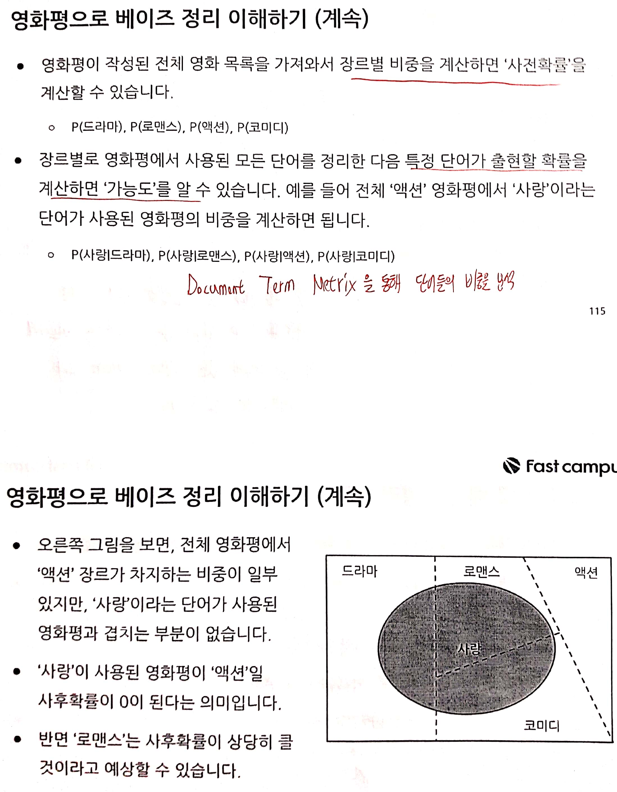

나이브 베이즈 알고리즘
======================

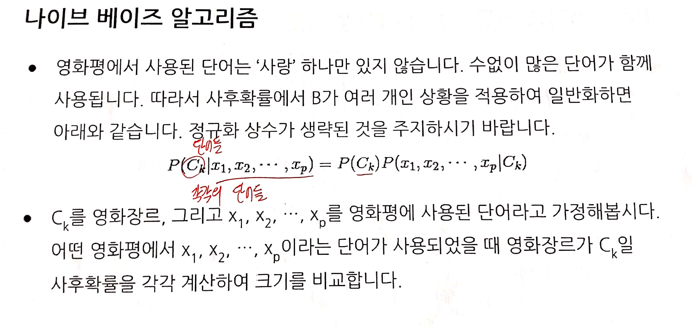

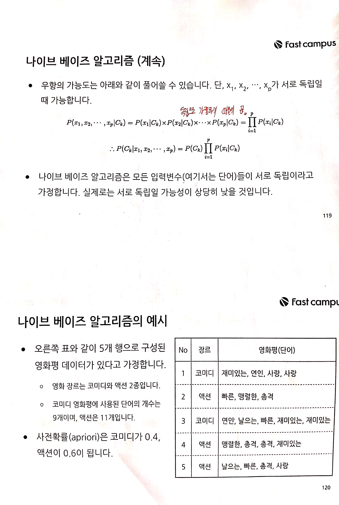

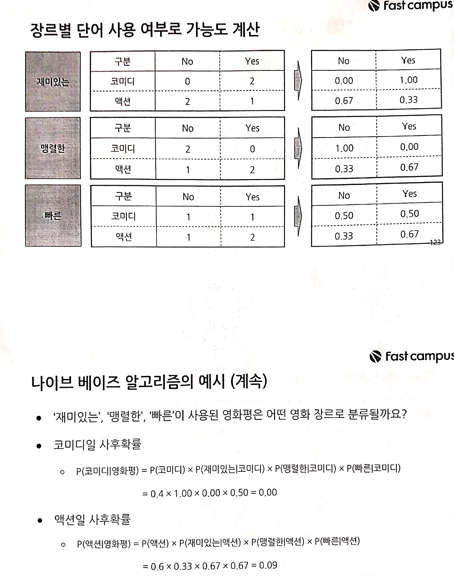

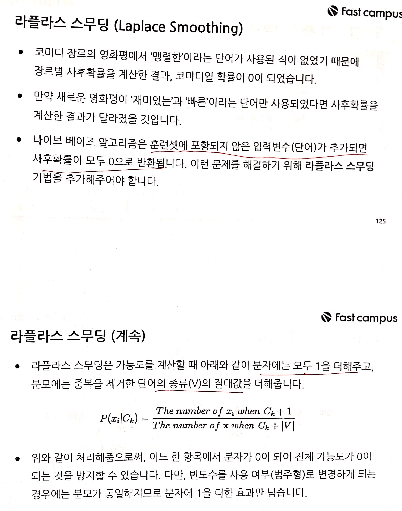

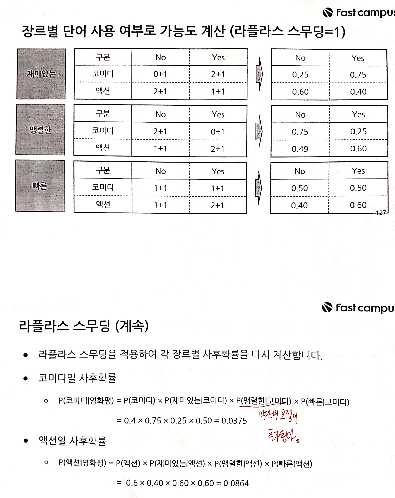

**e1071 패키지의 naiveBayes() 함수**를 사용하면 나이브 베이즈 알고리즘을 활용한 분류 모형을 적합할 수 있다.

| naiveBayes의 인자 |                            설명                            |
|:-----------------:|:----------------------------------------------------------:|
|         x         | 입력변수를 할당한다. (숫자형 행렬, 범주형 데이터프레임 등) |
|         y         |                 목표변수를 할당한다. (벡터)                |
|      formula      |     목표변수 ~ 입력변수 형태로 관계식을 할당할 수 있다.    |
|        data       |                     훈련셋을 할당한다.                     |
|      laplace      |     라플라스 스무딩을 적용할 숫자를 할당한다. 기본값 0     |

``` r
# 투표 데이터로 실습하기
data("HouseVotes84", package = "mlbench")

# 데이터 구조
str(HouseVotes84)
```

    ## 'data.frame':    435 obs. of  17 variables:
    ##  $ Class: Factor w/ 2 levels "democrat","republican": 2 2 1 1 1 1 1 2 2 1 ...
    ##  $ V1   : Factor w/ 2 levels "n","y": 1 1 NA 1 2 1 1 1 1 2 ...
    ##  $ V2   : Factor w/ 2 levels "n","y": 2 2 2 2 2 2 2 2 2 2 ...
    ##  $ V3   : Factor w/ 2 levels "n","y": 1 1 2 2 2 2 1 1 1 2 ...
    ##  $ V4   : Factor w/ 2 levels "n","y": 2 2 NA 1 1 1 2 2 2 1 ...
    ##  $ V5   : Factor w/ 2 levels "n","y": 2 2 2 NA 2 2 2 2 2 1 ...
    ##  $ V6   : Factor w/ 2 levels "n","y": 2 2 2 2 2 2 2 2 2 1 ...
    ##  $ V7   : Factor w/ 2 levels "n","y": 1 1 1 1 1 1 1 1 1 2 ...
    ##  $ V8   : Factor w/ 2 levels "n","y": 1 1 1 1 1 1 1 1 1 2 ...
    ##  $ V9   : Factor w/ 2 levels "n","y": 1 1 1 1 1 1 1 1 1 2 ...
    ##  $ V10  : Factor w/ 2 levels "n","y": 2 1 1 1 1 1 1 1 1 1 ...
    ##  $ V11  : Factor w/ 2 levels "n","y": NA 1 2 2 2 1 1 1 1 1 ...
    ##  $ V12  : Factor w/ 2 levels "n","y": 2 2 1 1 NA 1 1 1 2 1 ...
    ##  $ V13  : Factor w/ 2 levels "n","y": 2 2 2 2 2 2 NA 2 2 1 ...
    ##  $ V14  : Factor w/ 2 levels "n","y": 2 2 2 1 2 2 2 2 2 1 ...
    ##  $ V15  : Factor w/ 2 levels "n","y": 1 1 1 1 2 2 2 NA 1 NA ...
    ##  $ V16  : Factor w/ 2 levels "n","y": 2 NA 1 2 2 2 2 2 2 NA ...

``` r
# 팩터 순서 바꾸기
levels(HouseVotes84$Class)
```

    ## [1] "democrat"   "republican"

``` r
HouseVotes84$Class <- relevel(HouseVotes84$Class, ref = "republican")

# 훈련셋, 시험셋 나누기
set.seed(123)
index <- sample(x = 1:2,
                size = nrow(HouseVotes84),
                prob = c(0.7,0.3),
                replace = TRUE)

train.set <- HouseVotes84[index == 1, ]
test.set <- HouseVotes84[index == 2, ]


# 1. 라플라스 스무딩이 없는 분류모형 적합하기
fit.NB0 <- naiveBayes(formula = Class ~.,
                      data = train.set,
                      laplace = 0)

# 모형의 구조
str(fit.NB0)
```

    ## List of 5
    ##  $ apriori  : 'table' int [1:2(1d)] 118 193
    ##   ..- attr(*, "dimnames")=List of 1
    ##   .. ..$ Y: chr [1:2] "republican" "democrat"
    ##  $ tables   :List of 16
    ##   ..$ V1 : 'table' num [1:2, 1:2] 0.822 0.396 0.178 0.604
    ##   .. ..- attr(*, "dimnames")=List of 2
    ##   .. .. ..$ Y : chr [1:2] "republican" "democrat"
    ##   .. .. ..$ V1: chr [1:2] "n" "y"
    ##   ..$ V2 : 'table' num [1:2, 1:2] 0.495 0.497 0.505 0.503
    ##   .. ..- attr(*, "dimnames")=List of 2
    ##   .. .. ..$ Y : chr [1:2] "republican" "democrat"
    ##   .. .. ..$ V2: chr [1:2] "n" "y"
    ##   ..$ V3 : 'table' num [1:2, 1:2] 0.888 0.102 0.112 0.898
    ##   .. ..- attr(*, "dimnames")=List of 2
    ##   .. .. ..$ Y : chr [1:2] "republican" "democrat"
    ##   .. .. ..$ V3: chr [1:2] "n" "y"
    ##   ..$ V4 : 'table' num [1:2, 1:2] 0.0171 0.9459 0.9829 0.0541
    ##   .. ..- attr(*, "dimnames")=List of 2
    ##   .. .. ..$ Y : chr [1:2] "republican" "democrat"
    ##   .. .. ..$ V4: chr [1:2] "n" "y"
    ##   ..$ V5 : 'table' num [1:2, 1:2] 0.0427 0.788 0.9573 0.212
    ##   .. ..- attr(*, "dimnames")=List of 2
    ##   .. .. ..$ Y : chr [1:2] "republican" "democrat"
    ##   .. .. ..$ V5: chr [1:2] "n" "y"
    ##   ..$ V6 : 'table' num [1:2, 1:2] 0.103 0.524 0.897 0.476
    ##   .. ..- attr(*, "dimnames")=List of 2
    ##   .. .. ..$ Y : chr [1:2] "republican" "democrat"
    ##   .. .. ..$ V6: chr [1:2] "n" "y"
    ##   ..$ V7 : 'table' num [1:2, 1:2] 0.767 0.214 0.233 0.786
    ##   .. ..- attr(*, "dimnames")=List of 2
    ##   .. .. ..$ Y : chr [1:2] "republican" "democrat"
    ##   .. .. ..$ V7: chr [1:2] "n" "y"
    ##   ..$ V8 : 'table' num [1:2, 1:2] 0.848 0.158 0.152 0.842
    ##   .. ..- attr(*, "dimnames")=List of 2
    ##   .. .. ..$ Y : chr [1:2] "republican" "democrat"
    ##   .. .. ..$ V8: chr [1:2] "n" "y"
    ##   ..$ V9 : 'table' num [1:2, 1:2] 0.897 0.254 0.103 0.746
    ##   .. ..- attr(*, "dimnames")=List of 2
    ##   .. .. ..$ Y : chr [1:2] "republican" "democrat"
    ##   .. .. ..$ V9: chr [1:2] "n" "y"
    ##   ..$ V10: 'table' num [1:2, 1:2] 0.444 0.521 0.556 0.479
    ##   .. ..- attr(*, "dimnames")=List of 2
    ##   .. .. ..$ Y  : chr [1:2] "republican" "democrat"
    ##   .. .. ..$ V10: chr [1:2] "n" "y"
    ##   ..$ V11: 'table' num [1:2, 1:2] 0.85 0.497 0.15 0.503
    ##   .. ..- attr(*, "dimnames")=List of 2
    ##   .. .. ..$ Y  : chr [1:2] "republican" "democrat"
    ##   .. .. ..$ V11: chr [1:2] "n" "y"
    ##   ..$ V12: 'table' num [1:2, 1:2] 0.128 0.866 0.872 0.134
    ##   .. ..- attr(*, "dimnames")=List of 2
    ##   .. .. ..$ Y  : chr [1:2] "republican" "democrat"
    ##   .. .. ..$ V12: chr [1:2] "n" "y"
    ##   ..$ V13: 'table' num [1:2, 1:2] 0.149 0.718 0.851 0.282
    ##   .. ..- attr(*, "dimnames")=List of 2
    ##   .. .. ..$ Y  : chr [1:2] "republican" "democrat"
    ##   .. .. ..$ V13: chr [1:2] "n" "y"
    ##   ..$ V14: 'table' num [1:2, 1:2] 0.0087 0.6757 0.9913 0.3243
    ##   .. ..- attr(*, "dimnames")=List of 2
    ##   .. .. ..$ Y  : chr [1:2] "republican" "democrat"
    ##   .. .. ..$ V14: chr [1:2] "n" "y"
    ##   ..$ V15: 'table' num [1:2, 1:2] 0.9455 0.3536 0.0545 0.6464
    ##   .. ..- attr(*, "dimnames")=List of 2
    ##   .. .. ..$ Y  : chr [1:2] "republican" "democrat"
    ##   .. .. ..$ V15: chr [1:2] "n" "y"
    ##   ..$ V16: 'table' num [1:2, 1:2] 0.3558 0.0379 0.6442 0.9621
    ##   .. ..- attr(*, "dimnames")=List of 2
    ##   .. .. ..$ Y  : chr [1:2] "republican" "democrat"
    ##   .. .. ..$ V16: chr [1:2] "n" "y"
    ##  $ levels   : chr [1:2] "republican" "democrat"
    ##  $ isnumeric: Named logi [1:16] FALSE FALSE FALSE FALSE FALSE FALSE ...
    ##   ..- attr(*, "names")= chr [1:16] "V1" "V2" "V3" "V4" ...
    ##  $ call     : language naiveBayes.default(x = X, y = Y, laplace = laplace)
    ##  - attr(*, "class")= chr "naiveBayes"

``` r
# 사전확률(aporiori)
fit.NB0$apriori
```

    ## Y
    ## republican   democrat 
    ##        118        193

``` r
# V1에 대한 가능도(likelihood)
fit.NB0$tables$V1
```

    ##             V1
    ## Y                    n         y
    ##   republican 0.8220339 0.1779661
    ##   democrat   0.3957219 0.6042781

``` r
# 민주당의 경우 V1 정책에 찬성할 가능도가 60%, 공화당원이라면 찬성할 가능도가 18%라는 것을 의미한다.

# 위의 결과는 아래와 같다.
table(train.set$Class, train.set$V1) %>% prop.table(margin = 1)
```

    ##             
    ##                      n         y
    ##   republican 0.8220339 0.1779661
    ##   democrat   0.3957219 0.6042781

``` r
# 분류모형 평가하기
pred <- predict(object = fit.NB0, newdata = train.set)
real <- train.set$Class

confusionMatrix(pred, real)
```

    ## Confusion Matrix and Statistics
    ## 
    ##             Reference
    ## Prediction   republican democrat
    ##   republican        110       20
    ##   democrat            8      173
    ##                                           
    ##                Accuracy : 0.91            
    ##                  95% CI : (0.8725, 0.9393)
    ##     No Information Rate : 0.6206          
    ##     P-Value [Acc > NIR] : < 2e-16         
    ##                                           
    ##                   Kappa : 0.8125          
    ##                                           
    ##  Mcnemar's Test P-Value : 0.03764         
    ##                                           
    ##             Sensitivity : 0.9322          
    ##             Specificity : 0.8964          
    ##          Pos Pred Value : 0.8462          
    ##          Neg Pred Value : 0.9558          
    ##              Prevalence : 0.3794          
    ##          Detection Rate : 0.3537          
    ##    Detection Prevalence : 0.4180          
    ##       Balanced Accuracy : 0.9143          
    ##                                           
    ##        'Positive' Class : republican      
    ## 

``` r
F1_Score(real, pred)
```

    ## [1] 0.8870968

``` r
real <- as.numeric(real)
pred <- as.numeric(pred)
pROC::auc(real, pred)
```

    ## Area under the curve: 0.9143

``` r
# 2. 표본 샘플링 후, 라플라스 스무딩 적용해서 모형 적합하기
train.set.bal <- ovun.sample(formula = Class ~.,
                             data = train.set,
                             method = "both",
                             p = 0.5,
                             seed = 123) %>% `[[`("data")

fit.NB1 <- naiveBayes(formula = Class ~.,
                      data = train.set.bal,
                      laplace = 1)

str(fit.NB1)
```

    ## List of 5
    ##  $ apriori  : 'table' int [1:2(1d)] 89 76
    ##   ..- attr(*, "dimnames")=List of 1
    ##   .. ..$ Y: chr [1:2] "democrat" "republican"
    ##  $ tables   :List of 16
    ##   ..$ V1 : 'table' num [1:2, 1:2] 0.374 0.731 0.626 0.269
    ##   .. ..- attr(*, "dimnames")=List of 2
    ##   .. .. ..$ Y : chr [1:2] "democrat" "republican"
    ##   .. .. ..$ V1: chr [1:2] "n" "y"
    ##   ..$ V2 : 'table' num [1:2, 1:2] 0.56 0.487 0.44 0.513
    ##   .. ..- attr(*, "dimnames")=List of 2
    ##   .. .. ..$ Y : chr [1:2] "democrat" "republican"
    ##   .. .. ..$ V2: chr [1:2] "n" "y"
    ##   ..$ V3 : 'table' num [1:2, 1:2] 0.0989 0.8974 0.9011 0.1026
    ##   .. ..- attr(*, "dimnames")=List of 2
    ##   .. .. ..$ Y : chr [1:2] "democrat" "republican"
    ##   .. .. ..$ V3: chr [1:2] "n" "y"
    ##   ..$ V4 : 'table' num [1:2, 1:2] 0.9341 0.0128 0.0659 0.9872
    ##   .. ..- attr(*, "dimnames")=List of 2
    ##   .. .. ..$ Y : chr [1:2] "democrat" "republican"
    ##   .. .. ..$ V4: chr [1:2] "n" "y"
    ##   ..$ V5 : 'table' num [1:2, 1:2] 0.7692 0.0385 0.2308 0.9615
    ##   .. ..- attr(*, "dimnames")=List of 2
    ##   .. .. ..$ Y : chr [1:2] "democrat" "republican"
    ##   .. .. ..$ V5: chr [1:2] "n" "y"
    ##   ..$ V6 : 'table' num [1:2, 1:2] 0.582 0.141 0.418 0.859
    ##   .. ..- attr(*, "dimnames")=List of 2
    ##   .. .. ..$ Y : chr [1:2] "democrat" "republican"
    ##   .. .. ..$ V6: chr [1:2] "n" "y"
    ##   ..$ V7 : 'table' num [1:2, 1:2] 0.242 0.769 0.758 0.231
    ##   .. ..- attr(*, "dimnames")=List of 2
    ##   .. .. ..$ Y : chr [1:2] "democrat" "republican"
    ##   .. .. ..$ V7: chr [1:2] "n" "y"
    ##   ..$ V8 : 'table' num [1:2, 1:2] 0.209 0.821 0.791 0.179
    ##   .. ..- attr(*, "dimnames")=List of 2
    ##   .. .. ..$ Y : chr [1:2] "democrat" "republican"
    ##   .. .. ..$ V8: chr [1:2] "n" "y"
    ##   ..$ V9 : 'table' num [1:2, 1:2] 0.275 0.846 0.725 0.154
    ##   .. ..- attr(*, "dimnames")=List of 2
    ##   .. .. ..$ Y : chr [1:2] "democrat" "republican"
    ##   .. .. ..$ V9: chr [1:2] "n" "y"
    ##   ..$ V10: 'table' num [1:2, 1:2] 0.44 0.474 0.56 0.526
    ##   .. ..- attr(*, "dimnames")=List of 2
    ##   .. .. ..$ Y  : chr [1:2] "democrat" "republican"
    ##   .. .. ..$ V10: chr [1:2] "n" "y"
    ##   ..$ V11: 'table' num [1:2, 1:2] 0.495 0.833 0.505 0.167
    ##   .. ..- attr(*, "dimnames")=List of 2
    ##   .. .. ..$ Y  : chr [1:2] "democrat" "republican"
    ##   .. .. ..$ V11: chr [1:2] "n" "y"
    ##   ..$ V12: 'table' num [1:2, 1:2] 0.9121 0.141 0.0879 0.859
    ##   .. ..- attr(*, "dimnames")=List of 2
    ##   .. .. ..$ Y  : chr [1:2] "democrat" "republican"
    ##   .. .. ..$ V12: chr [1:2] "n" "y"
    ##   ..$ V13: 'table' num [1:2, 1:2] 0.714 0.167 0.286 0.833
    ##   .. ..- attr(*, "dimnames")=List of 2
    ##   .. .. ..$ Y  : chr [1:2] "democrat" "republican"
    ##   .. .. ..$ V13: chr [1:2] "n" "y"
    ##   ..$ V14: 'table' num [1:2, 1:2] 0.7363 0.0128 0.2637 0.9872
    ##   .. ..- attr(*, "dimnames")=List of 2
    ##   .. .. ..$ Y  : chr [1:2] "democrat" "republican"
    ##   .. .. ..$ V14: chr [1:2] "n" "y"
    ##   ..$ V15: 'table' num [1:2, 1:2] 0.3626 0.9231 0.6374 0.0769
    ##   .. ..- attr(*, "dimnames")=List of 2
    ##   .. .. ..$ Y  : chr [1:2] "democrat" "republican"
    ##   .. .. ..$ V15: chr [1:2] "n" "y"
    ##   ..$ V16: 'table' num [1:2, 1:2] 0.044 0.41 0.956 0.59
    ##   .. ..- attr(*, "dimnames")=List of 2
    ##   .. .. ..$ Y  : chr [1:2] "democrat" "republican"
    ##   .. .. ..$ V16: chr [1:2] "n" "y"
    ##  $ levels   : chr [1:2] "democrat" "republican"
    ##  $ isnumeric: Named logi [1:16] FALSE FALSE FALSE FALSE FALSE FALSE ...
    ##   ..- attr(*, "names")= chr [1:16] "V1" "V2" "V3" "V4" ...
    ##  $ call     : language naiveBayes.default(x = X, y = Y, laplace = laplace)
    ##  - attr(*, "class")= chr "naiveBayes"

``` r
pred <- predict(object = fit.NB1, newdata = train.set.bal)
real <- train.set.bal$Class

# 성능 평가하기
confusionMatrix(pred, real)
```

    ## Confusion Matrix and Statistics
    ## 
    ##             Reference
    ## Prediction   democrat republican
    ##   democrat         79          4
    ##   republican       10         72
    ##                                           
    ##                Accuracy : 0.9152          
    ##                  95% CI : (0.8617, 0.9528)
    ##     No Information Rate : 0.5394          
    ##     P-Value [Acc > NIR] : <2e-16          
    ##                                           
    ##                   Kappa : 0.8302          
    ##                                           
    ##  Mcnemar's Test P-Value : 0.1814          
    ##                                           
    ##             Sensitivity : 0.8876          
    ##             Specificity : 0.9474          
    ##          Pos Pred Value : 0.9518          
    ##          Neg Pred Value : 0.8780          
    ##              Prevalence : 0.5394          
    ##          Detection Rate : 0.4788          
    ##    Detection Prevalence : 0.5030          
    ##       Balanced Accuracy : 0.9175          
    ##                                           
    ##        'Positive' Class : democrat        
    ## 

``` r
F1_Score(real, pred)
```

    ## [1] 0.9186047

``` r
real <- as.numeric(real)
pred <- as.numeric(pred)
pROC::auc(real, pred)
```

    ## Area under the curve: 0.9175
