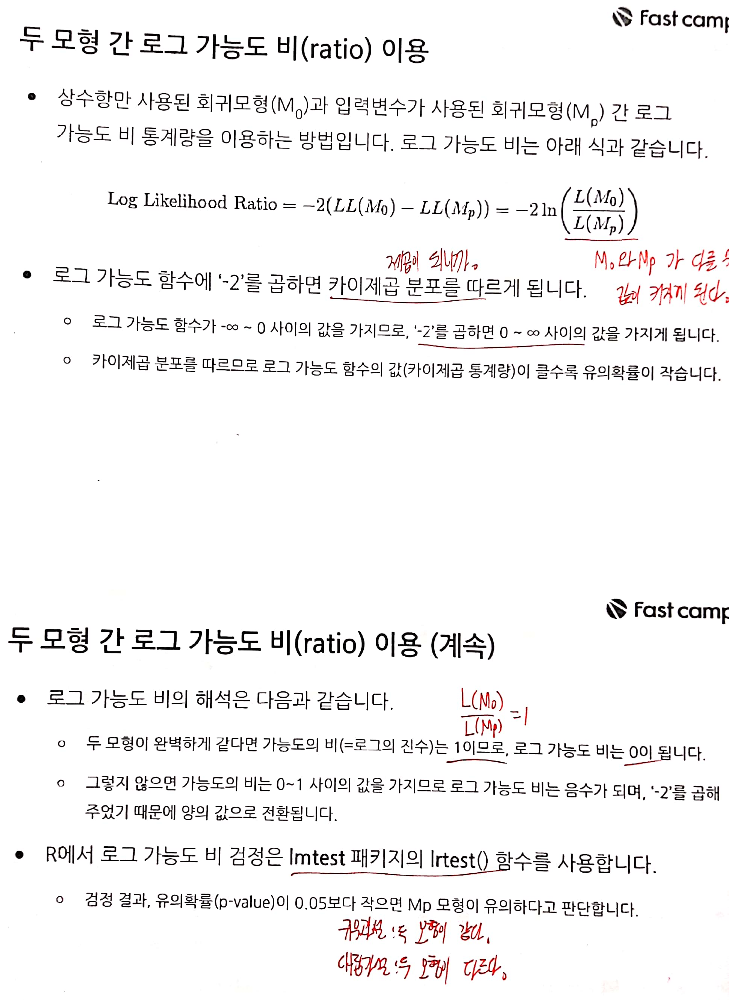
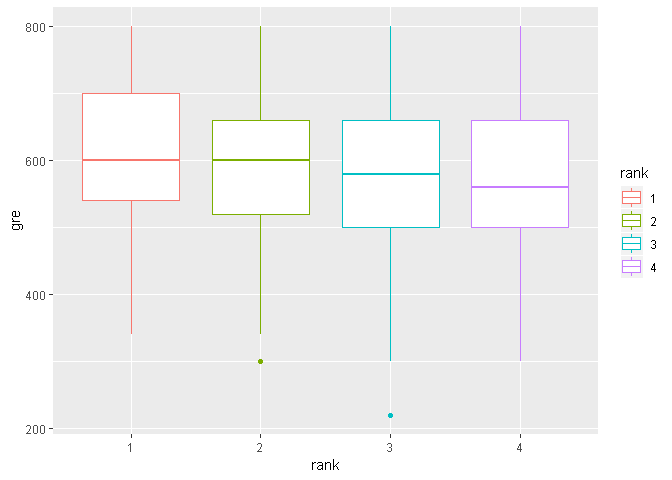
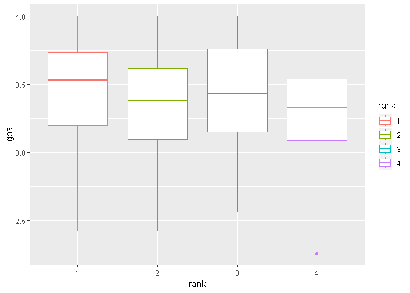

fastcampus\_머신러닝\_4
================
huimin
2019년 5월 30일

# 기초설정

``` r
library(tidyverse)
```

    ## Registered S3 methods overwritten by 'ggplot2':
    ##   method         from 
    ##   [.quosures     rlang
    ##   c.quosures     rlang
    ##   print.quosures rlang

    ## Registered S3 method overwritten by 'rvest':
    ##   method            from
    ##   read_xml.response xml2

    ## -- Attaching packages --------------------------------- tidyverse 1.2.1 --

    ## √ ggplot2 3.1.1       √ purrr   0.3.2  
    ## √ tibble  2.1.1       √ dplyr   0.8.0.1
    ## √ tidyr   0.8.3       √ stringr 1.4.0  
    ## √ readr   1.3.1       √ forcats 0.4.0

    ## -- Conflicts ------------------------------------ tidyverse_conflicts() --
    ## x dplyr::filter() masks stats::filter()
    ## x dplyr::lag()    masks stats::lag()

``` r
library(readr)
library(caret)
```

    ## Loading required package: lattice

    ## 
    ## Attaching package: 'caret'

    ## The following object is masked from 'package:purrr':
    ## 
    ##     lift

``` r
library(e1071)
library(MLmetrics)
```

    ## 
    ## Attaching package: 'MLmetrics'

    ## The following objects are masked from 'package:caret':
    ## 
    ##     MAE, RMSE

    ## The following object is masked from 'package:base':
    ## 
    ##     Recall

``` r
library(pROC)
```

    ## Type 'citation("pROC")' for a citation.

    ## 
    ## Attaching package: 'pROC'

    ## The following objects are masked from 'package:stats':
    ## 
    ##     cov, smooth, var

# 로지스틱 회귀분석 알고리즘 개요

  - 로지스틱 회귀분석은 목표변수가 연속형 자료인 선형 회귀분석과 달리 **목표변수가 범주형 자료일 때 사용하는
    알고리즘**이다.
  - 모형이 적합되면 각 입력변수들이 목표변수에 영향을 미치는 정도를 알 수 있다. 즉, **해석하기 쉬운 모형이므로
    의사결정나무 알고리즘과 함께 분류모형 적합에 가장 많이 사용된다.**
  - 0\~1의 값을 갖는 추정확률을 반환한다. 분석가가 **기준점(cut-off)를 정해 목표변수를 여러 레벨로 구분할 수
    있다.**


# 가능도 함수


# 로지스틱 회귀모형의 유의성 검정





# 로지스틱 회귀계수의 유의성 검정

로지스틱 회귀모형이 유의하다고 판단되면 다음 단계로 회귀계수별 유의성 검정을 실시한다.

  - 로그 가능도 비를 이용한 방법
  - z-검정 또는 Wald 검정

로그 가능도 비 검정으로 회귀계수의 유의성을 검정하는 방법은 간단하다. **만약 Mp 모형에 사용된 변수가 1개라면** 로그
가능도 비 검정으로 회귀모형의 유의성 검정은 물론 유일한 회귀계수의 검정도 가능하다.


# 이항 로지스틱 회귀분석 모형


## 이항 로지스틱 회귀분석 실습

### 1\. 로지스틱 회귀모형 적합하기

``` r
load(file = "practice_data/univ.RData")

# 구조 확인하기
str(univ)
```

    ## 'data.frame':    400 obs. of  4 variables:
    ##  $ admit: int  0 1 1 1 0 1 1 0 1 0 ...
    ##  $ gre  : int  380 660 800 640 520 760 560 400 540 700 ...
    ##  $ gpa  : num  3.61 3.67 4 3.19 2.93 3 2.98 3.08 3.39 3.92 ...
    ##  $ rank : int  3 3 1 4 4 2 1 2 3 2 ...

``` r
# 10줄만 출력해보기
head(univ, n = 10)
```

    ##    admit gre  gpa rank
    ## 1      0 380 3.61    3
    ## 2      1 660 3.67    3
    ## 3      1 800 4.00    1
    ## 4      1 640 3.19    4
    ## 5      0 520 2.93    4
    ## 6      1 760 3.00    2
    ## 7      1 560 2.98    1
    ## 8      0 400 3.08    2
    ## 9      1 540 3.39    3
    ## 10     0 700 3.92    2

``` r
# admit과 rank 펙터로 변환하기
univ$admit <- as.factor(univ$admit)
univ$rank <- as.factor(univ$rank)

# 구조 다시 확인하기
str(univ)
```

    ## 'data.frame':    400 obs. of  4 variables:
    ##  $ admit: Factor w/ 2 levels "0","1": 1 2 2 2 1 2 2 1 2 1 ...
    ##  $ gre  : int  380 660 800 640 520 760 560 400 540 700 ...
    ##  $ gpa  : num  3.61 3.67 4 3.19 2.93 3 2.98 3.08 3.39 3.92 ...
    ##  $ rank : Factor w/ 4 levels "1","2","3","4": 3 3 1 4 4 2 1 2 3 2 ...

``` r
ggplot(data = univ) +
  geom_boxplot(mapping = aes(x = rank,
                             y = gre,
                             color = rank))
```

<!-- -->

``` r
ggplot(data = univ) +
  geom_boxplot(mapping = aes(x = rank,
                             y = gpa,
                             color = rank))
```

<!-- -->

``` r
# 요약 데이터 확인하기(이것도 잘 활용하자!)
summary(univ)
```

    ##  admit        gre             gpa        rank   
    ##  0:273   Min.   :220.0   Min.   :2.260   1: 61  
    ##  1:127   1st Qu.:520.0   1st Qu.:3.130   2:151  
    ##          Median :580.0   Median :3.395   3:121  
    ##          Mean   :587.7   Mean   :3.390   4: 67  
    ##          3rd Qu.:660.0   3rd Qu.:3.670          
    ##          Max.   :800.0   Max.   :4.000

``` r
# 비율확인하기
univ$admit %>% table() %>% prop.table()
```

    ## .
    ##      0      1 
    ## 0.6825 0.3175

``` r
univ$rank %>% table() %>% prop.table()
```

    ## .
    ##      1      2      3      4 
    ## 0.1525 0.3775 0.3025 0.1675

``` r
# 합격자의 비중이 더 낮은 불균형 데이터이므로,
# ROSE 패키지의 ovun.sample() 함수로 표본 샘플링 후 모형을 적합하거나
# 매튜의 상관계수(MCC)를 사용하여 목표변수를 분류하면 된다.

set.seed(123)

index <- sample(x = 1:2,
                size = nrow(univ),
                prob = c(0.7,0.3),
                replace = TRUE)

trainset <- univ[index == 1, ]
testset <- univ[index == 2, ]

# 비율 확인하기
trainset$admit %>% table() %>% prop.table()
```

    ## .
    ##         0         1 
    ## 0.6596491 0.3403509

``` r
testset$admit %>% table() %>% prop.table()
```

    ## .
    ##         0         1 
    ## 0.7391304 0.2608696

``` r
# 이항 로지스틱 회귀모형 적합하기
fit.lr1 <- glm(formula = admit ~.,
               data = trainset,
               family = binomial(link = 'logit'))

summary(fit.lr1)
```

    ## 
    ## Call:
    ## glm(formula = admit ~ ., family = binomial(link = "logit"), data = trainset)
    ## 
    ## Deviance Residuals: 
    ##     Min       1Q   Median       3Q      Max  
    ## -1.7922  -0.8671  -0.6244   1.0927   2.0928  
    ## 
    ## Coefficients:
    ##              Estimate Std. Error z value Pr(>|z|)    
    ## (Intercept) -4.757201   1.412049  -3.369 0.000754 ***
    ## gre          0.001906   0.001294   1.473 0.140787    
    ## gpa          1.201242   0.401402   2.993 0.002766 ** 
    ## rank2       -1.103149   0.401043  -2.751 0.005947 ** 
    ## rank3       -1.524519   0.431435  -3.534 0.000410 ***
    ## rank4       -1.641057   0.490539  -3.345 0.000822 ***
    ## ---
    ## Signif. codes:  0 '***' 0.001 '**' 0.01 '*' 0.05 '.' 0.1 ' ' 1
    ## 
    ## (Dispersion parameter for binomial family taken to be 1)
    ## 
    ##     Null deviance: 365.52  on 284  degrees of freedom
    ## Residual deviance: 326.20  on 279  degrees of freedom
    ## AIC: 338.2
    ## 
    ## Number of Fisher Scoring iterations: 4

  - rank라는 이름을 가진 더미변수 3개가 형성되었다.
  - 모든 회귀계수의 p-value가 0.05보다 낮다.
  - Null과 Residual deviance값이 추력된다.
  - AIC값이 출력된다.
  - Fisher Scoring iterations은 모델 적합에 소요된 횟수를 의미하지만 무시해도 된다.

### 2.1 회귀모형 유의성 검정 방법 1 : 카이제곱 통계량

``` r
# 두 편차의 차이
dev.gap <- fit.lr1$null.deviance - fit.lr1$deviance
print(dev.gap)
```

    ## [1] 39.32392

``` r
# 두 모형의 자유도 차이
df.gap <- fit.lr1$df.null - fit.lr1$df.residual
print(df.gap)
```

    ## [1] 5

``` r
# 카이제곱 검정 실행
pchisq(q = dev.gap, df = df.gap, lower.tail = FALSE)
```

    ## [1] 2.04369e-07

유의확률이 0.05보다 작기 때문에 두 모형이 서로 같다고 할 수 없다. 최소한 1개 이상의 회귀계수가 0이 아님을 뜻한다.

### 2.2 회귀모형 유의성 검정 방법 2 : 로그 가능도 비

``` r
# 입력변수가 사용되지 않은 로지스틱 회귀모형을 적합한다.
# 1을 입력하면 상수항만 적용한다는 뜻이 된다.
fit.lr0 <- glm(formula = admit ~ 1,
               data = trainset,
               family = binomial(link = "logit"))

summary(fit.lr0)
```

    ## 
    ## Call:
    ## glm(formula = admit ~ 1, family = binomial(link = "logit"), data = trainset)
    ## 
    ## Deviance Residuals: 
    ##     Min       1Q   Median       3Q      Max  
    ## -0.9122  -0.9122  -0.9122   1.4682   1.4682  
    ## 
    ## Coefficients:
    ##             Estimate Std. Error z value Pr(>|z|)    
    ## (Intercept)  -0.6617     0.1250  -5.293  1.2e-07 ***
    ## ---
    ## Signif. codes:  0 '***' 0.001 '**' 0.01 '*' 0.05 '.' 0.1 ' ' 1
    ## 
    ## (Dispersion parameter for binomial family taken to be 1)
    ## 
    ##     Null deviance: 365.52  on 284  degrees of freedom
    ## Residual deviance: 365.52  on 284  degrees of freedom
    ## AIC: 367.52
    ## 
    ## Number of Fisher Scoring iterations: 4

``` r
# 두 모형의 로그 가능도 비를 계산한다.
llr <-  -2*(logLik(fit.lr0) - logLik(fit.lr1))
print(llr)
```

    ## 'log Lik.' 39.32392 (df=1)

``` r
# 카이제곱 검정을 실행한다.(결과는 동일하다)
pchisq(q = llr, df = df.gap, lower.tail = FALSE)
```

    ## 'log Lik.' 2.04369e-07 (df=1)

``` r
# lmtest 패키지를 사용하여 쉽게 가능도 비 검정하기
library(lmtest)
```

    ## Warning: package 'lmtest' was built under R version 3.6.1

    ## Loading required package: zoo

    ## Warning: package 'zoo' was built under R version 3.6.1

    ## 
    ## Attaching package: 'zoo'

    ## The following objects are masked from 'package:base':
    ## 
    ##     as.Date, as.Date.numeric

``` r
lrtest(fit.lr0, fit.lr1)
```

    ## Likelihood ratio test
    ## 
    ## Model 1: admit ~ 1
    ## Model 2: admit ~ gre + gpa + rank
    ##   #Df  LogLik Df  Chisq Pr(>Chisq)    
    ## 1   1 -182.76                         
    ## 2   6 -163.10  5 39.324  2.044e-07 ***
    ## ---
    ## Signif. codes:  0 '***' 0.001 '**' 0.01 '*' 0.05 '.' 0.1 ' ' 1

``` r
# lmtest 패키지의 waldtest() 함수는 상수항 모형을 적합할 필요가 없다.
# test인자는 생략가능하며, object2 인자에서 제외할 입력변수를 지정한다.
waldtest(object = fit.lr1, test = c("F","Chisq"))
```

    ## Wald test
    ## 
    ## Model 1: admit ~ gre + gpa + rank
    ## Model 2: admit ~ 1
    ##   Res.Df Df      F    Pr(>F)    
    ## 1    279                        
    ## 2    284 -5 6.5309 9.179e-06 ***
    ## ---
    ## Signif. codes:  0 '***' 0.001 '**' 0.01 '*' 0.05 '.' 0.1 ' ' 1

``` r
waldtest(object = fit.lr1, object2 = c("gre","gpa"))
```

    ## Wald test
    ## 
    ## Model 1: admit ~ gre + gpa + rank
    ## Model 2: admit ~ rank
    ##   Res.Df Df      F    Pr(>F)    
    ## 1    279                        
    ## 2    281 -2 7.7614 0.0005244 ***
    ## ---
    ## Signif. codes:  0 '***' 0.001 '**' 0.01 '*' 0.05 '.' 0.1 ' ' 1

유의확률이 0.05보다 작으면 입력변수를 제외한 모형과 차이가 있다고 판단한다.

### 3\. 회귀계수의 유의성 검정해보기

이미 summary()함수를 통하여 확인할 수 있지만, 3가지 방법으로 직접 유의성을 검정해보자.

``` r
# 1. z-검정

# summary의 결과표 객체에 저장하기
coef.tbl <- fit.lr1 %>% summary() %>% `$`(coefficients) %>% as.data.frame()
colnames(coef.tbl) <- c("coef","se","z","pvalue")

coef.tbl
```

    ##                     coef          se         z       pvalue
    ## (Intercept) -4.757201188 1.412048658 -3.369007 0.0007543963
    ## gre          0.001906021 0.001294088  1.472868 0.1407865490
    ## gpa          1.201241565 0.401402235  2.992613 0.0027660021
    ## rank2       -1.103149221 0.401043309 -2.750698 0.0059468353
    ## rank3       -1.524519089 0.431435339 -3.533598 0.0004099439
    ## rank4       -1.641057430 0.490538901 -3.345418 0.0008215879

``` r
# z-stats는 회귀계수를 표준오차로 나눈 값이다.
coef.tbl$coef / coef.tbl$se
```

    ## [1] -3.369007  1.472868  2.992613 -2.750698 -3.533598 -3.345418

``` r
# z-stats의 누적확률 확인하기
pnorm(q = abs(coef.tbl$z), mean = 0, sd = 1, lower.tail = TRUE)
```

    ## [1] 0.9996228 0.9296067 0.9986170 0.9970266 0.9997950 0.9995892

``` r
# 양측검정이므로, 1에서 누적확률을 빼고, 2를 곱하면 p-value이다.
(1- pnorm(q = abs(coef.tbl$z), mean = 0, sd = 1, lower.tail = TRUE))*2
```

    ## [1] 0.0007543963 0.1407865490 0.0027660021 0.0059468353 0.0004099439
    ## [6] 0.0008215879

``` r
# 2. Wald 검정
# 회귀계수와 표준오차를 각각 제곱한 다음 Wald 통계량을 계산한다.
wald.1 <- (coef.tbl$coef)^2 / (coef.tbl$se)^2
wald.1
```

    ## [1] 11.350205  2.169341  8.955733  7.566342 12.486315 11.191818

``` r
# wald 통계량은 카이제곱 분포를 따르므로 카이제곱 검정을 실행한다.
# 이 때 자유도는 1이다.
# 참고로 lower.tail을 TRUE로 하면 1-pvalue 값이 나온다.
# pvalue를 구하는 것이 목적이므로, FALSE로 둔다.
pchisq(q = wald.1, df = 1, lower.tail = FALSE)
```

    ## [1] 0.0007543963 0.1407865490 0.0027660021 0.0059468353 0.0004099439
    ## [6] 0.0008215879

``` r
# 3. 회귀계수의 신뢰구간
# 회귀계수의 신뢰구간을 출력하여 양 끝점의 부호가 서로 같으면 해당 회귀계수는 0이 아니라고 할 수 있다.
confint(fit.lr1)
```

    ## Waiting for profiling to be done...

    ##                  2.5 %       97.5 %
    ## (Intercept) -7.5984590 -2.046110090
    ## gre         -0.0006133  0.004475438
    ## gpa          0.4286385  2.006916081
    ## rank2       -1.9094669 -0.329234203
    ## rank3       -2.3926382 -0.693955284
    ## rank4       -2.6361129 -0.703354655

### 4\. 회귀모형의 결과 해석

``` r
# 각 입력변수의 오즈비 출력
fit.lr1 %>% coef() %>% exp()
```

    ## (Intercept)         gre         gpa       rank2       rank3       rank4 
    ## 0.008589617 1.001907839 3.324241624 0.331824448 0.217725738 0.193775030

``` r
# 더미변수 간 유의성 검정을 통해 차이가 있는지 확인하기
library(aod)
```

    ## Warning: package 'aod' was built under R version 3.6.1

``` r
# sigma 인자 : 회귀계수의 분산-공분산 행렬을 할당한다.
# b 인자 : 회귀계수 벡터를 할당한다.
# Terms 인자 : 유의성 검정 대상인 회귀계수의 위치를 지정한다.
aod::wald.test(Sigma = vcov(fit.lr1),
               b = fit.lr1$coefficients,
               Terms = 4:6) %>% 
  `$`(result)
```

    ## $chi2
    ##         chi2           df            P 
    ## 15.245810183  3.000000000  0.001618192

``` r
# Terms인자 대신 L 인자를 사용하면 더미변수의 회귀계수 간 차이를 확인할 수 있다.
# 비교하려는 회귀계수의 위치에 1과 -1을 지정하면 된다.
aod::wald.test(Sigma = vcov(fit.lr1),
               b = fit.lr1$coefficients,
               L = cbind(0,0,0,1,-1,0)) %>% 
  `$`(result)
```

    ## $chi2
    ##      chi2        df         P 
    ## 1.5814944 1.0000000 0.2085456

y절편은 의미가 없으므로 제외하고 나머지 다섯 개의 회귀계수를 확인한다.

**gre의 오즈비는 1이다.** 이는 곧, 다른 모든 조건이 같을 때 gre가 1단위 증가할 때마다 불합격할 확률 (1-p)
대비 합격할 확률(p)의 비율이 1배라는 뜻이다.결국 이는, **대학교 합격과 무관한 점수라고 볼 수 있다.**

반면에 gpa는 다섯 개의 회귀계수 중 대학교 합격에 가장 영향력 높은 입력변수이다.

더미변수 간 유의성 검정 결과가 유의확률이 0.05보다 작으면 더미변수 간 유의한 차이가 있다고 판단할 수 있다.

### 5\. 회귀모형 성능 평가

``` r
tr.prob <- fit.lr1$fitted.values
tr.pred <- ifelse(tr.prob >= 0.5, 1, 0) %>% as.factor()
tr.real <- trainset$admit

confusionMatrix(tr.pred, tr.real)
```

    ## Confusion Matrix and Statistics
    ## 
    ##           Reference
    ## Prediction   0   1
    ##          0 170  65
    ##          1  18  32
    ##                                           
    ##                Accuracy : 0.7088          
    ##                  95% CI : (0.6523, 0.7609)
    ##     No Information Rate : 0.6596          
    ##     P-Value [Acc > NIR] : 0.04443         
    ##                                           
    ##                   Kappa : 0.2653          
    ##                                           
    ##  Mcnemar's Test P-Value : 4.438e-07       
    ##                                           
    ##             Sensitivity : 0.9043          
    ##             Specificity : 0.3299          
    ##          Pos Pred Value : 0.7234          
    ##          Neg Pred Value : 0.6400          
    ##              Prevalence : 0.6596          
    ##          Detection Rate : 0.5965          
    ##    Detection Prevalence : 0.8246          
    ##       Balanced Accuracy : 0.6171          
    ##                                           
    ##        'Positive' Class : 0               
    ## 

``` r
F1_Score(tr.real, tr.pred)
```

    ## [1] 0.8037825

### 번외 : 메튜계수를 통하여 적합한 기준점 찾기(표본 샘플링을 하지 않았을 경우)

``` r
tr.real %>% table() %>% prop.table()
```

    ## .
    ##         0         1 
    ## 0.6596491 0.3403509

``` r
plot(x = tr.real,
     y = tr.prob)
```

<!-- -->

``` r
# 0.5를 기준점으로 하면, 대부분 불합격으로 분류된다. 따라서 불균형된 데이터셋으로 로지스틱 회귀모형을 적합하였다면 기준점은 0.5보다 아래로 내려야 한다.


# 0부터 1까지 0.01 단위로 총 101번 변경하면서 MCC를 계산한 뒤, MCC가 최대값을 갖는 기준점을 선택한다. 기준점이 여러 개라면, 가장 낮은 것을 택한다.


# MCC를 계산하는 사용자 정의 함수 생성
library(mccr)
```

    ## Warning: package 'mccr' was built under R version 3.6.1

``` r
get.mcc <- function(fit.model) {
  
  real <- fit.model$y %>% as.factor()
  cutoff <- seq(from = 0, to = 1, by = 0.01)
  
  df <- data.frame()
  
  for (i in cutoff) {
    
    pred <- ifelse(test = fit.model$fitted.values >= i, 1, 0) %>% as.factor()
    
    mcc <- mccr(act = real, pred = pred)
    df <- rbind(df, data.frame(cutoff = i, mcc = mcc))
    
  }
  
  return(df)

}

mcc.1 <- get.mcc(fit.lr1)
mcc.1
```

    ##     cutoff        mcc
    ## 1     0.00 0.00000000
    ## 2     0.01 0.00000000
    ## 3     0.02 0.00000000
    ## 4     0.03 0.00000000
    ## 5     0.04 0.00000000
    ## 6     0.05 0.00000000
    ## 7     0.06 0.04262337
    ## 8     0.07 0.04262337
    ## 9     0.08 0.08570058
    ## 10    0.09 0.09598711
    ## 11    0.10 0.10533688
    ## 12    0.11 0.12971006
    ## 13    0.12 0.09473550
    ## 14    0.13 0.11837631
    ## 15    0.14 0.16827861
    ## 16    0.15 0.15103649
    ## 17    0.16 0.18395046
    ## 18    0.17 0.19435950
    ## 19    0.18 0.22429582
    ## 20    0.19 0.21594056
    ## 21    0.20 0.20419225
    ## 22    0.21 0.23782811
    ## 23    0.22 0.27483784
    ## 24    0.23 0.27861279
    ## 25    0.24 0.29003468
    ## 26    0.25 0.26590261
    ## 27    0.26 0.30298898
    ## 28    0.27 0.30311093
    ## 29    0.28 0.31192490
    ## 30    0.29 0.28157563
    ## 31    0.30 0.28595544
    ## 32    0.31 0.28156807
    ## 33    0.32 0.27361067
    ## 34    0.33 0.29462920
    ## 35    0.34 0.28733945
    ## 36    0.35 0.29580736
    ## 37    0.36 0.28036580
    ## 38    0.37 0.27875284
    ## 39    0.38 0.28713671
    ## 40    0.39 0.28014272
    ## 41    0.40 0.28278365
    ## 42    0.41 0.28310061
    ## 43    0.42 0.26021571
    ## 44    0.43 0.26106766
    ## 45    0.44 0.26256271
    ## 46    0.45 0.25230074
    ## 47    0.46 0.26740340
    ## 48    0.47 0.27267683
    ## 49    0.48 0.27843839
    ## 50    0.49 0.28287240
    ## 51    0.50 0.29170519
    ## 52    0.51 0.30072142
    ## 53    0.52 0.28743159
    ## 54    0.53 0.29636981
    ## 55    0.54 0.29575643
    ## 56    0.55 0.31784599
    ## 57    0.56 0.30677315
    ## 58    0.57 0.30677315
    ## 59    0.58 0.30677315
    ## 60    0.59 0.31987207
    ## 61    0.60 0.31987207
    ## 62    0.61 0.30860434
    ## 63    0.62 0.27463110
    ## 64    0.63 0.26216666
    ## 65    0.64 0.26216666
    ## 66    0.65 0.27654694
    ## 67    0.66 0.23751124
    ## 68    0.67 0.22364008
    ## 69    0.68 0.22364008
    ## 70    0.69 0.20925592
    ## 71    0.70 0.17868167
    ## 72    0.71 0.16232369
    ## 73    0.72 0.17937230
    ## 74    0.73 0.16238902
    ## 75    0.74 0.12517326
    ## 76    0.75 0.10449622
    ## 77    0.76 0.10449622
    ## 78    0.77 0.12436119
    ## 79    0.78 0.12963208
    ## 80    0.79 0.12963208
    ## 81    0.80 0.11703475
    ## 82    0.81 0.11703475
    ## 83    0.82 0.08261024
    ## 84    0.83 0.00000000
    ## 85    0.84 0.00000000
    ## 86    0.85 0.00000000
    ## 87    0.86 0.00000000
    ## 88    0.87 0.00000000
    ## 89    0.88 0.00000000
    ## 90    0.89 0.00000000
    ## 91    0.90 0.00000000
    ## 92    0.91 0.00000000
    ## 93    0.92 0.00000000
    ## 94    0.93 0.00000000
    ## 95    0.94 0.00000000
    ## 96    0.95 0.00000000
    ## 97    0.96 0.00000000
    ## 98    0.97 0.00000000
    ## 99    0.98 0.00000000
    ## 100   0.99 0.00000000
    ## 101   1.00 0.00000000

``` r
# 매튜의 상관계수가 최대값일 때 기준점을 확인한다.
mcc.1[mcc.1$mcc == max(mcc.1$mcc), "cutoff"]
```

    ## [1] 0.59 0.60

``` r
# 새로운 기준점으로 성능지표를 확인한다.
tr.pred <- ifelse(fit.lr1$fitted.values >= 0.59, 1, 0) %>% as.factor()
tr.real <- trainset$admit

# 성능이 아주 미약하게 올랐다.
confusionMatrix(tr.pred, tr.real)
```

    ## Confusion Matrix and Statistics
    ## 
    ##           Reference
    ## Prediction   0   1
    ##          0 181  73
    ##          1   7  24
    ##                                           
    ##                Accuracy : 0.7193          
    ##                  95% CI : (0.6633, 0.7707)
    ##     No Information Rate : 0.6596          
    ##     P-Value [Acc > NIR] : 0.01842         
    ##                                           
    ##                   Kappa : 0.2516          
    ##                                           
    ##  Mcnemar's Test P-Value : 3.67e-13        
    ##                                           
    ##             Sensitivity : 0.9628          
    ##             Specificity : 0.2474          
    ##          Pos Pred Value : 0.7126          
    ##          Neg Pred Value : 0.7742          
    ##              Prevalence : 0.6596          
    ##          Detection Rate : 0.6351          
    ##    Detection Prevalence : 0.8912          
    ##       Balanced Accuracy : 0.6051          
    ##                                           
    ##        'Positive' Class : 0               
    ## 

``` r
F1_Score(tr.real, tr.pred)
```

    ## [1] 0.8190045

# 다항 로지스틱 회귀분석 모형


자주 쓰이는 방법이 아니므로, 실습은 생략한다.
