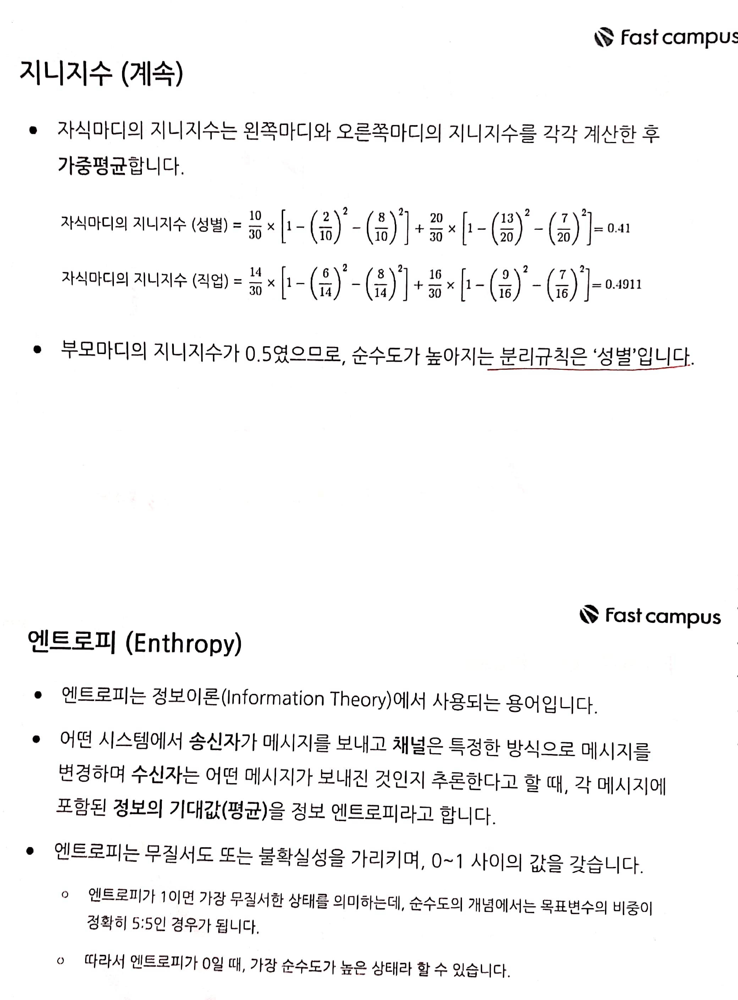
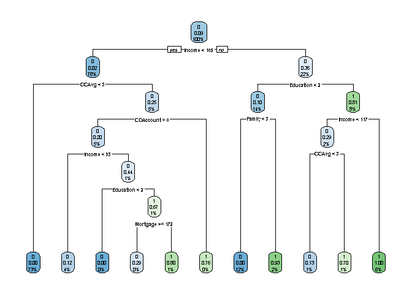

fastcampus\_머신러닝\_5
================
huimin
2019 7 16

# 기초 설정

``` r
library(tidyverse)
```

    ## Registered S3 methods overwritten by 'ggplot2':
    ##   method         from 
    ##   [.quosures     rlang
    ##   c.quosures     rlang
    ##   print.quosures rlang

    ## Registered S3 method overwritten by 'rvest':
    ##   method            from
    ##   read_xml.response xml2

    ## -- Attaching packages --------------------------------- tidyverse 1.2.1 --

    ## √ ggplot2 3.1.1       √ purrr   0.3.2  
    ## √ tibble  2.1.1       √ dplyr   0.8.0.1
    ## √ tidyr   0.8.3       √ stringr 1.4.0  
    ## √ readr   1.3.1       √ forcats 0.4.0

    ## -- Conflicts ------------------------------------ tidyverse_conflicts() --
    ## x dplyr::filter() masks stats::filter()
    ## x dplyr::lag()    masks stats::lag()

``` r
library(readr)
library(caret)
```

    ## Loading required package: lattice

    ## 
    ## Attaching package: 'caret'

    ## The following object is masked from 'package:purrr':
    ## 
    ##     lift

``` r
library(e1071)
library(MLmetrics)
```

    ## 
    ## Attaching package: 'MLmetrics'

    ## The following objects are masked from 'package:caret':
    ## 
    ##     MAE, RMSE

    ## The following object is masked from 'package:base':
    ## 
    ##     Recall

# 의사결정나무 알고리즘의 개요

**의사결정나무는 분류모형에 사용되는 대표적인 알고리즘**이다. 전체 데이터셋을 몇 개의 소그룹으로 분류하는데, 각각의 소그룹에는
목표변수의 레벨이 하나로 집중된다.

전체 데이터셋에서 **소그룹으로 분리되는 규칙**을 따라가다 보면 데이터셋이 가지는 일정한 패턴을 규칙으로 만들고, 이는 이해하기
쉽고 활용하기 좋아 많은 분석가들이 분류모형을 적합할 때 의사결정나무 알고리즘을 사용한다.

의사결정나무의 **특징**은 다음과 같다.

  - 목표변수가 **범주형일 때 분류모형, 연속형일 때 회귀모형을 적합할 수 있다.**
  - **순수도(Purity) 또는 불순도(Impurity)를 기준**으로 나무를 성장시킨다.
  - 부모마디보다 자식마디의 순수도가 높아지거나 불순도가 낮아져야 분리될 수 있다.
  - 나무모형을 적합하고 나면 **IF-THEN 규칙**을 만들 수 있으므로, 해석하기가 쉽다.

의사결정나무의 **장점**은 다음과 같다.

  - **비모수적 알고리즘(데이터셋에 대한 통계적 가정이 필요없다.)**이기 때문에 간단하다.
  - 이상치는 분류과정에서 자연스럽게 도태되기 때문에 **이상치에 덜 민감하다.**
  - 결측값이 있어도 모형을 적합할 수 있다.

의사결정나무의 **단점**은 다음과 같다.

  - 과적합하기 쉽다.
  - 정지규칙을 별도로 설정하여, 데이터에 맞도록 나무의 성장을 제한해야 한다.
  - **비용복잡도를 기준으로 가지치기를 통하여 과적합의 위험을 줄일 수 있다.**

# 의사결정나무 알고리즘의 종류

**CART(Classification and Regression Tree)**

  - 분류모형은 **지니지수를 이용하여 순수도를 계산**한다.
  - 회귀모형은 분산의 감소량을 기준으로 나무를 성장시킨다.
  - **이지분리(Binary Classification)**에 사용된다.
  - 반복 분할을 하므로 같은 입력변수가 여러 번 사용된다.
  - R에서 rpart 패키지의 **rpart() 함수**를 사용한다.

**C5.0**

  - **엔트로피**를 이용하여 **순수도를 계산**하는 알고리즘이다.
  - 부모마디의 엔트로피에서 자식마디의 엔트로피 가중평균을 뺀 감소량인 **정보이익(Information Gain)**을
    기준으로 나무를 성장시킨다.
  - 다지분리가 가능하다.
  - **반복 분할을 하므로, 같은 입력변수를 여러 번 사용한다.**
  - R에서는 C50 패키지의 **C5.0() 함수**를 사용한다.

**CHAID(Chi-squared Automatic Interaction Detection)**

  - 분류모형은 **카이제곱 통계량을 이용하여 순수도를 계산**한다.
  - 회귀모형의 경우 F-통계량을 이용한다.
  - **입력변수를 반드시 범주형**이어야 한다. 숫자형 벡터를 전부 범주형으로 변환해야한다.
  - CHAID 패키지의 **chaid() 함수**를 사용한다.

# 의사결정나무 프로세스


  - 뿌리마디로부터 출발하여, 부모마디보다 자식마디의 **순수도가 높아지거나 불순도가 낮아지는 최적의 분리규칙이 있을 때 나무를
    성장**시킨다.
  - **정지규칙을 만족하면 성장**을 중단한다.
  - 과적합을 피해 불필요한 가지를 잘라내는 **가지치기를 하여 나무를 완성**한다.
  - 다수의 분류모형을 적합했다면, **다양한 성능지표를 통해 최종모형을 결정**한다.

# 자세한 의사결정나무 프로세스별 설명





# 의사결정나무 함수 설명


# 이지분리 의사결정나무 실습

## 시작 : 데이터 전처리 과정

``` r
# 실습데이터 불러오기
load(file = "practice_data/bank.RData")

# 데이터 구조 파악하기
str(bank)
```

    ## 'data.frame':    5000 obs. of  14 variables:
    ##  $ ID               : int  1 2 3 4 5 6 7 8 9 10 ...
    ##  $ Age              : int  25 45 39 35 35 37 53 50 35 34 ...
    ##  $ Experience       : int  1 19 15 9 8 13 27 24 10 9 ...
    ##  $ Income           : int  49 34 11 100 45 29 72 22 81 180 ...
    ##  $ ZIP.Code         : int  91107 90089 94720 94112 91330 92121 91711 93943 90089 93023 ...
    ##  $ Family           : int  4 3 1 1 4 4 2 1 3 1 ...
    ##  $ CCAvg            : num  1.6 1.5 1 2.7 1 0.4 1.5 0.3 0.6 8.9 ...
    ##  $ Education        : int  1 1 1 2 2 2 2 3 2 3 ...
    ##  $ Mortgage         : int  0 0 0 0 0 155 0 0 104 0 ...
    ##  $ PersonalLoan     : int  0 0 0 0 0 0 0 0 0 1 ...
    ##  $ SecuritiesAccount: int  1 1 0 0 0 0 0 0 0 0 ...
    ##  $ CDAccount        : int  0 0 0 0 0 0 0 0 0 0 ...
    ##  $ Online           : int  0 0 0 0 0 1 1 0 1 0 ...
    ##  $ CreditCard       : int  0 0 0 0 1 0 0 1 0 0 ...

``` r
# 간단한 데이터 실습을 위해서 ID와 ZIP CODE 삭제하기
bank <- bank[,c(-1,-5)]

# 요약통계량을 통해 대략적인 모양 확인하기
summary(bank)
```

    ##       Age          Experience       Income           Family     
    ##  Min.   :23.00   Min.   :-3.0   Min.   :  8.00   Min.   :1.000  
    ##  1st Qu.:35.00   1st Qu.:10.0   1st Qu.: 39.00   1st Qu.:1.000  
    ##  Median :45.00   Median :20.0   Median : 64.00   Median :2.000  
    ##  Mean   :45.34   Mean   :20.1   Mean   : 73.77   Mean   :2.396  
    ##  3rd Qu.:55.00   3rd Qu.:30.0   3rd Qu.: 98.00   3rd Qu.:3.000  
    ##  Max.   :67.00   Max.   :43.0   Max.   :224.00   Max.   :4.000  
    ##      CCAvg          Education        Mortgage      PersonalLoan  
    ##  Min.   : 0.000   Min.   :1.000   Min.   :  0.0   Min.   :0.000  
    ##  1st Qu.: 0.700   1st Qu.:1.000   1st Qu.:  0.0   1st Qu.:0.000  
    ##  Median : 1.500   Median :2.000   Median :  0.0   Median :0.000  
    ##  Mean   : 1.938   Mean   :1.881   Mean   : 56.5   Mean   :0.096  
    ##  3rd Qu.: 2.500   3rd Qu.:3.000   3rd Qu.:101.0   3rd Qu.:0.000  
    ##  Max.   :10.000   Max.   :3.000   Max.   :635.0   Max.   :1.000  
    ##  SecuritiesAccount   CDAccount          Online         CreditCard   
    ##  Min.   :0.0000    Min.   :0.0000   Min.   :0.0000   Min.   :0.000  
    ##  1st Qu.:0.0000    1st Qu.:0.0000   1st Qu.:0.0000   1st Qu.:0.000  
    ##  Median :0.0000    Median :0.0000   Median :1.0000   Median :0.000  
    ##  Mean   :0.1044    Mean   :0.0604   Mean   :0.5968   Mean   :0.294  
    ##  3rd Qu.:0.0000    3rd Qu.:0.0000   3rd Qu.:1.0000   3rd Qu.:1.000  
    ##  Max.   :1.0000    Max.   :1.0000   Max.   :1.0000   Max.   :1.000

``` r
# 목표변수를 범주형으로 변환하기
bank$PersonalLoan <- as.factor(bank$PersonalLoan)

# 목표변수 비율 확인하기
bank$PersonalLoan %>% table() %>% prop.table()
```

    ## .
    ##     0     1 
    ## 0.904 0.096

``` r
# 매우 불균형한 데이터이다. 하지만 우선, 훈련셋, 시험셋으로 나누기로 한다.
set.seed(123)

index <- sample(x = 1:2,
                size = nrow(bank),
                prob = c(0.7, 0.3),
                replace = TRUE)

trainset <- bank[index == 1, ]
testset <- bank[index == 2, ]

trainset$PersonalLoan %>% table() %>% prop.table()
```

    ## .
    ##          0          1 
    ## 0.91033305 0.08966695

``` r
testset$PersonalLoan %>% table() %>% prop.table()
```

    ## .
    ##         0         1 
    ## 0.8890383 0.1109617

## 1\. 이지분리 의사결정나무 모형 적합하기

``` r
# 의사결정나무 모형 적합에 필요한 패키지이다.
library(rpart)

fit.tree0 <- rpart(formula = PersonalLoan ~.,
                   data = trainset,
                   parms = list(split = "gini"),
                   control = rpart.control(minsplit = 20,
                                           cp = 0.01,
                                           maxdepth = 10))

summary(fit.tree0)
```

    ## Call:
    ## rpart(formula = PersonalLoan ~ ., data = trainset, parms = list(split = "gini"), 
    ##     control = rpart.control(minsplit = 20, cp = 0.01, maxdepth = 10))
    ##   n= 3513 
    ## 
    ##           CP nsplit rel error    xerror       xstd
    ## 1 0.26507937      0 1.0000000 1.0000000 0.05375822
    ## 2 0.14920635      2 0.4698413 0.5047619 0.03911384
    ## 3 0.09523810      3 0.3206349 0.3269841 0.03174287
    ## 4 0.02539683      4 0.2253968 0.2507937 0.02789742
    ## 5 0.01428571      5 0.2000000 0.2253968 0.02647799
    ## 6 0.01000000      9 0.1428571 0.1841270 0.02397664
    ## 
    ## Variable importance
    ##     Income  Education     Family      CCAvg  CDAccount   Mortgage 
    ##         30         27         20         13          5          3 
    ## Experience        Age 
    ##          1          1 
    ## 
    ## Node number 1: 3513 observations,    complexity param=0.2650794
    ##   predicted class=0  expected loss=0.08966695  P(node) =1
    ##     class counts:  3198   315
    ##    probabilities: 0.910 0.090 
    ##   left son=2 (2755 obs) right son=3 (758 obs)
    ##   Primary splits:
    ##       Income    < 104.5 to the left,  improve=135.97210, (0 missing)
    ##       CCAvg     < 2.95  to the left,  improve=112.17930, (0 missing)
    ##       CDAccount < 0.5   to the left,  improve= 61.06767, (0 missing)
    ##       Mortgage  < 294.5 to the left,  improve= 26.97778, (0 missing)
    ##       Education < 1.5   to the left,  improve= 10.89078, (0 missing)
    ##   Surrogate splits:
    ##       CCAvg    < 3.225 to the left,  agree=0.861, adj=0.356, (0 split)
    ##       Mortgage < 307.5 to the left,  agree=0.807, adj=0.106, (0 split)
    ## 
    ## Node number 2: 2755 observations,    complexity param=0.01428571
    ##   predicted class=0  expected loss=0.01669691  P(node) =0.78423
    ##     class counts:  2709    46
    ##    probabilities: 0.983 0.017 
    ##   left son=4 (2569 obs) right son=5 (186 obs)
    ##   Primary splits:
    ##       CCAvg     < 2.95  to the left,  improve=21.216570, (0 missing)
    ##       Income    < 92.5  to the left,  improve= 5.323440, (0 missing)
    ##       CDAccount < 0.5   to the left,  improve= 2.445270, (0 missing)
    ##       Mortgage  < 325   to the left,  improve= 1.197150, (0 missing)
    ##       Age       < 64.5  to the left,  improve= 0.123298, (0 missing)
    ## 
    ## Node number 3: 758 observations,    complexity param=0.2650794
    ##   predicted class=0  expected loss=0.3548813  P(node) =0.21577
    ##     class counts:   489   269
    ##    probabilities: 0.645 0.355 
    ##   left son=6 (489 obs) right son=7 (269 obs)
    ##   Primary splits:
    ##       Education < 1.5   to the left,  improve=173.050200, (0 missing)
    ##       Family    < 2.5   to the left,  improve=121.734300, (0 missing)
    ##       CDAccount < 0.5   to the left,  improve= 48.297770, (0 missing)
    ##       Income    < 122.5 to the left,  improve= 12.393270, (0 missing)
    ##       CCAvg     < 2.95  to the left,  improve=  6.164216, (0 missing)
    ##   Surrogate splits:
    ##       Family    < 2.5   to the left,  agree=0.749, adj=0.294, (0 split)
    ##       CDAccount < 0.5   to the left,  agree=0.686, adj=0.115, (0 split)
    ##       Mortgage  < 515.5 to the left,  agree=0.657, adj=0.033, (0 split)
    ##       Income    < 108.5 to the right, agree=0.656, adj=0.030, (0 split)
    ##       CCAvg     < 8.85  to the left,  agree=0.653, adj=0.022, (0 split)
    ## 
    ## Node number 4: 2569 observations
    ##   predicted class=0  expected loss=0  P(node) =0.7312838
    ##     class counts:  2569     0
    ##    probabilities: 1.000 0.000 
    ## 
    ## Node number 5: 186 observations,    complexity param=0.01428571
    ##   predicted class=0  expected loss=0.2473118  P(node) =0.0529462
    ##     class counts:   140    46
    ##    probabilities: 0.753 0.247 
    ##   left son=10 (169 obs) right son=11 (17 obs)
    ##   Primary splits:
    ##       CDAccount  < 0.5   to the left,  improve=10.017240, (0 missing)
    ##       Income     < 88.5  to the left,  improve= 6.564294, (0 missing)
    ##       Age        < 60.5  to the left,  improve= 2.896737, (0 missing)
    ##       CCAvg      < 4.85  to the right, improve= 2.588629, (0 missing)
    ##       Experience < 33.5  to the left,  improve= 2.480212, (0 missing)
    ##   Surrogate splits:
    ##       Age < 64.5  to the left,  agree=0.914, adj=0.059, (0 split)
    ## 
    ## Node number 6: 489 observations,    complexity param=0.1492063
    ##   predicted class=0  expected loss=0.1042945  P(node) =0.1391973
    ##     class counts:   438    51
    ##    probabilities: 0.896 0.104 
    ##   left son=12 (434 obs) right son=13 (55 obs)
    ##   Primary splits:
    ##       Family    < 2.5   to the left,  improve=83.9437800, (0 missing)
    ##       CDAccount < 0.5   to the left,  improve=11.6940600, (0 missing)
    ##       CCAvg     < 6.635 to the right, improve= 1.7249260, (0 missing)
    ##       Mortgage  < 182.5 to the left,  improve= 1.2957120, (0 missing)
    ##       Age       < 34.5  to the left,  improve= 0.7475259, (0 missing)
    ## 
    ## Node number 7: 269 observations,    complexity param=0.0952381
    ##   predicted class=1  expected loss=0.1895911  P(node) =0.07657273
    ##     class counts:    51   218
    ##    probabilities: 0.190 0.810 
    ##   left son=14 (72 obs) right son=15 (197 obs)
    ##   Primary splits:
    ##       Income     < 116.5 to the left,  improve=52.911710, (0 missing)
    ##       CCAvg      < 2.45  to the left,  improve=18.348130, (0 missing)
    ##       Experience < 38.5  to the right, improve= 6.450248, (0 missing)
    ##       Age        < 63.5  to the right, improve= 5.767686, (0 missing)
    ##       CDAccount  < 0.5   to the left,  improve= 4.669904, (0 missing)
    ##   Surrogate splits:
    ##       Experience < 38.5  to the right, agree=0.755, adj=0.083, (0 split)
    ##       Age        < 63.5  to the right, agree=0.751, adj=0.069, (0 split)
    ##       CCAvg      < 0.15  to the left,  agree=0.743, adj=0.042, (0 split)
    ## 
    ## Node number 10: 169 observations,    complexity param=0.01428571
    ##   predicted class=0  expected loss=0.1952663  P(node) =0.04810703
    ##     class counts:   136    33
    ##    probabilities: 0.805 0.195 
    ##   left son=20 (128 obs) right son=21 (41 obs)
    ##   Primary splits:
    ##       Income    < 92.5  to the left,  improve=6.432929, (0 missing)
    ##       Education < 1.5   to the left,  improve=3.004062, (0 missing)
    ##       Online    < 0.5   to the right, improve=1.708073, (0 missing)
    ##       Age       < 31.5  to the right, improve=1.661735, (0 missing)
    ##       CCAvg     < 4.85  to the right, improve=1.632426, (0 missing)
    ##   Surrogate splits:
    ##       Mortgage   < 248.5 to the left,  agree=0.775, adj=0.073, (0 split)
    ##       Experience < 34.5  to the left,  agree=0.769, adj=0.049, (0 split)
    ##       CCAvg      < 5.3   to the left,  agree=0.769, adj=0.049, (0 split)
    ##       Age        < 59.5  to the left,  agree=0.763, adj=0.024, (0 split)
    ## 
    ## Node number 11: 17 observations
    ##   predicted class=1  expected loss=0.2352941  P(node) =0.004839169
    ##     class counts:     4    13
    ##    probabilities: 0.235 0.765 
    ## 
    ## Node number 12: 434 observations
    ##   predicted class=0  expected loss=0  P(node) =0.1235411
    ##     class counts:   434     0
    ##    probabilities: 1.000 0.000 
    ## 
    ## Node number 13: 55 observations
    ##   predicted class=1  expected loss=0.07272727  P(node) =0.01565613
    ##     class counts:     4    51
    ##    probabilities: 0.073 0.927 
    ## 
    ## Node number 14: 72 observations,    complexity param=0.02539683
    ##   predicted class=0  expected loss=0.2916667  P(node) =0.0204953
    ##     class counts:    51    21
    ##    probabilities: 0.708 0.292 
    ##   left son=28 (52 obs) right son=29 (20 obs)
    ##   Primary splits:
    ##       CCAvg      < 2.95  to the left,  improve=9.2346150, (0 missing)
    ##       Age        < 60    to the right, improve=2.0346150, (0 missing)
    ##       Experience < 35.5  to the right, improve=1.7936940, (0 missing)
    ##       Education  < 2.5   to the right, improve=1.2744760, (0 missing)
    ##       CreditCard < 0.5   to the right, improve=0.9796296, (0 missing)
    ##   Surrogate splits:
    ##       CDAccount < 0.5   to the left,  agree=0.75, adj=0.1, (0 split)
    ## 
    ## Node number 15: 197 observations
    ##   predicted class=1  expected loss=0  P(node) =0.05607743
    ##     class counts:     0   197
    ##    probabilities: 0.000 1.000 
    ## 
    ## Node number 20: 128 observations
    ##   predicted class=0  expected loss=0.1171875  P(node) =0.03643609
    ##     class counts:   113    15
    ##    probabilities: 0.883 0.117 
    ## 
    ## Node number 21: 41 observations,    complexity param=0.01428571
    ##   predicted class=0  expected loss=0.4390244  P(node) =0.01167094
    ##     class counts:    23    18
    ##    probabilities: 0.561 0.439 
    ##   left son=42 (14 obs) right son=43 (27 obs)
    ##   Primary splits:
    ##       Education < 1.5   to the left,  improve=8.195122, (0 missing)
    ##       Family    < 2.5   to the left,  improve=5.075122, (0 missing)
    ##       CCAvg     < 4.25  to the right, improve=3.476074, (0 missing)
    ##       Mortgage  < 172   to the right, improve=3.096221, (0 missing)
    ##       Online    < 0.5   to the right, improve=1.509408, (0 missing)
    ##   Surrogate splits:
    ##       CCAvg      < 4.85  to the right, agree=0.829, adj=0.500, (0 split)
    ##       Family     < 1.5   to the left,  agree=0.732, adj=0.214, (0 split)
    ##       Online     < 0.5   to the right, agree=0.707, adj=0.143, (0 split)
    ##       Age        < 29.5  to the left,  agree=0.683, adj=0.071, (0 split)
    ##       Experience < 4.5   to the left,  agree=0.683, adj=0.071, (0 split)
    ## 
    ## Node number 28: 52 observations
    ##   predicted class=0  expected loss=0.1346154  P(node) =0.01480216
    ##     class counts:    45     7
    ##    probabilities: 0.865 0.135 
    ## 
    ## Node number 29: 20 observations
    ##   predicted class=1  expected loss=0.3  P(node) =0.00569314
    ##     class counts:     6    14
    ##    probabilities: 0.300 0.700 
    ## 
    ## Node number 42: 14 observations
    ##   predicted class=0  expected loss=0  P(node) =0.003985198
    ##     class counts:    14     0
    ##    probabilities: 1.000 0.000 
    ## 
    ## Node number 43: 27 observations
    ##   predicted class=1  expected loss=0.3333333  P(node) =0.007685739
    ##     class counts:     9    18
    ##    probabilities: 0.333 0.667

출력되는 결과는 많지만, **두 번째 표와 세 번째 표가 가장 중요하다.**

**두 번째 표**는 비용복잡도(CP) 파라미터별로 가지가 분리되는 횟수, 실제 오차 및 교차검정 오차를 제시한다. 비용복잡도
파라미터를 기본값인 0.01로 정했기 때문에 그 기준으로 분리된 횟수는 4번이다. 따라서 끝마디 수는 5개가 된다.

**세 번째 표**는 변수별 중요도를 보여준다. Income, Education, Family, Mortagage,
CDAccount, Experience 순으로 오분류율이 낮은 모형을 적합하는데 기여하였다.

**네 번째부터는** 노드 별로 결과를 상세하게 나타내어 준다. 간단하게 Node number 1을 살펴보자면, 비용복잡도 약
0.27 추정라벨 0, 예상 손실은 약 0.09이다. 그리고 왼쪽 자식마디로 2755건이 할당되고, 오른쪽 자식마디로는 758건이
할당되었다. 분리규칙 중에서 Improve가 가장 큰 분리규칙이 사용되었다. 이는 즉, Income이 135.97보다 크면 오른쪽
자식마디로 이동하고, 그보다 작을경우 왼쪽 자식마디로 이동한다는 뜻이다.

## 2\. rpart.plot 패키지를 이용하여 나무모형 그림 그려보기

``` r
library(rpart.plot)

rpart.plot(fit.tree0)
```

<!-- -->

이 외의 기본 함수를 이용한 나무모형 그림이 있지만, 생략하겠다.

## 3\. 의사결정나무 가지치기

``` r
# 가지치기 판단을 하기 위해서 비용복잡도 표를 출력한다.
printcp(fit.tree0)
```

    ## 
    ## Classification tree:
    ## rpart(formula = PersonalLoan ~ ., data = trainset, parms = list(split = "gini"), 
    ##     control = rpart.control(minsplit = 20, cp = 0.01, maxdepth = 10))
    ## 
    ## Variables actually used in tree construction:
    ## [1] CCAvg     CDAccount Education Family    Income   
    ## 
    ## Root node error: 315/3513 = 0.089667
    ## 
    ## n= 3513 
    ## 
    ##         CP nsplit rel error  xerror     xstd
    ## 1 0.265079      0   1.00000 1.00000 0.053758
    ## 2 0.149206      2   0.46984 0.50476 0.039114
    ## 3 0.095238      3   0.32063 0.32698 0.031743
    ## 4 0.025397      4   0.22540 0.25079 0.027897
    ## 5 0.014286      5   0.20000 0.22540 0.026478
    ## 6 0.010000      9   0.14286 0.18413 0.023977

``` r
# 현재의 모형은 가지치기가 필요가 없다. 하지만, 실습을 위해 조금 더 복잡한 새로운 모형을 만들고 가지치기를 해보도록 하겠다.
fit.tree1 <- rpart(formula = PersonalLoan ~.,
                   data = trainset,
                   parms = list(split = "gini"),
                   control = rpart.control(minsplit = 20,
                                           cp = 0.001,
                                           maxdepth = 30))

# 새롭게 적합한 모형의 비용복잡도 표 출력
printcp(fit.tree1)
```

    ## 
    ## Classification tree:
    ## rpart(formula = PersonalLoan ~ ., data = trainset, parms = list(split = "gini"), 
    ##     control = rpart.control(minsplit = 20, cp = 0.001, maxdepth = 30))
    ## 
    ## Variables actually used in tree construction:
    ## [1] CCAvg     CDAccount Education Family    Income    Mortgage 
    ## 
    ## Root node error: 315/3513 = 0.089667
    ## 
    ## n= 3513 
    ## 
    ##          CP nsplit rel error  xerror     xstd
    ## 1 0.2650794      0   1.00000 1.00000 0.053758
    ## 2 0.1492063      2   0.46984 0.51746 0.039579
    ## 3 0.0952381      3   0.32063 0.32381 0.031593
    ## 4 0.0253968      4   0.22540 0.24762 0.027724
    ## 5 0.0142857      5   0.20000 0.20317 0.025164
    ## 6 0.0095238      9   0.14286 0.18095 0.023772
    ## 7 0.0010000     10   0.13333 0.17143 0.023148

``` r
# xerror가 최소일 때의 지표들을 best.xerror 객체에 저장한다.
best.xerror <- fit.tree1$cptable[fit.tree1$cptable[, "xerror"] == min(fit.tree1$cptable[, 4]), ]

best.xerror
```

    ##          CP      nsplit   rel error      xerror        xstd 
    ##  0.00100000 10.00000000  0.13333333  0.17142857  0.02314848

``` r
names(best.xerror)
```

    ## [1] "CP"        "nsplit"    "rel error" "xerror"    "xstd"

``` r
# best.cp 객체에 cp값 저장하기
best.cp <- best.xerror[1]


# prune.rpart 함수를 통해서 가지치기하기
fit.tree2 <- prune.rpart(tree = fit.tree1, cp = best.cp)

# 가지치기한 모형 확인하기
summary(fit.tree2)
```

    ## Call:
    ## rpart(formula = PersonalLoan ~ ., data = trainset, parms = list(split = "gini"), 
    ##     control = rpart.control(minsplit = 20, cp = 0.001, maxdepth = 30))
    ##   n= 3513 
    ## 
    ##           CP nsplit rel error    xerror       xstd
    ## 1 0.26507937      0 1.0000000 1.0000000 0.05375822
    ## 2 0.14920635      2 0.4698413 0.5174603 0.03957916
    ## 3 0.09523810      3 0.3206349 0.3238095 0.03159303
    ## 4 0.02539683      4 0.2253968 0.2476190 0.02772433
    ## 5 0.01428571      5 0.2000000 0.2031746 0.02516442
    ## 6 0.00952381      9 0.1428571 0.1809524 0.02377249
    ## 7 0.00100000     10 0.1333333 0.1714286 0.02314848
    ## 
    ## Variable importance
    ##     Income  Education     Family      CCAvg  CDAccount   Mortgage 
    ##         30         27         20         13          5          3 
    ## Experience        Age 
    ##          1          1 
    ## 
    ## Node number 1: 3513 observations,    complexity param=0.2650794
    ##   predicted class=0  expected loss=0.08966695  P(node) =1
    ##     class counts:  3198   315
    ##    probabilities: 0.910 0.090 
    ##   left son=2 (2755 obs) right son=3 (758 obs)
    ##   Primary splits:
    ##       Income    < 104.5 to the left,  improve=135.97210, (0 missing)
    ##       CCAvg     < 2.95  to the left,  improve=112.17930, (0 missing)
    ##       CDAccount < 0.5   to the left,  improve= 61.06767, (0 missing)
    ##       Mortgage  < 294.5 to the left,  improve= 26.97778, (0 missing)
    ##       Education < 1.5   to the left,  improve= 10.89078, (0 missing)
    ##   Surrogate splits:
    ##       CCAvg    < 3.225 to the left,  agree=0.861, adj=0.356, (0 split)
    ##       Mortgage < 307.5 to the left,  agree=0.807, adj=0.106, (0 split)
    ## 
    ## Node number 2: 2755 observations,    complexity param=0.01428571
    ##   predicted class=0  expected loss=0.01669691  P(node) =0.78423
    ##     class counts:  2709    46
    ##    probabilities: 0.983 0.017 
    ##   left son=4 (2569 obs) right son=5 (186 obs)
    ##   Primary splits:
    ##       CCAvg     < 2.95  to the left,  improve=21.216570, (0 missing)
    ##       Income    < 92.5  to the left,  improve= 5.323440, (0 missing)
    ##       CDAccount < 0.5   to the left,  improve= 2.445270, (0 missing)
    ##       Mortgage  < 325   to the left,  improve= 1.197150, (0 missing)
    ##       Age       < 64.5  to the left,  improve= 0.123298, (0 missing)
    ## 
    ## Node number 3: 758 observations,    complexity param=0.2650794
    ##   predicted class=0  expected loss=0.3548813  P(node) =0.21577
    ##     class counts:   489   269
    ##    probabilities: 0.645 0.355 
    ##   left son=6 (489 obs) right son=7 (269 obs)
    ##   Primary splits:
    ##       Education < 1.5   to the left,  improve=173.050200, (0 missing)
    ##       Family    < 2.5   to the left,  improve=121.734300, (0 missing)
    ##       CDAccount < 0.5   to the left,  improve= 48.297770, (0 missing)
    ##       Income    < 122.5 to the left,  improve= 12.393270, (0 missing)
    ##       CCAvg     < 2.95  to the left,  improve=  6.164216, (0 missing)
    ##   Surrogate splits:
    ##       Family    < 2.5   to the left,  agree=0.749, adj=0.294, (0 split)
    ##       CDAccount < 0.5   to the left,  agree=0.686, adj=0.115, (0 split)
    ##       Mortgage  < 515.5 to the left,  agree=0.657, adj=0.033, (0 split)
    ##       Income    < 108.5 to the right, agree=0.656, adj=0.030, (0 split)
    ##       CCAvg     < 8.85  to the left,  agree=0.653, adj=0.022, (0 split)
    ## 
    ## Node number 4: 2569 observations
    ##   predicted class=0  expected loss=0  P(node) =0.7312838
    ##     class counts:  2569     0
    ##    probabilities: 1.000 0.000 
    ## 
    ## Node number 5: 186 observations,    complexity param=0.01428571
    ##   predicted class=0  expected loss=0.2473118  P(node) =0.0529462
    ##     class counts:   140    46
    ##    probabilities: 0.753 0.247 
    ##   left son=10 (169 obs) right son=11 (17 obs)
    ##   Primary splits:
    ##       CDAccount  < 0.5   to the left,  improve=10.017240, (0 missing)
    ##       Income     < 88.5  to the left,  improve= 6.564294, (0 missing)
    ##       Age        < 60.5  to the left,  improve= 2.896737, (0 missing)
    ##       CCAvg      < 4.85  to the right, improve= 2.588629, (0 missing)
    ##       Experience < 33.5  to the left,  improve= 2.480212, (0 missing)
    ##   Surrogate splits:
    ##       Age < 64.5  to the left,  agree=0.914, adj=0.059, (0 split)
    ## 
    ## Node number 6: 489 observations,    complexity param=0.1492063
    ##   predicted class=0  expected loss=0.1042945  P(node) =0.1391973
    ##     class counts:   438    51
    ##    probabilities: 0.896 0.104 
    ##   left son=12 (434 obs) right son=13 (55 obs)
    ##   Primary splits:
    ##       Family    < 2.5   to the left,  improve=83.9437800, (0 missing)
    ##       CDAccount < 0.5   to the left,  improve=11.6940600, (0 missing)
    ##       CCAvg     < 6.635 to the right, improve= 1.7249260, (0 missing)
    ##       Mortgage  < 182.5 to the left,  improve= 1.2957120, (0 missing)
    ##       Age       < 34.5  to the left,  improve= 0.7475259, (0 missing)
    ## 
    ## Node number 7: 269 observations,    complexity param=0.0952381
    ##   predicted class=1  expected loss=0.1895911  P(node) =0.07657273
    ##     class counts:    51   218
    ##    probabilities: 0.190 0.810 
    ##   left son=14 (72 obs) right son=15 (197 obs)
    ##   Primary splits:
    ##       Income     < 116.5 to the left,  improve=52.911710, (0 missing)
    ##       CCAvg      < 2.45  to the left,  improve=18.348130, (0 missing)
    ##       Experience < 38.5  to the right, improve= 6.450248, (0 missing)
    ##       Age        < 63.5  to the right, improve= 5.767686, (0 missing)
    ##       CDAccount  < 0.5   to the left,  improve= 4.669904, (0 missing)
    ##   Surrogate splits:
    ##       Experience < 38.5  to the right, agree=0.755, adj=0.083, (0 split)
    ##       Age        < 63.5  to the right, agree=0.751, adj=0.069, (0 split)
    ##       CCAvg      < 0.15  to the left,  agree=0.743, adj=0.042, (0 split)
    ## 
    ## Node number 10: 169 observations,    complexity param=0.01428571
    ##   predicted class=0  expected loss=0.1952663  P(node) =0.04810703
    ##     class counts:   136    33
    ##    probabilities: 0.805 0.195 
    ##   left son=20 (128 obs) right son=21 (41 obs)
    ##   Primary splits:
    ##       Income    < 92.5  to the left,  improve=6.432929, (0 missing)
    ##       Education < 1.5   to the left,  improve=3.004062, (0 missing)
    ##       Online    < 0.5   to the right, improve=1.708073, (0 missing)
    ##       Age       < 31.5  to the right, improve=1.661735, (0 missing)
    ##       CCAvg     < 4.85  to the right, improve=1.632426, (0 missing)
    ##   Surrogate splits:
    ##       Mortgage   < 248.5 to the left,  agree=0.775, adj=0.073, (0 split)
    ##       Experience < 34.5  to the left,  agree=0.769, adj=0.049, (0 split)
    ##       CCAvg      < 5.3   to the left,  agree=0.769, adj=0.049, (0 split)
    ##       Age        < 59.5  to the left,  agree=0.763, adj=0.024, (0 split)
    ## 
    ## Node number 11: 17 observations
    ##   predicted class=1  expected loss=0.2352941  P(node) =0.004839169
    ##     class counts:     4    13
    ##    probabilities: 0.235 0.765 
    ## 
    ## Node number 12: 434 observations
    ##   predicted class=0  expected loss=0  P(node) =0.1235411
    ##     class counts:   434     0
    ##    probabilities: 1.000 0.000 
    ## 
    ## Node number 13: 55 observations
    ##   predicted class=1  expected loss=0.07272727  P(node) =0.01565613
    ##     class counts:     4    51
    ##    probabilities: 0.073 0.927 
    ## 
    ## Node number 14: 72 observations,    complexity param=0.02539683
    ##   predicted class=0  expected loss=0.2916667  P(node) =0.0204953
    ##     class counts:    51    21
    ##    probabilities: 0.708 0.292 
    ##   left son=28 (52 obs) right son=29 (20 obs)
    ##   Primary splits:
    ##       CCAvg      < 2.95  to the left,  improve=9.2346150, (0 missing)
    ##       Age        < 60    to the right, improve=2.0346150, (0 missing)
    ##       Experience < 35.5  to the right, improve=1.7936940, (0 missing)
    ##       Education  < 2.5   to the right, improve=1.2744760, (0 missing)
    ##       CreditCard < 0.5   to the right, improve=0.9796296, (0 missing)
    ##   Surrogate splits:
    ##       CDAccount < 0.5   to the left,  agree=0.75, adj=0.1, (0 split)
    ## 
    ## Node number 15: 197 observations
    ##   predicted class=1  expected loss=0  P(node) =0.05607743
    ##     class counts:     0   197
    ##    probabilities: 0.000 1.000 
    ## 
    ## Node number 20: 128 observations
    ##   predicted class=0  expected loss=0.1171875  P(node) =0.03643609
    ##     class counts:   113    15
    ##    probabilities: 0.883 0.117 
    ## 
    ## Node number 21: 41 observations,    complexity param=0.01428571
    ##   predicted class=0  expected loss=0.4390244  P(node) =0.01167094
    ##     class counts:    23    18
    ##    probabilities: 0.561 0.439 
    ##   left son=42 (14 obs) right son=43 (27 obs)
    ##   Primary splits:
    ##       Education < 1.5   to the left,  improve=8.195122, (0 missing)
    ##       Family    < 2.5   to the left,  improve=5.075122, (0 missing)
    ##       CCAvg     < 4.25  to the right, improve=3.476074, (0 missing)
    ##       Mortgage  < 172   to the right, improve=3.096221, (0 missing)
    ##       Online    < 0.5   to the right, improve=1.509408, (0 missing)
    ##   Surrogate splits:
    ##       CCAvg      < 4.85  to the right, agree=0.829, adj=0.500, (0 split)
    ##       Family     < 1.5   to the left,  agree=0.732, adj=0.214, (0 split)
    ##       Online     < 0.5   to the right, agree=0.707, adj=0.143, (0 split)
    ##       Age        < 29.5  to the left,  agree=0.683, adj=0.071, (0 split)
    ##       Experience < 4.5   to the left,  agree=0.683, adj=0.071, (0 split)
    ## 
    ## Node number 28: 52 observations
    ##   predicted class=0  expected loss=0.1346154  P(node) =0.01480216
    ##     class counts:    45     7
    ##    probabilities: 0.865 0.135 
    ## 
    ## Node number 29: 20 observations
    ##   predicted class=1  expected loss=0.3  P(node) =0.00569314
    ##     class counts:     6    14
    ##    probabilities: 0.300 0.700 
    ## 
    ## Node number 42: 14 observations
    ##   predicted class=0  expected loss=0  P(node) =0.003985198
    ##     class counts:    14     0
    ##    probabilities: 1.000 0.000 
    ## 
    ## Node number 43: 27 observations,    complexity param=0.00952381
    ##   predicted class=1  expected loss=0.3333333  P(node) =0.007685739
    ##     class counts:     9    18
    ##    probabilities: 0.333 0.667 
    ##   left son=86 (7 obs) right son=87 (20 obs)
    ##   Primary splits:
    ##       Mortgage   < 172   to the right, improve=2.7428570, (0 missing)
    ##       Family     < 2.5   to the left,  improve=2.1098900, (0 missing)
    ##       CCAvg      < 4.45  to the right, improve=1.3333330, (0 missing)
    ##       Experience < 10    to the left,  improve=1.0714290, (0 missing)
    ##       Age        < 42.5  to the left,  improve=0.8823529, (0 missing)
    ##   Surrogate splits:
    ##       CCAvg < 4.45  to the right, agree=0.778, adj=0.143, (0 split)
    ## 
    ## Node number 86: 7 observations
    ##   predicted class=0  expected loss=0.2857143  P(node) =0.001992599
    ##     class counts:     5     2
    ##    probabilities: 0.714 0.286 
    ## 
    ## Node number 87: 20 observations
    ##   predicted class=1  expected loss=0.2  P(node) =0.00569314
    ##     class counts:     4    16
    ##    probabilities: 0.200 0.800

``` r
rpart.plot(fit.tree2)
```

<!-- -->

## 4\. 가지치기 전과 후의 모형 평가하기

``` r
pred <- predict(fit.tree0, newdata = trainset, type = "class")
pred.prun <- predict(fit.tree2, data = trainset, type = "class")
real <- trainset$PersonalLoan

confusionMatrix(pred, real, positive = "1")
```

    ## Confusion Matrix and Statistics
    ## 
    ##           Reference
    ## Prediction    0    1
    ##          0 3175   22
    ##          1   23  293
    ##                                           
    ##                Accuracy : 0.9872          
    ##                  95% CI : (0.9829, 0.9906)
    ##     No Information Rate : 0.9103          
    ##     P-Value [Acc > NIR] : <2e-16          
    ##                                           
    ##                   Kappa : 0.9216          
    ##                                           
    ##  Mcnemar's Test P-Value : 1               
    ##                                           
    ##             Sensitivity : 0.93016         
    ##             Specificity : 0.99281         
    ##          Pos Pred Value : 0.92722         
    ##          Neg Pred Value : 0.99312         
    ##              Prevalence : 0.08967         
    ##          Detection Rate : 0.08340         
    ##    Detection Prevalence : 0.08995         
    ##       Balanced Accuracy : 0.96148         
    ##                                           
    ##        'Positive' Class : 1               
    ## 

``` r
confusionMatrix(pred.prun, real, positive = "1")
```

    ## Confusion Matrix and Statistics
    ## 
    ##           Reference
    ## Prediction    0    1
    ##          0 3180   24
    ##          1   18  291
    ##                                           
    ##                Accuracy : 0.988           
    ##                  95% CI : (0.9839, 0.9914)
    ##     No Information Rate : 0.9103          
    ##     P-Value [Acc > NIR] : <2e-16          
    ##                                           
    ##                   Kappa : 0.9261          
    ##                                           
    ##  Mcnemar's Test P-Value : 0.4404          
    ##                                           
    ##             Sensitivity : 0.92381         
    ##             Specificity : 0.99437         
    ##          Pos Pred Value : 0.94175         
    ##          Neg Pred Value : 0.99251         
    ##              Prevalence : 0.08967         
    ##          Detection Rate : 0.08284         
    ##    Detection Prevalence : 0.08796         
    ##       Balanced Accuracy : 0.95909         
    ##                                           
    ##        'Positive' Class : 1               
    ## 

``` r
F1_Score(real, pred)
```

    ## [1] 0.9929633

``` r
F1_Score(real, pred.prun)
```

    ## [1] 0.9934396

가지치기 후의 모형이 조금 더 높은 성능을 보임을 알 수 있다.
