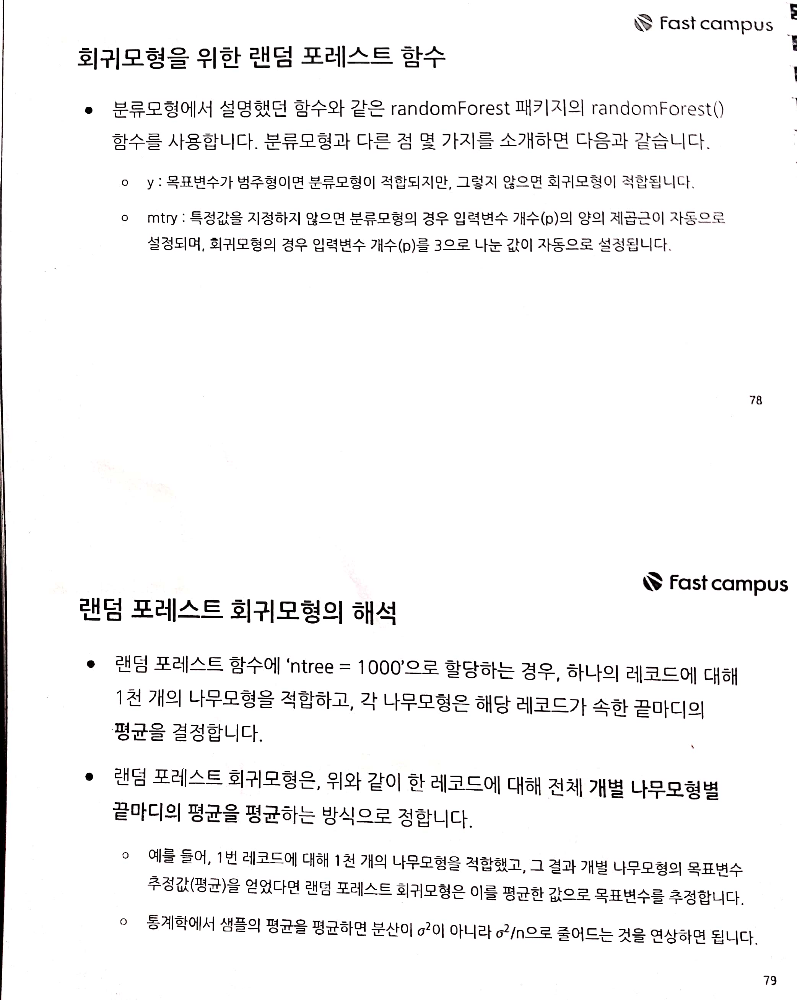

fastcampus\_머신러닝\_6
================
huimin
2019 7 19

# 기초 설정

``` r
library(tidyverse)
```

    ## Registered S3 methods overwritten by 'ggplot2':
    ##   method         from 
    ##   [.quosures     rlang
    ##   c.quosures     rlang
    ##   print.quosures rlang

    ## Registered S3 method overwritten by 'rvest':
    ##   method            from
    ##   read_xml.response xml2

    ## -- Attaching packages --------------------------------- tidyverse 1.2.1 --

    ## √ ggplot2 3.1.1       √ purrr   0.3.2  
    ## √ tibble  2.1.1       √ dplyr   0.8.0.1
    ## √ tidyr   0.8.3       √ stringr 1.4.0  
    ## √ readr   1.3.1       √ forcats 0.4.0

    ## -- Conflicts ------------------------------------ tidyverse_conflicts() --
    ## x dplyr::filter() masks stats::filter()
    ## x dplyr::lag()    masks stats::lag()

``` r
library(readr)
library(caret)
```

    ## Loading required package: lattice

    ## 
    ## Attaching package: 'caret'

    ## The following object is masked from 'package:purrr':
    ## 
    ##     lift

``` r
library(MLmetrics)
```

    ## 
    ## Attaching package: 'MLmetrics'

    ## The following objects are masked from 'package:caret':
    ## 
    ##     MAE, RMSE

    ## The following object is masked from 'package:base':
    ## 
    ##     Recall

``` r
library(e1071)
```

# 랜덤 포레스트 알고리즘의 개요 (회귀나무는 생략하였으므로 패캠 교재 참고)

의사결정나무는 하나의 나무모형을 적합하여 범주형 목표변수를 분류하거나 연속형 목표변수를 추정(회귀)하는 알고리즘이다. 반면에,
**랜덤 포레스트는 수 백, 수 천 개의 나무모형을 적합하여 결과를 추정**한다. **최종모형은 다수결 방식**으로 가장 많은
점수를 받은 결과를 선택하게 된다.

또한, 만약 목표변수가 **연속형**이라면 1천 개의 나무로부터 **추정값의 평균을 반환**한다.

분석가는 분류모형이나 회귀모형을 적합할 때, **나무의 수와 입력변수의 수만 결정**하면 된다.

**입력변수의 수**는 일반적으로, 분류모형의 경우 데이터셋의 전체 feature의 수(p)의 양의 제곱근(소수점 이하 절사),
예측모형(회귀모형)의 경우 p/3으로 결정한다.

분석가는 랜덤 포레스트 알고리즘으로 모형을 적합하고자 할 때, 최적 나무의 수와 입력변수의 수를 정해주어야 하는데, 이러한 최적의
하이퍼 파라미터를 찾기 위해 **그리드 탐색**을 한다.

# 랜덤 포레스트 알고리즘의 이론


# 랜덤 포레스트 프로세스


# 랜덤 포레스트 분류모형


# 랜덤 포레스트 회귀모형




# 랜덤 포레스트 분류모형 적합 실습

## 1\. 데이터 전처리하기

``` r
# 실습용 데이터
load(file = "practice_data/wine.RData")

# 데이터 구조 파악하기
str(wine)
```

    ## 'data.frame':    4898 obs. of  12 variables:
    ##  $ fixed.acidity       : num  7 6.3 8.1 7.2 7.2 8.1 6.2 7 6.3 8.1 ...
    ##  $ volatile.acidity    : num  0.27 0.3 0.28 0.23 0.23 0.28 0.32 0.27 0.3 0.22 ...
    ##  $ citric.acid         : num  0.36 0.34 0.4 0.32 0.32 0.4 0.16 0.36 0.34 0.43 ...
    ##  $ residual.sugar      : num  20.7 1.6 6.9 8.5 8.5 6.9 7 20.7 1.6 1.5 ...
    ##  $ chlorides           : num  0.045 0.049 0.05 0.058 0.058 0.05 0.045 0.045 0.049 0.044 ...
    ##  $ free.sulfur.dioxide : num  45 14 30 47 47 30 30 45 14 28 ...
    ##  $ total.sulfur.dioxide: num  170 132 97 186 186 97 136 170 132 129 ...
    ##  $ density             : num  1.001 0.994 0.995 0.996 0.996 ...
    ##  $ pH                  : num  3 3.3 3.26 3.19 3.19 3.26 3.18 3 3.3 3.22 ...
    ##  $ sulphates           : num  0.45 0.49 0.44 0.4 0.4 0.44 0.47 0.45 0.49 0.45 ...
    ##  $ alcohol             : num  8.8 9.5 10.1 9.9 9.9 10.1 9.6 8.8 9.5 11 ...
    ##  $ quality             : int  6 6 6 6 6 6 6 6 6 6 ...

``` r
summary(wine)
```

    ##  fixed.acidity    volatile.acidity  citric.acid     residual.sugar  
    ##  Min.   : 3.800   Min.   :0.0800   Min.   :0.0000   Min.   : 0.600  
    ##  1st Qu.: 6.300   1st Qu.:0.2100   1st Qu.:0.2700   1st Qu.: 1.700  
    ##  Median : 6.800   Median :0.2600   Median :0.3200   Median : 5.200  
    ##  Mean   : 6.855   Mean   :0.2782   Mean   :0.3342   Mean   : 6.391  
    ##  3rd Qu.: 7.300   3rd Qu.:0.3200   3rd Qu.:0.3900   3rd Qu.: 9.900  
    ##  Max.   :14.200   Max.   :1.1000   Max.   :1.6600   Max.   :65.800  
    ##    chlorides       free.sulfur.dioxide total.sulfur.dioxide
    ##  Min.   :0.00900   Min.   :  2.00      Min.   :  9.0       
    ##  1st Qu.:0.03600   1st Qu.: 23.00      1st Qu.:108.0       
    ##  Median :0.04300   Median : 34.00      Median :134.0       
    ##  Mean   :0.04577   Mean   : 35.31      Mean   :138.4       
    ##  3rd Qu.:0.05000   3rd Qu.: 46.00      3rd Qu.:167.0       
    ##  Max.   :0.34600   Max.   :289.00      Max.   :440.0       
    ##     density             pH          sulphates         alcohol     
    ##  Min.   :0.9871   Min.   :2.720   Min.   :0.2200   Min.   : 8.00  
    ##  1st Qu.:0.9917   1st Qu.:3.090   1st Qu.:0.4100   1st Qu.: 9.50  
    ##  Median :0.9937   Median :3.180   Median :0.4700   Median :10.40  
    ##  Mean   :0.9940   Mean   :3.188   Mean   :0.4898   Mean   :10.51  
    ##  3rd Qu.:0.9961   3rd Qu.:3.280   3rd Qu.:0.5500   3rd Qu.:11.40  
    ##  Max.   :1.0390   Max.   :3.820   Max.   :1.0800   Max.   :14.20  
    ##     quality     
    ##  Min.   :3.000  
    ##  1st Qu.:5.000  
    ##  Median :6.000  
    ##  Mean   :5.878  
    ##  3rd Qu.:6.000  
    ##  Max.   :9.000

``` r
# 목표변수의 비율 확인하기
wine$quality %>% table() %>% prop.table() %>% round(digits = 4) * 100
```

    ## .
    ##     3     4     5     6     7     8     9 
    ##  0.41  3.33 29.75 44.88 17.97  3.57  0.10

``` r
# 이진분류를 하기 위해서, 목표변수 새롭게 만들기
wine$grade <- ifelse(wine$quality >= 7, "best", "good")
wine$grade <- as.factor(wine$grade)

# 비율 확인하기
wine$grade %>% table() %>% prop.table() %>% round(digits = 4) * 100
```

    ## .
    ##  best  good 
    ## 21.64 78.36

``` r
# 훈련셋과 시험셋 나누기
set.seed(123)

index <- sample(x = 1:2,
                size = nrow(wine),
                prob = c(0.7, 0.3),
                replace = TRUE)

# quality 변수 삭제하고 trainset과 testset으로.
trainset <- wine[index == 1, -12]
testset <- wine[index == 2, -12]

# 비율 다시 한 번 확인하기
trainset$grade %>% table() %>% prop.table()
```

    ## .
    ##      best      good 
    ## 0.2102355 0.7897645

``` r
testset$grade %>% table() %>% prop.table()
```

    ## .
    ##      best      good 
    ## 0.2309801 0.7690199

## 2\. 랜덤 포레스트 분류모형 적합하기

``` r
# 항상 같은 결과를 얻고 싶다면, set.seed()를 설정하여야 한다.
# ntree 인자에 별도의 값을 지정하지 않으면 500개의 나무모형을 적합한다.
# mtry 인자에 별도의 값을 지정하지 않으면 분류모형의 경우 양의 제곱근이 할당된다.
# 이번 실습에서는 ntree에 1000, mtry에 3을 할당하겠다.
library(randomForest)
```

    ## Warning: package 'randomForest' was built under R version 3.6.1

    ## randomForest 4.6-14

    ## Type rfNews() to see new features/changes/bug fixes.

    ## 
    ## Attaching package: 'randomForest'

    ## The following object is masked from 'package:dplyr':
    ## 
    ##     combine

    ## The following object is masked from 'package:ggplot2':
    ## 
    ##     margin

``` r
# 모형 적합하기
fit.rf0 <- randomForest(x = trainset[, -12],
                        y = trainset[, 12],
                        xtest = testset[, -12],
                        ytest = testset[, 12],
                        ntree = 1000,
                        mtry = 3,
                        importance = TRUE,
                        do.trace = 50,
                        keep.forest = TRUE)
```

    ## ntree      OOB      1      2|    Test      1      2
    ##    50:  13.58% 44.81%  5.27%|  14.60% 48.07%  4.55%
    ##   100:  12.74% 43.98%  4.42%|  13.91% 46.29%  4.19%
    ##   150:  12.53% 44.40%  4.05%|  13.98% 46.59%  4.19%
    ##   200:  12.71% 43.98%  4.38%|  13.85% 45.10%  4.46%
    ##   250:  12.27% 42.46%  4.23%|  13.98% 45.99%  4.37%
    ##   300:  12.24% 43.15%  4.01%|  14.19% 45.99%  4.63%
    ##   350:  12.30% 43.29%  4.05%|  14.12% 46.29%  4.46%
    ##   400:  12.56% 44.12%  4.16%|  13.91% 45.70%  4.37%
    ##   450:  12.39% 43.57%  4.09%|  13.91% 45.99%  4.28%
    ##   500:  12.18% 43.15%  3.94%|  13.78% 45.40%  4.28%
    ##   550:  12.27% 43.57%  3.94%|  14.05% 45.99%  4.46%
    ##   600:  12.24% 43.57%  3.90%|  13.98% 45.99%  4.37%
    ##   650:  12.18% 43.43%  3.87%|  13.91% 45.70%  4.37%
    ##   700:  12.15% 43.02%  3.94%|  14.12% 46.29%  4.46%
    ##   750:  12.27% 43.29%  4.01%|  13.85% 45.40%  4.37%
    ##   800:  12.24% 43.43%  3.94%|  13.91% 45.70%  4.37%
    ##   850:  12.30% 43.02%  4.12%|  13.85% 45.40%  4.37%
    ##   900:  12.15% 42.74%  4.01%|  13.64% 44.51%  4.37%
    ##   950:  12.45% 43.57%  4.16%|  13.57% 44.21%  4.37%
    ##  1000:  12.45% 43.71%  4.12%|  13.71% 44.81%  4.37%

``` r
# 적합한 모형 출력하기
print(fit.rf0)
```

    ## 
    ## Call:
    ##  randomForest(x = trainset[, -12], y = trainset[, 12], xtest = testset[,      -12], ytest = testset[, 12], ntree = 1000, mtry = 3, importance = TRUE,      do.trace = 50, keep.forest = TRUE) 
    ##                Type of random forest: classification
    ##                      Number of trees: 1000
    ## No. of variables tried at each split: 3
    ## 
    ##         OOB estimate of  error rate: 12.45%
    ## Confusion matrix:
    ##      best good class.error
    ## best  407  316  0.43706777
    ## good  112 2604  0.04123711
    ##                 Test set error rate: 13.71%
    ## Confusion matrix:
    ##      best good class.error
    ## best  186  151  0.44807122
    ## good   49 1073  0.04367201

``` r
# OOB 에러 추정값 그래프
plot(x = fit.rf0$err.rate[, 1],
     ylab = "OOB Error",
     type = "l")
```

<!-- -->

``` r
# 오분류된 수를 확인한다.
sum(fit.rf0$predicted != trainset$grade)
```

    ## [1] 428

``` r
# 오분류율을 계산한다.
100 * sum(fit.rf0$predicted != trainset$grade) / nrow(trainset)
```

    ## [1] 12.44548

``` r
# 모형 적합 결과를 그래프로 출력해보기
# best(red)와 good(green), 이를 가중평균한 검정색 곡선이 그려진다.
plot(fit.rf0)
```

<!-- -->

``` r
# 변수의 중요도 확인하기
importance(fit.rf0)
```

    ##                          best     good MeanDecreaseAccuracy
    ## fixed.acidity        42.12949 37.35594             54.22802
    ## volatile.acidity     84.58767 44.57290             81.06810
    ## citric.acid          50.22963 39.09045             58.69378
    ## residual.sugar       44.25483 49.61678             66.32622
    ## chlorides            64.40307 29.44404             64.57473
    ## free.sulfur.dioxide  49.79468 56.78683             70.13061
    ## total.sulfur.dioxide 46.13973 33.20962             50.19578
    ## density              49.89895 41.60072             56.55604
    ## pH                   65.02490 41.62238             67.67880
    ## sulphates            54.59730 41.26506             63.90250
    ## alcohol              79.41054 52.77611             98.06812
    ##                      MeanDecreaseGini
    ## fixed.acidity                72.95076
    ## volatile.acidity             98.73905
    ## citric.acid                  78.79644
    ## residual.sugar              104.40430
    ## chlorides                   103.77199
    ## free.sulfur.dioxide          95.46239
    ## total.sulfur.dioxide         91.36157
    ## density                     134.92641
    ## pH                           98.72327
    ## sulphates                    89.53655
    ## alcohol                     173.35417

``` r
# 변수의 중요도 그래프
varImpPlot(fit.rf0,
           main = "Random Forest Classification Model with Wine Dataset")
```

<!-- -->

``` r
# 앙상블 방식의 분류모형은 마진(Margin) 그래프로 성능을 가늠할 수 있다.
plot(x = margin(fit.rf0))
```

    ## Warning in RColorBrewer::brewer.pal(nlevs, "Set1"): minimal value for n is 3, returning requested palette with 3 different levels

<!-- -->

변수의 중요도 표의 경우, fixed.acidity 변수가 제외될 경우, best에 대한 오분류 에러가 약 42% 증가함을
의미한다.

## 3\. 성능 확인하기

``` r
# 훈련셋의 추정값과 훈련셋의 실제값 비교해보기
tr.pred <- fit.rf0$predicted
tr.real <- trainset$grade

confusionMatrix(tr.pred, tr.real)
```

    ## Confusion Matrix and Statistics
    ## 
    ##           Reference
    ## Prediction best good
    ##       best  407  112
    ##       good  316 2604
    ##                                          
    ##                Accuracy : 0.8755         
    ##                  95% CI : (0.864, 0.8864)
    ##     No Information Rate : 0.7898         
    ##     P-Value [Acc > NIR] : < 2.2e-16      
    ##                                          
    ##                   Kappa : 0.5819         
    ##                                          
    ##  Mcnemar's Test P-Value : < 2.2e-16      
    ##                                          
    ##             Sensitivity : 0.5629         
    ##             Specificity : 0.9588         
    ##          Pos Pred Value : 0.7842         
    ##          Neg Pred Value : 0.8918         
    ##              Prevalence : 0.2102         
    ##          Detection Rate : 0.1183         
    ##    Detection Prevalence : 0.1509         
    ##       Balanced Accuracy : 0.7608         
    ##                                          
    ##        'Positive' Class : best           
    ## 

``` r
F1_Score(tr.pred, tr.real)
```

    ## [1] 0.6553945

``` r
# 시험셋의 추정값과 시험셋의 실제값 비교해보기
te.pred <- predict(object = fit.rf0, 
                   newdata = testset,
                   type = "response")
te.real <- testset$grade

confusionMatrix(te.pred, te.real)
```

    ## Confusion Matrix and Statistics
    ## 
    ##           Reference
    ## Prediction best good
    ##       best  187   49
    ##       good  150 1073
    ##                                           
    ##                Accuracy : 0.8636          
    ##                  95% CI : (0.8449, 0.8808)
    ##     No Information Rate : 0.769           
    ##     P-Value [Acc > NIR] : < 2.2e-16       
    ##                                           
    ##                   Kappa : 0.5711          
    ##                                           
    ##  Mcnemar's Test P-Value : 1.353e-12       
    ##                                           
    ##             Sensitivity : 0.5549          
    ##             Specificity : 0.9563          
    ##          Pos Pred Value : 0.7924          
    ##          Neg Pred Value : 0.8774          
    ##              Prevalence : 0.2310          
    ##          Detection Rate : 0.1282          
    ##    Detection Prevalence : 0.1618          
    ##       Balanced Accuracy : 0.7556          
    ##                                           
    ##        'Positive' Class : best            
    ## 

``` r
F1_Score(te.pred, te.real)
```

    ## [1] 0.6527051

## 4\. 튜닝을 통하여 성능 향상시키기

  - 최적의 하이퍼 파라미터(나무의 수, 입력변수의 수)를 찾기 위해 튜닝한다.
  - 탐색할 나무의 수와 입력변수의 수를 선정하여 **그리드(grid)**를 생성한다.
  - 그리드 객체를 생성할 때, expand.grid() 함수를 사용하며 데이터프레임이 반환된다.
  - 그리드를 출력하면 두 개의 하이퍼 파라미터들의 조합인 것을 알 수 있다.
  - 튜닝하는 과정에서 그리드의 각 행을 반복하며 실행한다.
  - 분류모형의 경우, 오분류율이 가장 낮을 때의 하이퍼 파라미터를 선정한다.

<!-- end list -->

``` r
# 그리드 생성하기
grid <- expand.grid(ntree = c(300,500,1000,1500),
                    mtry = c(2,3,4,5,6))

# 생성한 그리드 확인하기
print(grid)
```

    ##    ntree mtry
    ## 1    300    2
    ## 2    500    2
    ## 3   1000    2
    ## 4   1500    2
    ## 5    300    3
    ## 6    500    3
    ## 7   1000    3
    ## 8   1500    3
    ## 9    300    4
    ## 10   500    4
    ## 11  1000    4
    ## 12  1500    4
    ## 13   300    5
    ## 14   500    5
    ## 15  1000    5
    ## 16  1500    5
    ## 17   300    6
    ## 18   500    6
    ## 19  1000    6
    ## 20  1500    6

``` r
# 각 모형의 오분류율을 저장할 빈 데이터프레임 생성하기
tune.df <- data.frame()

# 반복할 횟수
n <- nrow(grid)

# 반복문을 실행하여 각 파라미터별 오분류율을 데이터프레임에 저장하기
for(i in 1:n) {
  
  cat("나무의 수 : ",grid[i,1]," 입력변수의 수 : ",grid[i,2],"\n")
  
  fit.rfex <- randomForest(x = trainset[, -12],
                           y = trainset[, 12],
                           xtest = testset[, -12],
                           ytest = testset[, 12],
                           ntree = grid[i, "ntree"],
                           mtry = grid[i, "mtry"],
                           importance = TRUE,
                           do.trace = 50,
                           keep.forest = TRUE)
  
  miss.rate <- 100 * sum(fit.rfex$predicted != trainset$grade) / nrow(trainset)
  
  df.ex <- data.frame(NTREE = grid[i,1],
                      MTRY = grid[i,2],
                      MisClassRate = miss.rate)
  
  
  tune.df <- rbind(tune.df, df.ex)
  
}
```

    ## 나무의 수 :  300  입력변수의 수 :  2 
    ## ntree      OOB      1      2|    Test      1      2
    ##    50:  13.29% 45.09%  4.82%|  14.67% 47.48%  4.81%
    ##   100:  12.62% 45.37%  3.90%|  14.39% 47.77%  4.37%
    ##   150:  12.39% 44.54%  3.83%|  14.39% 47.48%  4.46%
    ##   200:  12.24% 44.54%  3.65%|  13.85% 45.40%  4.37%
    ##   250:  12.13% 43.57%  3.76%|  13.98% 46.59%  4.19%
    ##   300:  12.18% 43.71%  3.79%|  13.91% 45.70%  4.37%
    ## 나무의 수 :  500  입력변수의 수 :  2 
    ## ntree      OOB      1      2|    Test      1      2
    ##    50:  12.68% 43.15%  4.57%|  14.05% 45.40%  4.63%
    ##   100:  12.47% 43.71%  4.16%|  13.91% 47.18%  3.92%
    ##   150:  12.27% 43.43%  3.98%|  14.19% 46.88%  4.37%
    ##   200:  12.21% 43.98%  3.76%|  13.91% 47.18%  3.92%
    ##   250:  12.30% 43.57%  3.98%|  13.98% 47.48%  3.92%
    ##   300:  12.24% 43.71%  3.87%|  14.12% 46.88%  4.28%
    ##   350:  12.24% 43.29%  3.98%|  14.12% 46.88%  4.28%
    ##   400:  12.24% 43.57%  3.90%|  14.12% 46.59%  4.37%
    ##   450:  11.89% 43.29%  3.53%|  14.19% 46.88%  4.37%
    ##   500:  11.95% 43.43%  3.57%|  13.98% 46.29%  4.28%
    ## 나무의 수 :  1000  입력변수의 수 :  2 
    ## ntree      OOB      1      2|    Test      1      2
    ##    50:  12.91% 44.40%  4.53%|  13.71% 43.92%  4.63%
    ##   100:  12.30% 44.26%  3.79%|  13.71% 46.29%  3.92%
    ##   150:  12.13% 44.26%  3.57%|  13.43% 45.70%  3.74%
    ##   200:  11.92% 44.12%  3.35%|  13.50% 45.70%  3.83%
    ##   250:  12.27% 44.54%  3.68%|  13.37% 44.81%  3.92%
    ##   300:  12.07% 44.40%  3.46%|  13.23% 44.81%  3.74%
    ##   350:  12.13% 44.40%  3.53%|  13.37% 45.40%  3.74%
    ##   400:  12.04% 43.43%  3.68%|  13.43% 45.10%  3.92%
    ##   450:  12.13% 43.98%  3.65%|  13.57% 45.99%  3.83%
    ##   500:  12.15% 43.85%  3.72%|  13.64% 45.99%  3.92%
    ##   550:  11.95% 43.85%  3.46%|  13.64% 45.70%  4.01%
    ##   600:  12.10% 43.85%  3.65%|  13.57% 45.40%  4.01%
    ##   650:  12.10% 43.98%  3.61%|  13.71% 45.99%  4.01%
    ##   700:  12.13% 43.98%  3.65%|  13.78% 46.29%  4.01%
    ##   750:  12.18% 44.12%  3.68%|  13.78% 46.29%  4.01%
    ##   800:  12.18% 43.85%  3.76%|  13.71% 46.29%  3.92%
    ##   850:  12.07% 44.12%  3.53%|  13.78% 45.99%  4.10%
    ##   900:  12.07% 43.98%  3.57%|  13.71% 45.70%  4.10%
    ##   950:  11.95% 43.98%  3.42%|  13.50% 45.40%  3.92%
    ##  1000:  12.01% 43.98%  3.50%|  13.57% 45.40%  4.01%
    ## 나무의 수 :  1500  입력변수의 수 :  2 
    ## ntree      OOB      1      2|    Test      1      2
    ##    50:  13.09% 45.64%  4.42%|  13.30% 45.40%  3.65%
    ##   100:  12.56% 46.20%  3.61%|  13.37% 45.40%  3.74%
    ##   150:  12.45% 45.37%  3.68%|  13.50% 45.70%  3.83%
    ##   200:  12.30% 44.40%  3.76%|  13.50% 45.99%  3.74%
    ##   250:  12.24% 44.54%  3.65%|  13.50% 45.40%  3.92%
    ##   300:  12.24% 44.67%  3.61%|  13.71% 45.70%  4.10%
    ##   350:  12.30% 44.26%  3.79%|  13.71% 45.99%  4.01%
    ##   400:  12.36% 44.67%  3.76%|  13.78% 46.29%  4.01%
    ##   450:  12.50% 45.09%  3.83%|  13.85% 46.88%  3.92%
    ##   500:  12.47% 44.54%  3.94%|  13.91% 46.29%  4.19%
    ##   550:  12.45% 44.67%  3.87%|  13.91% 46.29%  4.19%
    ##   600:  12.30% 44.26%  3.79%|  14.19% 46.88%  4.37%
    ##   650:  12.24% 43.85%  3.83%|  14.12% 47.18%  4.19%
    ##   700:  12.24% 44.26%  3.72%|  14.05% 46.88%  4.19%
    ##   750:  12.30% 43.98%  3.87%|  13.91% 46.59%  4.10%
    ##   800:  12.15% 43.57%  3.79%|  13.98% 46.59%  4.19%
    ##   850:  12.07% 43.85%  3.61%|  14.05% 46.59%  4.28%
    ##   900:  12.18% 44.26%  3.65%|  14.12% 46.59%  4.37%
    ##   950:  12.07% 43.85%  3.61%|  14.19% 46.88%  4.37%
    ##  1000:  12.21% 44.12%  3.72%|  14.05% 46.88%  4.19%
    ##  1050:  12.15% 43.98%  3.68%|  14.12% 47.18%  4.19%
    ##  1100:  12.10% 43.85%  3.65%|  14.05% 46.88%  4.19%
    ##  1150:  12.10% 44.12%  3.57%|  14.05% 46.88%  4.19%
    ##  1200:  12.15% 44.12%  3.65%|  14.05% 46.88%  4.19%
    ##  1250:  12.13% 44.40%  3.53%|  14.05% 47.18%  4.10%
    ##  1300:  12.18% 44.26%  3.65%|  14.05% 47.18%  4.10%
    ##  1350:  12.10% 44.26%  3.53%|  13.91% 46.88%  4.01%
    ##  1400:  12.24% 44.26%  3.72%|  13.98% 46.88%  4.10%
    ##  1450:  12.21% 44.26%  3.68%|  13.91% 46.88%  4.01%
    ##  1500:  12.21% 44.40%  3.65%|  13.98% 46.88%  4.10%
    ## 나무의 수 :  300  입력변수의 수 :  3 
    ## ntree      OOB      1      2|    Test      1      2
    ##    50:  13.14% 43.43%  5.08%|  14.60% 45.99%  5.17%
    ##   100:  12.47% 43.29%  4.27%|  14.26% 46.29%  4.63%
    ##   150:  12.36% 43.57%  4.05%|  13.78% 45.70%  4.19%
    ##   200:  12.24% 43.43%  3.94%|  13.91% 45.40%  4.46%
    ##   250:  12.42% 44.40%  3.90%|  13.71% 45.40%  4.19%
    ##   300:  12.39% 43.71%  4.05%|  13.91% 45.99%  4.28%
    ## 나무의 수 :  500  입력변수의 수 :  3 
    ## ntree      OOB      1      2|    Test      1      2
    ##    50:  13.43% 44.26%  5.23%|  13.91% 44.21%  4.81%
    ##   100:  12.88% 44.54%  4.46%|  14.05% 44.81%  4.81%
    ##   150:  12.71% 44.26%  4.31%|  13.98% 45.70%  4.46%
    ##   200:  12.68% 43.57%  4.46%|  14.12% 45.99%  4.55%
    ##   250:  12.45% 43.57%  4.16%|  14.05% 45.70%  4.55%
    ##   300:  12.50% 43.71%  4.20%|  14.05% 46.29%  4.37%
    ##   350:  12.50% 43.57%  4.23%|  13.71% 45.70%  4.10%
    ##   400:  12.39% 43.57%  4.09%|  13.64% 45.70%  4.01%
    ##   450:  12.39% 43.43%  4.12%|  13.64% 45.70%  4.01%
    ##   500:  12.33% 43.43%  4.05%|  13.64% 45.10%  4.19%
    ## 나무의 수 :  1000  입력변수의 수 :  3 
    ## ntree      OOB      1      2|    Test      1      2
    ##    50:  13.29% 43.29%  5.30%|  14.53% 47.48%  4.63%
    ##   100:  12.59% 41.91%  4.79%|  13.78% 43.92%  4.72%
    ##   150:  12.33% 42.05%  4.42%|  13.85% 45.40%  4.37%
    ##   200:  12.47% 42.46%  4.49%|  13.71% 44.21%  4.55%
    ##   250:  12.45% 43.02%  4.31%|  13.85% 45.10%  4.46%
    ##   300:  12.33% 43.02%  4.16%|  13.78% 44.81%  4.46%
    ##   350:  12.27% 43.02%  4.09%|  13.71% 44.51%  4.46%
    ##   400:  12.30% 43.02%  4.12%|  13.78% 44.81%  4.46%
    ##   450:  12.15% 42.74%  4.01%|  13.85% 45.40%  4.37%
    ##   500:  12.39% 43.02%  4.23%|  13.91% 45.70%  4.37%
    ##   550:  12.53% 43.57%  4.27%|  13.78% 45.40%  4.28%
    ##   600:  12.39% 43.43%  4.12%|  13.78% 45.10%  4.37%
    ##   650:  12.50% 43.43%  4.27%|  13.71% 45.10%  4.28%
    ##   700:  12.30% 43.02%  4.12%|  13.78% 45.70%  4.19%
    ##   750:  12.33% 43.02%  4.16%|  13.91% 45.70%  4.37%
    ##   800:  12.42% 43.15%  4.23%|  13.91% 45.70%  4.37%
    ##   850:  12.42% 43.71%  4.09%|  13.91% 45.70%  4.37%
    ##   900:  12.45% 43.85%  4.09%|  13.78% 45.40%  4.28%
    ##   950:  12.33% 43.71%  3.98%|  13.78% 45.40%  4.28%
    ##  1000:  12.39% 43.85%  4.01%|  13.78% 45.40%  4.28%
    ## 나무의 수 :  1500  입력변수의 수 :  3 
    ## ntree      OOB      1      2|    Test      1      2
    ##    50:  13.23% 43.43%  5.19%|  13.71% 45.99%  4.01%
    ##   100:  12.21% 41.77%  4.34%|  14.19% 46.29%  4.55%
    ##   150:  12.27% 41.91%  4.38%|  14.19% 46.59%  4.46%
    ##   200:  12.45% 42.46%  4.46%|  14.39% 47.18%  4.55%
    ##   250:  12.56% 42.88%  4.49%|  14.19% 46.59%  4.46%
    ##   300:  12.33% 43.15%  4.12%|  13.91% 45.10%  4.55%
    ##   350:  12.47% 43.43%  4.23%|  13.98% 45.70%  4.46%
    ##   400:  12.36% 43.71%  4.01%|  13.91% 45.40%  4.46%
    ##   450:  12.24% 43.29%  3.98%|  14.12% 46.29%  4.46%
    ##   500:  12.30% 43.15%  4.09%|  14.05% 45.99%  4.46%
    ##   550:  12.39% 43.71%  4.05%|  13.98% 45.99%  4.37%
    ##   600:  12.50% 43.71%  4.20%|  14.19% 46.59%  4.46%
    ##   650:  12.59% 44.12%  4.20%|  14.12% 46.59%  4.37%
    ##   700:  12.45% 43.98%  4.05%|  13.98% 45.99%  4.37%
    ##   750:  12.36% 43.85%  3.98%|  14.05% 46.29%  4.37%
    ##   800:  12.45% 44.12%  4.01%|  13.98% 45.99%  4.37%
    ##   850:  12.42% 43.85%  4.05%|  14.05% 46.29%  4.37%
    ##   900:  12.50% 43.85%  4.16%|  14.12% 46.29%  4.46%
    ##   950:  12.47% 43.71%  4.16%|  14.05% 46.29%  4.37%
    ##  1000:  12.42% 43.43%  4.16%|  13.85% 45.40%  4.37%
    ##  1050:  12.39% 43.29%  4.16%|  13.85% 45.40%  4.37%
    ##  1100:  12.33% 43.02%  4.16%|  13.85% 45.40%  4.37%
    ##  1150:  12.39% 43.15%  4.20%|  13.85% 45.40%  4.37%
    ##  1200:  12.39% 43.15%  4.20%|  13.98% 45.99%  4.37%
    ##  1250:  12.39% 43.02%  4.23%|  13.98% 45.99%  4.37%
    ##  1300:  12.36% 43.02%  4.20%|  13.91% 45.70%  4.37%
    ##  1350:  12.45% 43.43%  4.20%|  13.85% 45.40%  4.37%
    ##  1400:  12.56% 43.57%  4.31%|  13.98% 45.70%  4.46%
    ##  1450:  12.42% 43.43%  4.16%|  13.85% 45.40%  4.37%
    ##  1500:  12.39% 43.29%  4.16%|  13.85% 45.40%  4.37%
    ## 나무의 수 :  300  입력변수의 수 :  4 
    ## ntree      OOB      1      2|    Test      1      2
    ##    50:  13.32% 42.60%  5.52%|  13.57% 44.21%  4.37%
    ##   100:  12.45% 42.74%  4.38%|  13.85% 44.51%  4.63%
    ##   150:  12.21% 41.91%  4.31%|  13.91% 45.10%  4.55%
    ##   200:  12.39% 43.02%  4.23%|  13.85% 45.10%  4.46%
    ##   250:  12.24% 42.60%  4.16%|  13.43% 44.81%  4.01%
    ##   300:  12.33% 42.74%  4.23%|  13.37% 44.51%  4.01%
    ## 나무의 수 :  500  입력변수의 수 :  4 
    ## ntree      OOB      1      2|    Test      1      2
    ##    50:  12.42% 41.77%  4.60%|  14.26% 44.51%  5.17%
    ##   100:  12.30% 42.05%  4.38%|  14.32% 46.59%  4.63%
    ##   150:  12.42% 43.29%  4.20%|  14.05% 46.88%  4.19%
    ##   200:  12.56% 44.12%  4.16%|  14.05% 47.48%  4.01%
    ##   250:  12.56% 43.57%  4.31%|  14.32% 47.48%  4.37%
    ##   300:  12.36% 42.88%  4.23%|  14.19% 46.88%  4.37%
    ##   350:  12.50% 43.85%  4.16%|  14.05% 46.29%  4.37%
    ##   400:  12.33% 43.29%  4.09%|  13.98% 46.29%  4.28%
    ##   450:  12.56% 43.85%  4.23%|  13.91% 46.29%  4.19%
    ##   500:  12.39% 43.02%  4.23%|  13.98% 46.29%  4.28%
    ## 나무의 수 :  1000  입력변수의 수 :  4 
    ## ntree      OOB      1      2|    Test      1      2
    ##    50:  13.20% 43.02%  5.27%|  14.80% 46.88%  5.17%
    ##   100:  12.45% 43.02%  4.31%|  13.98% 45.70%  4.46%
    ##   150:  12.47% 43.57%  4.20%|  13.91% 45.10%  4.55%
    ##   200:  12.24% 43.71%  3.87%|  14.05% 44.81%  4.81%
    ##   250:  12.45% 43.98%  4.05%|  14.05% 44.51%  4.90%
    ##   300:  12.21% 43.02%  4.01%|  13.98% 45.10%  4.63%
    ##   350:  12.21% 43.02%  4.01%|  13.98% 45.40%  4.55%
    ##   400:  12.13% 42.88%  3.94%|  13.91% 45.40%  4.46%
    ##   450:  12.30% 43.02%  4.12%|  13.71% 44.21%  4.55%
    ##   500:  12.21% 42.60%  4.12%|  13.78% 44.51%  4.55%
    ##   550:  12.13% 42.74%  3.98%|  13.64% 43.92%  4.55%
    ##   600:  12.24% 43.15%  4.01%|  13.71% 43.92%  4.63%
    ##   650:  12.27% 43.29%  4.01%|  13.78% 44.21%  4.63%
    ##   700:  12.36% 43.29%  4.12%|  13.78% 44.51%  4.55%
    ##   750:  12.27% 43.02%  4.09%|  13.85% 44.81%  4.55%
    ##   800:  12.33% 43.02%  4.16%|  13.91% 45.10%  4.55%
    ##   850:  12.45% 43.15%  4.27%|  13.91% 44.81%  4.63%
    ##   900:  12.45% 43.29%  4.23%|  13.78% 44.81%  4.46%
    ##   950:  12.36% 43.29%  4.12%|  13.78% 44.51%  4.55%
    ##  1000:  12.36% 43.15%  4.16%|  13.85% 45.10%  4.46%
    ## 나무의 수 :  1500  입력변수의 수 :  4 
    ## ntree      OOB      1      2|    Test      1      2
    ##    50:  13.17% 43.98%  4.97%|  13.43% 42.73%  4.63%
    ##   100:  12.74% 43.15%  4.64%|  13.71% 44.21%  4.55%
    ##   150:  12.47% 43.02%  4.34%|  13.71% 45.10%  4.28%
    ##   200:  12.36% 42.60%  4.31%|  13.43% 44.51%  4.10%
    ##   250:  12.42% 43.43%  4.16%|  13.50% 44.21%  4.28%
    ##   300:  12.36% 43.02%  4.20%|  13.50% 44.51%  4.19%
    ##   350:  12.15% 42.32%  4.12%|  13.71% 44.81%  4.37%
    ##   400:  12.04% 42.05%  4.05%|  13.85% 45.10%  4.46%
    ##   450:  12.24% 42.32%  4.23%|  13.91% 45.40%  4.46%
    ##   500:  12.15% 42.60%  4.05%|  13.91% 45.10%  4.55%
    ##   550:  12.04% 42.60%  3.90%|  13.78% 44.81%  4.46%
    ##   600:  12.07% 42.74%  3.90%|  13.85% 45.40%  4.37%
    ##   650:  12.18% 42.88%  4.01%|  13.71% 45.10%  4.28%
    ##   700:  12.15% 42.74%  4.01%|  13.71% 45.10%  4.28%
    ##   750:  12.04% 42.46%  3.94%|  13.71% 44.51%  4.46%
    ##   800:  12.01% 42.60%  3.87%|  13.71% 44.81%  4.37%
    ##   850:  12.04% 42.74%  3.87%|  13.57% 44.51%  4.28%
    ##   900:  12.15% 42.88%  3.98%|  13.57% 44.51%  4.28%
    ##   950:  12.27% 43.15%  4.05%|  13.64% 44.81%  4.28%
    ##  1000:  12.45% 43.29%  4.23%|  13.50% 44.51%  4.19%
    ##  1050:  12.36% 43.02%  4.20%|  13.50% 44.51%  4.19%
    ##  1100:  12.39% 43.02%  4.23%|  13.50% 44.51%  4.19%
    ##  1150:  12.30% 42.88%  4.16%|  13.50% 44.51%  4.19%
    ##  1200:  12.42% 42.88%  4.31%|  13.57% 44.51%  4.28%
    ##  1250:  12.30% 42.74%  4.20%|  13.57% 44.51%  4.28%
    ##  1300:  12.39% 43.02%  4.23%|  13.50% 44.51%  4.19%
    ##  1350:  12.36% 43.15%  4.16%|  13.50% 44.51%  4.19%
    ##  1400:  12.36% 43.15%  4.16%|  13.57% 44.81%  4.19%
    ##  1450:  12.45% 43.57%  4.16%|  13.57% 44.81%  4.19%
    ##  1500:  12.50% 43.57%  4.23%|  13.50% 44.51%  4.19%
    ## 나무의 수 :  300  입력변수의 수 :  5 
    ## ntree      OOB      1      2|    Test      1      2
    ##    50:  13.06% 41.36%  5.52%|  14.05% 43.62%  5.17%
    ##   100:  12.74% 42.19%  4.90%|  13.64% 43.62%  4.63%
    ##   150:  12.59% 42.32%  4.68%|  13.78% 43.62%  4.81%
    ##   200:  12.77% 42.74%  4.79%|  13.64% 44.21%  4.46%
    ##   250:  12.65% 42.74%  4.64%|  13.50% 43.62%  4.46%
    ##   300:  12.65% 43.02%  4.57%|  13.57% 44.51%  4.28%
    ## 나무의 수 :  500  입력변수의 수 :  5 
    ## ntree      OOB      1      2|    Test      1      2
    ##    50:  13.90% 44.40%  5.78%|  13.43% 44.51%  4.10%
    ##   100:  13.29% 43.71%  5.19%|  14.19% 45.70%  4.72%
    ##   150:  12.94% 43.85%  4.71%|  13.98% 45.10%  4.63%
    ##   200:  12.77% 42.74%  4.79%|  14.05% 45.40%  4.63%
    ##   250:  12.79% 43.02%  4.75%|  14.05% 44.51%  4.90%
    ##   300:  12.82% 43.29%  4.71%|  14.05% 44.81%  4.81%
    ##   350:  12.71% 43.29%  4.57%|  13.78% 44.51%  4.55%
    ##   400:  12.71% 43.15%  4.60%|  14.05% 45.40%  4.63%
    ##   450:  12.50% 42.60%  4.49%|  13.85% 45.40%  4.37%
    ##   500:  12.56% 43.02%  4.46%|  13.78% 44.51%  4.55%
    ## 나무의 수 :  1000  입력변수의 수 :  5 
    ## ntree      OOB      1      2|    Test      1      2
    ##    50:  13.61% 43.29%  5.71%|  14.94% 48.66%  4.81%
    ##   100:  13.06% 43.98%  4.82%|  14.60% 45.99%  5.17%
    ##   150:  12.85% 43.43%  4.71%|  14.26% 47.18%  4.37%
    ##   200:  12.47% 42.74%  4.42%|  14.26% 46.59%  4.55%
    ##   250:  12.74% 43.43%  4.57%|  14.32% 46.59%  4.63%
    ##   300:  12.71% 43.15%  4.60%|  14.05% 46.29%  4.37%
    ##   350:  12.85% 43.29%  4.75%|  13.91% 45.70%  4.37%
    ##   400:  12.82% 43.02%  4.79%|  13.71% 45.40%  4.19%
    ##   450:  12.91% 43.43%  4.79%|  13.98% 46.29%  4.28%
    ##   500:  12.68% 43.15%  4.57%|  13.98% 45.99%  4.37%
    ##   550:  12.59% 43.29%  4.42%|  13.71% 45.10%  4.28%
    ##   600:  12.56% 43.43%  4.34%|  13.78% 45.10%  4.37%
    ##   650:  12.56% 43.57%  4.31%|  13.85% 45.10%  4.46%
    ##   700:  12.50% 43.29%  4.31%|  13.91% 45.70%  4.37%
    ##   750:  12.59% 43.43%  4.38%|  13.98% 45.99%  4.37%
    ##   800:  12.74% 43.71%  4.49%|  13.85% 45.70%  4.28%
    ##   850:  12.74% 43.85%  4.46%|  13.71% 45.40%  4.19%
    ##   900:  12.68% 43.43%  4.49%|  13.91% 45.99%  4.28%
    ##   950:  12.62% 43.29%  4.46%|  13.91% 46.29%  4.19%
    ##  1000:  12.56% 43.15%  4.42%|  13.91% 45.99%  4.28%
    ## 나무의 수 :  1500  입력변수의 수 :  5 
    ## ntree      OOB      1      2|    Test      1      2
    ##    50:  13.17% 42.88%  5.27%|  14.12% 44.81%  4.90%
    ##   100:  12.77% 43.15%  4.68%|  14.12% 45.10%  4.81%
    ##   150:  12.53% 42.05%  4.68%|  13.85% 44.81%  4.55%
    ##   200:  12.50% 42.60%  4.49%|  14.12% 45.40%  4.72%
    ##   250:  12.42% 43.02%  4.27%|  14.12% 45.99%  4.55%
    ##   300:  12.53% 43.02%  4.42%|  14.12% 45.40%  4.72%
    ##   350:  12.47% 42.88%  4.38%|  14.05% 45.70%  4.55%
    ##   400:  12.50% 43.15%  4.34%|  13.71% 44.81%  4.37%
    ##   450:  12.47% 43.15%  4.31%|  13.64% 44.81%  4.28%
    ##   500:  12.36% 43.02%  4.20%|  13.64% 45.10%  4.19%
    ##   550:  12.45% 43.15%  4.27%|  13.57% 44.81%  4.19%
    ##   600:  12.39% 43.02%  4.23%|  13.64% 45.10%  4.19%
    ##   650:  12.39% 42.88%  4.27%|  13.64% 45.10%  4.19%
    ##   700:  12.30% 43.02%  4.12%|  13.71% 45.10%  4.28%
    ##   750:  12.27% 43.02%  4.09%|  13.71% 44.81%  4.37%
    ##   800:  12.36% 43.43%  4.09%|  13.78% 45.10%  4.37%
    ##   850:  12.50% 43.29%  4.31%|  13.85% 45.10%  4.46%
    ##   900:  12.30% 43.29%  4.05%|  13.98% 45.70%  4.46%
    ##   950:  12.27% 43.29%  4.01%|  13.85% 45.10%  4.46%
    ##  1000:  12.33% 43.29%  4.09%|  13.78% 44.81%  4.46%
    ##  1050:  12.24% 43.15%  4.01%|  13.78% 44.81%  4.46%
    ##  1100:  12.27% 43.02%  4.09%|  13.78% 44.81%  4.46%
    ##  1150:  12.24% 43.29%  3.98%|  13.71% 44.51%  4.46%
    ##  1200:  12.36% 43.29%  4.12%|  13.71% 44.51%  4.46%
    ##  1250:  12.24% 43.02%  4.05%|  13.78% 44.21%  4.63%
    ##  1300:  12.30% 43.15%  4.09%|  13.78% 44.81%  4.46%
    ##  1350:  12.30% 42.88%  4.16%|  13.71% 44.51%  4.46%
    ##  1400:  12.21% 43.02%  4.01%|  13.71% 44.81%  4.37%
    ##  1450:  12.30% 43.15%  4.09%|  13.64% 44.51%  4.37%
    ##  1500:  12.30% 42.74%  4.20%|  13.71% 44.51%  4.46%
    ## 나무의 수 :  300  입력변수의 수 :  6 
    ## ntree      OOB      1      2|    Test      1      2
    ##    50:  12.88% 42.19%  5.08%|  14.12% 44.51%  4.99%
    ##   100:  12.56% 42.32%  4.64%|  13.43% 43.32%  4.46%
    ##   150:  12.50% 42.05%  4.64%|  13.50% 44.21%  4.28%
    ##   200:  12.30% 41.63%  4.49%|  13.85% 45.10%  4.46%
    ##   250:  12.62% 42.60%  4.64%|  13.91% 44.81%  4.63%
    ##   300:  12.45% 42.32%  4.49%|  13.71% 44.51%  4.46%
    ## 나무의 수 :  500  입력변수의 수 :  6 
    ## ntree      OOB      1      2|    Test      1      2
    ##    50:  13.72% 42.74%  6.00%|  13.98% 43.03%  5.26%
    ##   100:  12.97% 43.15%  4.93%|  13.98% 43.92%  4.99%
    ##   150:  12.68% 42.60%  4.71%|  13.85% 44.81%  4.55%
    ##   200:  12.74% 42.74%  4.75%|  14.12% 45.70%  4.63%
    ##   250:  12.53% 42.60%  4.53%|  13.91% 45.40%  4.46%
    ##   300:  12.59% 42.32%  4.68%|  13.43% 44.51%  4.10%
    ##   350:  12.36% 42.19%  4.42%|  13.78% 45.40%  4.28%
    ##   400:  12.56% 42.32%  4.64%|  13.85% 44.81%  4.55%
    ##   450:  12.50% 42.19%  4.60%|  13.78% 45.10%  4.37%
    ##   500:  12.50% 42.32%  4.57%|  13.57% 44.81%  4.19%
    ## 나무의 수 :  1000  입력변수의 수 :  6 
    ## ntree      OOB      1      2|    Test      1      2
    ##    50:  13.32% 43.29%  5.34%|  13.71% 44.51%  4.46%
    ##   100:  13.09% 43.71%  4.93%|  13.98% 44.81%  4.72%
    ##   150:  12.82% 43.98%  4.53%|  13.98% 45.40%  4.55%
    ##   200:  12.53% 42.88%  4.46%|  13.71% 44.51%  4.46%
    ##   250:  12.42% 43.15%  4.23%|  13.91% 44.51%  4.72%
    ##   300:  12.56% 43.15%  4.42%|  13.85% 44.21%  4.72%
    ##   350:  12.36% 42.60%  4.31%|  13.98% 45.40%  4.55%
    ##   400:  12.50% 42.60%  4.49%|  13.85% 44.51%  4.63%
    ##   450:  12.50% 42.88%  4.42%|  14.05% 44.81%  4.81%
    ##   500:  12.56% 42.74%  4.53%|  13.71% 44.21%  4.55%
    ##   550:  12.56% 42.46%  4.60%|  13.85% 44.81%  4.55%
    ##   600:  12.50% 42.60%  4.49%|  13.98% 45.40%  4.55%
    ##   650:  12.45% 42.60%  4.42%|  14.19% 45.40%  4.81%
    ##   700:  12.53% 42.60%  4.53%|  14.19% 45.10%  4.90%
    ##   750:  12.45% 42.46%  4.46%|  14.05% 44.81%  4.81%
    ##   800:  12.45% 42.60%  4.42%|  14.05% 45.10%  4.72%
    ##   850:  12.45% 42.60%  4.42%|  14.12% 45.10%  4.81%
    ##   900:  12.42% 42.88%  4.31%|  14.12% 45.10%  4.81%
    ##   950:  12.53% 43.29%  4.34%|  14.12% 45.10%  4.81%
    ##  1000:  12.50% 43.43%  4.27%|  14.05% 45.10%  4.72%
    ## 나무의 수 :  1500  입력변수의 수 :  6 
    ## ntree      OOB      1      2|    Test      1      2
    ##    50:  13.20% 41.77%  5.60%|  14.12% 43.03%  5.44%
    ##   100:  12.77% 42.19%  4.93%|  13.64% 44.21%  4.46%
    ##   150:  12.88% 42.19%  5.08%|  13.91% 43.92%  4.90%
    ##   200:  12.74% 42.46%  4.82%|  13.91% 43.62%  4.99%
    ##   250:  12.53% 42.46%  4.57%|  13.85% 43.92%  4.81%
    ##   300:  12.27% 42.46%  4.23%|  13.98% 44.81%  4.72%
    ##   350:  12.33% 42.46%  4.31%|  13.98% 44.81%  4.72%
    ##   400:  12.59% 43.02%  4.49%|  13.91% 44.21%  4.81%
    ##   450:  12.59% 42.88%  4.53%|  13.78% 43.92%  4.72%
    ##   500:  12.56% 43.02%  4.46%|  13.71% 43.92%  4.63%
    ##   550:  12.45% 42.74%  4.38%|  13.57% 44.21%  4.37%
    ##   600:  12.42% 42.74%  4.34%|  13.50% 44.21%  4.28%
    ##   650:  12.50% 42.74%  4.46%|  13.85% 44.81%  4.55%
    ##   700:  12.68% 42.60%  4.71%|  13.71% 44.51%  4.46%
    ##   750:  12.50% 42.46%  4.53%|  13.71% 44.51%  4.46%
    ##   800:  12.56% 42.46%  4.60%|  13.78% 44.81%  4.46%
    ##   850:  12.53% 42.46%  4.57%|  13.71% 44.51%  4.46%
    ##   900:  12.59% 42.46%  4.64%|  13.64% 44.51%  4.37%
    ##   950:  12.65% 42.74%  4.64%|  13.71% 44.51%  4.46%
    ##  1000:  12.50% 42.46%  4.53%|  13.98% 44.81%  4.72%
    ##  1050:  12.65% 43.02%  4.57%|  13.64% 44.21%  4.46%
    ##  1100:  12.56% 43.02%  4.46%|  13.64% 44.21%  4.46%
    ##  1150:  12.53% 42.60%  4.53%|  13.71% 44.51%  4.46%
    ##  1200:  12.62% 42.88%  4.57%|  13.71% 44.51%  4.46%
    ##  1250:  12.47% 42.60%  4.46%|  13.71% 44.51%  4.46%
    ##  1300:  12.50% 42.60%  4.49%|  13.64% 44.21%  4.46%
    ##  1350:  12.56% 42.74%  4.53%|  13.64% 44.21%  4.46%
    ##  1400:  12.53% 42.74%  4.49%|  13.64% 44.21%  4.46%
    ##  1450:  12.47% 42.74%  4.42%|  13.64% 44.21%  4.46%
    ##  1500:  12.50% 42.60%  4.49%|  13.64% 44.21%  4.46%

``` r
# 결과를 그래프로 그려보기
ggplot(data = tune.df) +
  geom_point(mapping = aes(x = MTRY, y = MisClassRate)) +
  facet_wrap(~ NTREE, nrow = 2)
```

<!-- -->

``` r
# 데이터프레임에서 최적의 파라미터를 찾기
best.ntree <- tune.df[tune.df$MisClassRate == min(tune.df$MisClassRate) , 1]
best.mtry <- tune.df[tune.df$MisClassRate == min(tune.df$MisClassRate) , 2]


# 최적의 파라미터를 통해 모형을 적합하기
fit.rf1 <- randomForest(x = trainset[, -12],
                        y = trainset[, 12],
                        xtest = testset[, -12],
                        ytest = testset[, 12],
                        ntree = best.ntree,
                        mtry = best.mtry,
                        importance = TRUE,
                        do.trace = 50,
                        keep.forest = TRUE)
```

    ## ntree      OOB      1      2|    Test      1      2
    ##    50:  13.14% 45.09%  4.64%|  14.39% 47.18%  4.55%
    ##   100:  12.74% 45.09%  4.12%|  14.74% 48.37%  4.63%
    ##   150:  12.50% 45.78%  3.65%|  14.32% 48.66%  4.01%
    ##   200:  12.33% 45.64%  3.46%|  14.53% 49.26%  4.10%
    ##   250:  12.30% 45.50%  3.46%|  14.39% 48.66%  4.10%
    ##   300:  12.10% 45.09%  3.31%|  13.98% 47.18%  4.01%
    ##   350:  12.04% 45.09%  3.24%|  13.98% 46.88%  4.10%
    ##   400:  12.04% 44.95%  3.28%|  14.05% 47.18%  4.10%
    ##   450:  12.13% 44.81%  3.42%|  13.91% 47.18%  3.92%
    ##   500:  12.27% 45.23%  3.50%|  13.91% 46.88%  4.01%

## 5\. 튜닝 전과 후 성능 비교

``` r
# 1. 튜닝 전의 지표
te.pred <- predict(object = fit.rf0, 
                   newdata = testset,
                   type = "response")
te.real <- testset$grade

confusionMatrix(te.pred, te.real)
```

    ## Confusion Matrix and Statistics
    ## 
    ##           Reference
    ## Prediction best good
    ##       best  187   49
    ##       good  150 1073
    ##                                           
    ##                Accuracy : 0.8636          
    ##                  95% CI : (0.8449, 0.8808)
    ##     No Information Rate : 0.769           
    ##     P-Value [Acc > NIR] : < 2.2e-16       
    ##                                           
    ##                   Kappa : 0.5711          
    ##                                           
    ##  Mcnemar's Test P-Value : 1.353e-12       
    ##                                           
    ##             Sensitivity : 0.5549          
    ##             Specificity : 0.9563          
    ##          Pos Pred Value : 0.7924          
    ##          Neg Pred Value : 0.8774          
    ##              Prevalence : 0.2310          
    ##          Detection Rate : 0.1282          
    ##    Detection Prevalence : 0.1618          
    ##       Balanced Accuracy : 0.7556          
    ##                                           
    ##        'Positive' Class : best            
    ## 

``` r
F1_Score(te.pred, te.real)
```

    ## [1] 0.6527051

``` r
# 2. 튜닝 후의 지표
te.pred <- predict(object = fit.rf1, 
                   newdata = testset,
                   type = "response")
te.real <- testset$grade

confusionMatrix(te.pred, te.real)
```

    ## Confusion Matrix and Statistics
    ## 
    ##           Reference
    ## Prediction best good
    ##       best  178   45
    ##       good  159 1077
    ##                                           
    ##                Accuracy : 0.8602          
    ##                  95% CI : (0.8413, 0.8776)
    ##     No Information Rate : 0.769           
    ##     P-Value [Acc > NIR] : < 2.2e-16       
    ##                                           
    ##                   Kappa : 0.5536          
    ##                                           
    ##  Mcnemar's Test P-Value : 2.541e-15       
    ##                                           
    ##             Sensitivity : 0.5282          
    ##             Specificity : 0.9599          
    ##          Pos Pred Value : 0.7982          
    ##          Neg Pred Value : 0.8714          
    ##              Prevalence : 0.2310          
    ##          Detection Rate : 0.1220          
    ##    Detection Prevalence : 0.1528          
    ##       Balanced Accuracy : 0.7440          
    ##                                           
    ##        'Positive' Class : best            
    ## 

``` r
F1_Score(te.pred, te.real)
```

    ## [1] 0.6357143
