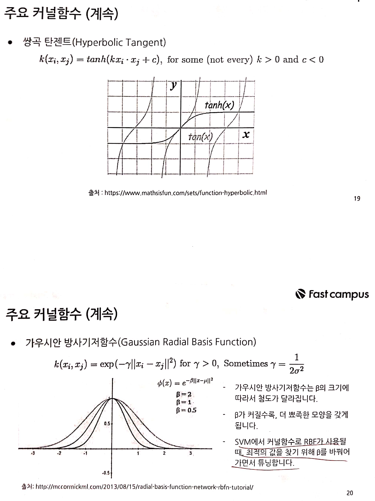

fastcampus\_머신러닝\_8
================
huimin
2019 7 21

# 기초 설정

``` r
library(tidyverse)
```

    ## Registered S3 methods overwritten by 'ggplot2':
    ##   method         from 
    ##   [.quosures     rlang
    ##   c.quosures     rlang
    ##   print.quosures rlang

    ## Registered S3 method overwritten by 'rvest':
    ##   method            from
    ##   read_xml.response xml2

    ## -- Attaching packages --------------------------------- tidyverse 1.2.1 --

    ## √ ggplot2 3.1.1       √ purrr   0.3.2  
    ## √ tibble  2.1.1       √ dplyr   0.8.0.1
    ## √ tidyr   0.8.3       √ stringr 1.4.0  
    ## √ readr   1.3.1       √ forcats 0.4.0

    ## -- Conflicts ------------------------------------ tidyverse_conflicts() --
    ## x dplyr::filter() masks stats::filter()
    ## x dplyr::lag()    masks stats::lag()

``` r
library(readr)
library(e1071) # 서포트 벡터 머신
library(caret)
```

    ## Loading required package: lattice

    ## 
    ## Attaching package: 'caret'

    ## The following object is masked from 'package:purrr':
    ## 
    ##     lift

``` r
library(MLmetrics)
```

    ## 
    ## Attaching package: 'MLmetrics'

    ## The following objects are masked from 'package:caret':
    ## 
    ##     MAE, RMSE

    ## The following object is masked from 'package:base':
    ## 
    ##     Recall

# 서포트 벡터 머신 알고리즘의 개요


# 초평면과 소프트 마진





# 서포트 벡터 머신 프로세스


# 서포트 벡터 머신 분류모형


# 서포트 벡터 머신 회귀모형


# 서포트 벡터 머신 분류모형 적합 실습

서포트 벡터 머신에 할당하는 데이터셋은 **데이터 표준화 처리**가 되어 있어야 한다. 그런데 **svm() 함수의 scale
인자가 자동으로 데이터 표준화를 실행**하므로, 편리하다.

목표변수가 범주형인 경우 type은 “C-classification” 으로 자동 할당된다. 분류모형의 경우 gamma와 cost를
별도로 지정해주지 않으면 기본값이 적용된다.

## 1\. 기본값으로 분류모형 적합하기

``` r
# 실습용 데이터 불러오기
load(file = "practice_data/RFC_Model.Rdata")

# 데이터 구조 다시 한 번 확인해보기
str(trainSet)
```

    ## 'data.frame':    3439 obs. of  12 variables:
    ##  $ fixed.acidity       : num  7 8.1 8.1 6.2 6.3 8.1 8.6 7.9 6.6 8.3 ...
    ##  $ volatile.acidity    : num  0.27 0.28 0.28 0.32 0.3 0.22 0.23 0.18 0.16 0.42 ...
    ##  $ citric.acid         : num  0.36 0.4 0.4 0.16 0.34 0.43 0.4 0.37 0.4 0.62 ...
    ##  $ residual.sugar      : num  20.7 6.9 6.9 7 1.6 ...
    ##  $ chlorides           : num  0.045 0.05 0.05 0.045 0.049 0.044 0.035 0.04 0.044 0.04 ...
    ##  $ free.sulfur.dioxide : num  45 30 30 30 14 28 17 16 48 41 ...
    ##  $ total.sulfur.dioxide: num  170 97 97 136 132 129 109 75 143 172 ...
    ##  $ density             : num  1.001 0.995 0.995 0.995 0.994 ...
    ##  $ pH                  : num  3 3.26 3.26 3.18 3.3 3.22 3.14 3.18 3.54 2.98 ...
    ##  $ sulphates           : num  0.45 0.44 0.44 0.47 0.49 0.45 0.53 0.63 0.52 0.67 ...
    ##  $ alcohol             : num  8.8 10.1 10.1 9.6 9.5 11 9.7 10.8 12.4 9.7 ...
    ##  $ grade               : Factor w/ 2 levels "best","good": 2 2 2 2 2 2 2 2 1 2 ...

``` r
# 기본값으로 분류모형 적합해보기
# probability를 TRUE로 할 경우, 모델에 확률 예측값들이 포함된다.
fit.svm0 <- svm(formula = grade ~.,
                data = trainSet,
                probability = TRUE)


# 적합한 모형 출력하기
print(fit.svm0)
```

    ## 
    ## Call:
    ## svm(formula = grade ~ ., data = trainSet, probability = TRUE)
    ## 
    ## 
    ## Parameters:
    ##    SVM-Type:  C-classification 
    ##  SVM-Kernel:  radial 
    ##        cost:  1 
    ##       gamma:  0.09090909 
    ## 
    ## Number of Support Vectors:  1444

``` r
# 비용상수
fit.svm0$cost
```

    ## [1] 1

``` r
# gamma
fit.svm0$gamma
```

    ## [1] 0.09090909

``` r
# 서포트 벡터 확인해보기
fit.svm0$SV %>% head(n = 10)
```

    ##    fixed.acidity volatile.acidity citric.acid residual.sugar  chlorides
    ## 27    0.05071745      -0.38171798   0.1190854     -1.0657270  0.2715294
    ## 28    0.16769754       0.02302342   0.4469100      0.4734017  0.2262920
    ## 41   -0.18324273      -0.48290333   0.4469100     -0.7658967  5.7000127
    ## 51    0.40165771      -0.88764472  -0.2087391     -0.9457949  0.7239030
    ## 55   -0.06626264      -0.78645937   2.0860329     -1.0857157  4.5690787
    ## 57    0.40165771      -0.68527402   0.0371293      1.1130396 -0.1356068
    ## 60    0.63561789      -0.78645937   0.2010416     -1.0257496 -0.3617937
    ## 61   -0.06626264      -0.58408867  -0.7824321     -0.2861683  2.0810238
    ## 79    0.63561789      -0.98883007  -0.2906953      0.4933904  0.8143777
    ## 81   -0.06626264      -0.58408867  -0.2087391     -0.9857723  0.3167668
    ##    free.sulfur.dioxide total.sulfur.dioxide    density         pH
    ## 27         -0.02366092            0.1714862 -0.3470535  1.7371168
    ## 28         -0.19593312            0.0549366  0.7163509  1.2760932
    ## 41          1.58421294            0.4512054 -0.1069300 -0.5021410
    ## 51         -0.25335718            0.8008543 -0.7929973  1.0785116
    ## 55          0.14861128           -0.1548527 -0.3470535 -0.8973042
    ## 57          0.09118721            1.7332514  0.7506543 -0.6338621
    ## 60          0.49315568           -0.6443612 -0.4842670  1.1443721
    ## 61         -0.31078125           -0.3646421  0.3733172 -1.0290252
    ## 79         -0.54047752           -0.8308406  0.7163509 -1.6217699
    ## 81         -0.08108499           -0.5744314 -0.3813569  1.3419537
    ##      sulphates      alcohol
    ## 27 -0.44104242 -0.407271858
    ## 28  0.34020315 -0.001963489
    ## 41 -1.13548293 -0.893641900
    ## 51 -0.44104242  0.970776597
    ## 55 -0.96187280 -1.136826922
    ## 57  0.07978796 -0.731518553
    ## 60 -1.30909305 -0.488333531
    ## 61 -0.26743229 -1.542135291
    ## 79  0.60061834 -0.974703574
    ## 81  2.42352468  0.079098185

``` r
# 서포트 벡터의 가중치 벡터 확인해보기
fit.svm0$coefs %>% head(n = 10)
```

    ##             [,1]
    ##  [1,] 1.00000000
    ##  [2,] 1.00000000
    ##  [3,] 0.06849885
    ##  [4,] 1.00000000
    ##  [5,] 0.15043035
    ##  [6,] 1.00000000
    ##  [7,] 0.02764265
    ##  [8,] 1.00000000
    ##  [9,] 1.00000000
    ## [10,] 1.00000000

``` r
# 입력변수별 가중치를 계산한다.
# %*%는 행렬의 곱셈이다.
weights <- apply(t(fit.svm0$coefs) %*% fit.svm0$SV,
                 MARGIN = 2,
                 FUN = function(x) sqrt(sum(x^2))) %>% 
  round(digits = 2) %>% 
  sort(decreasing = TRUE)

# 변수의 중요도를 출력한다.
print(weights)
```

    ##              alcohol     volatile.acidity        fixed.acidity 
    ##                19.22                17.56                17.21 
    ##              density            sulphates            chlorides 
    ##                16.37                14.16                12.59 
    ##                   pH  free.sulfur.dioxide total.sulfur.dioxide 
    ##                10.89                10.39                 3.52 
    ##       residual.sugar          citric.acid 
    ##                 1.41                 0.32

``` r
# 오분류된 수를 확인한다.
sum(fit.svm0$fitted != trainSet$grade)
```

    ## [1] 506

``` r
# 오분류율을 구한다.
100 * sum(fit.svm0$fitted != trainSet$grade) / nrow(trainSet)
```

    ## [1] 14.71358

## 2\. 분류모형의 성능 평가하기

``` r
# 확률 예측값
tr.prod <- predict(object = fit.svm0, 
                   newdata = trainSet,
                   probability = TRUE) %>% attr(which = "probabilities")

# 예측값
tr.pred <- fit.svm0$fitted

# 실제값
tr.real <- trainSet$grade

# 혼돈행렬
confusionMatrix(tr.pred, tr.real)
```

    ## Confusion Matrix and Statistics
    ## 
    ##           Reference
    ## Prediction best good
    ##       best  284   67
    ##       good  439 2649
    ##                                           
    ##                Accuracy : 0.8529          
    ##                  95% CI : (0.8406, 0.8645)
    ##     No Information Rate : 0.7898          
    ##     P-Value [Acc > NIR] : < 2.2e-16       
    ##                                           
    ##                   Kappa : 0.4538          
    ##                                           
    ##  Mcnemar's Test P-Value : < 2.2e-16       
    ##                                           
    ##             Sensitivity : 0.39281         
    ##             Specificity : 0.97533         
    ##          Pos Pred Value : 0.80912         
    ##          Neg Pred Value : 0.85784         
    ##              Prevalence : 0.21024         
    ##          Detection Rate : 0.08258         
    ##    Detection Prevalence : 0.10206         
    ##       Balanced Accuracy : 0.68407         
    ##                                           
    ##        'Positive' Class : best            
    ## 

``` r
# F1 점수
F1_Score(tr.pred, tr.real)
```

    ## [1] 0.5288641

``` r
# 시험셋에 적용해보기
te.pred <- predict(object = fit.svm0, newdata = testSet)
te.real <- testSet$grade

# 혼돈행렬
confusionMatrix(te.pred, te.real)
```

    ## Confusion Matrix and Statistics
    ## 
    ##           Reference
    ## Prediction best good
    ##       best   92   41
    ##       good  245 1081
    ##                                           
    ##                Accuracy : 0.804           
    ##                  95% CI : (0.7827, 0.8241)
    ##     No Information Rate : 0.769           
    ##     P-Value [Acc > NIR] : 0.0007103       
    ##                                           
    ##                   Kappa : 0.3             
    ##                                           
    ##  Mcnemar's Test P-Value : < 2.2e-16       
    ##                                           
    ##             Sensitivity : 0.27300         
    ##             Specificity : 0.96346         
    ##          Pos Pred Value : 0.69173         
    ##          Neg Pred Value : 0.81523         
    ##              Prevalence : 0.23098         
    ##          Detection Rate : 0.06306         
    ##    Detection Prevalence : 0.09116         
    ##       Balanced Accuracy : 0.61823         
    ##                                           
    ##        'Positive' Class : best            
    ## 

``` r
# F1 점수
F1_Score(te.pred, te.real)
```

    ## [1] 0.3914894

## 3\. 분류모형 튜닝 실습

**tune.svm() 함수**를 이용하여 튜닝한다. 탐색할 **gamma와 cost의 범위를 분석가가 선정**한 다음
tune.svm() 함수에 할당하면 된다. tune.svm()함수는 최적 모형일 때의 하이퍼 파라미터를 제시한다.

``` r
# 결과를 항상 동일하게 만들기
set.seed(123)

fit.svm1 <- tune.svm(x = trainSet[, -12],
                     y = trainSet[, 12],
                     gamma = seq(from = 0, to = 3, by = 0.5),
                     cost = seq(from = 1, to = 5, by = 1))


# 베스트 하이퍼 파라미터를 확인한다.
print(fit.svm1)
```

    ## 
    ## Parameter tuning of 'svm':
    ## 
    ## - sampling method: 10-fold cross validation 
    ## 
    ## - best parameters:
    ##  gamma cost
    ##    0.5    2
    ## 
    ## - best performance: 0.133476

``` r
fit.svm1$best.parameters$gamma
```

    ## [1] 0.5

``` r
fit.svm1$best.parameters$cost
```

    ## [1] 2

``` r
# 튜닝 결과를 2차원 그래프로 그리면, gamma와 cost의 최적값 범위를 확인할 수 있다.
# 이 범위를 이용하여 색이 진한 부분으로 범위를 좁혀 튜닝을 다시 할 수도 있다.
plot(fit.svm1)
```

<!-- -->

``` r
# 베스트 모형을 적합한다.
fit.svm2 <- svm(formula = grade ~.,
                data = trainSet,
                probability = TRUE,
                gamma = fit.svm1$best.parameters$gamma,
                cost = fit.svm1$best.parameters$cost)


# 변수의 중요도를 계산하여, 객체에 저장한다.
weights <- apply(t(fit.svm2$coefs) %*% fit.svm2$SV,
                 MARGIN = 2,
                 FUN = function(x) sqrt(sum(x^2))) %>% round(digits = 2) %>% 
  sort(decreasing = TRUE)

# 변수의 중요도 출력
print(weights)
```

    ##              alcohol            chlorides              density 
    ##               171.91               139.03               118.58 
    ##        fixed.acidity                   pH            sulphates 
    ##                87.63                83.14                69.51 
    ##     volatile.acidity total.sulfur.dioxide  free.sulfur.dioxide 
    ##                65.31                55.54                31.19 
    ##       residual.sugar          citric.acid 
    ##                22.20                 8.45

``` r
# 오분류된 수를 확인한다.
sum(fit.svm2$fitted != trainSet$grade)
```

    ## [1] 127

``` r
# 오분류율을 계산한다.
100 * sum(fit.svm2$fitted != trainSet$grade) / nrow(trainSet)
```

    ## [1] 3.692934

## 4\. 튜닝 전 후의 성능 비교

아래의 결과를 보면 알 수 있듯이, 성능이 매우 크게 향상되었다.

``` r
# 튜닝 전 혼동행렬과 F1 점수
confusionMatrix(te.pred, te.real)
```

    ## Confusion Matrix and Statistics
    ## 
    ##           Reference
    ## Prediction best good
    ##       best   92   41
    ##       good  245 1081
    ##                                           
    ##                Accuracy : 0.804           
    ##                  95% CI : (0.7827, 0.8241)
    ##     No Information Rate : 0.769           
    ##     P-Value [Acc > NIR] : 0.0007103       
    ##                                           
    ##                   Kappa : 0.3             
    ##                                           
    ##  Mcnemar's Test P-Value : < 2.2e-16       
    ##                                           
    ##             Sensitivity : 0.27300         
    ##             Specificity : 0.96346         
    ##          Pos Pred Value : 0.69173         
    ##          Neg Pred Value : 0.81523         
    ##              Prevalence : 0.23098         
    ##          Detection Rate : 0.06306         
    ##    Detection Prevalence : 0.09116         
    ##       Balanced Accuracy : 0.61823         
    ##                                           
    ##        'Positive' Class : best            
    ## 

``` r
F1_Score(te.pred, te.real)
```

    ## [1] 0.3914894

``` r
# 튜닝 후 혼동행렬과 F1 점수
te.pred <- predict(object = fit.svm2, newdata = testSet)
te.real <- testSet$grade

confusionMatrix(te.pred, te.real)
```

    ## Confusion Matrix and Statistics
    ## 
    ##           Reference
    ## Prediction best good
    ##       best  160   53
    ##       good  177 1069
    ##                                           
    ##                Accuracy : 0.8424          
    ##                  95% CI : (0.8226, 0.8607)
    ##     No Information Rate : 0.769           
    ##     P-Value [Acc > NIR] : 2.594e-12       
    ##                                           
    ##                   Kappa : 0.4907          
    ##                                           
    ##  Mcnemar's Test P-Value : 5.046e-16       
    ##                                           
    ##             Sensitivity : 0.4748          
    ##             Specificity : 0.9528          
    ##          Pos Pred Value : 0.7512          
    ##          Neg Pred Value : 0.8579          
    ##              Prevalence : 0.2310          
    ##          Detection Rate : 0.1097          
    ##    Detection Prevalence : 0.1460          
    ##       Balanced Accuracy : 0.7138          
    ##                                           
    ##        'Positive' Class : best            
    ## 

``` r
F1_Score(te.pred, te.real)
```

    ## [1] 0.5818182

# 서포트 벡터 머신 회귀모형 적합 실습

목표변수가 연속형인 경우 type은 “eps-regression”으로 자동 할당된다. 회귀모형 또한, gamma와 cost 및
epsilon을 별도로 지정해주지 않으면 기본값이 적용된다.

**주의해야 할 점은 서포트 벡터 머신의 경우, 입력변수가 모두 숫자형이어야 한다.** svm() 함수에 숫자형이 아닌 컬럼이
포함되면 자동으로 데이터 표준화를 실행할 때 제외한다.

따라서 범주형 컬럼의 경우에는 이진형일 경우 -1 또는 1로 변경하고, 다항이면 각 레벨을 이진형으로 나누어 변경한다. 예를
들어, 직업 컬럼에 학생, 회사원, 주부와 같이 3개의 레벨로 되어 있다면 직업\_학생, 직업\_회사원, 직업\_주부와
같이 3개의 변수를 생성한 다음 각각을 -1 또는 1로 인코딩하는 것이다. **(더미변수가 아니다 아무래도 0을
숫자형이라고 생각하지 않는 모양이다.)**

## 1\. 데이터 전처리 하기

``` r
# 실습용 데이터 불러오기
load(file = "practice_data/RFR_Model.Rdata")

# 데이터의 인코딩 형식 변환하기
colnames(trainSet) <- iconv(colnames(trainSet), from = "UTF-8", to = "EUC-KR")
colnames(testSet) <- iconv(colnames(testSet), from = "UTF-8", to = "EUC-KR")

# 구조 확인하기
str(trainSet)
```

    ## 'data.frame':    1064 obs. of  11 variables:
    ##  $ 전용면적    : num  33.8 35.7 35.7 114.3 114.3 ...
    ##  $ 층          : int  7 1 11 13 3 9 7 8 4 1 ...
    ##  $ 경비인원    : int  5 9 9 9 9 9 9 9 9 9 ...
    ##  $ 총세대수    : num  176 644 644 644 644 644 644 644 644 644 ...
    ##  $ 총주차대수  : num  276 684 684 684 684 684 684 684 684 684 ...
    ##  $ 주거전용면적: num  9680 45646 45646 45646 45646 ...
    ##  $ 경과년수    : num  11 20 20 20 20 20 20 20 20 20 ...
    ##  $ 계단식      : Factor w/ 2 levels "0","1": 1 2 2 2 2 2 2 2 2 2 ...
    ##  $ 개별난방    : Factor w/ 2 levels "0","1": 2 2 2 2 2 2 2 2 2 2 ...
    ##  $ 브랜드사    : Factor w/ 2 levels "0","1": 2 1 1 1 1 1 1 1 1 1 ...
    ##  $ 거래금액    : num  32900 58500 66500 124500 115000 ...

``` r
str(testSet)
```

    ## 'data.frame':    452 obs. of  11 variables:
    ##  $ 전용면적    : num  31.8 35.7 84.5 35.7 84.5 ...
    ##  $ 층          : int  4 9 6 2 3 12 8 6 1 10 ...
    ##  $ 경비인원    : int  3 9 9 9 9 11 16 16 16 20 ...
    ##  $ 총세대수    : num  155 644 644 644 644 168 416 416 416 405 ...
    ##  $ 총주차대수  : num  123 684 684 684 684 289 453 453 453 419 ...
    ##  $ 주거전용면적: num  4261 45646 45646 45646 45646 ...
    ##  $ 경과년수    : num  13 20 20 20 20 13 33 33 33 33 ...
    ##  $ 계단식      : Factor w/ 2 levels "0","1": 1 2 2 2 2 1 2 2 2 2 ...
    ##  $ 개별난방    : Factor w/ 2 levels "0","1": 2 2 2 2 2 2 1 1 1 1 ...
    ##  $ 브랜드사    : Factor w/ 2 levels "0","1": 2 1 1 1 1 2 2 2 2 1 ...
    ##  $ 거래금액    : num  27000 68000 92500 60400 102400 ...

``` r
# 데이터셋에서 범주형 자료를 숫자형으로 변경해주기 (-1 과 1로)
trainSet[, 8:10] <- sapply(trainSet[, 8:10],
                           FUN = function(x) ifelse(as.numeric(x) == 1, -1, 1)) %>% 
  as.data.frame()

testSet[, 8:10] <- sapply(testSet[, 8:10],
                           FUN = function(x) ifelse(as.numeric(x) == 1, -1, 1)) %>% 
  as.data.frame()
```

## 2\. 서포트 벡터 머신 회귀모형을 적합한다.

``` r
# 기본값으로 모형 적합하기
fit.svr0 <- svm(formula = 거래금액 ~.,
                data = trainSet)


# 분류모형에서 했던 과정들은 생략하고, 바로 변수의 중요도 측정하기
weights <- apply(t(fit.svr0$coefs) %*% fit.svr0$SV,
                 MARGIN = 2,
                 FUN = function(x) sqrt(sum(x^2))) %>% round(digits = 2) %>% 
  sort(decreasing = TRUE)

print(weights)
```

    ##     전용면적           층     경비인원 주거전용면적     개별난방 
    ##        44.96        10.87         9.19         8.47         6.35 
    ##       계단식     브랜드사     경과년수   총주차대수     총세대수 
    ##         5.70         3.53         3.44         2.10         1.81

``` r
# 회귀모형의 성능평가 지표 RMSE 측정하기
RMSE(fit.svr0$fitted, trainSet$거래금액)
```

    ## [1] 17048.55

## 3\. 회귀모형 튜닝 실습

``` r
set.seed(123)

# 최적의 파라미터 찾기
tune.svr <- tune.svm(x = trainSet[, Xvars],
                     y = trainSet[, yvar],
                     gamma = seq(from = 0, to = 3, by = 0.5),
                     cost = seq(from = 1, to = 5, by = 1),
                     epsilon = seq(from = 0, to = 1, by = 0.1))


# 최적의 파라미터
# 회귀모형의 경우 파라미터가 3가지이기 때문에, 그래프로 출력할 수 없다.
tune.svr$best.parameters$gamma
```

    ## [1] 0.5

``` r
tune.svr$best.parameters$cost
```

    ## [1] 4

``` r
tune.svr$best.parameters$epsilon
```

    ## [1] 0

``` r
# 최적의 회귀모형 적합하기
fit.svr1 <- svm(formula = 거래금액 ~.,
                data = trainSet,
                probability = TRUE,
                gamma = tune.svr$best.parameters$gamma,
                cost = tune.svr$best.parameters$cost,
                epsilon = tune.svr$best.parameters$epsilon)


# 변수의 중요도
weights <- apply(t(fit.svr1$coefs) %*% fit.svr1$SV,
                 MARGIN = 2,
                 FUN = function(x) sqrt(sum(x^2))) %>% round(digits = 2) %>% 
  sort(decreasing = TRUE)

print(weights)
```

    ##     전용면적           층 주거전용면적     경비인원     개별난방 
    ##       121.44        44.06        42.42        38.94        34.44 
    ##   총주차대수       계단식     총세대수     브랜드사     경과년수 
    ##        33.51        19.43        17.89        14.93        11.72

## 4\. 튜닝 전 후 RMSE값 비교해보기

아래의 결과를 보면 알 수 있듯이, 성능이 매우 크게 개선되었다.

``` r
# 튜닝 전
RMSE(fit.svr0$fitted, trainSet$거래금액)
```

    ## [1] 17048.55

``` r
# 튜닝 후
RMSE(fit.svr1$fitted, trainSet$거래금액)
```

    ## [1] 8694.82
