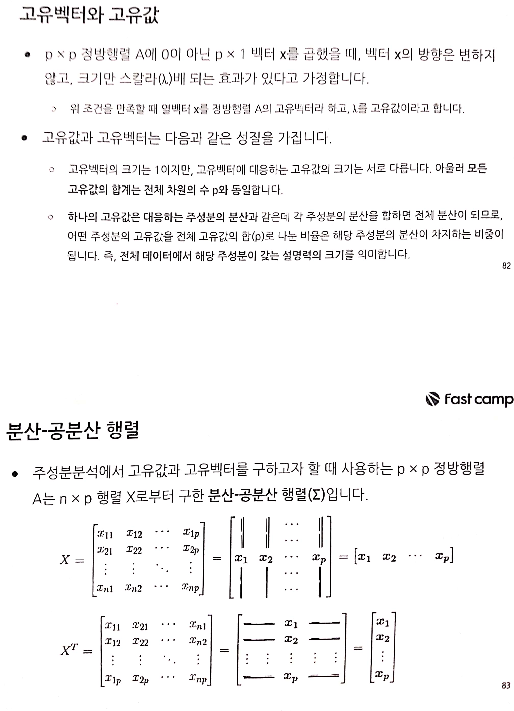

fastcampus\_머신러닝\_9
================
huimin
2019 7 23

# 기초 설정

``` r
library(tidyverse)
```

    ## Registered S3 methods overwritten by 'ggplot2':
    ##   method         from 
    ##   [.quosures     rlang
    ##   c.quosures     rlang
    ##   print.quosures rlang

    ## Registered S3 method overwritten by 'rvest':
    ##   method            from
    ##   read_xml.response xml2

    ## -- Attaching packages --------------------------------- tidyverse 1.2.1 --

    ## √ ggplot2 3.1.1       √ purrr   0.3.2  
    ## √ tibble  2.1.1       √ dplyr   0.8.0.1
    ## √ tidyr   0.8.3       √ stringr 1.4.0  
    ## √ readr   1.3.1       √ forcats 0.4.0

    ## -- Conflicts ------------------------------------ tidyverse_conflicts() --
    ## x dplyr::filter() masks stats::filter()
    ## x dplyr::lag()    masks stats::lag()

``` r
library(readr)
```

# 주성분분석 알고리즘의 개요


# 주성분분석 프로세스


# 주성분분석 알고리즘




# 주성분분석 실행 및 결과 해석


# 다차원 척도법


# 주성분 분석 실습 : 미국 범죄 데이터

R 내장 데이터셋인 USArrests로 주성분 분석을 실습한다. 이 데이터셋은 미국의 50개 주에 대해 Murder(살인),
Assault(폭행), UrbanPop(도시인구), Rape(강간) 등 4개의 숫자형 컬럼으로 구성된 간단한 데이터프레임이다.

Murder, Assault, Rape은 인구 10만 당 발생된 건수를 의미하며, UrbanPop은 도시인구의 비중이다.

## 1\. 주성분 분석 객체 생성하기

``` r
# 내장형 데이터 불러오기
data("USArrests")

# 데이터 구조 확인하기
str(USArrests)
```

    ## 'data.frame':    50 obs. of  4 variables:
    ##  $ Murder  : num  13.2 10 8.1 8.8 9 7.9 3.3 5.9 15.4 17.4 ...
    ##  $ Assault : int  236 263 294 190 276 204 110 238 335 211 ...
    ##  $ UrbanPop: int  58 48 80 50 91 78 77 72 80 60 ...
    ##  $ Rape    : num  21.2 44.5 31 19.5 40.6 38.7 11.1 15.8 31.9 25.8 ...

``` r
head(USArrests)
```

    ##            Murder Assault UrbanPop Rape
    ## Alabama      13.2     236       58 21.2
    ## Alaska       10.0     263       48 44.5
    ## Arizona       8.1     294       80 31.0
    ## Arkansas      8.8     190       50 19.5
    ## California    9.0     276       91 40.6
    ## Colorado      7.9     204       78 38.7

``` r
# 변수들을 표준화한다. (평균 0, 표준편차 1)
usa.scaled <- scale(USArrests)
head(usa.scaled, n = 10)
```

    ##                  Murder    Assault   UrbanPop         Rape
    ## Alabama      1.24256408  0.7828393 -0.5209066 -0.003416473
    ## Alaska       0.50786248  1.1068225 -1.2117642  2.484202941
    ## Arizona      0.07163341  1.4788032  0.9989801  1.042878388
    ## Arkansas     0.23234938  0.2308680 -1.0735927 -0.184916602
    ## California   0.27826823  1.2628144  1.7589234  2.067820292
    ## Colorado     0.02571456  0.3988593  0.8608085  1.864967207
    ## Connecticut -1.03041900 -0.7290821  0.7917228 -1.081740768
    ## Delaware    -0.43347395  0.8068381  0.4462940 -0.579946294
    ## Florida      1.74767144  1.9707777  0.9989801  1.138966691
    ## Georgia      2.20685994  0.4828549 -0.3827351  0.487701523

``` r
# 표준화된 데이터셋의 분산-공분산 행렬
# 대각성분은 각 변수의 분산이고, 삼각행렬의 성분은 공분산이다.
var(usa.scaled)
```

    ##              Murder   Assault   UrbanPop      Rape
    ## Murder   1.00000000 0.8018733 0.06957262 0.5635788
    ## Assault  0.80187331 1.0000000 0.25887170 0.6652412
    ## UrbanPop 0.06957262 0.2588717 1.00000000 0.4113412
    ## Rape     0.56357883 0.6652412 0.41134124 1.0000000

``` r
# 분산-공분산 행렬로부터 고유값과 고유벡터를 출력한다.
eigen(x = var(usa.scaled))
```

    ## eigen() decomposition
    ## $values
    ## [1] 2.4802416 0.9897652 0.3565632 0.1734301
    ## 
    ## $vectors
    ##            [,1]       [,2]       [,3]        [,4]
    ## [1,] -0.5358995  0.4181809 -0.3412327  0.64922780
    ## [2,] -0.5831836  0.1879856 -0.2681484 -0.74340748
    ## [3,] -0.2781909 -0.8728062 -0.3780158  0.13387773
    ## [4,] -0.5434321 -0.1673186  0.8177779  0.08902432

``` r
# princomp() 함수로 주성분 분석을 실행한다.
fit.pca <- princomp(x = usa.scaled, cor = TRUE)

# 객체의 구조를 확인한다.
str(fit.pca)
```

    ## List of 7
    ##  $ sdev    : Named num [1:4] 1.575 0.995 0.597 0.416
    ##   ..- attr(*, "names")= chr [1:4] "Comp.1" "Comp.2" "Comp.3" "Comp.4"
    ##  $ loadings: 'loadings' num [1:4, 1:4] 0.536 0.583 0.278 0.543 0.418 ...
    ##   ..- attr(*, "dimnames")=List of 2
    ##   .. ..$ : chr [1:4] "Murder" "Assault" "UrbanPop" "Rape"
    ##   .. ..$ : chr [1:4] "Comp.1" "Comp.2" "Comp.3" "Comp.4"
    ##  $ center  : Named num [1:4] -7.39e-17 9.37e-17 -4.53e-16 1.02e-16
    ##   ..- attr(*, "names")= chr [1:4] "Murder" "Assault" "UrbanPop" "Rape"
    ##  $ scale   : Named num [1:4] 0.99 0.99 0.99 0.99
    ##   ..- attr(*, "names")= chr [1:4] "Murder" "Assault" "UrbanPop" "Rape"
    ##  $ n.obs   : int 50
    ##  $ scores  : num [1:50, 1:4] 0.986 1.95 1.763 -0.141 2.524 ...
    ##   ..- attr(*, "dimnames")=List of 2
    ##   .. ..$ : chr [1:50] "Alabama" "Alaska" "Arizona" "Arkansas" ...
    ##   .. ..$ : chr [1:4] "Comp.1" "Comp.2" "Comp.3" "Comp.4"
    ##  $ call    : language princomp(x = usa.scaled, cor = TRUE)
    ##  - attr(*, "class")= chr "princomp"

**주성분 분석 객체의 구조 해석**

  - sdev : 주성분의 표준편차이다. 제곱하면 고유값이 된다.(p)
  - loadings : 주성분의 고유벡터이다. (p\*p)
  - center : 표준화된 변수의 중심이다. (p)
  - scale : 표준화 전 변수의 표준편차이다. (p)
  - scores : 주성분 점수이다. 제 1, 2 주성분 점수로 행렬도를 그린다. (n\*p)

## 2\. 객체 구조와 각각의 값들 확인하기

``` r
# 고유값
(fit.pca$sdev)^2
```

    ##    Comp.1    Comp.2    Comp.3    Comp.4 
    ## 2.4802416 0.9897652 0.3565632 0.1734301

``` r
# 고유값 합계
# 표준화된 공분산 행렬을 이용하는 경우, 데이터의 전체 분산은 차원의 수(p)와 같다.
sum(fit.pca$sdev^2)
```

    ## [1] 4

``` r
# 고유벡터
fit.pca$loadings
```

    ## 
    ## Loadings:
    ##          Comp.1 Comp.2 Comp.3 Comp.4
    ## Murder    0.536  0.418  0.341  0.649
    ## Assault   0.583  0.188  0.268 -0.743
    ## UrbanPop  0.278 -0.873  0.378  0.134
    ## Rape      0.543 -0.167 -0.818       
    ## 
    ##                Comp.1 Comp.2 Comp.3 Comp.4
    ## SS loadings      1.00   1.00   1.00   1.00
    ## Proportion Var   0.25   0.25   0.25   0.25
    ## Cumulative Var   0.25   0.50   0.75   1.00

``` r
# 변수들의 중심
fit.pca$center
```

    ##        Murder       Assault      UrbanPop          Rape 
    ## -7.394259e-17  9.367507e-17 -4.528712e-16  1.016168e-16

``` r
# 표준화된 데이터셋의 평균 출력하기
apply(X = usa.scaled,
      MARGIN = 2,
      FUN = mean)
```

    ##        Murder       Assault      UrbanPop          Rape 
    ## -7.663087e-17  1.112408e-16 -4.332808e-16  8.942391e-17

``` r
# 표준화된 데이터셋의 표준편차 출력
fit.pca$scale
```

    ##    Murder   Assault  UrbanPop      Rape 
    ## 0.9899495 0.9899495 0.9899495 0.9899495

``` r
# 표준화된 전 변수들의 표준편차 출력
apply(X = usa.scaled, 
      MARGIN = 2,
      FUN = sd)
```

    ##   Murder  Assault UrbanPop     Rape 
    ##        1        1        1        1

``` r
# 주성분 점수
head(fit.pca$scores, n = 10)
```

    ##                  Comp.1      Comp.2      Comp.3       Comp.4
    ## Alabama      0.98556588  1.13339238  0.44426879  0.156267145
    ## Alaska       1.95013775  1.07321326 -2.04000333 -0.438583440
    ## Arizona      1.76316354 -0.74595678 -0.05478082 -0.834652924
    ## Arkansas    -0.14142029  1.11979678 -0.11457369 -0.182810896
    ## California   2.52398013 -1.54293399 -0.59855680 -0.341996478
    ## Colorado     1.51456286 -0.98755509 -1.09500699  0.001464887
    ## Connecticut -1.35864746 -1.08892789  0.64325757 -0.118469414
    ## Delaware     0.04770931 -0.32535892  0.71863294 -0.881977637
    ## Florida      3.01304227  0.03922851  0.57682949 -0.096284752
    ## Georgia      1.63928304  1.27894240  0.34246008  1.076796812

주성분의 표준편차와 분산의 비율, 즉 누적 비율을 통해 주성분의 설명력을 확인한다. 주로 제 1, 2 주성분을 선택하며, 그 때의
**누적 비율(Cumulative Proportion)**을 참고한다.

``` r
summary(fit.pca)
```

    ## Importance of components:
    ##                           Comp.1    Comp.2    Comp.3     Comp.4
    ## Standard deviation     1.5748783 0.9948694 0.5971291 0.41644938
    ## Proportion of Variance 0.6200604 0.2474413 0.0891408 0.04335752
    ## Cumulative Proportion  0.6200604 0.8675017 0.9566425 1.00000000

위에 나와있듯이, 1\~2 주성분으로 전체 데이터셋의 분산 중 약 86%를 설명할 수 있다.

``` r
plot(x = fit.pca,
     type = "l")

abline(h = 1, col = "red", lty = 2)
```

<!-- -->

또한, Scree Plot을 그려 주성분 개수를 정하는 데 참고할 수 있다. **분산이 감소하다가 완만해지는 지점(Elbow
Point)**까지 주성분에 포함하면 된다. 이번 예제에서는 2번과 2번과 3번에서 완만해지지만, 뚜렷하게 감소하는 지점은 없다.

## 3\. 행렬도(biplot)를 통해 주성분분석 결과를 확인한다.

행렬도는 다차원의 데이터를 2차원의 평면에 관측치와 입력변수를 동시에 보여주는 그래프이다. 제 1, 2 주성분 평면 위에 50개
주의 위치를 출력하고, 4개 입력변수 벡터의 방향을 확인한다.

``` r
biplot(x = fit.pca,
       cex = c(0.8, 1.0),
       font = 2)
```

<!-- -->

Murder, Assault, Rape의 방향이 비슷하여 상관관계가 높다. **이들 벡터와 반대방향인 것은 관계가 없다고
해석한다.**

# 다차원 척도법(MDS) 실습

``` r
# 실습용 데이터는 그대로 usa를 사용하겠다.

# dist 함수를 사용하여 레코드간 거리 계산하기
usa.dist <- dist(x = usa.scaled,
                 method = "euclid")

# 다차원 척도법은 cmdscale() 함수의 d 인자에 거리 데이터를 할당한다.
# k 인자에는 축소할 차원수를 입력한다. (1~2 주성분만 사용하므로 2를 할당하겠다.)
# eig 인자에 TRUE를 할당하면 고유값을 반환한다.
fit.mds <- cmdscale(d = usa.dist,
                    k = 2,
                    eig = TRUE)

print(fit.mds)
```

    ## $points
    ##                       [,1]        [,2]
    ## Alabama        -0.97566045 -1.12200121
    ## Alaska         -1.93053788 -1.06242692
    ## Arizona        -1.74544285  0.73845954
    ## Arkansas        0.13999894 -1.10854226
    ## California     -2.49861285  1.52742672
    ## Colorado       -1.49934074  0.97762966
    ## Connecticut     1.34499236  1.07798362
    ## Delaware       -0.04722981  0.32208890
    ## Florida        -2.98275967 -0.03883425
    ## Georgia        -1.62280742 -1.26608838
    ## Hawaii          0.90348448  1.55467609
    ## Idaho           1.62331903 -0.20885253
    ## Illinois       -1.36505197  0.67498834
    ## Indiana         0.50038122  0.15003926
    ## Iowa            2.23099579  0.10300828
    ## Kansas          0.78887206  0.26744941
    ## Kentucky        0.74331256 -0.94880748
    ## Louisiana      -1.54909076 -0.86230011
    ## Maine           2.37274014 -0.37260865
    ## Maryland       -1.74564663 -0.42335704
    ## Massachusetts   0.48128007  1.45967706
    ## Michigan       -2.08725025  0.15383500
    ## Minnesota       1.67566951  0.62590670
    ## Mississippi    -0.98647919 -2.36973712
    ## Missouri       -0.68978426  0.26070794
    ## Montana         1.17353751 -0.53147851
    ## Nebraska        1.25291625  0.19200440
    ## Nevada         -2.84550542  0.76780502
    ## New Hampshire   2.35995585  0.01790055
    ## New Jersey     -0.17974128  1.43493745
    ## New Mexico     -1.96012351 -0.14141308
    ## New York       -1.66566662  0.81491072
    ## North Carolina -1.11208808 -2.20561081
    ## North Dakota    2.96215223 -0.59309738
    ## Ohio            0.22369436  0.73477837
    ## Oklahoma        0.30864928  0.28496113
    ## Oregon         -0.05852787  0.53596999
    ## Pennsylvania    0.87948680  0.56536050
    ## Rhode Island    0.85509072  1.47698328
    ## South Carolina -1.30744986 -1.91397297
    ## South Dakota    1.96779669 -0.81506822
    ## Tennessee      -0.98969377 -0.85160534
    ## Texas          -1.34151838  0.40833518
    ## Utah            0.54503180  1.45671524
    ## Vermont         2.77325613 -1.38819435
    ## Virginia        0.09536670 -0.19772785
    ## Washington      0.21472339  0.96037394
    ## West Virginia   2.08739306 -1.41052627
    ## Wisconsin       2.05881199  0.60512507
    ## Wyoming         0.62310061 -0.31778662
    ## 
    ## $eig
    ##  [1]  1.215318e+02  4.849849e+01  1.747160e+01  8.498074e+00  2.244795e-14
    ##  [6]  1.315233e-14  1.014419e-14  5.324071e-15  4.266770e-15  3.536758e-15
    ## [11]  3.529033e-15  3.317139e-15  2.593104e-15  2.557429e-15  2.146988e-15
    ## [16]  1.902191e-15  1.811596e-15  1.652006e-15  1.627347e-15  1.457171e-15
    ## [21]  1.171876e-15  1.082660e-15  9.970642e-16  8.680005e-16  6.200689e-16
    ## [26]  6.148299e-16  1.326028e-16 -2.703647e-16 -2.733425e-16 -2.916598e-16
    ## [31] -3.012387e-16 -3.399632e-16 -3.620532e-16 -4.432199e-16 -6.746649e-16
    ## [36] -8.020359e-16 -1.088550e-15 -1.634119e-15 -1.654199e-15 -1.949845e-15
    ## [41] -2.150540e-15 -2.182068e-15 -2.945136e-15 -2.975344e-15 -3.424436e-15
    ## [46] -3.728919e-15 -3.817835e-15 -3.892399e-15 -4.759355e-15 -6.293687e-15
    ## 
    ## $x
    ## NULL
    ## 
    ## $ac
    ## [1] 0
    ## 
    ## $GOF
    ## [1] 0.8675017 0.8675017

``` r
# 그래프를 그려보기

# type에 n을 입력하면, 점이 출력되지 않는다.
plot(x = fit.mds$points[, 1],
     y = fit.mds$points[, 2],
     type = "n",
     xlab = "PC1",
     ylab = "PC2",
     main = "Multidimensional Scaling")

# 점 대신 행이름을 출력하도록 하기 위해서이다.
text(x = fit.mds$points[, 1],
     y = fit.mds$points[, 2],
     labels = rownames(usa.scaled),
     cex = 1.0,
     font = 2)
```

<!-- -->
