fastcampus\_머신러닝\_10
================
huimin
2019 7 24

# 기초 설정

``` r
library(tidyverse)
```

    ## Registered S3 methods overwritten by 'ggplot2':
    ##   method         from 
    ##   [.quosures     rlang
    ##   c.quosures     rlang
    ##   print.quosures rlang

    ## Registered S3 method overwritten by 'rvest':
    ##   method            from
    ##   read_xml.response xml2

    ## -- Attaching packages --------------------------------- tidyverse 1.2.1 --

    ## √ ggplot2 3.1.1       √ purrr   0.3.2  
    ## √ tibble  2.1.1       √ dplyr   0.8.0.1
    ## √ tidyr   0.8.3       √ stringr 1.4.0  
    ## √ readr   1.3.1       √ forcats 0.4.0

    ## -- Conflicts ------------------------------------ tidyverse_conflicts() --
    ## x dplyr::filter() masks stats::filter()
    ## x dplyr::lag()    masks stats::lag()

``` r
library(readr)
```

# 요인 분석 개요

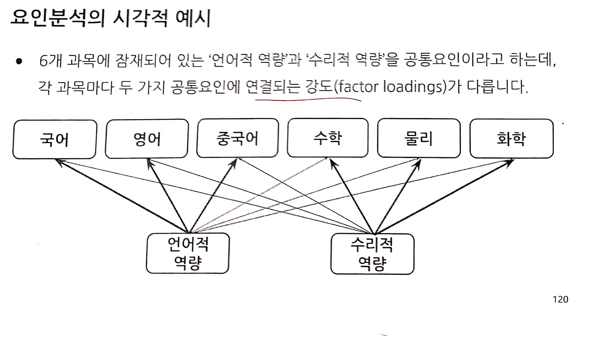

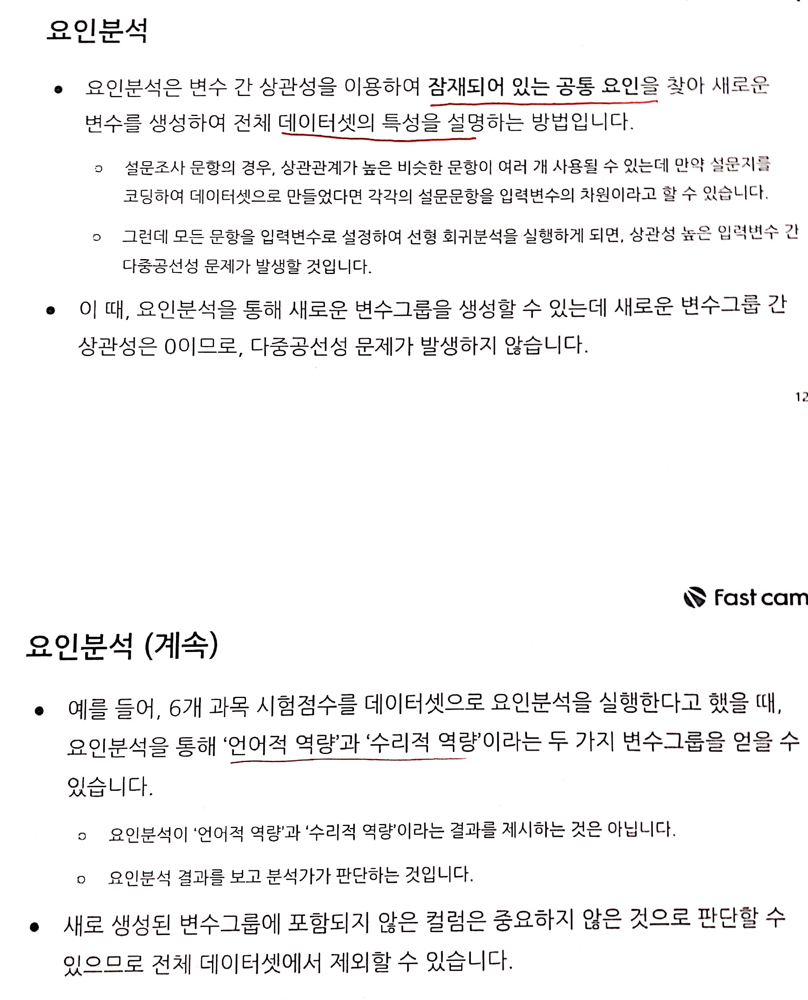

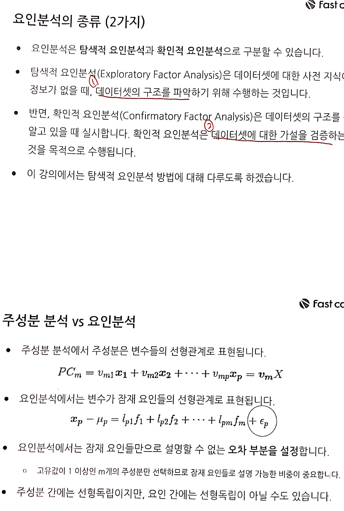

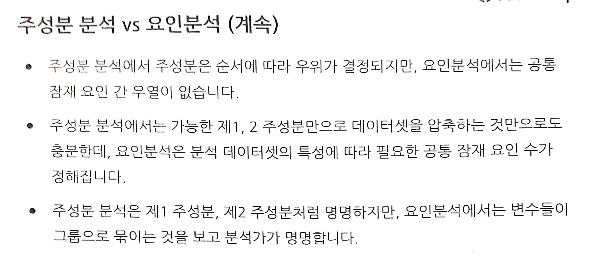

결국 주성분 분석과 요인 분석 모두, 데이터 탐색에 도움을 주는 방법이라는 말이다. 개념에는 차이가 있지만, 사용법은 비슷할 수
있다.

# 요인모형과 요인점수의 추정

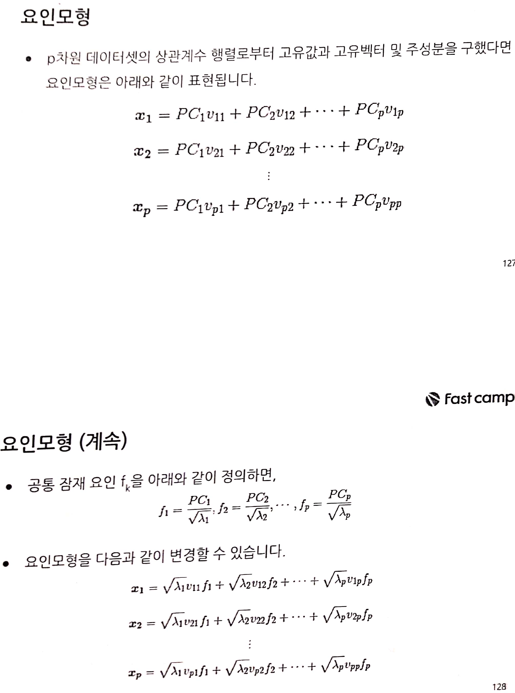

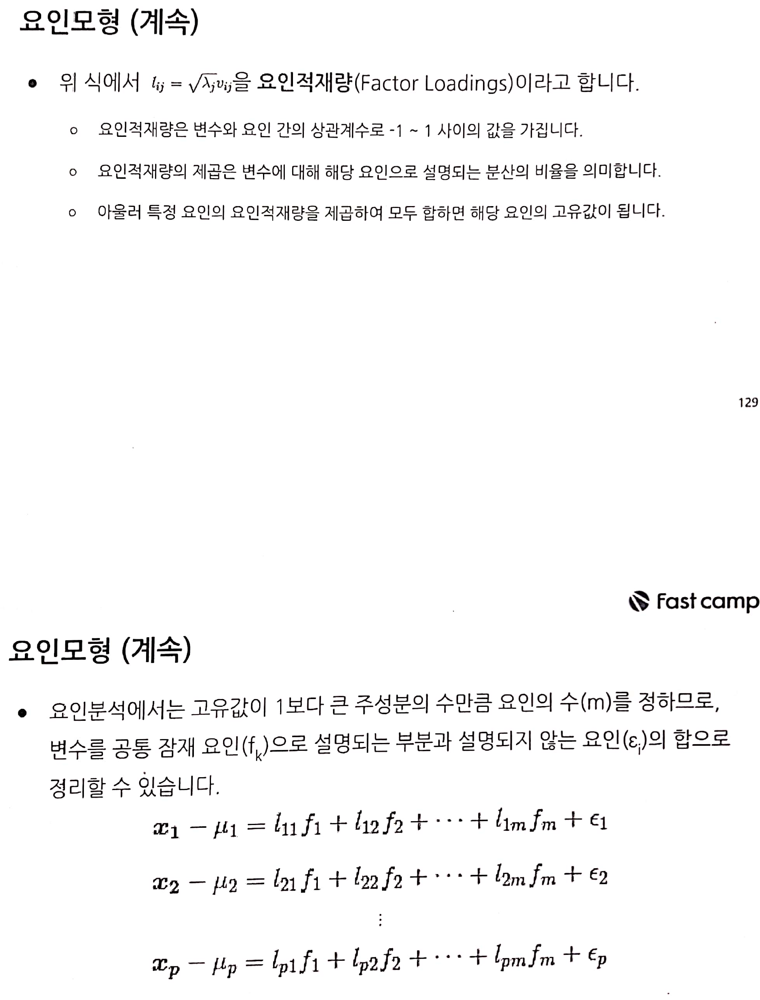


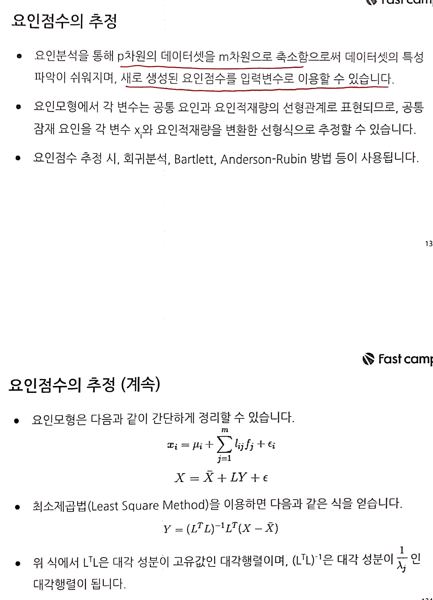

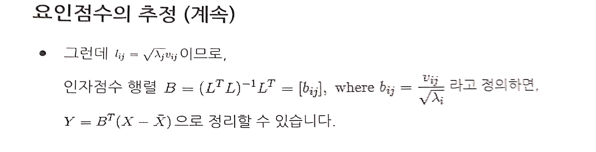

개념이 어렵지만, 전부 이해하려고 하지 말고, 사용법과 목적만을 이해하여 그냥 사용하자. 나중에 본격적인 수학적인 이론 공부를
하면 된다.

# 요인분석 프로세스

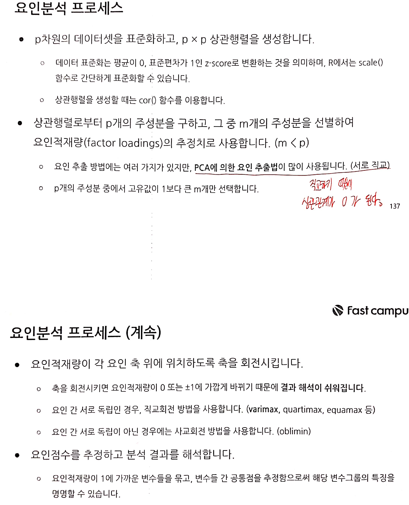

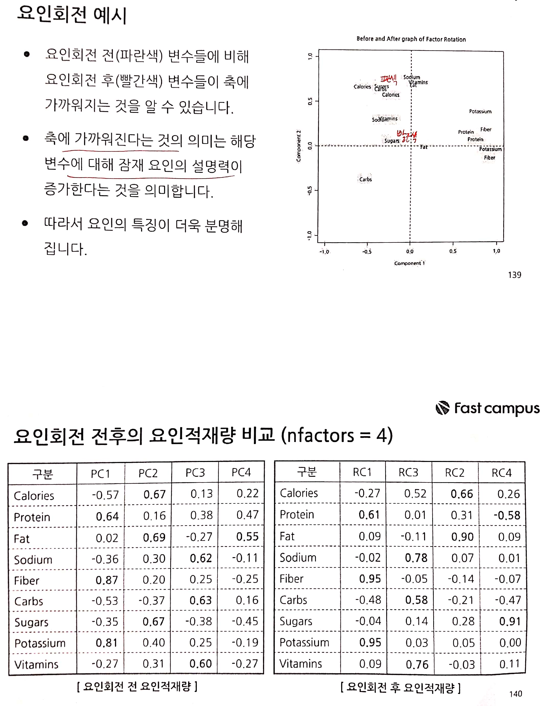

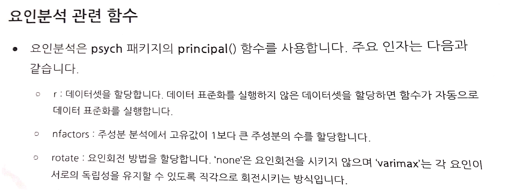

# 요인분석 실행 및 결과 해석

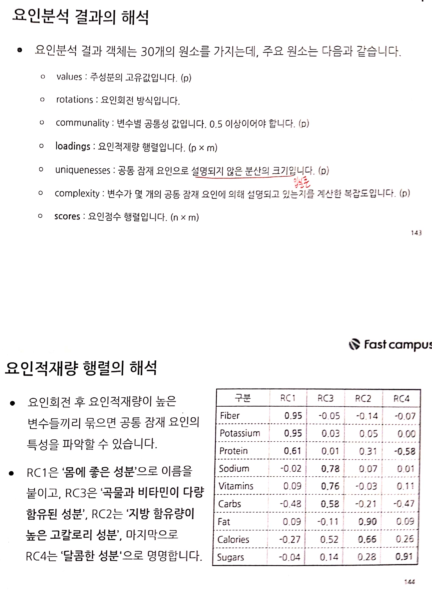

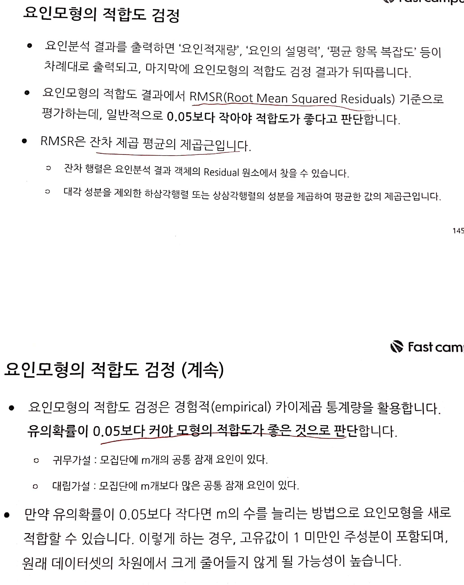

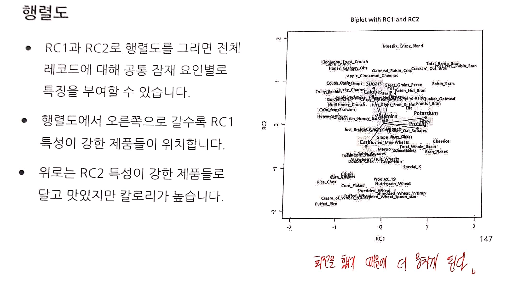

# 요인 분석 실습 : AptPrice로 요인 점수 추출하고 선형 회귀모형 결과 비교

## 1\. 데이터 전처리

``` r
# 데이터 불러온 후, 인코딩 형식 변경하기
apt.price <- read_rds(path = "practice_data/aptPrice.RDS")
colnames(apt.price) <- iconv(colnames(apt.price), from = "UTF-8", to = "EUC-KR")


# 데이터 구조 확인하기
str(apt.price)
```

    ## 'data.frame':    1516 obs. of  27 variables:
    ##  $ 아파트명    : chr  "SK허브프리모" "대우디오빌" "신동아(22)" "신동아(22)" ...
    ##  $ 전용면적    : num  33.8 31.8 35.7 35.7 84.5 ...
    ##  $ 층          : int  7 4 1 9 6 11 13 2 3 9 ...
    ##  $ 거래금액    : num  32900 27000 58500 68000 92500 ...
    ##  $ 최고층수    : int  20 15 13 13 13 13 13 13 13 13 ...
    ##  $ 승강기수    : int  4 2 20 20 20 20 20 20 20 20 ...
    ##  $ 총동수      : int  1 1 6 6 6 6 6 6 6 6 ...
    ##  $ 연면적      : num  35505 9783 58817 58817 58817 ...
    ##  $ 주거전용면적: num  9680 4261 45646 45646 45646 ...
    ##  $ 일반관리인원: int  6 3 6 6 6 6 6 6 6 6 ...
    ##  $ 경비인원    : int  5 3 9 9 9 9 9 9 9 9 ...
    ##  $ 청소인원    : int  3 2 6 6 6 6 6 6 6 6 ...
    ##  $ CCTV개수    : num  70 46 42 42 42 42 42 42 42 42 ...
    ##  $ 총세대수    : num  176 155 644 644 644 644 644 644 644 644 ...
    ##  $ 면적당관리비: num  3574 5213 1885 1885 1885 ...
    ##  $ 총주차대수  : num  276 123 684 684 684 684 684 684 684 684 ...
    ##  $ 세대주차대수: num  1.6 0.8 1.1 1.1 1.1 1.1 1.1 1.1 1.1 1.1 ...
    ##  $ 경과년수    : num  11 13 20 20 20 20 20 20 20 20 ...
    ##  $ 계단식      : num  0 0 1 1 1 1 1 1 1 1 ...
    ##  $ 분양        : num  1 1 1 1 1 1 1 1 1 1 ...
    ##  $ 위탁관리    : num  1 1 1 1 1 1 1 1 1 1 ...
    ##  $ 개별난방    : num  1 1 1 1 1 1 1 1 1 1 ...
    ##  $ 주차관제    : num  0 0 0 0 0 0 0 0 0 0 ...
    ##  $ 브랜드사    : num  1 1 0 0 0 0 0 0 0 0 ...
    ##  $ 로그금액    : num  10.4 10.2 11 11.1 11.4 ...
    ##  $ 루트금액    : num  181 164 242 261 304 ...
    ##  $ 변환금액    : num  3973 3394 6284 7085 9053 ...

``` r
# 데이터 전체를 셔플한다.
set.seed(123)
index <- sample(x = 1:nrow(apt.price))
apt.price.4fa <- apt.price[index, ]


# 중복되는 아파트명을 가지는 행들은 전부 제거하기
apt.price.4fa <- apt.price.4fa[!duplicated(apt.price.4fa$아파트명), ]


# 목표변수를 따로 저장하기
apt.price.object <- apt.price.4fa$거래금액


# 필요없는 컬럼을 제외(문자열과 목표변수)
apt.price.4fa <- apt.price.4fa[, c(2:3, 5:18)]


# 변수들을 표준화한다.
apt.price.scaled <- scale(apt.price.4fa)


# 전처리한 데이터셋을 확인한다.
str(apt.price.scaled)
```

    ##  num [1:146, 1:16] -0.295 -0.318 -1.77 0.431 -1.267 ...
    ##  - attr(*, "dimnames")=List of 2
    ##   ..$ : chr [1:146] "456" "538" "186" "613" ...
    ##   ..$ : chr [1:16] "전용면적" "층" "최고층수" "승강기수" ...
    ##  - attr(*, "scaled:center")= Named num [1:16] 95.27 8.69 18.55 16.58 9.36 ...
    ##   ..- attr(*, "names")= chr [1:16] "전용면적" "층" "최고층수" "승강기수" ...
    ##  - attr(*, "scaled:scale")= Named num [1:16] 35.08 6.89 9.65 17.56 12.46 ...
    ##   ..- attr(*, "names")= chr [1:16] "전용면적" "층" "최고층수" "승강기수" ...

``` r
head(apt.price.scaled, n = 10)
```

    ##        전용면적         층    최고층수   승강기수     총동수      연면적
    ## 456  -0.2945525  0.6248468  0.35689324 -0.5452538 -0.4298879 -0.58783238
    ## 538  -0.3179257  0.1897389  0.87484963 -0.9438586 -0.3496275 -0.39951240
    ## 186  -1.7699134 -0.6804770 -0.36824571 -0.9438586  0.1319349 -0.03458235
    ## 613   0.4308713 -0.2453691 -0.26465443 -0.9438586 -0.3496275 -0.36392808
    ## 1374 -1.2671049 -0.6804770 -0.36824571 -0.2605362 -0.1891067 -0.50993006
    ## 1643  1.5017622 -0.6804770  0.56407580 -0.9438586 -0.3496275 -0.34679262
    ## 1880 -1.0062944 -1.1155850 -0.57542827 -0.2605362 -0.2693671 -0.56939478
    ## 1779 -1.0088598 -0.3904051 -0.88620210 -0.9438586  1.3358408  0.83841785
    ## 1804  0.5574286 -0.9705490 -0.05747187 -0.6591409 -0.5904086 -0.65546833
    ## 1525  0.7637967  4.2507464  3.36104031 -0.7160844 -0.6706690 -0.06176245
    ##      주거전용면적 일반관리인원   경비인원    청소인원    CCTV개수
    ## 456   -0.53647118  -0.60987315 -0.5861854 -0.57424184 -0.44017020
    ## 538   -0.43521215  -0.49829235 -0.5461559 -0.57424184 -0.02826586
    ## 186   -0.01791964   0.17119246  0.3745226  0.32363563 -0.11375544
    ## 613   -0.40213066  -0.60987315 -0.5461559 -0.57424184  0.19711577
    ## 1374  -0.43545818  -0.27513074 -0.1858904 -0.23753779 -0.35468062
    ## 1643  -0.44362588  -0.49829235 -0.5461559 -0.57424184 -0.30804994
    ## 1880  -0.62094808  -0.60987315 -0.5461559 -0.57424184  0.08831084
    ## 1779   0.32368437   0.05961166 -0.1458609  0.32363563  2.53642157
    ## 1804  -0.61820789  -0.72145395 -0.6662444 -0.68647652 -0.28473460
    ## 1525  -0.24050780   0.17119246 -0.1858904  0.09916626 -0.10598366
    ##         총세대수 면적당관리비   총주차대수 세대주차대수   경과년수
    ## 456  -0.50877212  -0.95031661 -0.533046497  -0.27951651 -0.7564944
    ## 538  -0.54403568  -0.02926493 -0.329591361   0.78972569 -0.9312542
    ## 186   1.32623905   0.86219641 -0.376936267  -1.70517279  0.3794442
    ## 613  -0.50093578  -0.24765003 -0.440915870   0.07689756  0.6415839
    ## 1374 -0.02291863   1.34189346 -0.327032177  -0.81413762  0.3794442
    ## 1643 -0.52966905   0.36374491 -0.324472993   0.78972569 -0.8438743
    ## 1880 -0.44738741  -0.44561363 -0.493379144  -0.27951651 -1.2807737
    ## 1779  0.73981911  -2.06183011  1.063884384   0.07689756 -1.5429134
    ## 1804 -0.67986569  -1.21204532 -0.622617941   0.43331162 -0.2322151
    ## 1525 -0.42257231   1.43524892  0.003102573   1.32434680 -0.6691145

## 2\. 주성분 분석 시행하기

``` r
# prcomp() 함수는 5개의 원소를 가진 리스트 객체를 결과로 반환한다.
fit.pca <- prcomp(x = apt.price.scaled)

str(fit.pca)
```

    ## List of 5
    ##  $ sdev    : num [1:16] 2.646 1.782 1.251 1.163 0.846 ...
    ##  $ rotation: num [1:16, 1:16] 0.05523 -0.00894 0.02397 0.31144 0.25717 ...
    ##   ..- attr(*, "dimnames")=List of 2
    ##   .. ..$ : chr [1:16] "전용면적" "층" "최고층수" "승강기수" ...
    ##   .. ..$ : chr [1:16] "PC1" "PC2" "PC3" "PC4" ...
    ##  $ center  : Named num [1:16] 5.76e-17 9.13e-18 1.60e-16 -6.69e-17 -5.64e-17 ...
    ##   ..- attr(*, "names")= chr [1:16] "전용면적" "층" "최고층수" "승강기수" ...
    ##  $ scale   : Named num [1:16] 35.08 6.89 9.65 17.56 12.46 ...
    ##   ..- attr(*, "names")= chr [1:16] "전용면적" "층" "최고층수" "승강기수" ...
    ##  $ x       : num [1:146, 1:16] -1.763 -1.66 0.361 -1.413 -0.849 ...
    ##   ..- attr(*, "dimnames")=List of 2
    ##   .. ..$ : chr [1:146] "456" "538" "186" "613" ...
    ##   .. ..$ : chr [1:16] "PC1" "PC2" "PC3" "PC4" ...
    ##  - attr(*, "class")= chr "prcomp"

``` r
summary(fit.pca)
```

    ## Importance of components:
    ##                           PC1    PC2     PC3     PC4     PC5    PC6
    ## Standard deviation     2.6464 1.7823 1.25051 1.16317 0.84630 0.7310
    ## Proportion of Variance 0.4377 0.1985 0.09774 0.08456 0.04476 0.0334
    ## Cumulative Proportion  0.4377 0.6362 0.73399 0.81855 0.86331 0.8967
    ##                            PC7     PC8     PC9    PC10    PC11   PC12
    ## Standard deviation     0.64156 0.62143 0.55074 0.43141 0.34005 0.3099
    ## Proportion of Variance 0.02572 0.02414 0.01896 0.01163 0.00723 0.0060
    ## Cumulative Proportion  0.92244 0.94657 0.96553 0.97716 0.98439 0.9904
    ##                           PC13    PC14    PC15    PC16
    ## Standard deviation     0.29908 0.17717 0.16075 0.08400
    ## Proportion of Variance 0.00559 0.00196 0.00161 0.00044
    ## Cumulative Proportion  0.99598 0.99794 0.99956 1.00000

``` r
# 그림을 그려서 어디까지를 사용할 지 판단하자.
plot(fit.pca,
     type = "l")
abline(h = 1, col = "red", lty = 2)
```

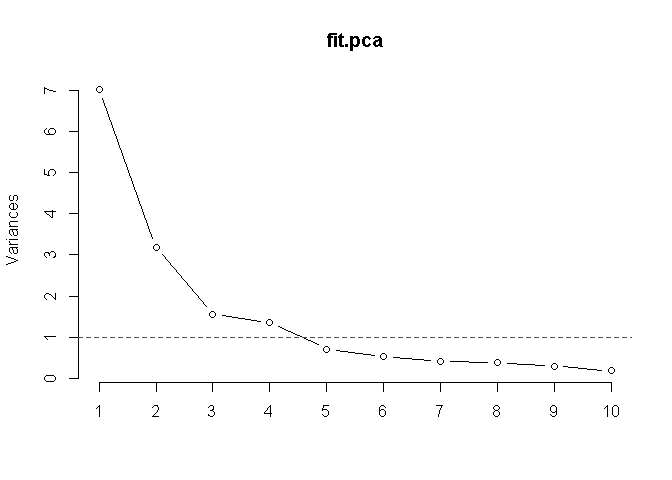<!-- -->

요인 분석에서는 고유값이 1이상인 주성분만 선택하므로, 위의 결과로 판단하였을 때, 제 1\~4 주성분까지 선택하기로 하였다.

## 3\. 요인 분석

``` r
# 요인 분석 패키지
library(psych)
```

    ## Warning: package 'psych' was built under R version 3.6.1

    ## 
    ## Attaching package: 'psych'

    ## The following objects are masked from 'package:ggplot2':
    ## 
    ##     %+%, alpha

``` r
# 요인 모형 적합하기 rotate = 'none'을 할 경우, 요인 회전을 실시하지 않는다.
fit.fa0 <- principal(r = apt.price.scaled,
                     nfactors = 4,
                     rotate = "none")


# 요인 분석 결과
print(fit.fa0)
```

    ## Principal Components Analysis
    ## Call: principal(r = apt.price.scaled, nfactors = 4, rotate = "none")
    ## Standardized loadings (pattern matrix) based upon correlation matrix
    ##                PC1   PC2   PC3   PC4   h2    u2 com
    ## 전용면적      0.15  0.23 -0.02  0.90 0.88 0.125 1.2
    ## 층           -0.02  0.63  0.41 -0.26 0.63 0.370 2.1
    ## 최고층수      0.06  0.85  0.25 -0.02 0.79 0.212 1.2
    ## 승강기수      0.82 -0.17  0.13  0.17 0.75 0.247 1.2
    ## 총동수        0.68 -0.28 -0.36 -0.19 0.71 0.293 2.1
    ## 연면적        0.97  0.16 -0.02 -0.02 0.97 0.033 1.1
    ## 주거전용면적  0.97 -0.13  0.06  0.04 0.96 0.038 1.0
    ## 일반관리인원  0.90  0.20  0.20 -0.04 0.89 0.114 1.2
    ## 경비인원      0.86 -0.24  0.27  0.15 0.89 0.111 1.4
    ## 청소인원      0.91  0.25  0.07 -0.06 0.90 0.098 1.2
    ## CCTV개수      0.35  0.57 -0.52 -0.19 0.76 0.243 2.9
    ## 총세대수      0.90 -0.19 -0.14 -0.21 0.92 0.082 1.3
    ## 면적당관리비  0.00  0.35  0.71 -0.23 0.68 0.323 1.7
    ## 총주차대수    0.72  0.41 -0.29  0.03 0.77 0.225 2.0
    ## 세대주차대수 -0.10  0.78 -0.15  0.43 0.82 0.181 1.7
    ## 경과년수      0.34 -0.67  0.40  0.26 0.79 0.208 2.5
    ## 
    ##                        PC1  PC2  PC3  PC4
    ## SS loadings           7.00 3.18 1.56 1.35
    ## Proportion Var        0.44 0.20 0.10 0.08
    ## Cumulative Var        0.44 0.64 0.73 0.82
    ## Proportion Explained  0.53 0.24 0.12 0.10
    ## Cumulative Proportion 0.53 0.78 0.90 1.00
    ## 
    ## Mean item complexity =  1.6
    ## Test of the hypothesis that 4 components are sufficient.
    ## 
    ## The root mean square of the residuals (RMSR) is  0.05 
    ##  with the empirical chi square  87.22  with prob <  0.019 
    ## 
    ## Fit based upon off diagonal values = 0.99

PC1, PC2, PC3, PC4에 대하여 요인 적재량이 나타나고 있다. 요인 적재량이 1에 가까울수록 해당 잠재 요인의 설명력이
높은 것이다. 이 외의 칼럼은 다음과 같다.

  - h2 : 변수마다 요인 적재량의 제곱을 합한 것이다. 설명되는 분산을 의미한다.
  - u2 : 표준화된 변수의ㅏ 분산 1에서 h2를 뺀 값이다.
  - com : 변수의 복잡도를 각 변수가 여러 요인에 걸쳐서 설명되고 있는지 확인한다. 각 요인 적재량의 제곱합을 제곱한 값을
    분자로 놓고, 각 요인 적재량의 네 제곱합을 분모로 하여 계산한다. 1에 가깝다는 것은 요인 적재량이 큰 주성분(요인)이
    하나라는 의미이다.
  - SS loadings : 각 주성분들의 고유값
  - Proportion Var : 각 주성분들의 분산 비중
  - Cumulative Var : 주성분들의 누적 분산 비중(설명력)

요인 모형의 적합도 검정에는 RMSR이 사용되는데, 잔차 행렬의 각 성분을 제곱하여 평균한 다음 제곱근을 씌워서 계산한다.\*
\*RMSR이 0.05보다 작을 때\*\*, 요인 모형 적합도가 좋다고 판단한다.

``` r
# 요인 점수 출력하기
head(fit.fa0$scores, n = 10)
```

    ##             PC1         PC2        PC3        PC4
    ## 456  -0.6660244  0.08725013 -0.2471832 -0.2970628
    ## 538  -0.6271656  0.66193051 -0.2038303 -0.1937628
    ## 186   0.1362649 -0.86265651  0.4120343 -1.9645721
    ## 613  -0.5338872 -0.18846451 -0.2068380  0.4756878
    ## 1374 -0.3206516 -0.55974298  0.6776035 -1.0789797
    ## 1643 -0.5904559  0.51241542 -0.2085106  1.1716453
    ## 1880 -0.6250756 -0.32284195 -0.9493130 -0.6735676
    ## 1779  0.4416086  0.28639985 -3.0758326 -1.3043002
    ## 1804 -0.7438727 -0.20801677 -0.8162547  0.9599975
    ## 1525 -0.2583414  2.55763565  2.1561082 -0.2587810

``` r
# 요인 점수간 상관관계를 확인한다.
# 대각 성분을 제외한, 모든 삼각행렬의 성분이 0이면 모두 서로 독립이라고 할 수 있다.
cor(fit.fa0$scores) %>% round(digits = 0)
```

    ##     PC1 PC2 PC3 PC4
    ## PC1   1   0   0   0
    ## PC2   0   1   0   0
    ## PC3   0   0   1   0
    ## PC4   0   0   0   1

``` r
# 요인 점수가 서로 독립이므로 요인 회전을 추가하여 요인 분석을 실행한다.
fit.fa1 <- principal(r = apt.price.scaled,
                     nfactors = 4,
                     rotate = "varimax")

print(fit.fa1)
```

    ## Principal Components Analysis
    ## Call: principal(r = apt.price.scaled, nfactors = 4, rotate = "varimax")
    ## Standardized loadings (pattern matrix) based upon correlation matrix
    ##                RC1   RC2   RC3   RC4   h2    u2 com
    ## 전용면적      0.13 -0.06 -0.09  0.92 0.88 0.125 1.1
    ## 층           -0.01  0.23  0.76 -0.02 0.63 0.370 1.2
    ## 최고층수      0.06  0.43  0.72  0.28 0.79 0.212 2.0
    ## 승강기수      0.83 -0.21 -0.07  0.12 0.75 0.247 1.2
    ## 총동수        0.67  0.13 -0.41 -0.26 0.71 0.293 2.1
    ## 연면적        0.96  0.17  0.06  0.06 0.97 0.033 1.1
    ## 주거전용면적  0.97 -0.10 -0.08  0.01 0.96 0.038 1.0
    ## 일반관리인원  0.90  0.06  0.26  0.06 0.89 0.114 1.2
    ## 경비인원      0.87 -0.35 -0.01  0.07 0.89 0.111 1.3
    ## 청소인원      0.91  0.18  0.20  0.05 0.90 0.098 1.2
    ## CCTV개수      0.32  0.81  0.01  0.03 0.76 0.243 1.3
    ## 총세대수      0.90  0.06 -0.20 -0.25 0.92 0.082 1.3
    ## 면적당관리비  0.03 -0.17  0.80 -0.09 0.68 0.323 1.1
    ## 총주차대수    0.70  0.50  0.01  0.19 0.77 0.225 2.0
    ## 세대주차대수 -0.13  0.52  0.28  0.68 0.82 0.181 2.3
    ## 경과년수      0.36 -0.79 -0.19  0.01 0.79 0.208 1.5
    ## 
    ##                        RC1  RC2  RC3  RC4
    ## SS loadings           6.99 2.34 2.19 1.59
    ## Proportion Var        0.44 0.15 0.14 0.10
    ## Cumulative Var        0.44 0.58 0.72 0.82
    ## Proportion Explained  0.53 0.18 0.17 0.12
    ## Cumulative Proportion 0.53 0.71 0.88 1.00
    ## 
    ## Mean item complexity =  1.4
    ## Test of the hypothesis that 4 components are sufficient.
    ## 
    ## The root mean square of the residuals (RMSR) is  0.05 
    ##  with the empirical chi square  87.22  with prob <  0.019 
    ## 
    ## Fit based upon off diagonal values = 0.99

``` r
head(apt.price.scaled)
```

    ##        전용면적         층   최고층수   승강기수     총동수      연면적
    ## 456  -0.2945525  0.6248468  0.3568932 -0.5452538 -0.4298879 -0.58783238
    ## 538  -0.3179257  0.1897389  0.8748496 -0.9438586 -0.3496275 -0.39951240
    ## 186  -1.7699134 -0.6804770 -0.3682457 -0.9438586  0.1319349 -0.03458235
    ## 613   0.4308713 -0.2453691 -0.2646544 -0.9438586 -0.3496275 -0.36392808
    ## 1374 -1.2671049 -0.6804770 -0.3682457 -0.2605362 -0.1891067 -0.50993006
    ## 1643  1.5017622 -0.6804770  0.5640758 -0.9438586 -0.3496275 -0.34679262
    ##      주거전용면적 일반관리인원   경비인원   청소인원    CCTV개수
    ## 456   -0.53647118   -0.6098732 -0.5861854 -0.5742418 -0.44017020
    ## 538   -0.43521215   -0.4982923 -0.5461559 -0.5742418 -0.02826586
    ## 186   -0.01791964    0.1711925  0.3745226  0.3236356 -0.11375544
    ## 613   -0.40213066   -0.6098732 -0.5461559 -0.5742418  0.19711577
    ## 1374  -0.43545818   -0.2751307 -0.1858904 -0.2375378 -0.35468062
    ## 1643  -0.44362588   -0.4982923 -0.5461559 -0.5742418 -0.30804994
    ##         총세대수 면적당관리비 총주차대수 세대주차대수   경과년수
    ## 456  -0.50877212  -0.95031661 -0.5330465  -0.27951651 -0.7564944
    ## 538  -0.54403568  -0.02926493 -0.3295914   0.78972569 -0.9312542
    ## 186   1.32623905   0.86219641 -0.3769363  -1.70517279  0.3794442
    ## 613  -0.50093578  -0.24765003 -0.4409159   0.07689756  0.6415839
    ## 1374 -0.02291863   1.34189346 -0.3270322  -0.81413762  0.3794442
    ## 1643 -0.52966905   0.36374491 -0.3244730   0.78972569 -0.8438743

요인 회전을 함으로써 주성분들의 고유값들이 평탄해졌다. 그리고 항목 복잡도 평균(Mean Item Complexity)도
낮아졌다. 이것은 **각 변수들이 하나의 잠재 요인으로 집중되었다는 것을 의미한다.**

요인 적재량 테이블에서 RC1에 대한 변수별 선형관계식을 표현하면 다음과 같다.

RC1 = 0.14X전용면적 -0.02X층 + 0.07X최고층수 + …

그리고 RC1에는 연면적, 주거전용면적, 일반관리인원, 경비인원, 청소인원, 승강기수의 요인 적재량이 높으므로 **고급 아파트라고
명명**할 수 있을 것이다. 이렇듯이, 각 요인들의 공통된 특징을 통하여 사용자가 임의로 명명을 하고 데이터를 해석하는 것이다.

``` r
# RC1과 RC2 만으로 행렬도를 그려본다면 다음과 같다.
plot(x = fit.fa1$scores[, "RC1"],
     y = fit.fa1$scores[, "RC2"],
     type = "n")

text(x = fit.fa1$scores[, "RC1"],
     y = fit.fa1$scores[, "RC2"],
     cex = 0.8,
     font = 2)

points(x = fit.fa1$scores[, "RC1"],
       y = fit.fa1$scores[, "RC2"],
       pch = 19,
       col = "red")
```

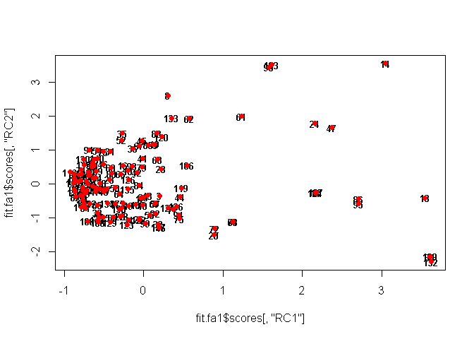<!-- -->

**요인 회전 그래프는 생략**하였다. 이것을 보고싶다면, 교재를 참고하라.

## 4\. 선형회귀분석 - 다중공선성 제거

``` r
# 선형 회귀분석을 위한 데이터셋을 새로 만든다.
apt.price.4fa <- cbind(apt.price.4fa, 거래금액 = apt.price.object)

# 회귀모형을 적합한다.
fit.reg1 <- lm(formula = 거래금액 ~.,
               data = apt.price.4fa)

# 결과를 확인한다.
summary(fit.reg1)
```

    ## 
    ## Call:
    ## lm(formula = 거래금액 ~ ., data = apt.price.4fa)
    ## 
    ## Residuals:
    ##    Min     1Q Median     3Q    Max 
    ## -49812 -22355    462  19415  83336 
    ## 
    ## Coefficients:
    ##                Estimate Std. Error t value Pr(>|t|)    
    ## (Intercept)  -4491.4372 19032.8242  -0.236 0.813820    
    ## 전용면적       938.6242    93.6235  10.026  < 2e-16 ***
    ## 층            -534.1865   442.1083  -1.208 0.229153    
    ## 최고층수      1311.7982   465.6525   2.817 0.005609 ** 
    ## 승강기수      -679.7941   307.5386  -2.210 0.028838 *  
    ## 총동수        2010.3806   515.5726   3.899 0.000154 ***
    ## 연면적          -0.3446     0.1866  -1.847 0.067068 .  
    ## 주거전용면적     0.3355     0.2195   1.528 0.128840    
    ## 일반관리인원  -881.5911   737.9028  -1.195 0.234386    
    ## 경비인원      1151.7803   292.7443   3.934 0.000136 ***
    ## 청소인원      2762.0103  1126.7078   2.451 0.015569 *  
    ## CCTV개수       105.5174    40.5869   2.600 0.010416 *  
    ## 총세대수       -38.5853    13.7610  -2.804 0.005829 ** 
    ## 면적당관리비     2.5052     3.4627   0.723 0.470695    
    ## 총주차대수       1.1153     7.3922   0.151 0.880307    
    ## 세대주차대수 -8142.6257  8557.3882  -0.952 0.343114    
    ## 경과년수       865.8169   392.1683   2.208 0.029028 *  
    ## ---
    ## Signif. codes:  0 '***' 0.001 '**' 0.01 '*' 0.05 '.' 0.1 ' ' 1
    ## 
    ## Residual standard error: 26930 on 129 degrees of freedom
    ## Multiple R-squared:  0.7669, Adjusted R-squared:  0.738 
    ## F-statistic: 26.53 on 16 and 129 DF,  p-value: < 2.2e-16

``` r
# 다중공선성을 확인한다.
library(car)
```

    ## Warning: package 'car' was built under R version 3.6.1

    ## Loading required package: carData

    ## 
    ## Attaching package: 'car'

    ## The following object is masked from 'package:psych':
    ## 
    ##     logit

    ## The following object is masked from 'package:dplyr':
    ## 
    ##     recode

    ## The following object is masked from 'package:purrr':
    ## 
    ##     some

``` r
car::vif(mod = fit.reg1)
```

    ##     전용면적           층     최고층수     승강기수       총동수 
    ##     2.157722     1.858402     4.041210     5.833703     8.252983 
    ##       연면적 주거전용면적 일반관리인원     경비인원     청소인원 
    ##    84.932284    70.126827     8.746883    10.696720    20.155906 
    ##     CCTV개수     총세대수 면적당관리비   총주차대수 세대주차대수 
    ##     5.454631    22.202796     1.534000     6.674725     4.611760 
    ##     경과년수 
    ##     4.028615

``` r
see.vif <- car::vif(mod = fit.reg1)

see.vif
```

    ##     전용면적           층     최고층수     승강기수       총동수 
    ##     2.157722     1.858402     4.041210     5.833703     8.252983 
    ##       연면적 주거전용면적 일반관리인원     경비인원     청소인원 
    ##    84.932284    70.126827     8.746883    10.696720    20.155906 
    ##     CCTV개수     총세대수 면적당관리비   총주차대수 세대주차대수 
    ##     5.454631    22.202796     1.534000     6.674725     4.611760 
    ##     경과년수 
    ##     4.028615

``` r
# 다중공선성이 매우 높은 것들이 여러가지 존재하기 때문에, 몇몇 변수는 제거해야한다.
# 다중공선성이 높은 것들을 차례차례 제거해나가며 모형을 적합하는 반복문
apt.price.4fa2 <- apt.price.4fa

for(i in 1:ncol(apt.price.4fa2)) {
  
  fit.reg1 <- lm(formula = 거래금액 ~.,
                 data = apt.price.4fa2)
  
  see.vif <- car::vif(mod = fit.reg1)
  
  k <- 0
  
  for (j in 1:length(see.vif)) {
    
    if(see.vif[j] > 10) {
      
      k <- j
      break
      
    }
  }
  
  if (k == 0) {
    break
  }else if(k != 0){
      
    apt.price.4fa2 <- apt.price.4fa2[, -k]
    
    }
  
}

# 결과를 확인한다.
summary(fit.reg1)
```

    ## 
    ## Call:
    ## lm(formula = 거래금액 ~ ., data = apt.price.4fa2)
    ## 
    ## Residuals:
    ##    Min     1Q Median     3Q    Max 
    ## -64621 -20946  -1651  19188  83430 
    ## 
    ## Coefficients:
    ##                Estimate Std. Error t value Pr(>|t|)    
    ## (Intercept)  -16753.374  17350.705  -0.966  0.33601    
    ## 전용면적        979.857     92.930  10.544  < 2e-16 ***
    ## 층             -251.383    448.523  -0.560  0.57610    
    ## 최고층수        815.337    429.172   1.900  0.05963 .  
    ## 승강기수       -693.959    271.785  -2.553  0.01180 *  
    ## 총동수          821.745    276.144   2.976  0.00347 ** 
    ## 일반관리인원   -287.550    589.355  -0.488  0.62642    
    ## 경비인원       1093.097    244.993   4.462 1.71e-05 ***
    ## CCTV개수         97.528     34.073   2.862  0.00489 ** 
    ## 면적당관리비      2.087      3.527   0.592  0.55494    
    ## 총주차대수       -9.444      6.601  -1.431  0.15484    
    ## 세대주차대수   1701.147   7986.686   0.213  0.83165    
    ## 경과년수       1031.010    398.796   2.585  0.01081 *  
    ## ---
    ## Signif. codes:  0 '***' 0.001 '**' 0.01 '*' 0.05 '.' 0.1 ' ' 1
    ## 
    ## Residual standard error: 28070 on 133 degrees of freedom
    ## Multiple R-squared:  0.7387, Adjusted R-squared:  0.7152 
    ## F-statistic: 31.34 on 12 and 133 DF,  p-value: < 2.2e-16

``` r
see.vif
```

    ##     전용면적           층     최고층수     승강기수       총동수 
    ##     1.955424     1.759345     3.157540     4.190785     2.177714 
    ## 일반관리인원     경비인원     CCTV개수 면적당관리비   총주차대수 
    ##     5.132259     6.890951     3.535941     1.463516     4.895546 
    ## 세대주차대수     경과년수 
    ##     3.695021     3.831878

## 5\. 선형회귀분석 - 유의하지 않은 회귀계수 제거

``` r
# stepwise를 이용하여, 유의하지 않은 변수를 제거한다.
fit.stepreg <- step(fit.reg1,
                    direction = "both")
```

    ## Start:  AIC=3003.23
    ## 거래금액 ~ 전용면적 + 층 + 최고층수 + 승강기수 + 총동수 + 일반관리인원 + 
    ##     경비인원 + CCTV개수 + 면적당관리비 + 총주차대수 + 세대주차대수 + 
    ##     경과년수
    ## 
    ##                Df  Sum of Sq        RSS    AIC
    ## - 세대주차대수  1 3.5759e+07 1.0487e+11 3001.3
    ## - 일반관리인원  1 1.8763e+08 1.0502e+11 3001.5
    ## - 층            1 2.4759e+08 1.0508e+11 3001.6
    ## - 면적당관리비  1 2.7612e+08 1.0511e+11 3001.6
    ## <none>                       1.0483e+11 3003.2
    ## - 총주차대수    1 1.6135e+09 1.0644e+11 3003.5
    ## - 최고층수      1 2.8448e+09 1.0767e+11 3005.1
    ## - 승강기수      1 5.1387e+09 1.0997e+11 3008.2
    ## - 경과년수      1 5.2682e+09 1.1010e+11 3008.4
    ## - CCTV개수      1 6.4578e+09 1.1129e+11 3010.0
    ## - 총동수        1 6.9797e+09 1.1181e+11 3010.6
    ## - 경비인원      1 1.5691e+10 1.2052e+11 3021.6
    ## - 전용면적      1 8.7628e+10 1.9246e+11 3089.9
    ## 
    ## Step:  AIC=3001.28
    ## 거래금액 ~ 전용면적 + 층 + 최고층수 + 승강기수 + 총동수 + 일반관리인원 + 
    ##     경비인원 + CCTV개수 + 면적당관리비 + 총주차대수 + 경과년수
    ## 
    ##                Df  Sum of Sq        RSS    AIC
    ## - 일반관리인원  1 1.8881e+08 1.0505e+11 2999.5
    ## - 층            1 2.4959e+08 1.0512e+11 2999.6
    ## - 면적당관리비  1 2.9420e+08 1.0516e+11 2999.7
    ## <none>                       1.0487e+11 3001.3
    ## - 총주차대수    1 1.9026e+09 1.0677e+11 3001.9
    ## + 세대주차대수  1 3.5759e+07 1.0483e+11 3003.2
    ## - 최고층수      1 2.9693e+09 1.0784e+11 3003.4
    ## - 승강기수      1 5.3771e+09 1.1024e+11 3006.6
    ## - 경과년수      1 6.6599e+09 1.1153e+11 3008.3
    ## - CCTV개수      1 6.9780e+09 1.1184e+11 3008.7
    ## - 총동수        1 7.1718e+09 1.1204e+11 3008.9
    ## - 경비인원      1 1.5661e+10 1.2053e+11 3019.6
    ## - 전용면적      1 1.4188e+11 2.4675e+11 3124.2
    ## 
    ## Step:  AIC=2999.54
    ## 거래금액 ~ 전용면적 + 층 + 최고층수 + 승강기수 + 총동수 + 경비인원 + 
    ##     CCTV개수 + 면적당관리비 + 총주차대수 + 경과년수
    ## 
    ##                Df  Sum of Sq        RSS    AIC
    ## - 면적당관리비  1 2.7629e+08 1.0533e+11 2997.9
    ## - 층            1 3.2398e+08 1.0538e+11 2998.0
    ## <none>                       1.0505e+11 2999.5
    ## - 총주차대수    1 2.0796e+09 1.0713e+11 3000.4
    ## + 일반관리인원  1 1.8881e+08 1.0487e+11 3001.3
    ## + 세대주차대수  1 3.6936e+07 1.0502e+11 3001.5
    ## - 최고층수      1 2.9332e+09 1.0799e+11 3001.6
    ## - 승강기수      1 5.7335e+09 1.1079e+11 3005.3
    ## - 경과년수      1 6.4862e+09 1.1154e+11 3006.3
    ## - CCTV개수      1 6.8003e+09 1.1186e+11 3006.7
    ## - 총동수        1 7.1638e+09 1.1222e+11 3007.2
    ## - 경비인원      1 1.7291e+10 1.2235e+11 3019.8
    ## - 전용면적      1 1.4542e+11 2.5047e+11 3124.4
    ## 
    ## Step:  AIC=2997.93
    ## 거래금액 ~ 전용면적 + 층 + 최고층수 + 승강기수 + 총동수 + 경비인원 + 
    ##     CCTV개수 + 총주차대수 + 경과년수
    ## 
    ##                Df  Sum of Sq        RSS    AIC
    ## - 층            1 2.2801e+08 1.0556e+11 2996.2
    ## <none>                       1.0533e+11 2997.9
    ## - 총주차대수    1 2.0900e+09 1.0742e+11 2998.8
    ## + 면적당관리비  1 2.7629e+08 1.0505e+11 2999.5
    ## + 일반관리인원  1 1.7090e+08 1.0516e+11 2999.7
    ## + 세대주차대수  1 5.4600e+07 1.0528e+11 2999.8
    ## - 최고층수      1 3.4446e+09 1.0878e+11 3000.6
    ## - 승강기수      1 5.9074e+09 1.1124e+11 3003.9
    ## - 경과년수      1 6.6562e+09 1.1199e+11 3004.9
    ## - CCTV개수      1 6.7737e+09 1.1210e+11 3005.0
    ## - 총동수        1 6.9519e+09 1.1228e+11 3005.3
    ## - 경비인원      1 1.8769e+10 1.2410e+11 3019.9
    ## - 전용면적      1 1.5032e+11 2.5566e+11 3125.4
    ## 
    ## Step:  AIC=2996.24
    ## 거래금액 ~ 전용면적 + 최고층수 + 승강기수 + 총동수 + 경비인원 + 
    ##     CCTV개수 + 총주차대수 + 경과년수
    ## 
    ##                Df  Sum of Sq        RSS    AIC
    ## <none>                       1.0556e+11 2996.2
    ## - 총주차대수    1 1.9688e+09 1.0753e+11 2996.9
    ## + 일반관리인원  1 2.3317e+08 1.0533e+11 2997.9
    ## + 층            1 2.2801e+08 1.0533e+11 2997.9
    ## + 면적당관리비  1 1.8032e+08 1.0538e+11 2998.0
    ## + 세대주차대수  1 5.3757e+07 1.0551e+11 2998.2
    ## - 최고층수      1 3.6667e+09 1.0923e+11 2999.2
    ## - 승강기수      1 5.7264e+09 1.1129e+11 3002.0
    ## - 경과년수      1 6.6455e+09 1.1220e+11 3003.2
    ## - CCTV개수      1 6.6745e+09 1.1223e+11 3003.2
    ## - 총동수        1 6.8336e+09 1.1239e+11 3003.4
    ## - 경비인원      1 1.8556e+10 1.2411e+11 3017.9
    ## - 전용면적      1 1.5317e+11 2.5873e+11 3125.1

``` r
# 결과를 확인한다.
summary(fit.stepreg)
```

    ## 
    ## Call:
    ## lm(formula = 거래금액 ~ 전용면적 + 최고층수 + 승강기수 + 총동수 + 
    ##     경비인원 + CCTV개수 + 총주차대수 + 경과년수, data = apt.price.4fa2)
    ## 
    ## Residuals:
    ##    Min     1Q Median     3Q    Max 
    ## -60627 -19675  -1815  19754  83628 
    ## 
    ## Coefficients:
    ##              Estimate Std. Error t value Pr(>|t|)    
    ## (Intercept) -8004.491  11504.211  -0.696  0.48774    
    ## 전용면적      990.436     70.248  14.099  < 2e-16 ***
    ## 최고층수      665.613    305.121   2.181  0.03085 *  
    ## 승강기수     -713.334    261.662  -2.726  0.00725 ** 
    ## 총동수        715.729    240.332   2.978  0.00343 ** 
    ## 경비인원     1056.338    215.255   4.907 2.58e-06 ***
    ## CCTV개수       90.859     30.871   2.943  0.00382 ** 
    ## 총주차대수     -8.737      5.466  -1.599  0.11223    
    ## 경과년수      960.802    327.158   2.937  0.00389 ** 
    ## ---
    ## Signif. codes:  0 '***' 0.001 '**' 0.01 '*' 0.05 '.' 0.1 ' ' 1
    ## 
    ## Residual standard error: 27760 on 137 degrees of freedom
    ## Multiple R-squared:  0.7369, Adjusted R-squared:  0.7216 
    ## F-statistic: 47.97 on 8 and 137 DF,  p-value: < 2.2e-16

``` r
car::vif(fit.stepreg)
```

    ##   전용면적   최고층수   승강기수     총동수   경비인원   CCTV개수 
    ##   1.143004   1.632645   3.973603   1.687389   5.441767   2.969247 
    ## 총주차대수   경과년수 
    ##   3.433323   2.638066

## 6\. 요인 점수를 이용하여 선형 회귀모형 적합해보기

``` r
# 요인 점수와 목표변수를 통합하여 데이터 프레임을 새로 만들기
apt.price.fas <- cbind(fit.fa1$scores, 거래금액 = apt.price.object) %>%
  as.data.frame()

# 모형 적합하기
fit.reg2 <- lm(formula = 거래금액 ~.,
               data = apt.price.fas)

# 모형 결과보기
summary(fit.reg2)
```

    ## 
    ## Call:
    ## lm(formula = 거래금액 ~ ., data = apt.price.fas)
    ## 
    ## Residuals:
    ##    Min     1Q Median     3Q    Max 
    ## -60875 -26166  -1347  21319  84379 
    ## 
    ## Coefficients:
    ##             Estimate Std. Error t value Pr(>|t|)    
    ## (Intercept)   137557       2697  51.012  < 2e-16 ***
    ## RC1            25804       2706   9.536  < 2e-16 ***
    ## RC2            -7931       2706  -2.931  0.00394 ** 
    ## RC3            -3505       2706  -1.296  0.19726    
    ## RC4            31526       2706  11.651  < 2e-16 ***
    ## ---
    ## Signif. codes:  0 '***' 0.001 '**' 0.01 '*' 0.05 '.' 0.1 ' ' 1
    ## 
    ## Residual standard error: 32580 on 141 degrees of freedom
    ## Multiple R-squared:  0.6269, Adjusted R-squared:  0.6164 
    ## F-statistic: 59.24 on 4 and 141 DF,  p-value: < 2.2e-16

``` r
# 다중공선성의 경우, 모든 입력변수가 독립이므로 문제가 발생하지 않는다.
car::vif(fit.reg2)
```

    ## RC1 RC2 RC3 RC4 
    ##   1   1   1   1

``` r
# 하지만 유의하지 않은 회귀계수가 있으므로, stepwise를 사용하겠다.
fit.stepreg2 <- step(fit.reg2,
                     direction = "both")
```

    ## Start:  AIC=3039.24
    ## 거래금액 ~ RC1 + RC2 + RC3 + RC4
    ## 
    ##        Df  Sum of Sq        RSS    AIC
    ## - RC3   1 1.7818e+09 1.5147e+11 3039.0
    ## <none>               1.4969e+11 3039.2
    ## - RC2   1 9.1214e+09 1.5881e+11 3045.9
    ## - RC1   1 9.6546e+10 2.4624e+11 3109.9
    ## - RC4   1 1.4412e+11 2.9381e+11 3135.7
    ## 
    ## Step:  AIC=3038.97
    ## 거래금액 ~ RC1 + RC2 + RC4
    ## 
    ##        Df  Sum of Sq        RSS    AIC
    ## <none>               1.5147e+11 3039.0
    ## + RC3   1 1.7818e+09 1.4969e+11 3039.2
    ## - RC2   1 9.1214e+09 1.6059e+11 3045.5
    ## - RC1   1 9.6546e+10 2.4802e+11 3109.0
    ## - RC4   1 1.4412e+11 2.9559e+11 3134.6

``` r
# 결과보기
summary(fit.stepreg2)
```

    ## 
    ## Call:
    ## lm(formula = 거래금액 ~ RC1 + RC2 + RC4, data = apt.price.fas)
    ## 
    ## Residuals:
    ##    Min     1Q Median     3Q    Max 
    ## -60894 -25899  -1814  21808  78595 
    ## 
    ## Coefficients:
    ##             Estimate Std. Error t value Pr(>|t|)    
    ## (Intercept)   137557       2703  50.891  < 2e-16 ***
    ## RC1            25804       2712   9.514  < 2e-16 ***
    ## RC2            -7931       2712  -2.924  0.00402 ** 
    ## RC4            31526       2712  11.623  < 2e-16 ***
    ## ---
    ## Signif. codes:  0 '***' 0.001 '**' 0.01 '*' 0.05 '.' 0.1 ' ' 1
    ## 
    ## Residual standard error: 32660 on 142 degrees of freedom
    ## Multiple R-squared:  0.6225, Adjusted R-squared:  0.6145 
    ## F-statistic: 78.05 on 3 and 142 DF,  p-value: < 2.2e-16
